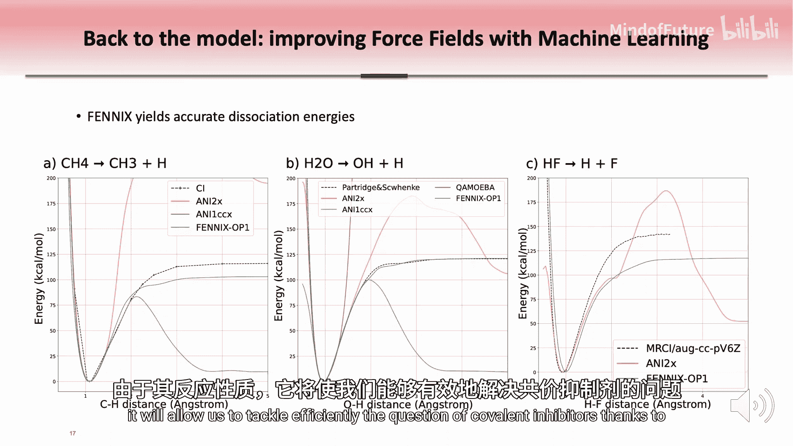
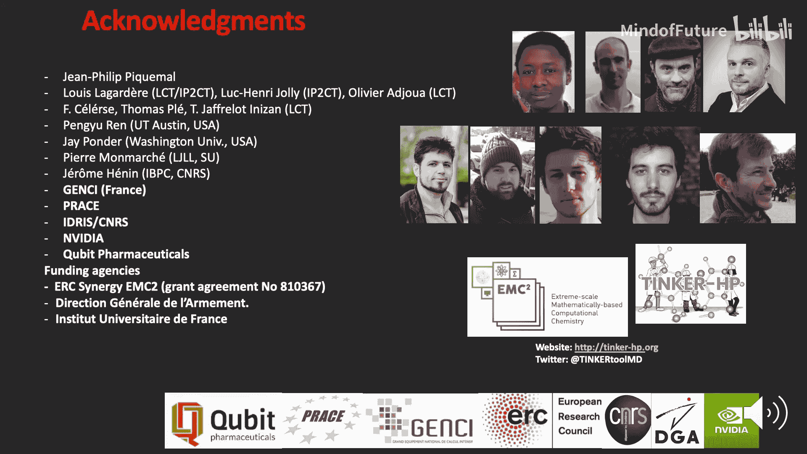

# 012：结合量子模型与机器学习加速药物发现

在本教程中，我们将学习如何利用基于量子力学的分子模拟模型来加速药物发现过程，并探讨如何在此框架内应用机器学习方法，以进一步解决这一内在复杂的问题。

## 概述：分子模拟与药物发现

在药物发现的背景下，分子模拟的核心是让原子系统在相互作用势下运动，并应用牛顿定律。这意味着，我们用来表示原子间相互作用的模型——即相互作用势——至关重要。任何模拟结果的质量都取决于这个模型的准确性。

在药物发现中，我们的目标是找到能与特定大分子靶标（例如蛋白质或RNA）结合的小分子。这种结合需要以抑制靶标功能的方式进行。在实践中，我们需要在靶标上找到一个可成药的结合口袋，然后模拟这个结合过程。由于这些系统的复杂性和动态特性，我们必须依赖高精度模型才能做出预测。

我们可以将这个过程比作太空探测器在崎岖的小行星表面着陆。然而，仅有高精度模型是不够的。我们还需要对靶标自身的构象进行广泛采样以找到可靶向的口袋，并对靶标与小分子的相对运动进行采样，以获得关于结合的重要见解。这意味着我们需要这些模型的高性能实现，以便在实用的药物发现框架中使用。

## 新一代分子模型

我们知道，要获得绝对精确的结果，需要对我们处理的分子的所有原子和电子进行量子描述，但对于有实际意义的系统来说，这在计算上过于昂贵。因此，我们需要做一些近似。

在过去的几十年里，人们通常使用两体成对模型来表示所有相互作用，尤其是静电相互作用。但在实践中，我们需要引入各向异性，以及系统对环境变化的某种响应，这通常是量子力学才能提供的。

为此，我们引入了分子电荷密度的多极描述，这提供了各向异性。同时，我们引入了多体极化来描述系统构象变化时的电子迁移率。

那么，这些更精确的模型能为我们带来哪些有价值的特性呢？以下是可能实现的一些方面：
*   首先，由于对所有（包括潜在的弱）相互作用的精确描述，我们可以处理复杂生物系统中微小、精细的能量差异。
*   其次，这使我们能够计算结合自由能，这对药物设计非常有用。
*   此外，由于包含了多体极化效应，我们可以模拟金属（包括过渡金属）以及在现代电池中起关键作用的离子液体。
*   最后，当与系统子部分的纯量子力学描述结合时，这种新一代模型能产生精确的液相光谱和复杂光谱。

## 高性能计算的重要性

请记住，在实践中，我们不仅需要高分辨率，还需要大规模采样。这就是高性能计算发挥作用的地方，也是我们过去几年的工作重点。

十年前，还没有真正高性能的可极化模型实现。处理此类模型的最流行代码仅通过OpenMP指令进行共享内存并行加速，这不足以解决实际问题。

因此，我们投入了大量时间和精力，从这个流行且设计良好的Tinker代码出发，开发了其高性能版本，我们称之为Tinker-HP。但由于解决这些更复杂方程所涉及算法的复杂性，我们必须重新思考代码的基本结构和架构，并设计特定的方法以实现可扩展的模拟。

在实践中，我们最初开发了一个基于MPI的、双精度的Fortran CPU实现，能够在足够大的系统上扩展到数万个核心，同时也能在较小的集群（如学术实验室中常见的集群）上扩展。因此，我们已为百亿亿次计算做好准备。

## GPU加速实现

随着现代GPU（尤其是NVIDIA GPU）的出现，我们知道通过利用这些平台可以获得可观的性能提升。这就是为什么我们开发了Tinker-HP代码的特定版本，专门用于使用多个NVIDIA GPU。

我们有两种不同的GPU实现：
*   第一种实现完全依赖于OpenACC移植。OpenACC指令既用于在CPU主机和GPU设备之间传输数据，也用于在NVIDIA GPU上运行计算密集型内核。我们使用此实现来运行双精度模拟，充分利用V100和A100等HPC计算卡。
*   第二种实现仍然使用OpenACC指令处理GPU与主机之间的数据传输，但使用高度优化的CUDA内核来进一步提升性能。此实现用于分子动力学中的混合精度模式，即计算最密集的能量和力内核使用单精度，但数据随后以双精度累积，从而在性能和精度之间取得最佳平衡。

这两种实现的一个关键特性是，几乎所有操作都卸载到GPU上，从而限制了CPU和GPU之间的同步。此外，多GPU实现遵循与CPU版本相同的3D域分解逻辑，并确保通过CUDA-aware MPI库直接在GPU之间进行数据传输。

## 性能基准测试

以下是一些具有代表性尺寸系统的实际基准测试，从著名的DHFR基准（约2万多个原子）到更大的系统，如溶液中的SARS-CoV-2主要蛋白酶（约10万个原子），直至更大的数百万原子系统，如我们称为“C系统”（超过700万个原子）的系统。

所有这些基准测试均在法国的Jean Zay超级计算机和NVIDIA的Selene超级计算机上运行。总体而言，我们在所有这些系统上观察到了此类模型有史以来在GPU和CPU上获得的最佳性能。例如，对于DHFR系统，我们每天可获得超过14纳秒的模拟产量；对于超过100万个原子的STMV系统，每天超过4纳秒；对于之前提到的C系统，每天接近1纳秒。

我们看到，对于较小的系统，使用多个GPU并没有真正的增益，这是可以预期的，因为单个GPU已经包含了强大的计算能力。但随着系统规模增大，从大约20万个原子的系统开始，使用多个GPU就显示出优势，并且对于更大的系统有显著的性能提升。

总结一下Tinker-HP及其高效的多GPU实现：以我之前提到的约100万个原子的STMV系统为例，我们从原始的Tinker OpenMP实现到多GPU CUDA实现，实现了约6000倍的加速。这极大地拓展了新一代可极化模型的潜在应用领域。

## 核心应用：结合亲和力预测

现在我想重点介绍的一个主要应用，是在药物发现项目中预测小分子与大分子靶标的结合亲和力。选择一个明确的目标（例如蛋白质）后，目标是找到一种能以改变其功能的方式与之结合的小分子。

通常，制药公司依赖对已知化合物进行高通量筛选以获得初始命中分子，然后进行大量合成以优化这些命中分子。因此，在药物发现背景下，能够可靠地预测小分子与靶标之间的实际结合亲和力极具吸引力，因为数值模拟可以大幅减少需要合成的候选药物数量，从而减少此类项目的时间和资金投入。

在实践中，这意味着我们需要计算结合态（配体或小分子位于宿主结合口袋中）与非结合态（小分子和宿主均处于溶液中且彼此不相互作用）之间的自由能差。如今，常规使用的是所谓的“炼金术”方法。小分子首先通过逐步减弱其与宿主的相互作用而从宿主中解耦，然后我们以类似的方式分别计算配体从溶液中解耦的自由能。最后，由于自由能是状态函数，我们可以通过热力学循环恢复出我们感兴趣的结合自由能。

在实践中，这需要大量且长时间的分子动力学轨迹模拟，因此高性能代码至关重要。在过去的几年里，通过盲测挑战，许多具有代表性的宿主-客体系统基准测试得以运行。在这些挑战中，可极化的AMOEBA模型反复表现非常出色。结果显示，使用这种高精度模型计算出的结合亲和力与实验值在几乎全部案例中相差在1千卡/摩尔以内，这构成了最先进的性能水平。这表明新一代模型的高性能实现如何在药物发现项目中提供实际帮助。

## 回归模型：结合机器学习的潜力

现在让我们回到模型本身，正如我们所看到的，模型决定了所有分子模拟的质量。我们知道，即使使用先进的可极化模型，我们仍然缺乏一些在短程发生的关键量子效应。之前介绍的模型的另一个限制是它们本质上是非反应性的。

同时，我们现在拥有精心策划的量子力学数据集，这使得开发机器学习相互作用势成为可能。在这种势中，所有相互作用都用机器学习方法描述。总的来说，此类模型利用每个原子局部环境的短程描述符，然后将其输入另一个网络以预测能量。这意味着这些模型通常比可极化力场慢，但由于它们本质上是短程的，因此是可扩展的。

这些模型通过Deep-H平台在Tinker-HP中实现。这些模型在许多情况下表现良好，但设计上，它们通常缺乏长程效应，而这些效应的物理原理是众所周知的。例如，我们知道长程静电遵循库仑定律。这促使我们寻找方法，在短程结合机器学习方法，在长程结合基于物理的方法。

为此，我们遵循两种不同的路径：
*   第一种思路是使用类似于混合量子力学/分子力学方法中的嵌入方案，即感兴趣系统内的相互作用用机器学习势处理，其余相互作用用可极化力场处理。
*   第二种思路更为复杂。我们使用机器学习模型来预测原子属性（如电荷、体积等），这些属性将依赖于环境，然后我们在具有当前势能函数形式的经典框架中使用它们。我们称之为Phoenix方法。

Phoenix方法的一个非常好的特性是它是反应性的。现在，让我们看看用这两种方法获得的实际结果。在结合亲和力结果中，我们看到通过在短程包含机器学习模型，我们成功改善了整体结果，特别是对于一些系统。均方根误差从1.81千卡/摩尔降低到略低于1千卡/摩尔，误差减少了约一半。

最后，一个展示Phoenix方法反应性的结果：这里有几个解离曲线，我们让分子中的一个原子离开平衡位置。我们有三个分子：CCl₄、水和HCl。我们可以看到，单独的ANI-2x模型给出了非物理的结果，而Phoenix的结果更接近虚线所示的参考值。

我们目前正在积极致力于通过纳入额外的能量项（如显式极化和电荷转移）来丰富Phoenix模型。Phoenix方法非常有前途，因为它自然地利用了机器学习方法的优势来处理短程的复杂相互作用，以及基于物理的长程相互作用的可迁移性。

## 总结与展望

总而言之，我相信，随着计算能力的不断增强和量子力学数据集的日益丰富，这些方法将为药物发现带来关键性的额外见解。例如，Phoenix的反应性质将使我们能够有效地解决共价抑制剂的问题。

在本节课中，我们一起学习了如何通过结合基于量子力学的可极化模型与高性能计算来加速药物发现中的分子模拟。我们探讨了Tinker-HP代码在CPU和GPU上的高性能实现及其带来的巨大性能提升。接着，我们深入了解了其在预测小分子-靶标结合亲和力这一核心药物设计问题上的成功应用。最后，我们展望了通过结合机器学习方法（如Phoenix）来进一步提升模型精度和反应性的未来方向。这些进展共同为更快速、更精准的药物研发开辟了新的道路。