# 013：Mistral AI - 将前沿AI置于掌中 🚀

在本节课中，我们将跟随Mistral AI的CEO Arthur Mensch，回顾过去几年大语言模型的发展历程，并深入了解Mistral AI如何通过模型压缩和高效训练，将强大的AI助手部署到个人设备上。我们将探讨从“越大越好”到“小而精”的范式转变背后的科学原理。

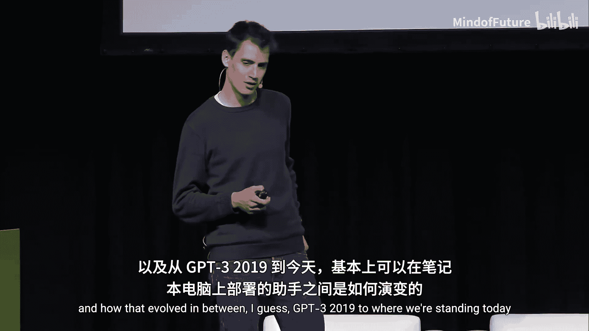

---

## 开场与介绍

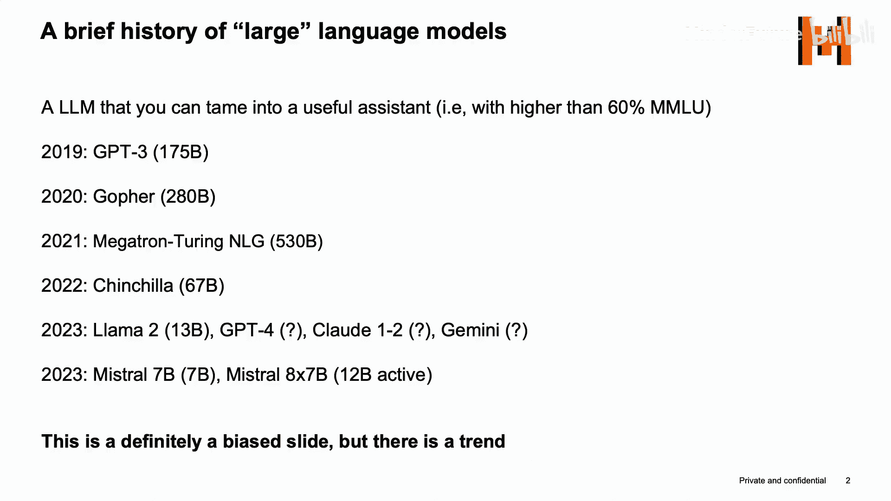

现在开始我们的会议。会议最后将留出一些时间进行提问。

欢迎通过移动应用程序、会议目录提交问题，或者在会议结束时到过道的麦克风前提问。

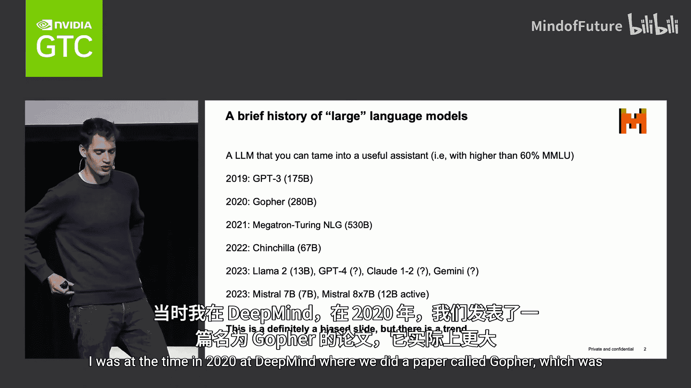

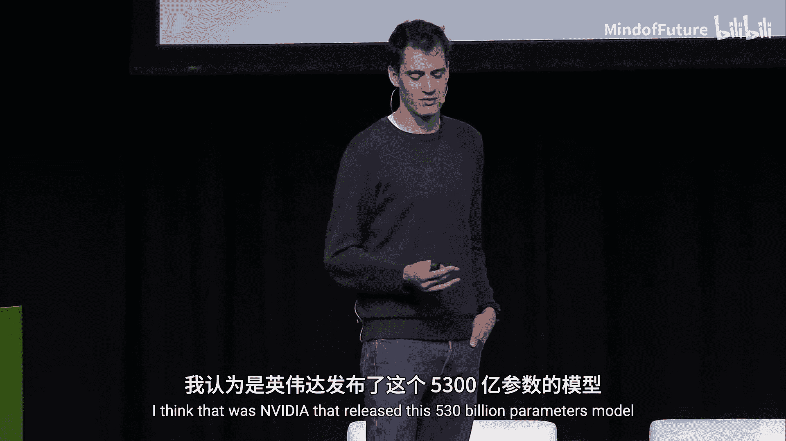

有请Arthur Mensch。Arthur是Mistral AI的首席执行官，该公司致力于训练最先进的生成式模型，并特别强调模型的定制化和可控性。今天他将与我们分享训练其首批模型（Mistral和Mixtral）过程中获得的经验，并展望未来一年的发展。欢迎Arthur。

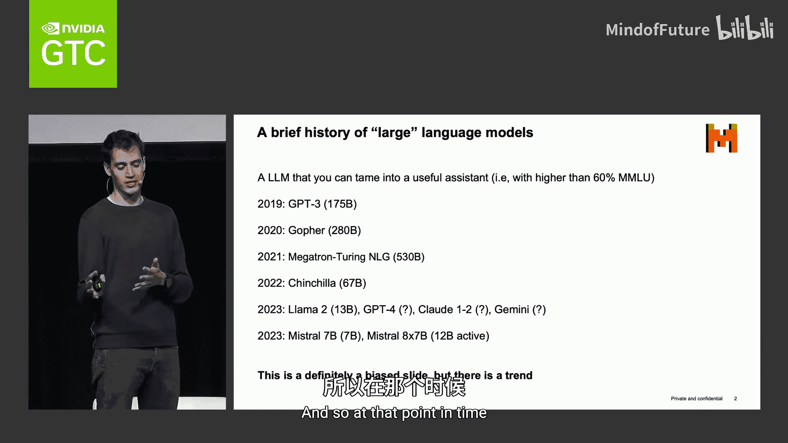

下午好，各位。我是Mistral AI的CEO，我将简要概述我们迄今为止的成果以及我们的发展历程。

在正式介绍公司、我们的差异化优势以及我们计划构建和已经构建的模型之前，我想先谈谈我对过去两年语言模型发展的看法，以及它是如何从2019年的GPT-3演变到今天我们所处的状态——基本上是可以部署在笔记本电脑上的助手。我将尝试解释我是如何看待这一过程的，因为我认为这是一个非常有趣的故事。

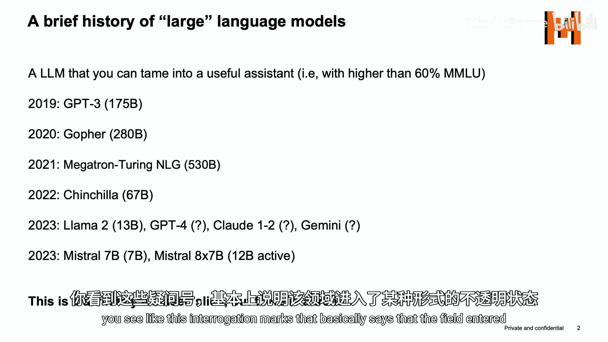

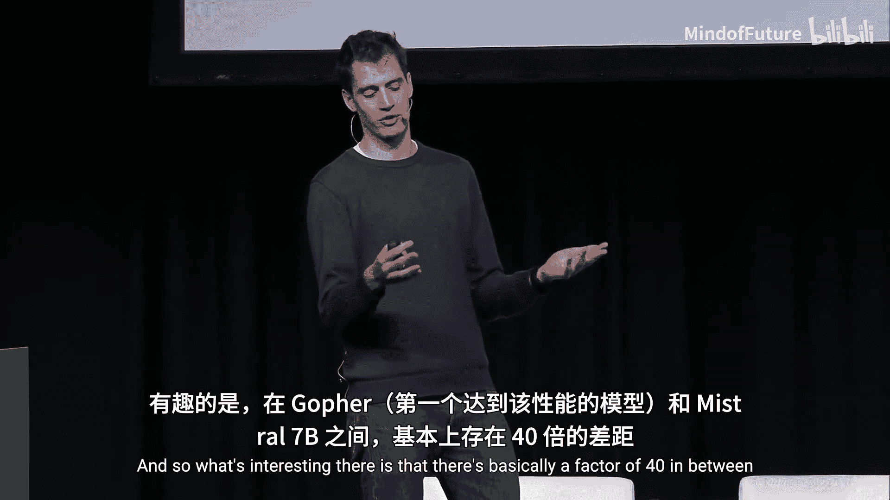

## 模型性能与规模的演变趋势

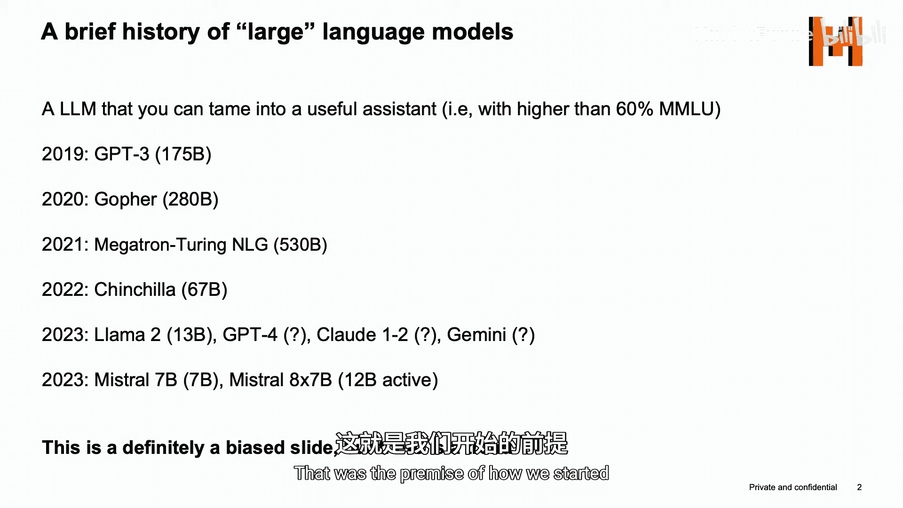

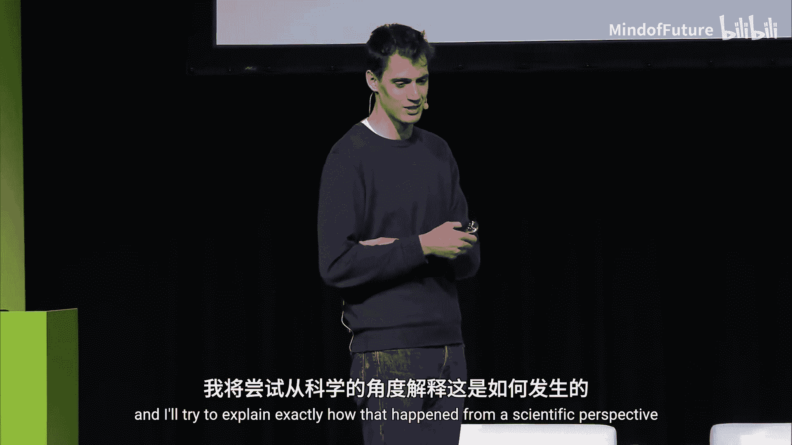

那么，如果你观察什么样的LLM能够成为一个有用的助手，作为一个科学家，你可以说它需要在MMLU基准测试上高于60%。通常低于这个水平，模型就不够有用，甚至有些令人沮丧。超过这个水平，你开始感觉像是在与一个足够好、足够聪明的助手或伙伴互动。

如果你试图观察达到这种性能的模型规模，在2019年，GPT-3实际上并没有达到60%的MMLU，但它已经足够接近了。2020年我在DeepMind时，我们发表了一篇名为Gopher的论文，模型更大，并且确实达到了60% MMLU的门槛。然后，在2020年，整个领域似乎都在追求构建越来越大的模型，随之而来的是所有相关的基础设施挑战。你必须进行各种维度的并行化。我记得当时NVIDIA发布了一个5300亿参数的模型。

然而，到了2022年，同样的性能由一个**小得多的模型**实现了。我将解释我们是如何做到这一点的。

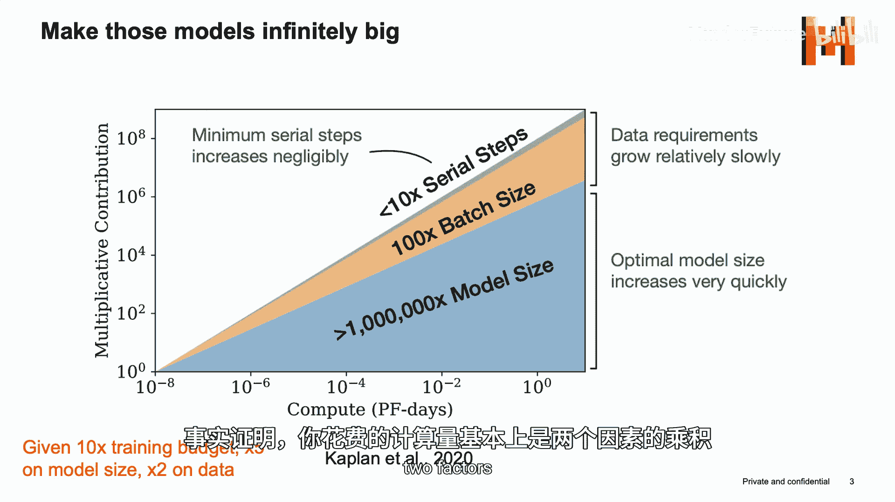

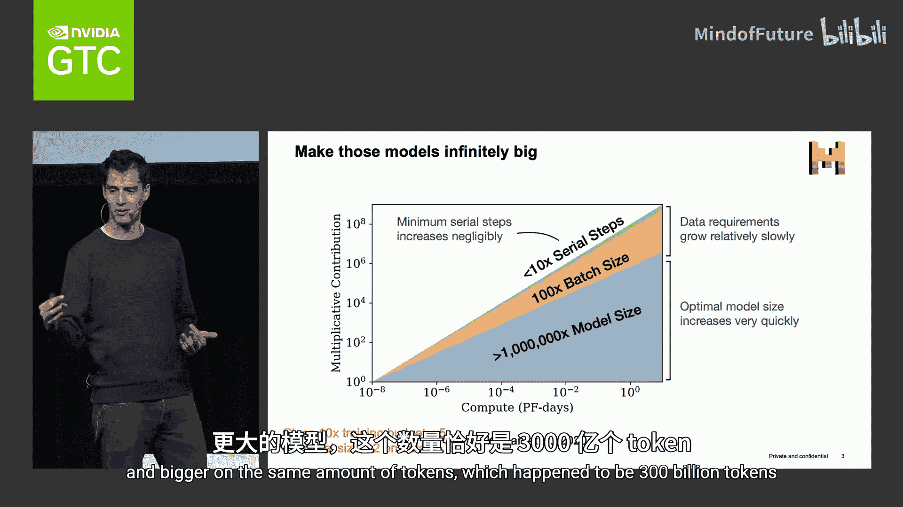

当时在DeepMind，我认为我们意识到并不需要构建非常大的模型，这可能不是一个好主意。如果你观察2022年发生的事情，GPT-3.5出现了，我认为这与Chinchilla论文修正了缩放定律密切相关。

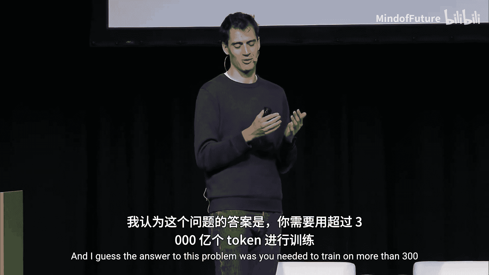

然后，在2023年，我们沿着这个方向继续前进，出现了Meta的Llama和Llama 2。当时，Mistral的许多同事也参与其中。在那个时候，你会看到一些问号，这基本上意味着该领域进入了一种不透明的状态，不同提供商使用的技术变得不透明。这在一定程度上催生了Mistral AI，也是我们创建它的原因。

我们关注的重点是尝试达到一个目标：在Mistral成立之初，我们的目标是让一个能在笔记本电脑上运行的模型达到60%的MMLU。这就是我们如何得到**Mistral 7B**的。有趣的是，在第一个达到该性能的模型Gopher和Mistral 7B之间，存在大约**40倍的规模差距**。

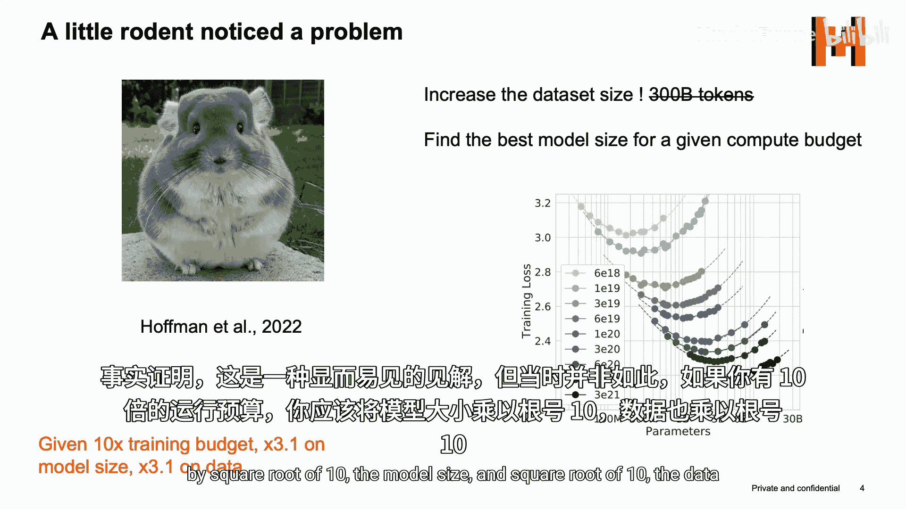

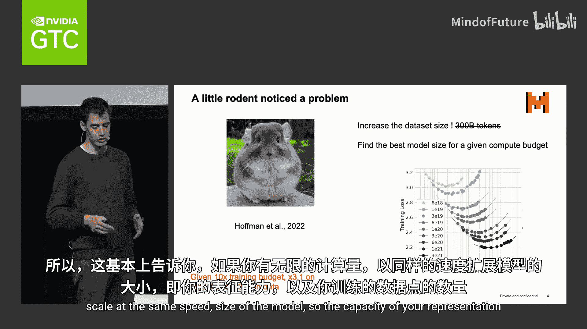

这就是我们起步的前提。我认为，我将解释为什么我相信这为许多有趣的应用开辟了道路。这张幻灯片可能有些偏颇，因为它以Mistral 7B和Mixtral 8x7B结尾，但其中确实存在一个趋势。我将尝试从科学角度解释这一切是如何发生的。

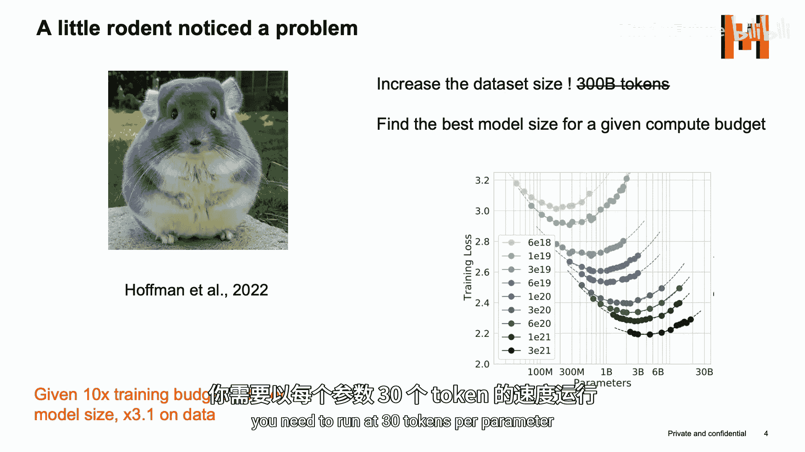

## 缩放定律的演进：从Chinchilla到高效训练

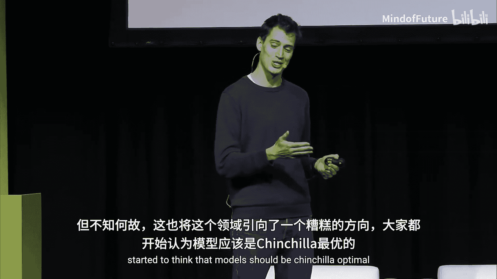

在2020年，趋势是让模型无限大。我认为其起点是Kaplan等人在2020年发表的一篇论文，该论文得出结论：如果你有10倍的训练预算（例如，从训练集群运行一周增加到十周），那么你应该将模型规模增加5倍，数据量增加2倍。事实证明，你在训练上花费的计算量基本上是这两个因素的乘积，即模型大小和数据量。Kaplan的结论是，如果你趋向于无限，你需要一个无限大的模型，并在多得多的数据量上进行训练。

这个前提在某种程度上推动了整个领域在相同的3000亿token数据量上训练越来越大的模型，持续了大约两年。这实际上在某种程度上减缓了该领域的发展，因为在某个时间点，如果你只在3000亿token上训练模型，你会开始饱和，因为你没有看到足够的token，并开始对数据集过拟合。我们在2021年底开始注意到这个问题。

解决这个问题的方法是你需要在超过3000亿token的数据上训练。我们当时处理这个问题的方法是：你有一个特定的计算预算。计算预算是参数数量乘以数据点数量。那么，你如何在扩展计算、扩展模型规模和扩展数据量之间做出适当的权衡呢？

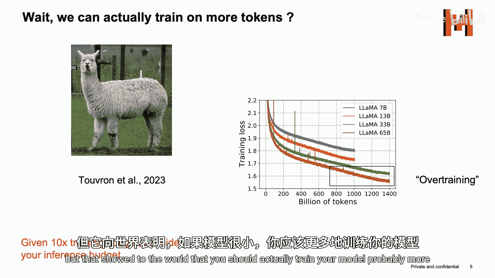

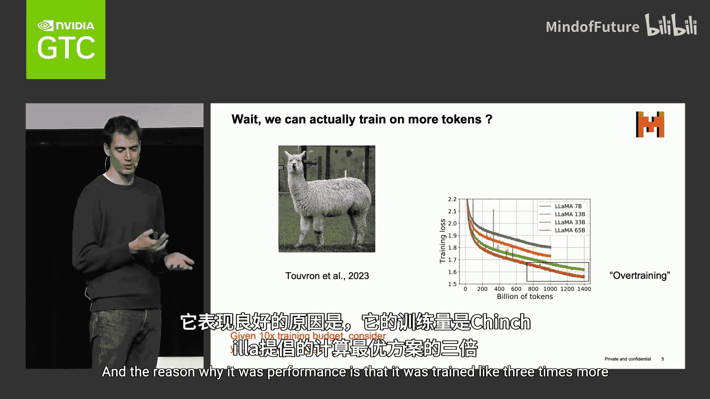

事实证明（这个见解现在看来很明显，但当时并非如此），如果你有10倍的训练预算，你应该将模型规模乘以√10，数据量也乘以√10。这实际上是唯一一个当你趋向无限时不会爆炸的设置。这基本上告诉你，如果你有无限的计算资源，你应该以相同的速度扩展模型规模（即你的表示能力）和你用于训练的数据点数量。

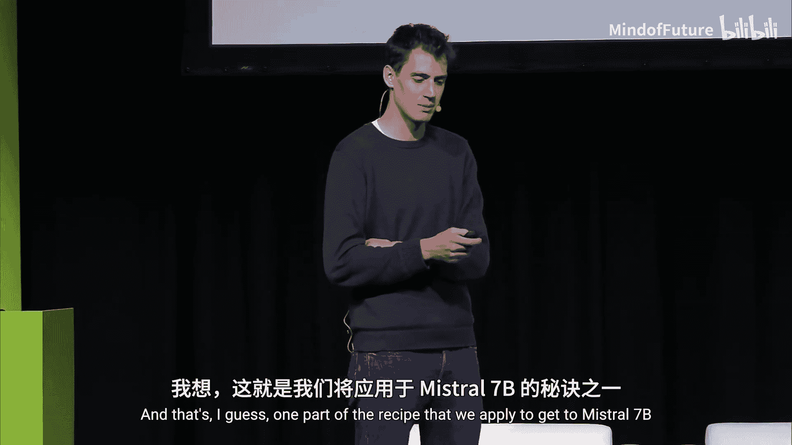

这意味着你的**压缩因子**应该保持相对恒定。事实证明，**最优压缩因子大约是每个参数对应30个token**。所以，无论你做什么，如果你有一个固定的计算预算（这也取决于数据质量），你需要在每个参数大约30个token的条件下运行。这是一个很好的见解。

但不知何故，它也误导了领域，让每个人都开始认为模型应该是“Chinchilla最优”的。我想这个词是在Twitter上创造的。但问题是，如果你用一个70亿参数的模型追求Chinchilla最优，你基本上只在2000亿token上训练。最终得到的模型在MMLU上表现平平，根本不起作用。所以，对于想要在笔记本电脑上运行的模型来说，追求**训练计算最优**并不是一个好主意。

我认为大约八个月后，Llama论文和Llama for Meta的出现，向世界展示了（尽管有些人早就知道）如果你想让模型更小，你可能需要训练得更久。Llama 7B可能是第一个表现尚可、性能良好的70亿参数模型。其原因在于，它的训练量大约是Chinchilla所倡导的计算最优方案的**三倍**。

我想这说明的是，如果你有10倍的训练预算，你应该考虑你的**推理预算**。当你在架构上做出选择时，如果只考虑训练预算，那么你应该训练一个大约每个参数对应30-32个token的模型。但如果你考虑到你将在许多GPU上部署你的模型，你应该尝试让你的模型更小。因此，在训练期间，你看到的token越多，对于相同的性能水平，模型就可以越小。你投入一些计算训练时间来更彻底地训练你的模型。我认为这是我们用来达到Mistral 7B的秘诀的一部分。

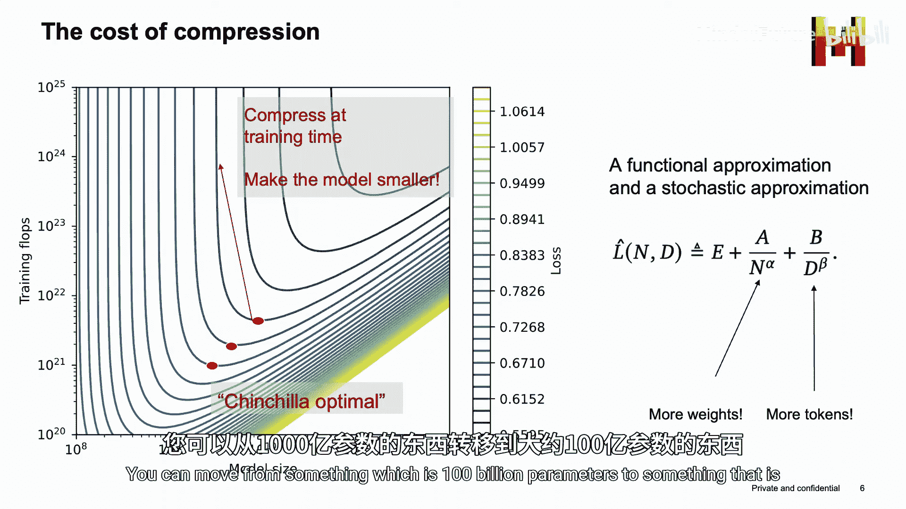

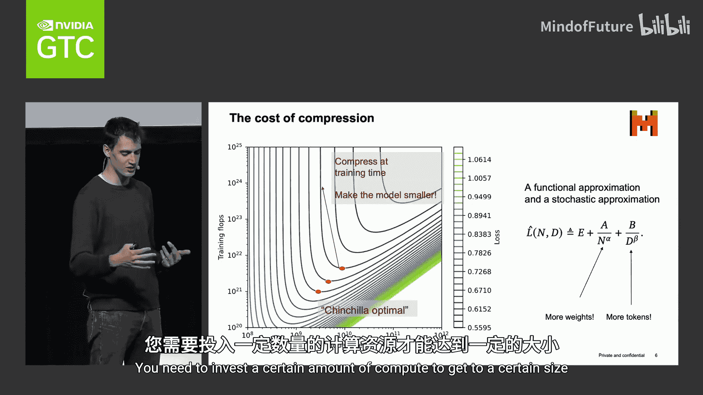

## 模型压缩的成本与收益

从这个意义上说，我认为考虑这种图表是有用的，它将模型大小与你应该应用的训练计算量（FLOPs）进行比较。在这里，你看到的每条等高线基本上代表了具有相同损失的模型，而损失是性能的指标。我们当时所称的“Chinchilla最优”模型，基本上是切线为水平线的点。

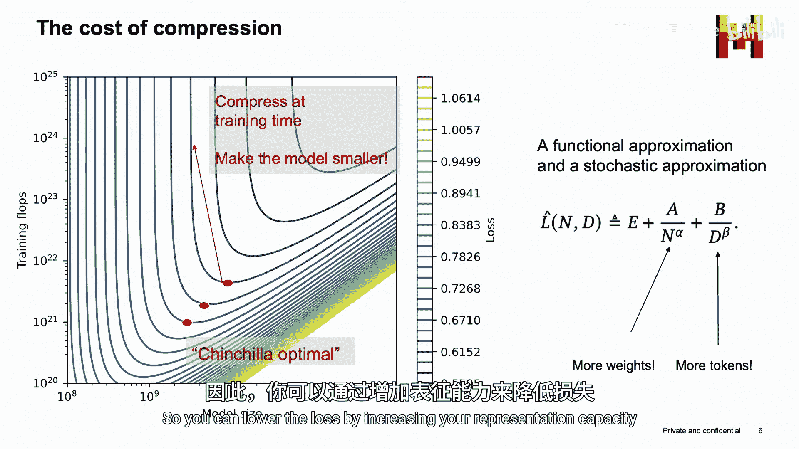

但如果你说，好吧，我有这个模型，但我想让它更小。所以我希望我的模型达到与红点相同的损失，但规模要更小。你将需要支付越来越多的计算成本。当你沿着纵轴向上移动时，你支付了更多的计算成本，向云提供商支付了更多费用，或者购买了更多GPU。最终，在这里你可以实现非常显著的改进：你可以从大约1000亿参数的模型，压缩到大约100亿参数的模型。

这就是**压缩的成本**。我认为这是一个非常有趣的现象，并且它是非常可预测的，你可以通过经验测量它。我认为这是一张非常重要的图表，因为它基本上设定了这个时期的经济学：你需要投入一定量的计算来达到特定的压缩水平。当你运营一家生成式AI公司时，这正是你应该优化的目标。

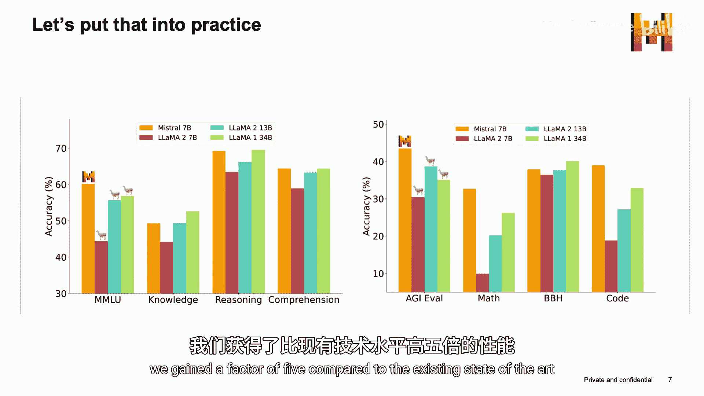

对于在场的数学家来说，这里的损失基本上由一个你无法低于的项（称为文本的自然熵）定义，然后还有两项。一项取决于模型的大小：模型越大，表示能力越强，因此你可以通过增加表示能力来降低损失。但你需要付出一些代价，这与随机梯度下降有关，这基本上是一个依赖于token数量的随机噪声项。

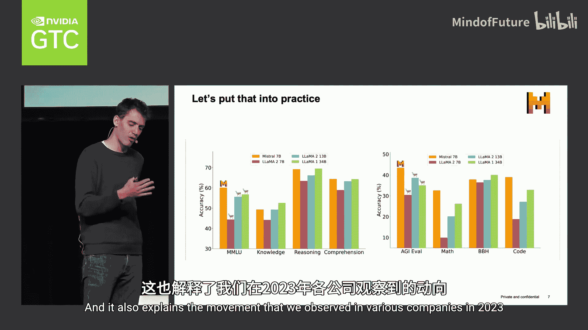

这两件事告诉你，要降低损失，你可以**增加权重（模型规模）**，或者**增加token数量**。仅仅通过绘制这种损失图，你最终就会得到这样的图表。正是这个图表决定了你在训练期间应该做出的选择。

## Mistral AI的实践与成果

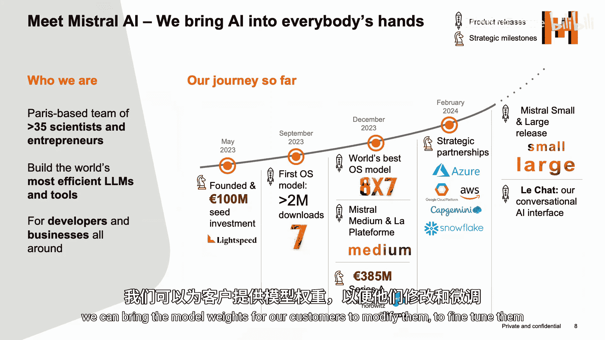

那么，如果你将其付诸实践，这正是我们在6月份创立公司时所做的事情。

最终，你得到的模型可以比Llama 2 7B好得多。这就是我们如何得到Mistral 7B的。我们尽可能地推动了压缩，最终得到了一个在当时性能超过Llama 2 13B的模型。

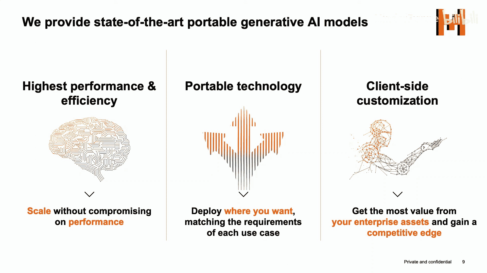

然后我们沿着这个方向继续前进，在12月得到了一个名为Mixtral的模型，它只有120亿个活跃参数，却拥有与Llama 2 70B相同的性能。通过推动这种压缩并改变架构，我们比现有技术水平提升了**5倍**。当你获得5倍的提升时，这非常酷，因为你可以在笔记本电脑上部署它，并且基本上可以运行5倍多的实例。这是一个必须考虑的重要因素。这也解释了我们在2023年观察到的各个公司的动向。

这就是我们所做的。这是我们创立公司时的观察结果。我们希望高效，并且希望开源。因此，我们在6月发布了Mistral 7B，在12月发布了Mixtral 8x7B。今天我们继续在开源前沿取得进展，构建越来越好的模型。我们也围绕此推出了我们称之为优化模型的商业模型，以及一个服务于它们的平台。

## Mistral AI的平台与使命

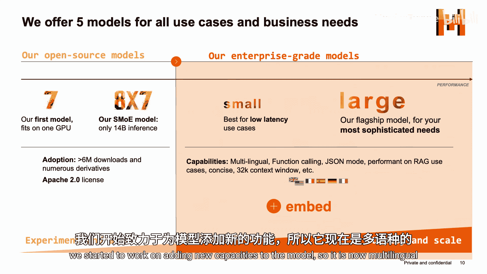

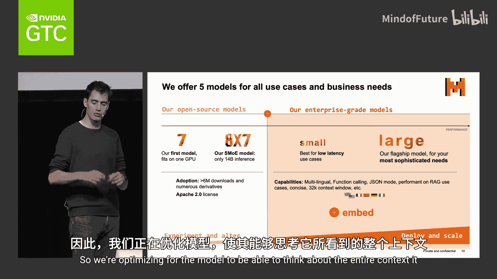

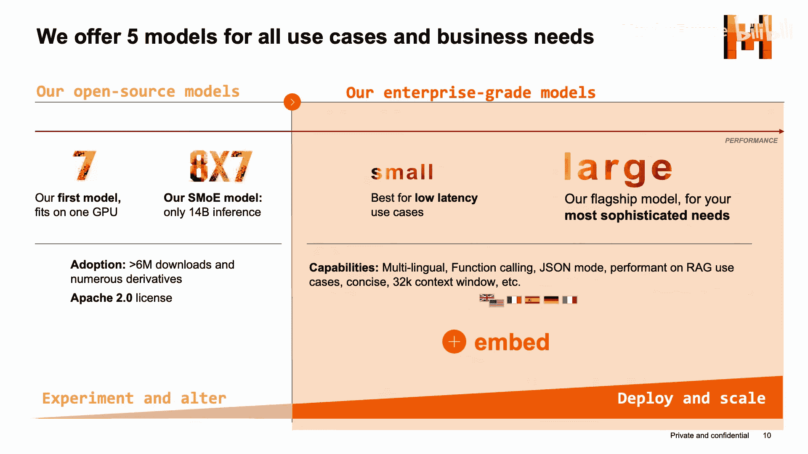

这个平台与许多人正在做的非常相似，不同之处在于我们提供了一个**可移植、可透明部署**的平台。这意味着我们可以将平台和模型权重带给客户，让他们进行修改和微调。我们已经与云提供商以及NVIDIA建立了各种战略合作伙伴关系（Jensen在周一宣布了这一点）。

我认为，我们的使命是**将AI带给每个人**。让它足够小，以便在笔记本电脑上运行；让它足够好，以达到最佳推理性能；同时让它足够便携，以便企业和开发人员可以在他们习惯的环境中工作——无论是在云端、平台上、私有云还是本地部署（如果需要的话）。通常，处理生成式AI时，你会在专有数据上工作，因此涉及许多合规性方面，这促使我们构建了一个可移植的平台。

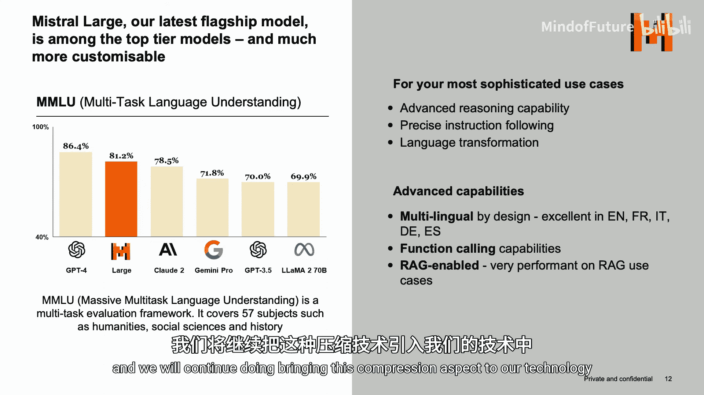

## 模型系列与能力

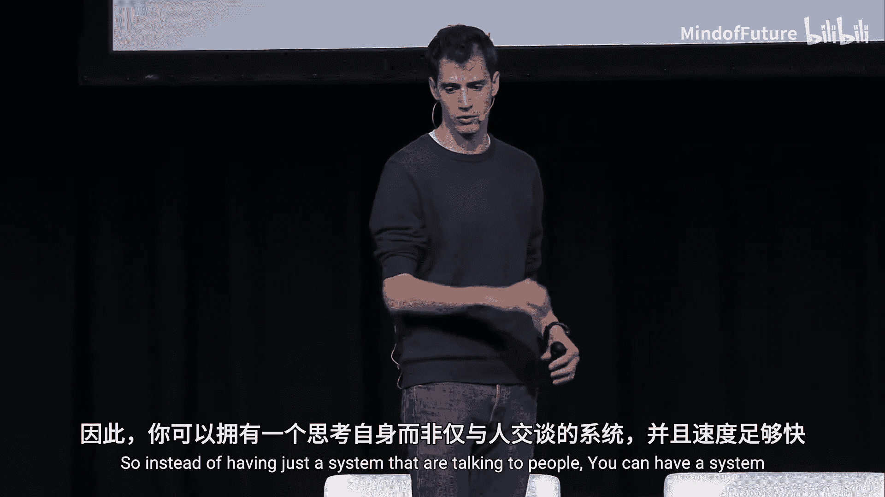

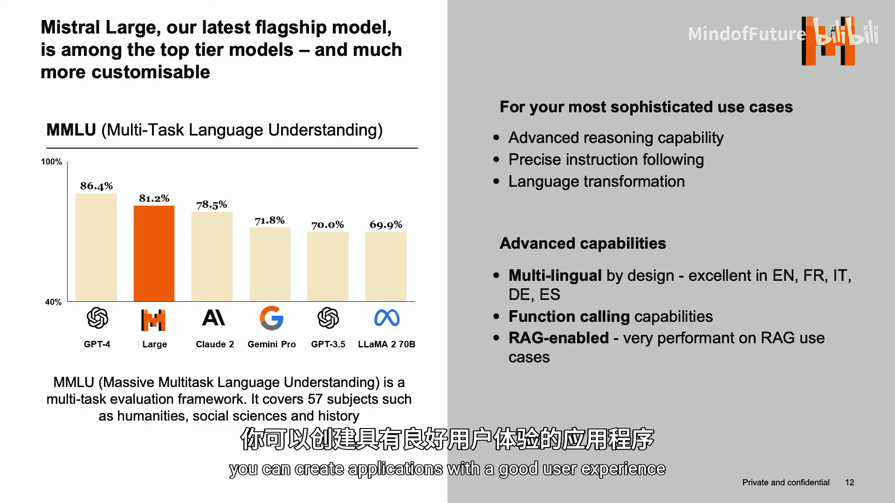

因此，我们为所有这些情况和业务需求提供了大约五种模型：Mistral 7B、Mixtral，我们还有一个小模型，其性能实际上优于Mixtral且延迟更低。我们还有Mistral Large，目前在推理能力方面属于顶级模型之一。

除了我们在12月之前所做的科学努力之外，我们还开始致力于为模型添加新能力。它现在是**多语言的**。它具备**函数调用**能力，这在当今的应用程序中非常重要，当你构建代理或让模型与数据库、工具交互时。我们有一个**JSON模式**，可以强制模型输出可用于调用API的内容。我们还针对我们称之为“用例”进行了优化，例如优化模型以思考整个上下文长度。

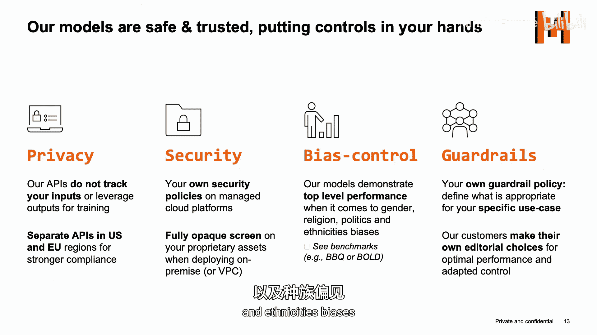

我们在12月还发布了一个嵌入模型，它曾经是最先进的，现在仍然非常先进。这是一个比大语言模型发展更快的领域。

## 性能、延迟与优化重点

是的，所有这些都可以通过我们的平台获得，并且正逐步通过一系列合作伙伴提供。现在也可以在 `ai.nvidia.com` 上找到。

在性能方面，我们一直在进行优化，包括针对Mistral Large的延迟和模型容量，使其在保持一定性能水平的同时足够小。因此，今天Mistral Large与其他模型相比具有相当低的延迟。我们将继续将这种压缩理念带入我们的技术中，因为我们认为这是构建复杂应用的途径。

**延迟之所以重要**，是因为一旦你达到某个延迟水平（通过更好的硬件和模型），你就可以不再考虑AI如何在后台运行。你可以拥有一个能够自行思考的系统，其速度足以创造具有良好用户体验的应用程序。这确实是我们优化的重点。

## 隐私、安全与可控性

我们针对**隐私**进行了优化，正如我所说，我们不追踪你的输入。我们针对**安全**进行了优化。自定义部署和VPC部署基本上是你能获得的最安全的部署方式。我们针对**护栏**进行了优化，你可以根据特定用例定义什么是合适的，基本上可以在提示中设置你需要的护栏，我们确保这些护栏得到遵守。

因为我们精心策划了数据，我们在**偏见控制**方面非常严格，我们的模型在性别、宗教、政治、种族偏见等方面实际上表现出顶级的控制性能。

## 未来展望与总结

我想，这些基本上就是我们的核心主张。我们打算在开源领域成为领导者。因此，我们目前正在发布最好的开源模型，并且我们打算在未来几个月继续这样做。我们会有更好的模型问世，会有新的能力出现。多语言性对我们来说非常重要，我们正在推进这方面的工作。

正如我所说，保持开放并拥有非常强大的开源模型，也是为了**让我们的客户能够修改模型并根据他们的用例进行微调**，从而获得更好的性能，使模型能够适应并随着时间的推移变得更好。这也是我们平台即将推出的功能，我们将把我们在AI方面的专业知识带入其中，目的是降低模型微调的门槛。这很快就会到来，虽然没有宣布具体日期。

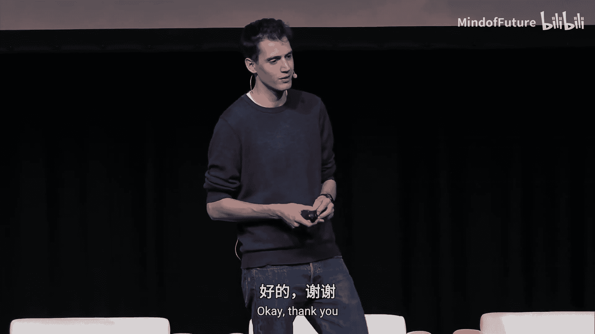

本节课中，我们一起回顾了大语言模型从追求规模到追求效率的演变历程。我们深入探讨了**缩放定律**、**模型压缩的成本与收益**，以及Mistral AI如何通过科学的方法（如优化训练数据量与模型规模的比例）将前沿AI模型的性能压缩到可在个人设备上运行的程度。我们了解了Mistral AI的模型系列、其平台对隐私、安全和可控性的重视，以及其推动开源和模型定制化的未来愿景。核心在于，通过高效的训练和架构创新，强大的AI助手正变得无处不在。