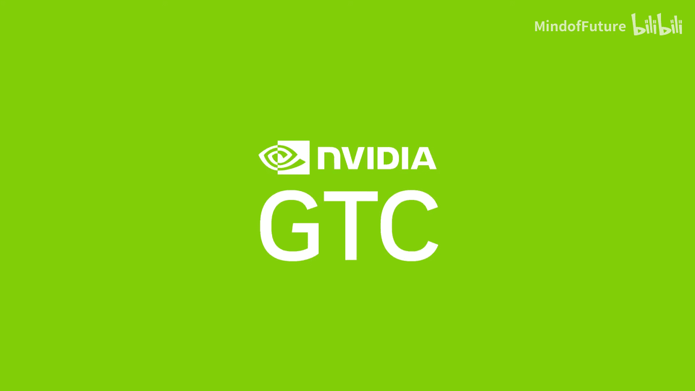
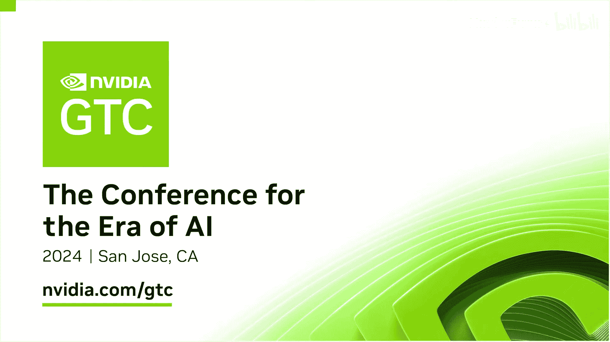

# 015：与 Greg Estes 的现场对话

## 概述

在本节课程中，我们将跟随 NVIDIA 开发者计划与企业营销副总裁 Greg Estes 的视角，回顾 GTC 2024 大会的盛况。我们将了解大会的规模变化、AI 生态系统的演进、行业参与者的多样性，以及 AI 技术从研究到企业级部署的转变历程。

---

大家好，我是 Claudia Cook。我身边的是 Greg Estes，他是我们的开发者计划与企业营销副总裁。

我们现在从 GTC 2024 现场为您带来直播，非常兴奋能与大家分享展会上正在发生的一切。五年了，对吧？距离我们上次在会议中心举办大会已经五年了，现场的能量简直爆棚。

是的，变化巨大。回想一下，NVIDIA 作为一家公司，与五年前相比已处于截然不同的位置。2019 年，我们公司大约有 8600 名员工。昨天主题演讲现场有 11000 人，现场参会人数可能达到 17000 甚至 18000。我们预计到本周结束时，将有 30 万人注册并通过在线方式观看 GTC 的内容。因此，现场的热烈氛围和能量完全超出了图表。

确实如此。现在时间还早，展馆还没开放，所以你们看不到我们身后的人群。但昨晚简直是人山人海，到处都挤满了人，而且大家都很开心。在众多科技展示中，我们还有一个很棒的啤酒花园。我想说，那是科技与乐趣的完美融合。

没错。我们的社区和生态系统也在发生变化。一切都已经改变。正如 Jensen 在昨天的主题演讲中所展示的，所有重要的 AI 参与者都来到了这里，包括谷歌、微软、AWS、甲骨文等大家能想到的公司，还有 Meta 等。但除此之外，你还能看到各种不同类型的企业也在这里，他们正在构建自己的业务，例如富国银行、约翰迪尔等。这些优秀的品牌和公司现在都在用 AI 做着惊人的事情。这与 2019 年相比是一个巨大的不同。

实际上有很多变化。2019 年，很多展示的还是研究项目，我们展示的可能只是上周四刚发明的、新奇古怪的东西。而现在，你看到这些技术已经在各种非常传统的企业中部署应用了。他们来到这里讨论这些应用，这标志着市场已经改变，也标志着生态系统如你所说已经改变。我一直很喜欢看到我们的研究变为现实，真正得到部署。回想它当初还只是一个想法雏形的时候，非常有趣。

同时，不同领域的涌现也让你能清楚地看到 AI 的发展方向。生成式 AI 当然是现在每个人都在关注的焦点。2019 年，人们甚至不太清楚 AI 是什么，而现在，12 岁的孩子都能告诉你 ChatGPT 是什么。这是一个巨大的变化。医疗保健等所有行业都在使用 AI。我们这里还有一个美丽的 AI 艺术装置，来自 Refik Anadol。他的装置非常华丽、漂亮。它也是主题演讲的一部分，人们走进来就能体验到。

我们很高兴能与他合作。这个装置在纽约曼哈顿的现代艺术博物馆展出，他确实是世界上领先的 AI 艺术家，无疑是最著名的一位。能在主题演讲现场进行这样的展示，并在那个巨大的、堪比泰勒·斯威夫特演唱会规模的屏幕上呈现，充满了整个 SAP 中心，那种能量非常酷。我们本周早些时候还在演播室采访了 Refik，所以大家可以去看看那期节目。他是个很有趣的人。

是的，他非常棒，大家一定要去看看。这个演播室让我们能够邀请到合作伙伴和演讲者，并请你来这里聊聊，因为 GTC 是你我共同的热情所在。说到电视演播室，CNBC 也在这里，Jim Cramer 正在进行现场直播，这太棒了。60 分钟节目组也在这里为一个片段进行拍摄。来自十几个国家的广播公司在这里进行各种活动。这种能量真的非常酷。例如，CNBC 在 Jensen 主题演讲前做了倒计时。《华尔街日报》的头版也有一篇很棒的文章，说 NVIDIA 吸引了 11000 人参加一个关于 AI 的开发者大会。想想看，这真的很酷。

确实如此。昨天早上醒来看到这些，真的很有趣。那个倒计时太棒了。还有什么你想让大家知道的吗？比如你在期待看到什么，或者在展馆里会遇到什么朋友？

我超级兴奋的事情之一，其实是所有的初创公司。你知道，我们的初创公司计划叫做 “Inception”。昨晚我们为所有 Inception 合作伙伴举办了一场招待会，有超过 500 人参加，我们甚至要担心房间的消防规定。圣何塞市长也到场发表了讲话，这很棒。市长 Matt Mahan 正在努力将圣何塞打造成真正的 AI 之都。

现在，你看到各级政府，从州和地方政府如圣何塞，到国家政府，当然包括美国，以及世界各地的政府，都开始创建这种在本国建立 AI 超级计算机的基础设施。这很有道理，因为你需要投资于这种基础设施，然后围绕它发展生态系统。这样，从顶尖大学毕业的学生就能留在国内，创建初创公司，做所有这些事情，并且使用本地语言，将数据保留在国内。因此，在政府的各个层面，你现在都能看到这种投资。而几年前，人们对 AI 的态度可能还是“好吧，知道了”。现在，这似乎成了一种必然。

这也说得通，因为想象一下，现在有哪个企业会在战略上说“是的，我们不打算在 AI 上做太多”？谁会那样做呢？所以，从技术角度来看，AI 已经无处不在。它是我们一生中经历的最深刻的技术变革。因此，人们能够来到 GTC，看到整个生态系统，了解它。如果你是开发者，可以获得动手培训；如果你是来自世界各地的高级管理人员或政府工作人员，可以沉浸其中，真正理解如何构建你的战略。

我们非常自豪，GTC 已经成为世界上最重要的 AI 会议。我们非常自豪，在注册人数方面，我们正在突破所有可能的预期。我也非常自豪，我们所有的合作伙伴，甚至有人在我们的开发者大会上搭建了两层楼的展位。这从根本上改变了 NVIDIA 的地位和生态系统的发展方向，超级令人兴奋。我们必须向幕后团队致敬，是他们将这一切凝聚在一起。

人们根本不知道这背后有多少工作。你知道，我们提前八到九个月就开始筹备 GTC，有些事项甚至提前一年就开始规划。因为我们有大约一千场不同的演讲、会议和小组讨论等。我们可能只接受了不到 64% 的提交内容（我上次看的数据），所以你必须筛选上千场演讲，决定邀请谁来，安排谁在哪天哪个场地。这些后勤工作，人们甚至想不到，简直令人难以置信。追踪器在这里帮了我们大忙。

是的，我们喜欢我们的追踪器。但就像你说的，五年了，能回到这里真是太棒了，见到老朋友和新朋友也很棒。谢谢你帮助我们完成这一切。

绝对应该。观看这段视频的各位，你们自然会在活动结束后才看到。但将这些 GTC 会议内容提供点播和视频点播，使我们所有开发者和希望了解前沿动态的人们都能获得这些精彩内容。这不仅仅是关于 AI，还包括数据科学、高性能图形和高性能计算。并非全是 AI，但 AI 可以说是重心所在。能够利用机会观看所有这些内容，是一份真正的礼物，我希望大家好好利用。

好的，Greg，感谢你加入我，一起回顾这次活动。也感谢大家的观看。请务必探索 GTC 目录中的更多会议。

---

## 总结

本节课中，我们一起回顾了 NVIDIA GTC 2024 大会的盛况。我们了解到，与五年前相比，大会规模、参与企业的多样性以及 AI 技术的成熟度都发生了巨大变化。AI 已从实验室研究走向广泛的行业部署，成为驱动各领域创新的核心力量。GTC 大会本身也已成为全球最重要的 AI 技术交流平台，连接着开发者、企业、初创公司和政府，共同构建未来的 AI 生态系统。