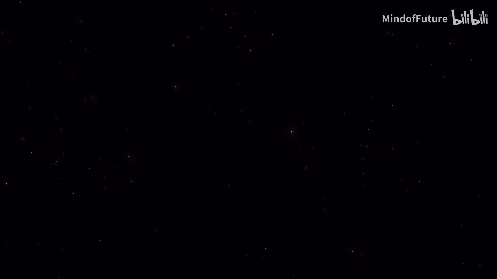
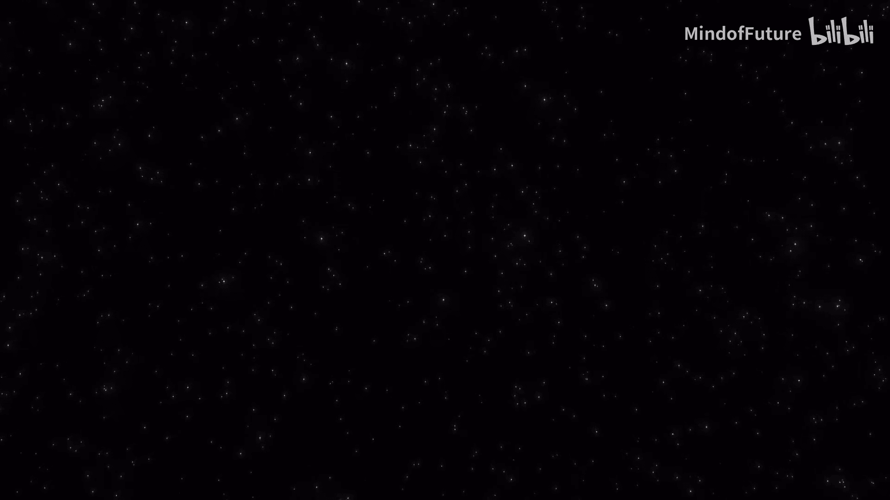
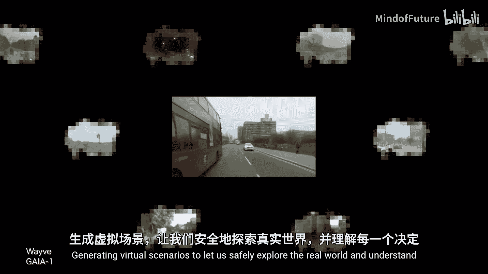
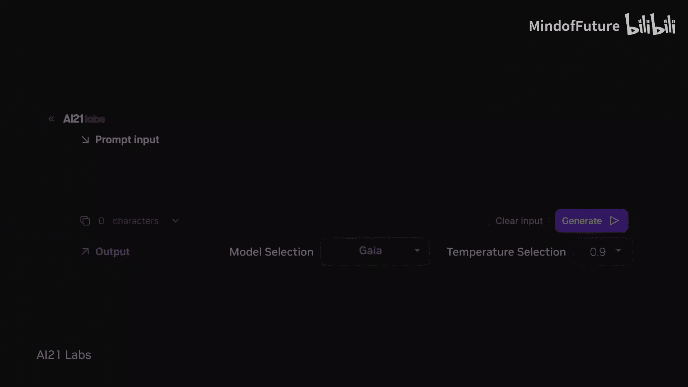
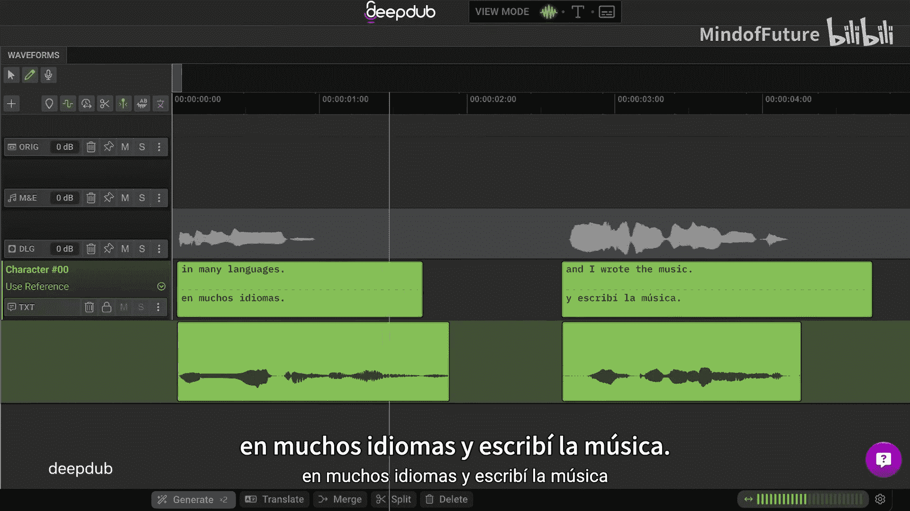
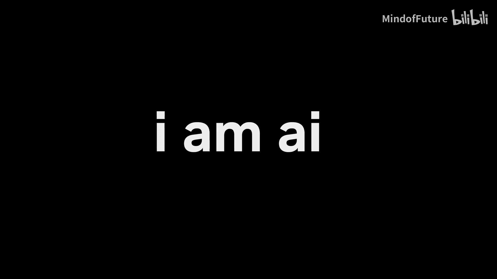

# 016：我是AI - 官方主题演讲介绍

在本节课中，我们将学习英伟达GTC 2024大会中“我是AI”主题演讲的核心内容。这段视频展示了人工智能在多个领域的应用与愿景。我们将逐一解析AI扮演的不同角色及其背后的技术概念。


## 概述

这段视频通过一系列生动的场景，描绘了人工智能作为**远见者**、**助手**、**变革者**、**训练师**、**治愈者**和**导航者**的形象。它展示了AI如何从天文物理到医疗健康，从能源存储到日常辅助，深刻地改变我们的世界。核心在于，AI是由**深度学习**、**英伟达技术**和**全球智慧**共同驱动的。



---



## 我是远见者 👁️

上一节我们概述了AI的多重角色，本节中我们来看看AI作为“远见者”的具体表现。

AI能够照亮星系，让我们见证恒星的诞生。它还能帮助我们更清晰地理解极端天气事件。这背后依赖于强大的计算模型分析海量数据。

以下是AI作为远见者的两个关键应用：
*   分析天文数据，模拟星系演化。
*   处理气候数据，预测极端天气模式。

其核心通常涉及处理序列数据的模型，例如循环神经网络（RNN）或Transformer，其基本注意力机制可简化为：
`Attention(Q, K, V) = softmax(QK^T / sqrt(d_k)) V`

---

## 我是助手 🤝

了解了AI在宏观科学领域的应用后，我们转向它与人类个体的直接互动。AI可以成为贴身的助手。

AI能够引导盲人在拥挤的世界中行走。它还能为无法说话的人发出声音。例如，语音合成和计算机视觉技术让这些成为可能。

以下是AI作为助手的功能示例：
*   实时环境感知与语音导航。
*   将文本或脑电波信号转换为自然语音。

一个简单的文本转语音（TTS）接口可能如下所示：
```python
tts_engine.synthesize(text="我需要去商店")
```

---

## 我是变革者 ⚡

AI不仅是生活的助手，更是推动根本性变革的力量。它作为“变革者”，正在重塑我们的能源未来。

AI利用重力来储存可再生能源，并为所有人通往无限的清洁能源之路铺平道路。这涉及到对复杂物理系统进行优化和控制。

以下是AI作为变革者的应用方向：
*   优化重力储能系统的调度与控制。
*   设计和模拟新型清洁能源网络。

其控制逻辑可能基于强化学习，目标是最大化长期收益：
`目标：最大化 Σ γ^t * R_t`，其中 `γ` 是折扣因子，`R_t` 是t时刻的奖励。

---

## 我是训练师 🤖

变革需要工具，而机器人是重要的工具之一。AI作为“训练师”，正在教会机器人如何更好地服务人类。

AI教导机器人提供协助、警惕危险，并帮助拯救生命。这通常通过在虚拟环境中进行大量的模拟训练来实现。

以下是AI训练机器人的关键任务：
*   在仿真环境中学习复杂的操作技能。
*   识别环境中的潜在威胁并做出安全反应。

训练过程通常使用深度强化学习框架，如：
`agent.learn(environment, episodes=10000)`

---

## 我是治愈者 🩺



从物理世界回到生命科学，AI在医疗健康领域扮演着“治愈者”的角色，带来了革命性的进步。

AI提供新一代的治疗方法和更高水平的患者护理。例如，AI医生可以处理药物过敏查询，确保用药安全。

以下是AI作为治愈者的应用场景：
*   加速新药研发与分子设计。
*   提供临床决策支持与个性化护理方案。



一个简单的药物交互检查对话可能如下：
```
患者：我对青霉素过敏，服用这些药安全吗？
AI系统：检查中...这些抗生素不含青霉素，您可以安全服用。
```

---

## 我是导航者 🧭

最后，AI还是探索未知世界的“导航者”。它通过创造虚拟世界，让我们能安全地理解和应对现实。



AI生成虚拟场景，让我们安全地探索真实世界，并理解每一个决策背后的可能结果。这在自动驾驶、城市规划和军事模拟中至关重要。

以下是AI作为导航者的核心用途：
*   生成用于测试和训练的逼真仿真环境。
*   对复杂决策进行推演和结果预测。

场景生成可以表示为：
`虚拟场景 = G(随机种子， 物理规则， 目标约束)`

---



## 总结

本节课中，我们一起学习了英伟达“我是AI”主题演讲展示的六大AI角色。我们看到，AI作为**远见者**、**助手**、**变革者**、**训练师**、**治愈者**和**导航者**，正通过**深度学习**等核心技术，在科学、生活、能源、机器人、医疗和仿真等领域发挥着变革性作用。这段视频最终强调，**“我是AI，由英伟达、深度学习和遍布各地的卓越智慧赋予生命。”** 这勾勒出了一幅由人工智能驱动的、更加智能和高效的未来图景。