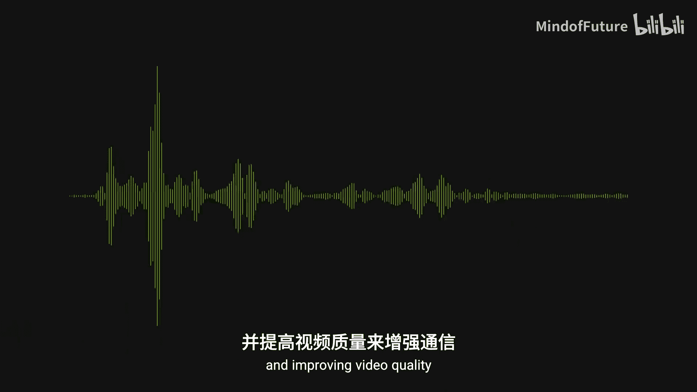
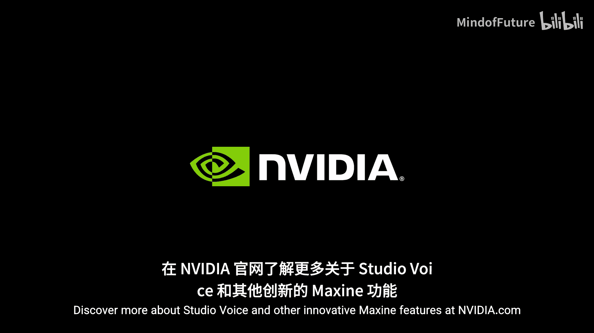

# 018：使用 NVIDIA Studio Voice 提升视频音质

在本节课中，我们将学习如何利用 NVIDIA Maxine 中的 **Studio Voice** 功能，将普通麦克风的录音音质提升至专业水准。我们将了解其核心原理、主要功能以及应用场景。

## 🎼 概述：革命性的AI音频增强

NVIDIA Maxine 的突破性 AI 模型旨在增强通信体验，彻底变革视频会议。其最新功能 **Studio Voice** 能将语音质量提升至专业标准，即使用户仅使用普通的笔记本电脑或台式机麦克风。

上一节我们介绍了 NVIDIA Maxine 的总体目标，本节中我们来看看 **Studio Voice** 具体是如何工作的。

## 🎼 核心原理：频谱重建与降噪

**Studio Voice** 利用先进的音频处理技术，通过重建录音过程中丢失的频率来扩展输入或录制音频的频谱。其核心在于两个关键处理：

1.  **频谱扩展与重建**：该功能能智能地补全音频信号中缺失的高频和低频成分。其过程可以简化为一个信号重建公式：
    `输出音频 = 模型(输入音频)`
    其中，AI 模型学习了从“普通麦克风录音”到“高质量录音”的映射关系。

2.  **噪声与回声消除**：**Studio Voice** 可以应用复杂的噪声和回声抑制算法。以下是其处理流程的简化表示：
    ```python
    # 伪代码示意
    原始音频 = 录制信号(包含语音、噪声、回声)
    处理后的音频 = studio_voice.process(原始音频)
    # 输出主要为纯净的语音信号
    ```
    最终结果是获得更清晰、更饱满的声音，显著提升听者的体验。


## 🎼 主要功能与优势

基于上述原理，**Studio Voice** 为用户带来了多项实用功能。以下是其主要优势列表：


*   **背景降噪**：有效识别并抑制键盘声、环境谈话等背景噪音，确保人声突出。
*   **回声消除**：移除由扬声器反馈到麦克风的回声，保证通话清晰。
*   **带宽优化**：在保持高音质的同时，可能对音频流进行智能编码，以适应不同的网络条件。
*   **音质增强**：提升语音的清晰度、饱满度和专业感，无需昂贵的外置麦克风。





## 🎼 总结与应用


本节课中，我们一起学习了 **NVIDIA Maxine Studio Voice** 如何通过AI技术提升音频质量。它通过频谱重建和降噪两大核心处理，将普通麦克风的录音转化为专业级音质，广泛应用于视频会议、内容创作、在线直播等场景。


总而言之，**Studio Voice** 代表了AI在实时音频处理领域的重大进步，它通过降低背景噪声、优化带宽，极大地增强了通信体验。如需了解更多关于 **Studio Voice** 及其他创新功能的信息，可以访问 NVIDIA 官方网站。