# 019：使用 NVIDIA Nsight System 将 AI 应用扩展至数据中心与云端 🚀

在本节课中，我们将学习 NVIDIA Nsight System 如何帮助开发者在数据中心和云端扩展人工智能应用。我们将了解其核心功能，特别是用于多节点性能分析的“配方”系统，以及它如何与 Jupyter Notebook、容器和远程 GUI 集成，以简化大规模应用的性能剖析与优化工作。

随着云应用每秒请求量的持续增长，以及高性能计算应用工作集规模的不断扩大，对可扩展解决方案的需求变得前所未有的迫切。

Nsight Systems 是 NVIDIA 推出的综合性性能分析工具。如今，Nsight Systems 正在不断发展，以应对 AI 应用在数据中心和云端横向扩展的挑战。我们很高兴地介绍一系列旨在帮助应用开发者分析微服务的新功能。

## 多节点性能分析与“配方”系统 🔍

上一节我们提到了 Nsight Systems 应对扩展挑战的演进。本节中，我们来看看其核心机制——多节点性能分析。该功能通过名为“配方”的脚本实现，这些脚本会对数据进行分类整理，帮助您直观地理解和分析应用性能。

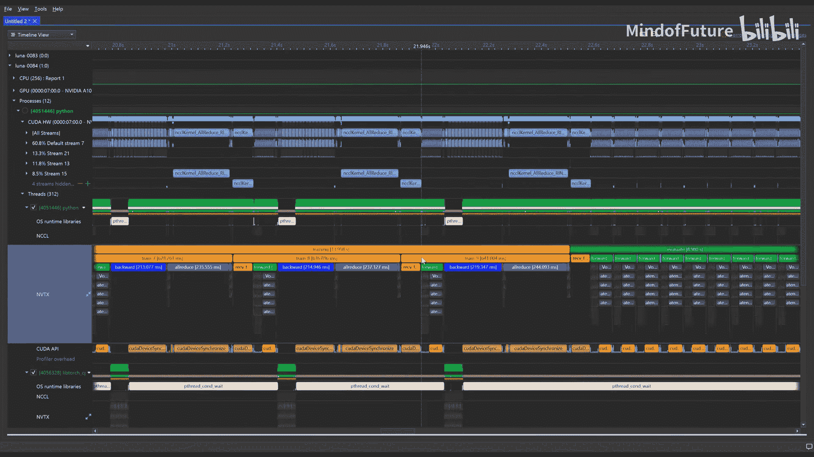

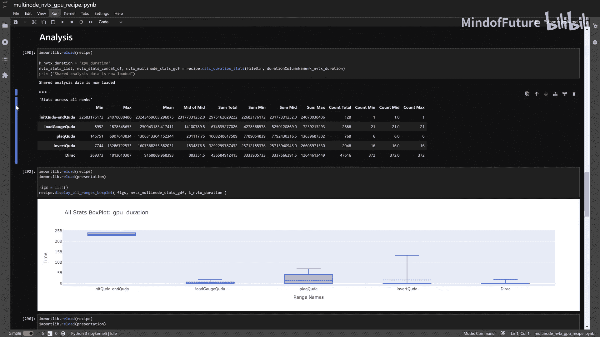

“配方”的输出结果通过 Jupyter Notebook 集成进行可视化。这能引导您定位需要优化的环节以及潜在的问题根源。

以下是“配方”可以帮助您检查的关键指标：

*   GPU 利用率
*   Host to Device 通信时间
*   网络通信

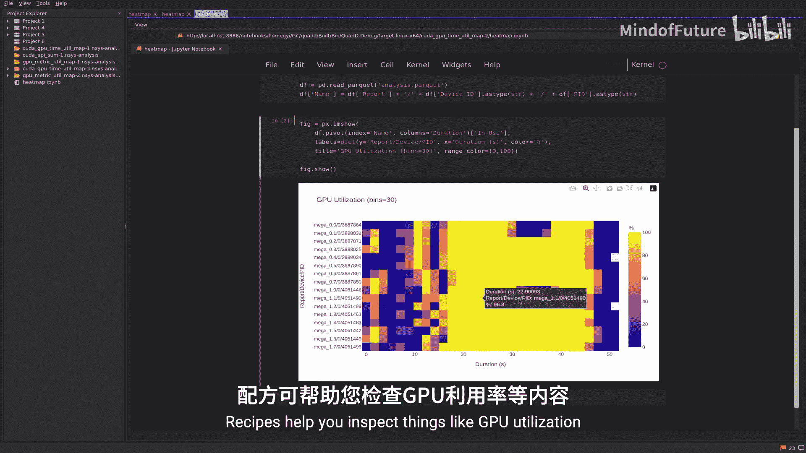

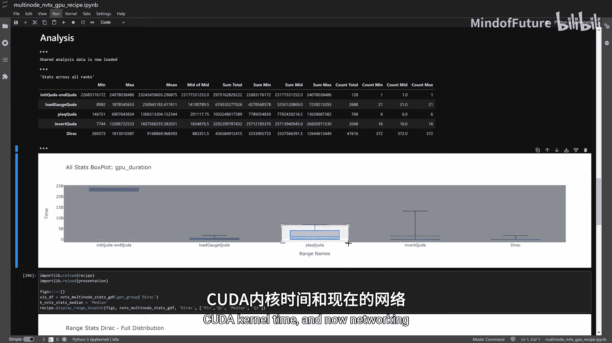

## 网络通信分析与可视化 📊

通信是应用横向扩展的关键部分。因此，我们引入了新的分析“配方”，旨在帮助用户理解计算“冷点”与通信之间的关系。

现在，Nsight Systems 可以生成多节点热力图，用于显示：

*   InfiniBand 网络拥塞情况
*   InfiniBand 和以太网吞吐量
*   NVLink 吞吐量
*   计算与网络通信的重叠情况

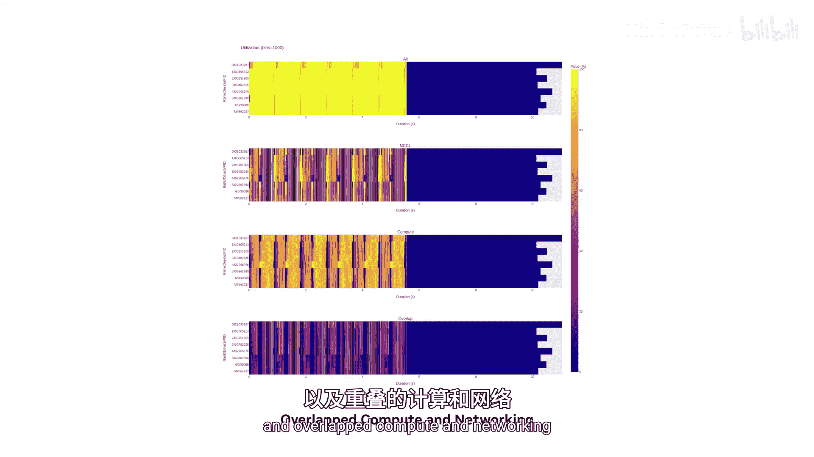

## 容器与云端集成 ☁️

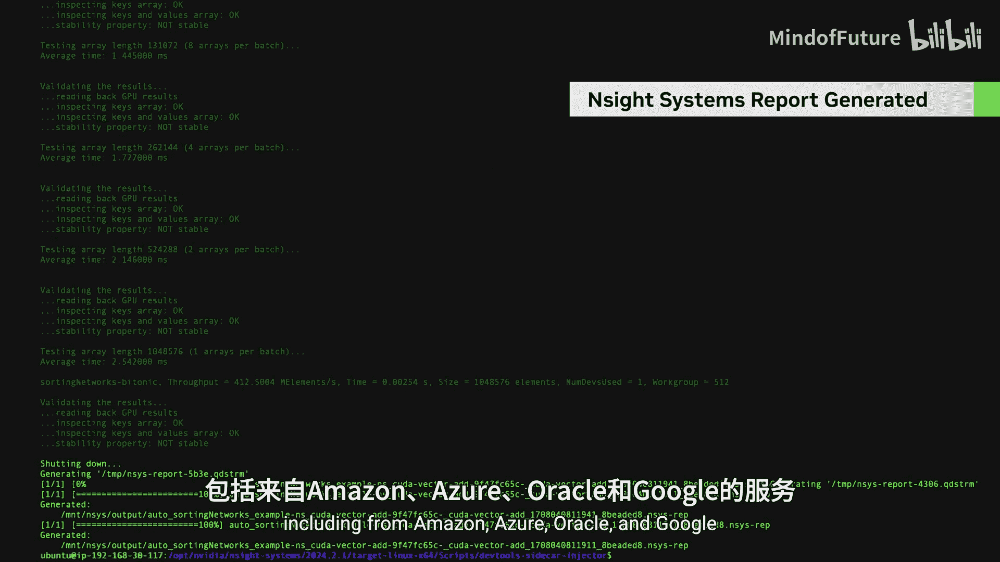

为了适应现代开发环境，Nsight Systems 增强了对流行容器系统的性能剖析支持，例如 Kubernetes 和 Docker。这包括对各大云服务提供商 Kubernetes 服务的全面支持，涵盖亚马逊、微软、甲骨文和谷歌。

此外，为了在您编写代码的地方提供支持，服务器端开发通过远程 GUI 流式容器得以实现。这允许您远程查看报告，而无需将其复制回您的个人电脑或笔记本电脑。

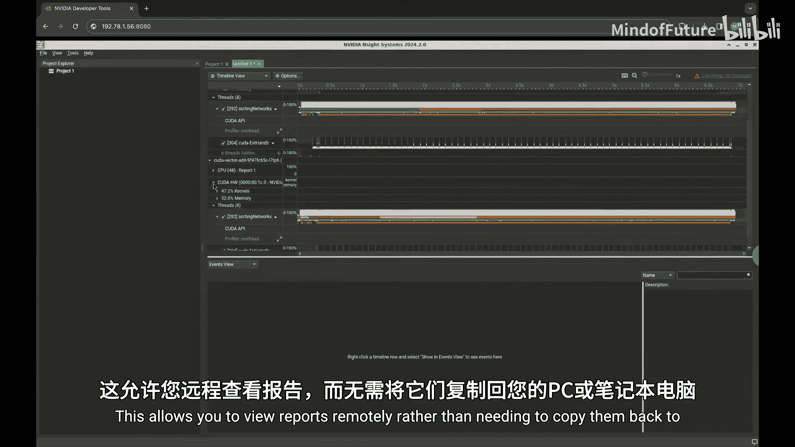

## 与 Jupyter 的深度集成 📓

Nsight Systems 与 Jupyter 软件的集成正在进一步扩展。现在，Nsight Systems 可以与 Jupyter Lab 集成，允许您在单个代码单元内剖析代码性能。您还可以直接在 Jupyter Lab 中查看文本结果，例如统计信息。

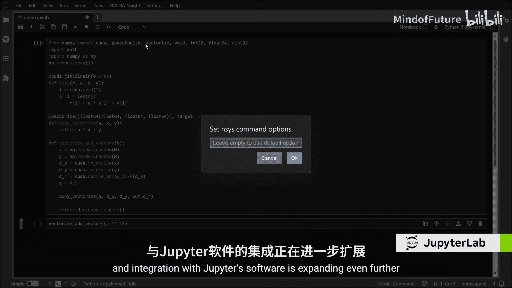

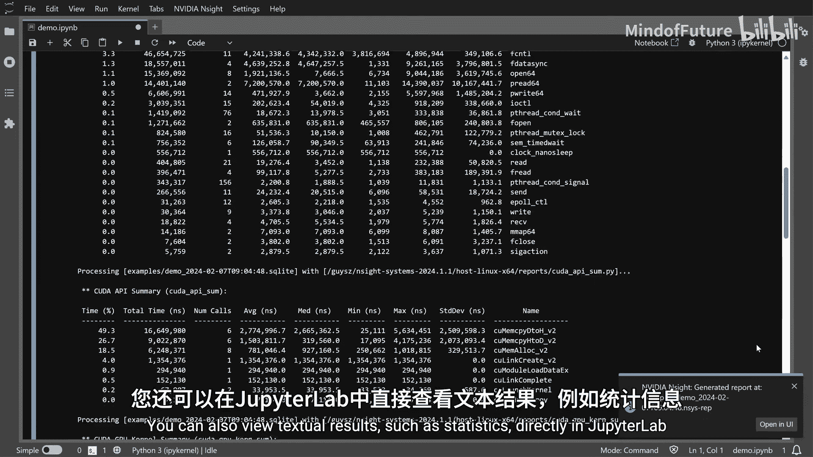

时间线报告只需单击一下即可启动远程 GUI 流式容器，并在新标签页中无缝打开。

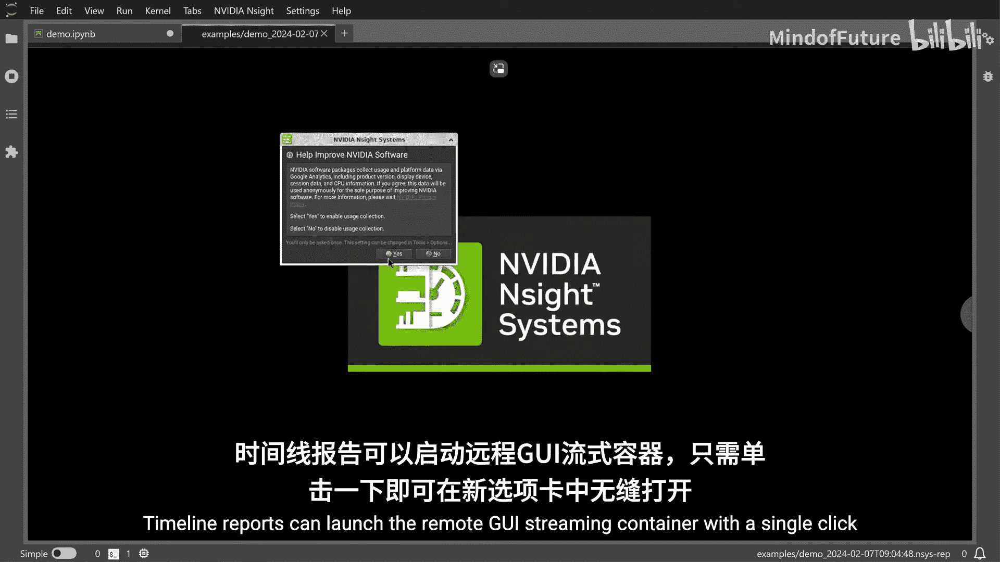

## 总结 🎯

本节课中，我们一起学习了 NVIDIA Nsight System 如何助力 AI 应用扩展。现代计算由 GPU 加速和 AI 定义，将应用扩展到多节点和云基础设施对于满足这些新需求至关重要。Nsight Systems 已经演进，旨在帮助您在新的计算格局中构建应用，无论是在本地还是在云端。

了解更多信息并开始使用，请访问 developer.nvidia.com。

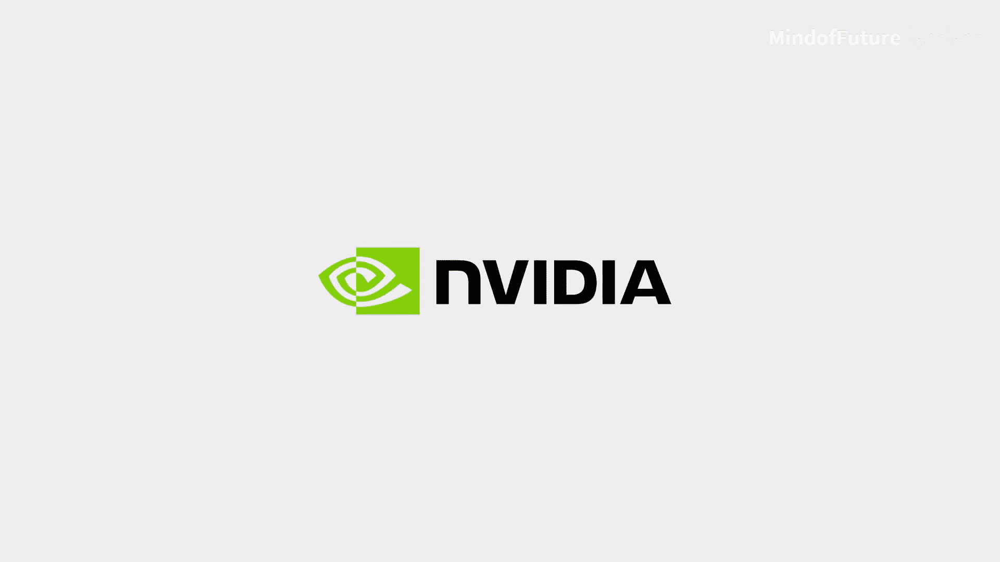

