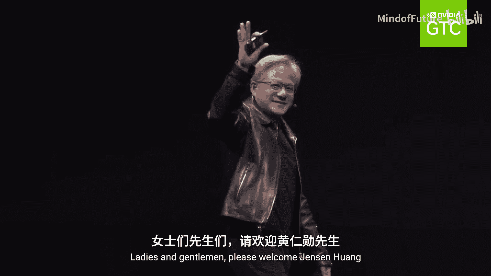
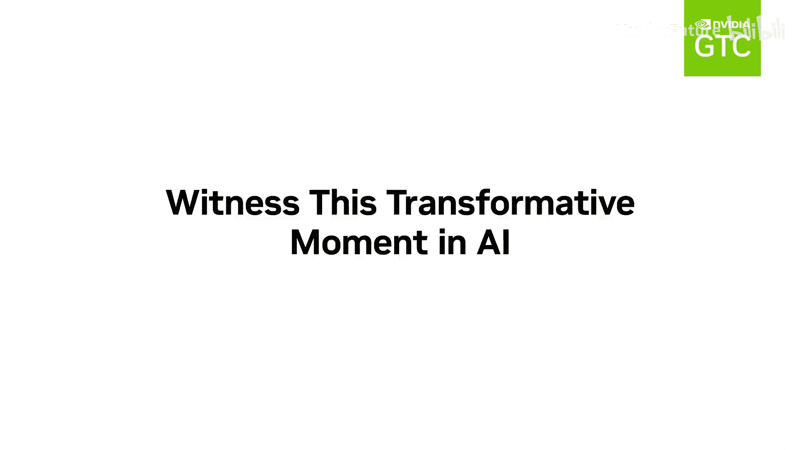

# 020：NVIDIA GTC 2024 主题演讲预告

在本节课中，我们将一起学习NVIDIA GTC 2024主题演讲预告的核心内容。我们将了解GTC大会的目的，并认识其关键人物。

## 概述

本次预告片的核心信息是介绍NVIDIA GTC 2024大会及其创办人，并阐明该大会的根本宗旨。

## 大会开场与人物介绍

首先，预告片展示了大会的开场环节。

以下是预告片中出现的具体画面描述：

*   一张图片显示：“女士们先生们，请欢迎黄仁勋。”
*   另一张图片是黄仁勋的肖像。
*   还有一张图片展示了大会的现场或相关视觉元素。

## 大会的核心宗旨

上一节我们看到了大会的开场，本节中我们来看看GTC大会存在的根本目的。

GTC的目的是**激发世界对于加速计算可能性的艺术**。

这意味著大会旨在向全球展示，通过加速计算技术，我们能够实现哪些前所未有的创新和突破。

## 总结

本节课中我们一起学习了NVIDIA GTC 2024主题演讲预告的内容。我们了解到大会由黄仁勋先生开场，并且其核心宗旨在于启迪世界，探索加速计算所能带来的无限可能。预告片以“祝大家GTC愉快”作为结束。

Have a great GTC。