# 课程P1：OpenCV计算机视觉实战课程简介 📚

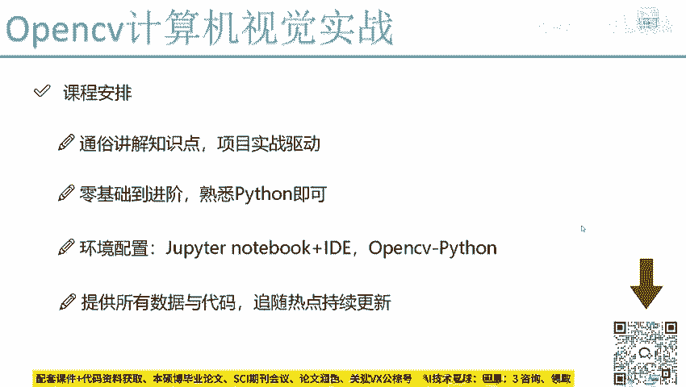

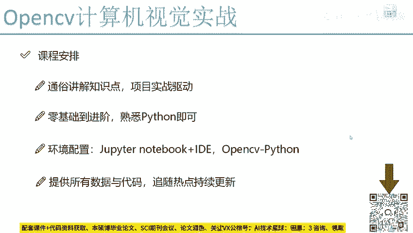

在本节课中，我们将要学习《OpenCV计算机视觉实战》课程的整体安排、风格、难度要求以及学习前的准备工作。通过本次介绍，你将清晰地了解这门课程的学习路径和预期收获。

## 课程整体安排 🗺️

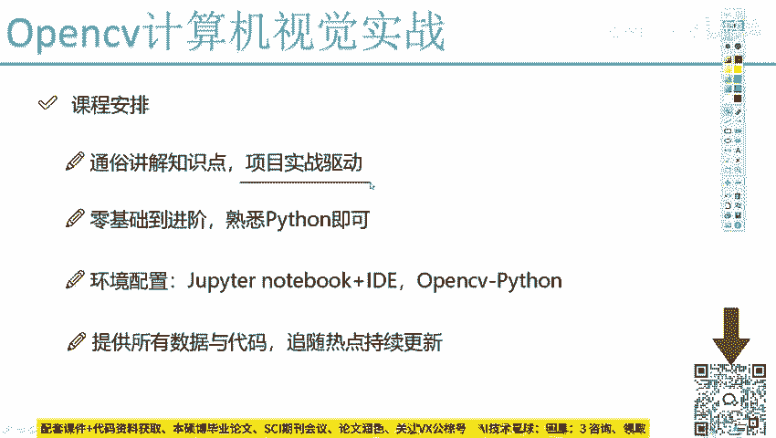

本课程的整体安排是以项目实战为驱动。在讲解几个知识点之后，我们会动手完成一个稍大型的项目。

上一节我们介绍了课程的整体安排，本节中我们来看看课程的具体风格与特点。

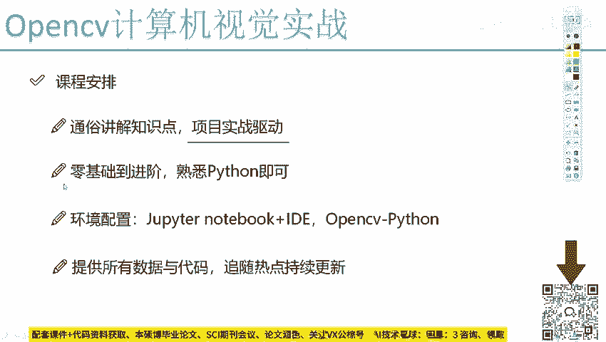

## 课程风格与特点 ✨

本课程的风格是通俗易懂的。课程将采用最接地气的方式，讲解其中比较复杂难懂的知识点。

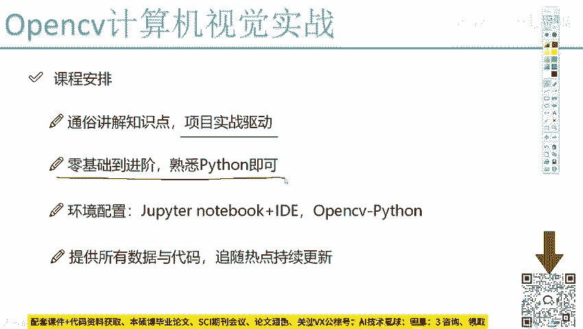

以下是本课程的核心特点：

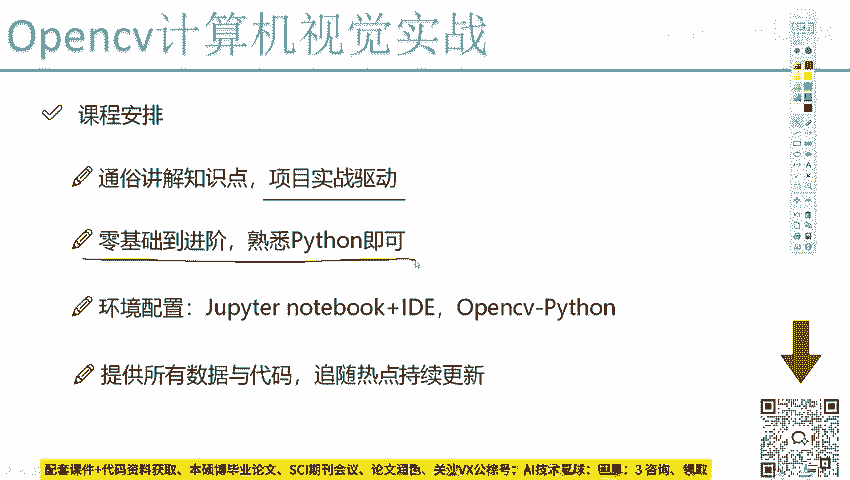

*   **实战驱动**：学习过程由项目实战驱动，帮助巩固知识点。
*   **循序渐进**：课程难度从零基础开始，逐渐进阶。
*   **业务导向**：在项目实战中，不仅练习技术，也熟悉完成一个实际项目的业务流程。

## 课程难度与要求 ⚙️

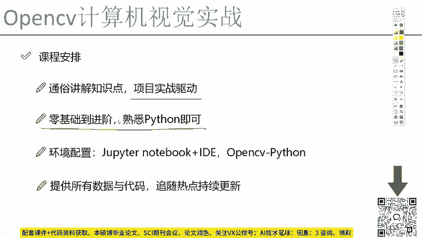

课程难度相当于从零基础到进阶。课程开始时，会讲解计算机视觉中最基本的操作，以及如何在OpenCV中使用函数构建小案例。后续我们会将这些知识融入更大型的项目中。

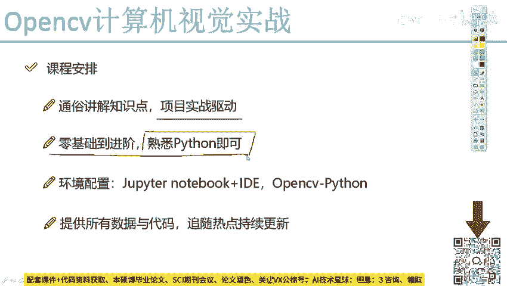

课程难度会逐渐提升，并且后续部分包含了非常丰富的项目实战内容，这些需要大家投入时间和精力来熟悉。

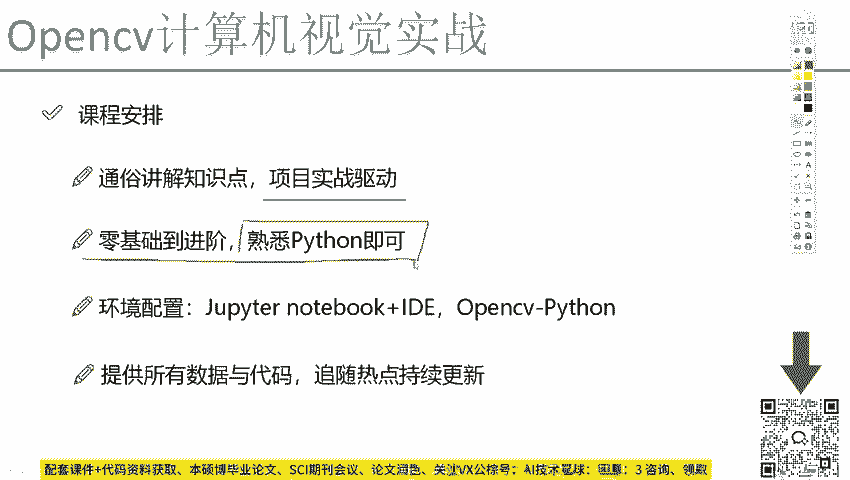

学习本课程有一个基本前提：需要掌握Python语言。

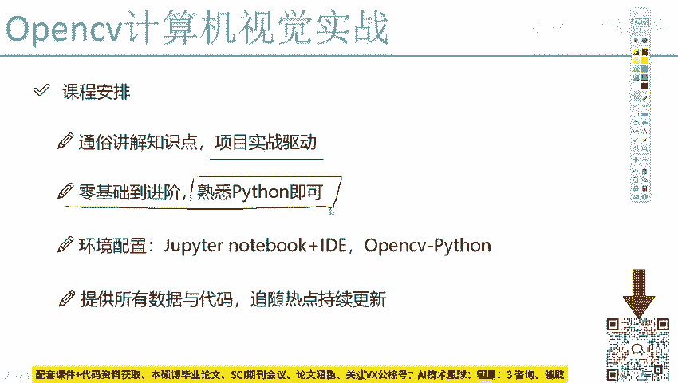

以下是具体的要求说明：

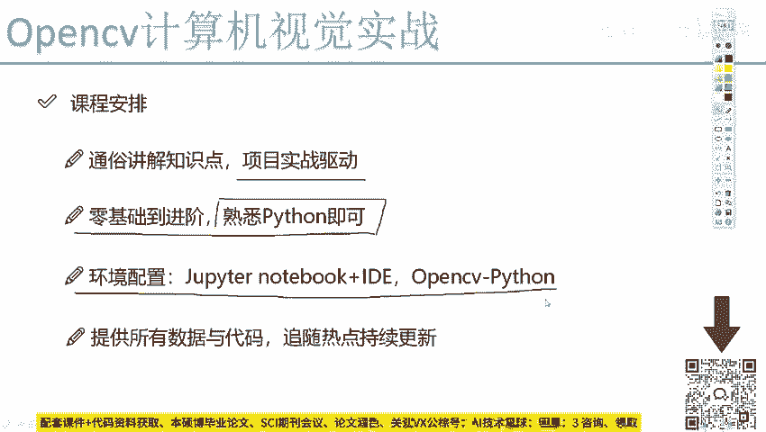

*   **Python基础**：所有实战案例、大型项目以及OpenCV函数的使用均基于Python。不要求精通，但需要熟悉并能看懂代码。
*   **环境准备**：关于如何安装OpenCV、配置Notebook及相关IDE，将在下一节课中详细说明。

> 提示：如果你对Python完全不熟悉，可以参考讲师提供的Python快速入门教程。

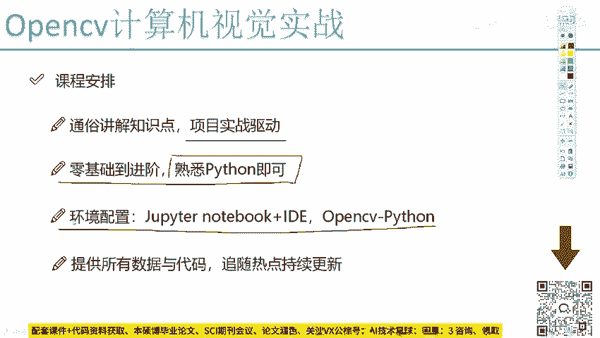

## 课程资料与更新 📦

在课程中，会提供所有的数据和代码。课程将持续更新，相关数据和代码均放在课程资料中，大家可以直接点击下载。

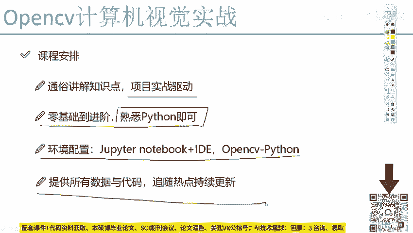

本节课中我们一起学习了《OpenCV计算机视觉实战》课程的整体框架。我们了解到这是一门以实战为核心、从基础到进阶的课程，学习前需要具备Python基础，并且课程会提供全部的学习资料。接下来，就请大家开始准备安装OpenCV，进入精彩的计算机视觉世界吧。