# 课程P10：4-边界填充 🖼️

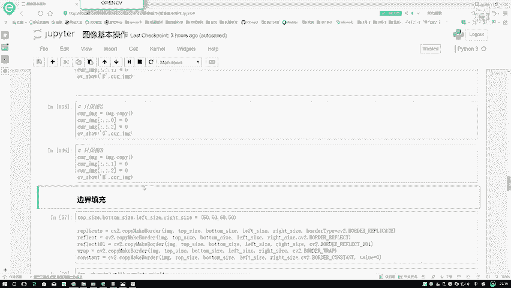

在本节课中，我们将要学习图像处理中的一个重要操作——边界填充。边界填充是指在图像周围添加额外的像素区域，这在许多图像处理算法（如卷积）中是一个常见的预处理步骤。

上一节我们介绍了图像的几何变换，本节中我们来看看如何为图像添加边界。

## 边界填充概述

当对图像进行变换或特征提取时，有时需要将图像扩大一圈。这个过程称为边界填充或边缘填充。例如，在卷积操作中，通常会先对图像进行填充（padding），以控制输出图像的尺寸或保留边缘信息。

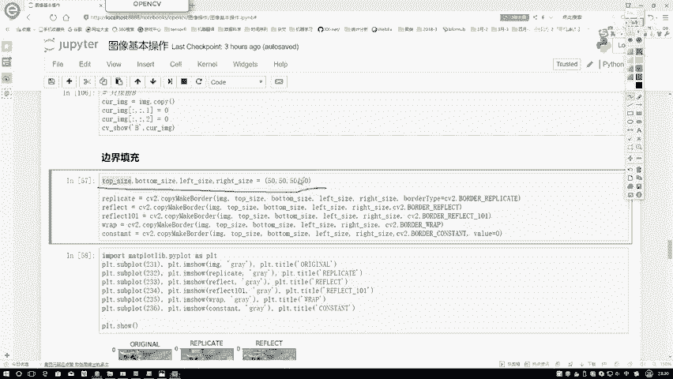

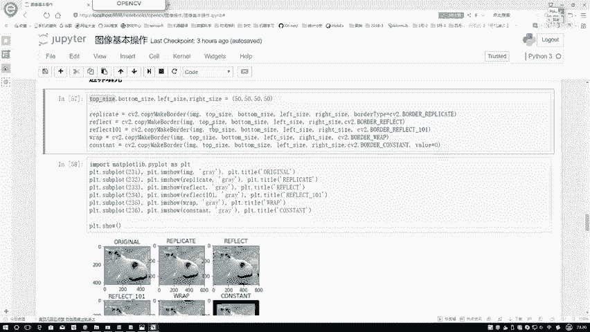

## 填充参数

进行填充时，需要指定在图像的**上、下、左、右**四个方向分别填充多少像素。在代码中，我们可以用一个参数来指定这四个方向的填充大小。

以下是填充参数的一个示例，表示在每个方向都填充50个像素：
```python
top = 50
bottom = 50
left = 50
right = 50
```

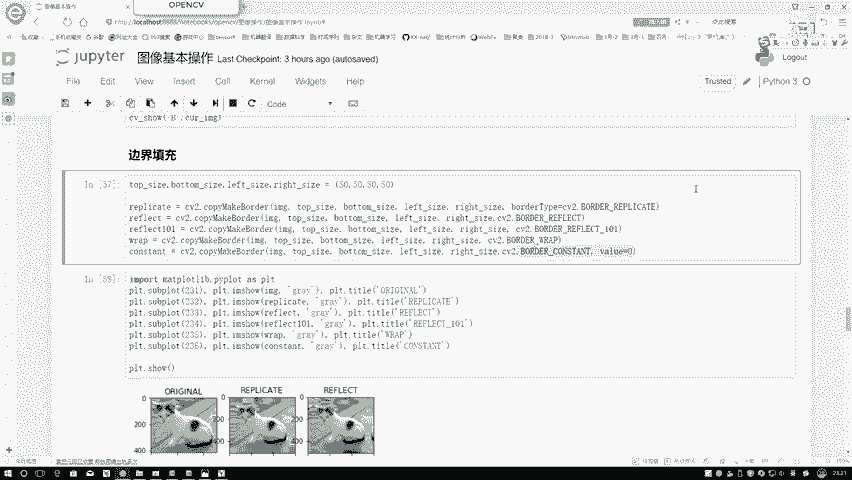

## 填充方法与效果

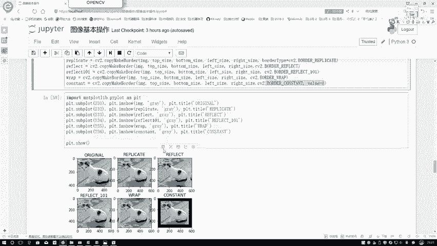

填充的核心函数是相同的，但可以通过指定不同的 `type` 参数来选择填充方法。OpenCV提供了多种填充方式。

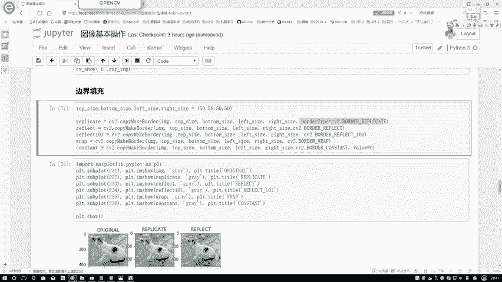

以下是几种常见的填充方法及其效果描述：

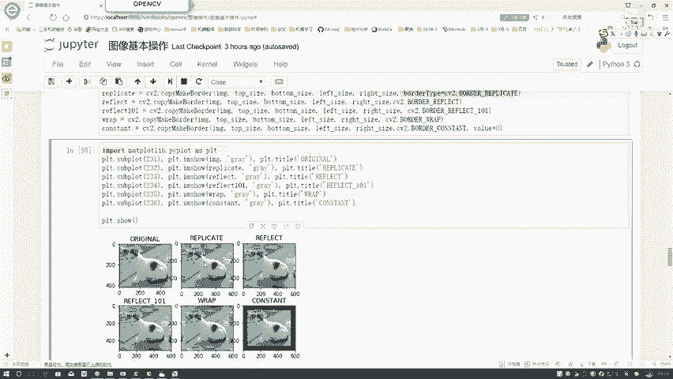

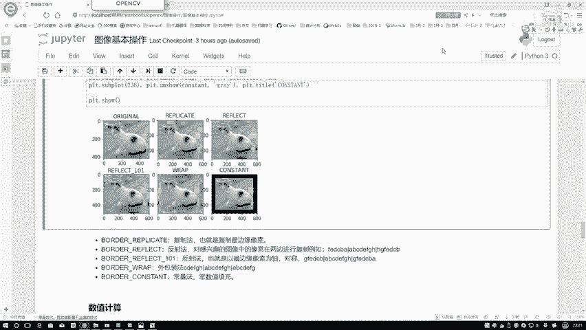

1.  **复制法 (BORDER_REPLICATE)**
    这种方法直接复制图像最边缘的像素值进行填充。例如，如果边缘像素是A，那么填充的所有像素都是A。

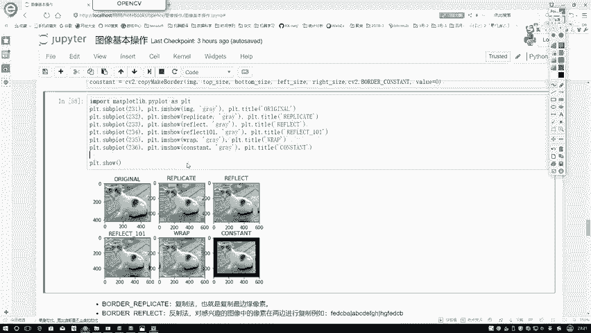

2.  **反射法 (BORDER_REFLECT)**
    这种方法以图像边缘为轴进行镜像反射。假设图像边缘像素序列是ABCDEFG，那么填充的像素序列将是GFEDCBA。

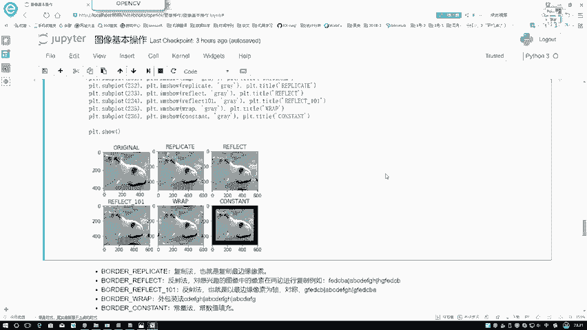

3.  **反射法101 (BORDER_REFLECT_101)**
    这是另一种反射方法，它使反射看起来更对称。它会忽略最边缘的像素，从次边缘开始反射。例如，序列ABCDEFGH的填充会从B开始反射。

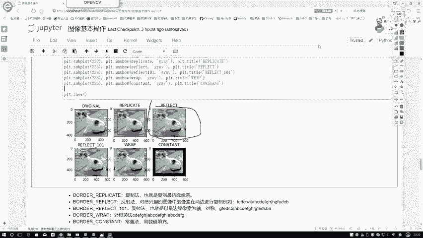

4.  **外包装法 (BORDER_WRAP)**
    这种方法将图像视为可以循环重复的。例如，序列ABCDEFGH的填充会是ABCDEFGHABCDEFGH...，以此类推。

5.  **常量法 (BORDER_CONSTANT)**
    这种方法使用一个固定的常数值（如0，代表黑色）来填充边界区域。使用此方法时，需要额外指定这个常数值。

## 代码实现

所有填充方法都使用同一个函数，仅 `borderType` 参数不同。以下是一个示例代码结构：
```python
import cv2
import matplotlib.pyplot as plt

# 读取图像
img = cv2.imread('image.jpg')
# 定义填充大小
top = bottom = left = right = 50

# 使用不同的方法进行填充
replicate = cv2.copyMakeBorder(img, top, bottom, left, right, cv2.BORDER_REPLICATE)
reflect = cv2.copyMakeBorder(img, top, bottom, left, right, cv2.BORDER_REFLECT)
reflect101 = cv2.copyMakeBorder(img, top, bottom, left, right, cv2.BORDER_REFLECT_101)
wrap = cv2.copyMakeBorder(img, top, bottom, left, right, cv2.BORDER_WRAP)
constant = cv2.copyMakeBorder(img, top, bottom, left, right, cv2.BORDER_CONSTANT, value=0)

# 使用matplotlib显示结果（此处省略具体绘图代码）
```

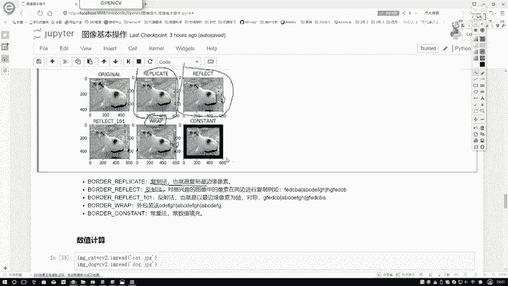

## 效果对比

*   **复制法**：填充区域是边缘像素的简单重复。
*   **反射法**：填充区域是图像边缘的镜像，看起来像在边缘放置了一面镜子。
*   **反射法101**：同样是镜像，但边界处理更平滑，避免了边缘像素的重复感。
*   **外包装法**：填充区域是图像内容的循环重复。
*   **常量法**：填充区域是统一的颜色（如黑色），形成一个边框。

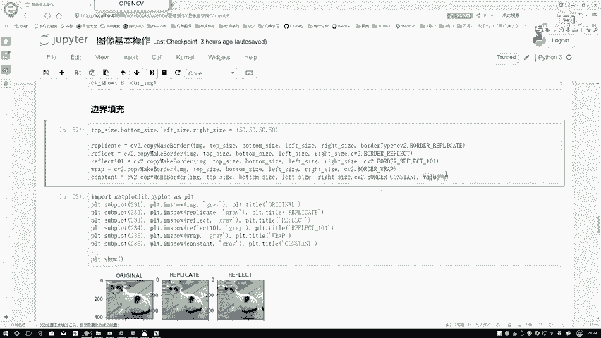

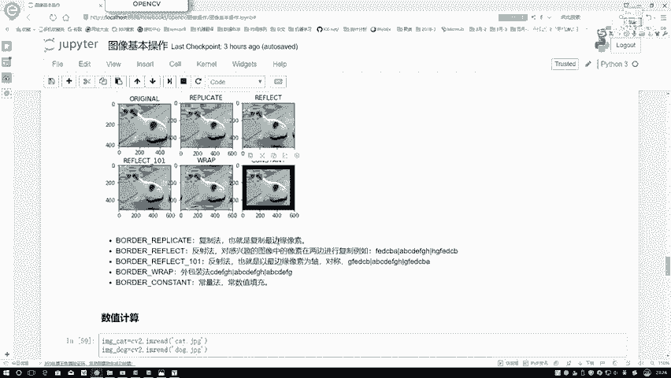

## 总结

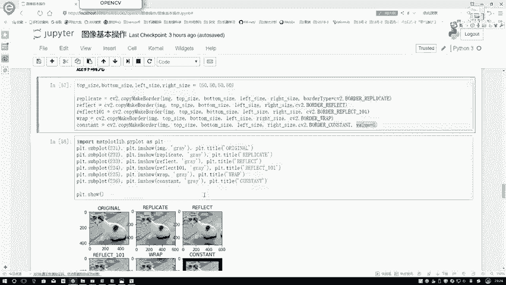

本节课中我们一起学习了图像处理中的边界填充技术。我们了解了填充的目的，掌握了如何指定填充范围，并重点介绍了五种不同的填充方法：复制法、反射法、反射法101、外包装法以及常量法。理解这些方法的原理和效果，对于后续进行更复杂的图像处理操作（如卷积）至关重要。在实际应用中，可以根据具体需求选择合适的填充方式。