# 图像处理课程 P11：图像阈值操作 📊

在本节课中，我们将要学习图像处理中的核心操作之一——阈值处理。阈值操作是图像分割、边缘检测等高级任务的基础，其核心思想是根据一个设定的临界值（阈值）对图像中的每个像素点进行分类或转换。

## 概述

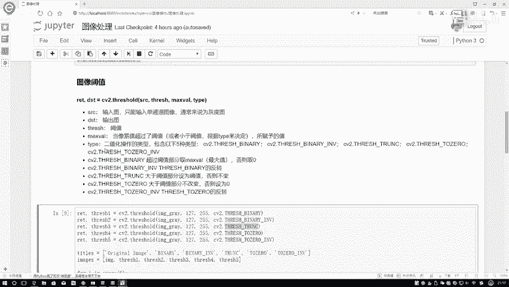

阈值操作的基本原理是：给定一个图像（由像素点组成的矩阵）和一个阈值，对图像中的每一个像素值进行判断。根据像素值与阈值的大小关系，将其转换为新的值。例如，一个像素值为56，阈值为127，我们需要决定大于127和小于127的像素分别如何处理。这就是阈值函数的核心功能。

## 阈值函数详解

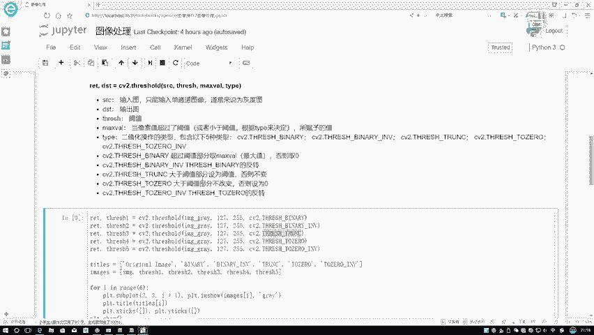

OpenCV 提供了 `cv2.threshold()` 函数来执行阈值操作。该函数需要四个输入参数：

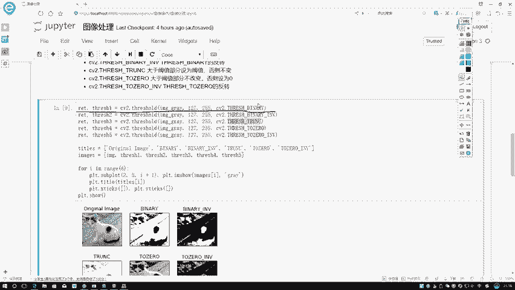

1.  **原始图像**：通过 `cv2.imread()` 读取的图像。
2.  **阈值**：一个具体的数值（例如127），用于判断像素值。注意，这不是百分比，而是0-255范围内的实际像素值。
3.  **最大值**：通常设置为255，因为图像像素值范围是0-255。
4.  **阈值类型**：一个关键参数，决定了如何应用阈值以及如何处理结果。它完全由 `type` 参数控制。

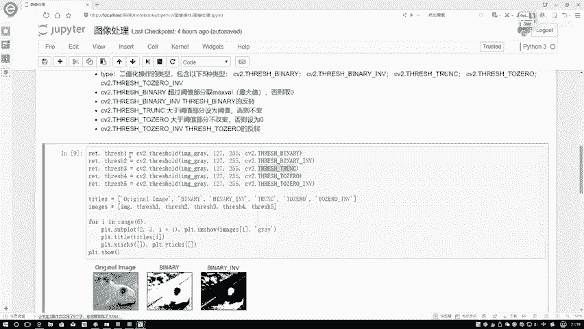

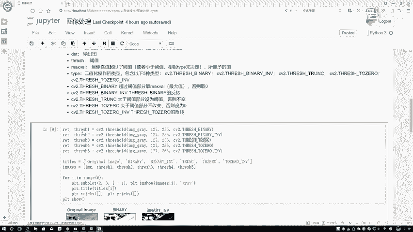

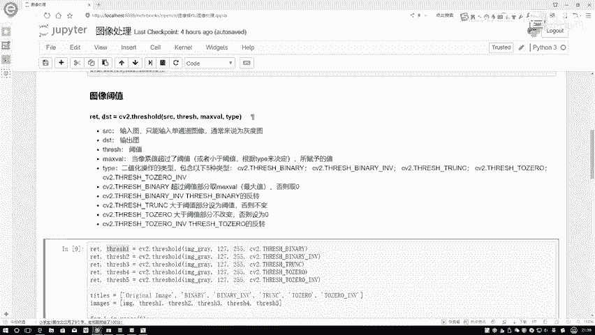

函数的基本调用格式如下：
```python
retval, dst = cv2.threshold(src, thresh, maxval, type)
```
其中：
*   `retval`：实际使用的阈值（在某些自适应阈值方法中会用到）。
*   `dst`：处理后的输出图像。

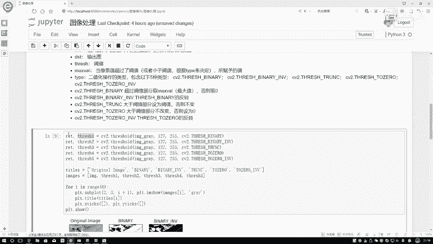

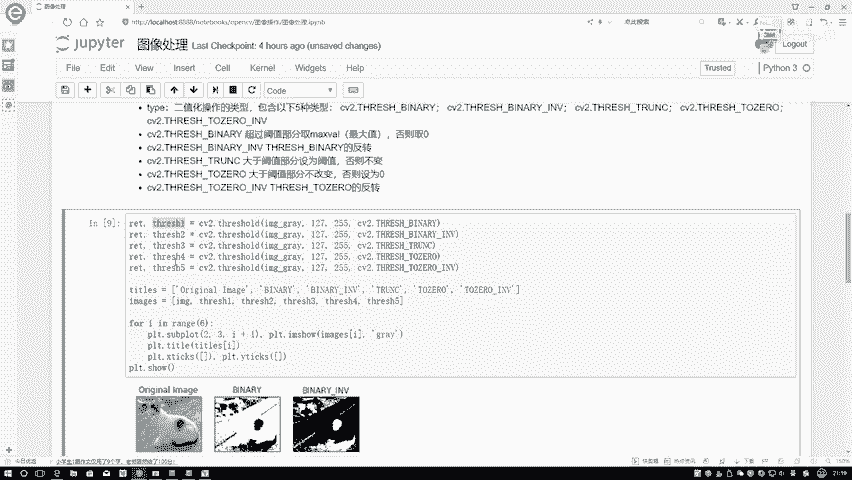

## 五种阈值处理方法

OpenCV 主要提供了五种阈值处理方法。上一节我们介绍了阈值函数的基本结构，本节中我们来看看具体的处理类型及其效果。

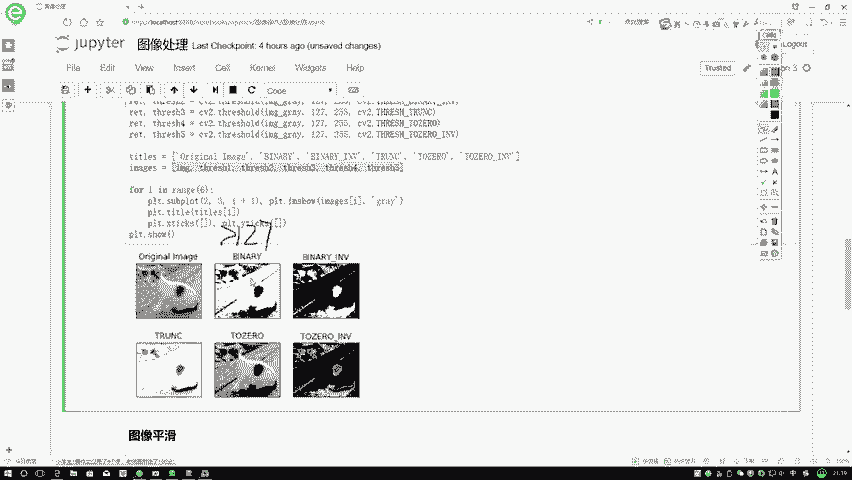

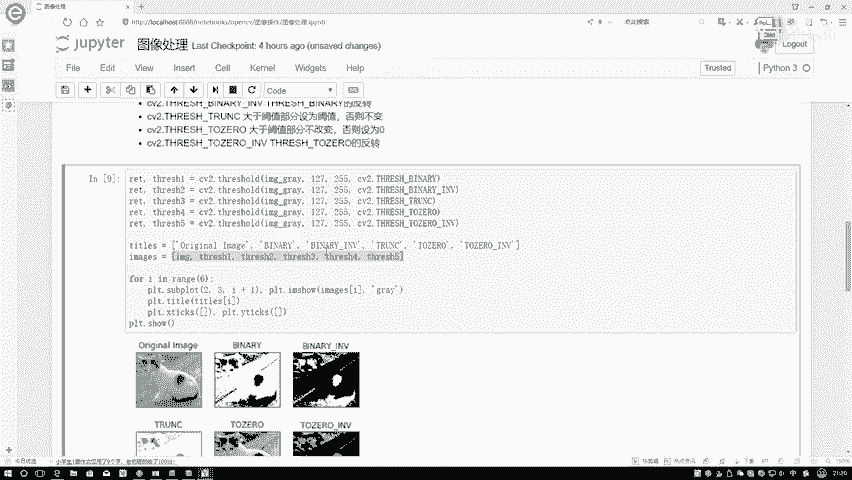

以下是五种阈值处理方法的详细说明和效果对比：

1.  **二值化**
    *   **原理**：像素值大于阈值时，设为最大值（如255，即白色）；否则设为0（即黑色）。
    *   **公式/逻辑**：`dst(x, y) = maxval if src(x, y) > thresh else 0`
    *   **OpenCV 类型**：`cv2.THRESH_BINARY`
    *   **效果**：图像被转换为只有纯黑和纯白的二值图像。较亮区域变白，较暗区域变黑。

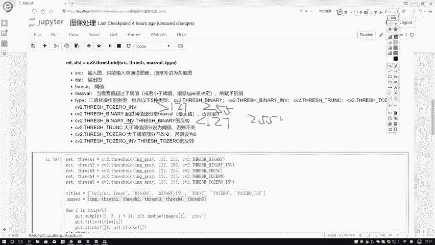

2.  **反二值化**
    *   **原理**：与二值化相反。像素值大于阈值时，设为0（黑色）；否则设为最大值（白色）。
    *   **公式/逻辑**：`dst(x, y) = 0 if src(x, y) > thresh else maxval`
    *   **OpenCV 类型**：`cv2.THRESH_BINARY_INV`
    *   **效果**：得到与二值化结果颜色完全反转的图像。较亮区域变黑，较暗区域变白。

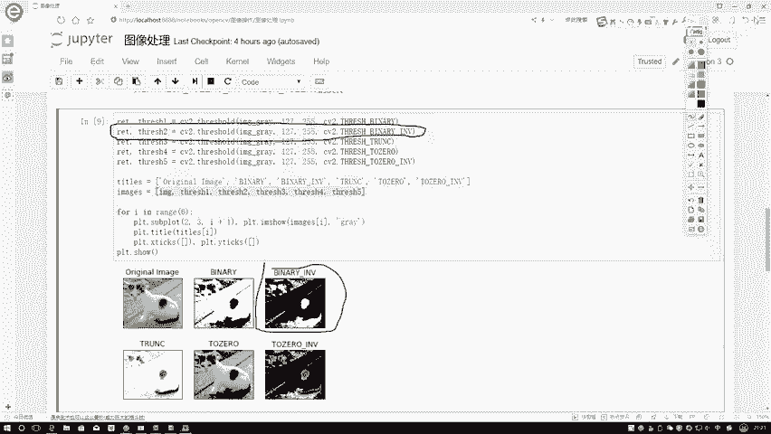

3.  **截断**
    *   **原理**：像素值大于阈值时，被限制为阈值本身；小于等于阈值时，保持不变。
    *   **公式/逻辑**：`dst(x, y) = thresh if src(x, y) > thresh else src(x, y)`
    *   **OpenCV 类型**：`cv2.THRESH_TRUNC`
    *   **效果**：图像中亮部区域（大于阈值的部分）的亮度被“截断”至阈值水平，暗部区域保持不变。整体图像对比度降低。

4.  **阈值化为0**
    *   **原理**：像素值小于阈值时，设为0（黑色）；大于等于阈值时，保持不变。
    *   **公式/逻辑**：`dst(x, y) = 0 if src(x, y) < thresh else src(x, y)`
    *   **OpenCV 类型**：`cv2.THRESH_TOZERO`
    *   **效果**：图像中暗部区域被置黑，亮部区域保留原样。相当于突出了图像中的亮部特征。

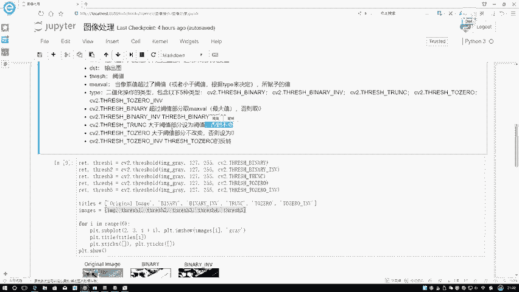

5.  **反阈值化为0**
    *   **原理**：与“阈值化为0”相反。像素值大于阈值时，设为0（黑色）；小于等于阈值时，保持不变。
    *   **公式/逻辑**：`dst(x, y) = 0 if src(x, y) > thresh else src(x, y)`
    *   **OpenCV 类型**：`cv2.THRESH_TOZERO_INV`
    *   **效果**：图像中亮部区域被置黑，暗部区域保留原样。相当于突出了图像中的暗部特征。

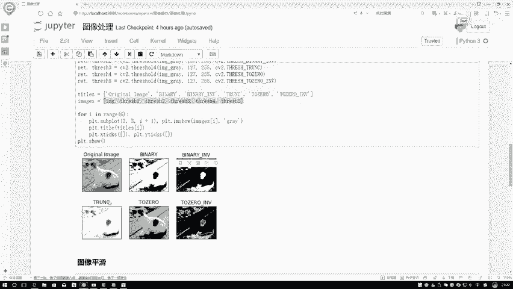

## 效果对比与总结

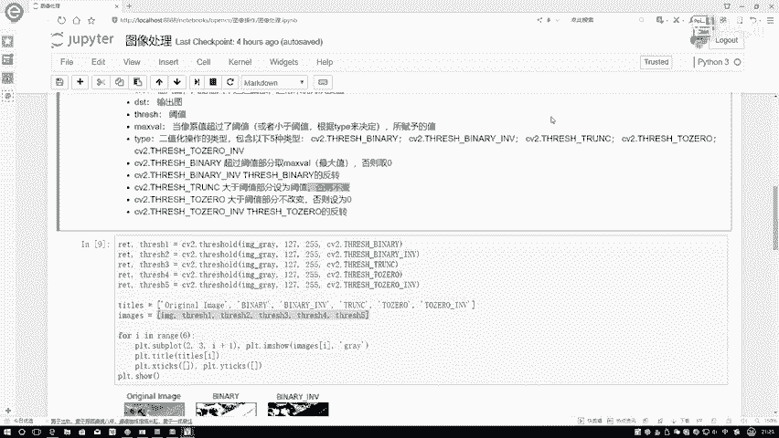

为了直观理解，我们将同一张原始图像（一只小猫）应用上述五种方法（阈值设为127，最大值设为255）进行处理，并将结果并列展示。

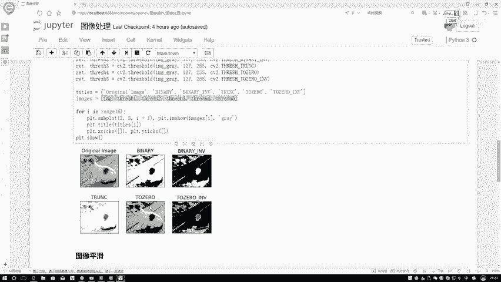

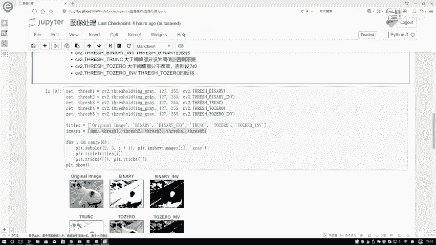

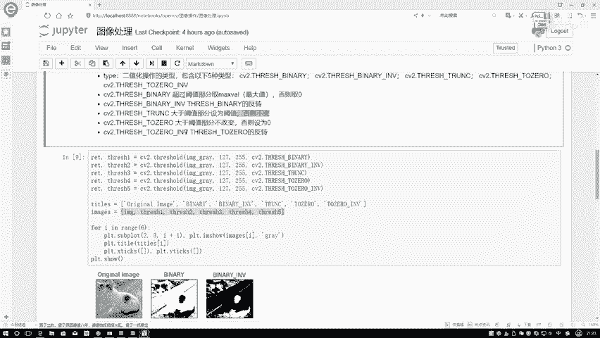

*   **二值化**：猫的白色身体等亮部变为纯白，黑色背景等暗部变为纯黑。
*   **反二值化**：结果与二值化完全相反，白变黑，黑变白。
*   **截断**：猫的亮部区域（如身体）亮度被压低至127的灰度，暗部区域（如背景）保持不变。
*   **阈值化为0**：猫的暗部区域（如背景、眼睛）变为纯黑，亮部区域（如身体）保持原有灰度。
*   **反阈值化为0**：猫的亮部区域（如身体）变为纯黑，暗部区域（如背景）保持原有灰度。

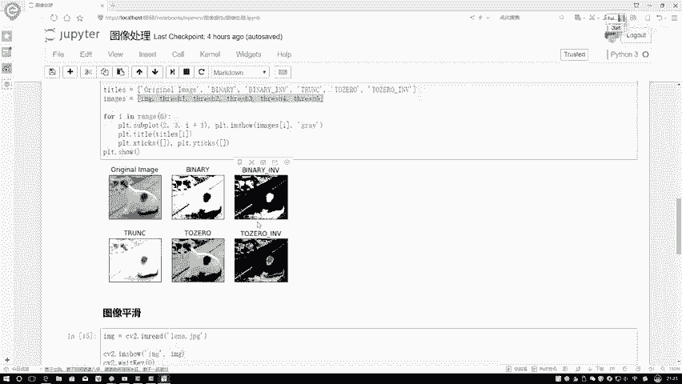

通过对比可以清晰看到，选择不同的阈值类型会得到截然不同的图像效果，适用于不同的场景需求。

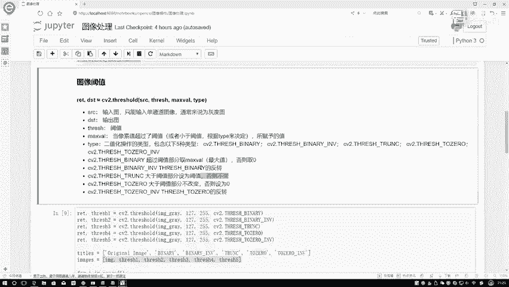

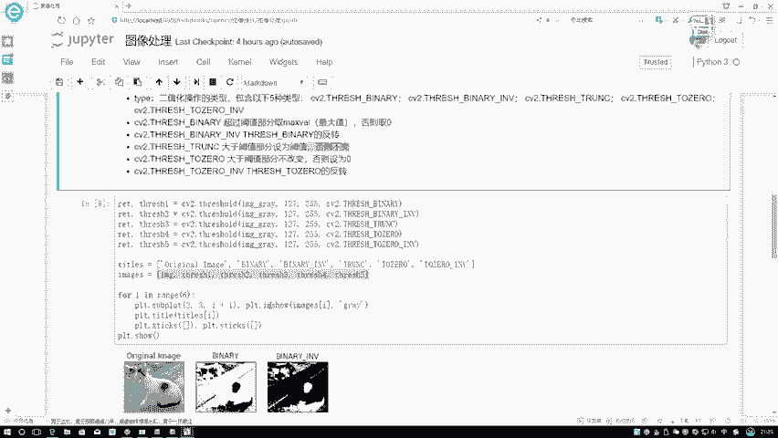

本节课中我们一起学习了图像阈值操作。我们掌握了 `cv2.threshold()` 函数的使用方法，并深入理解了**二值化、反二值化、截断、阈值化为0、反阈值化为0**这五种核心的阈值处理类型及其视觉表现。这是进行图像预处理和特征提取的重要一步，请务必理解每种方法背后的逻辑。