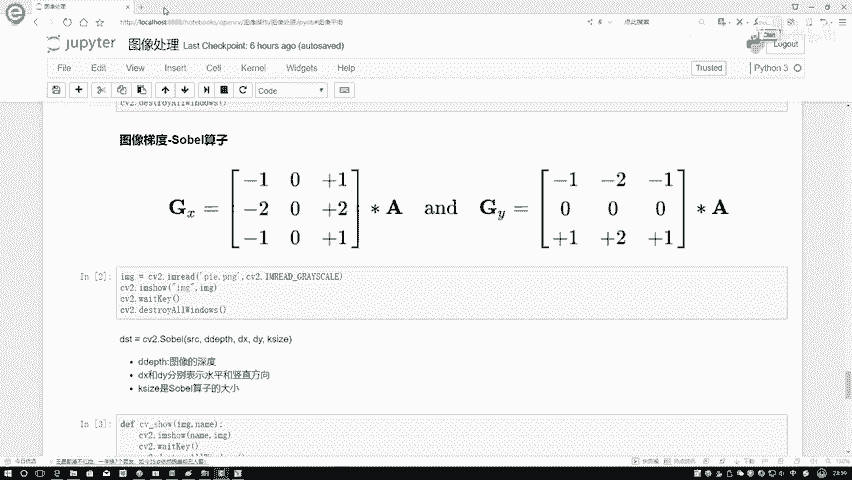
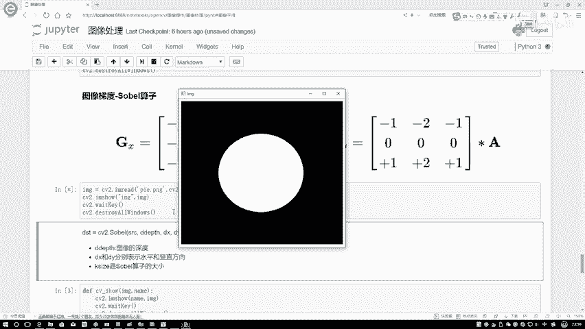
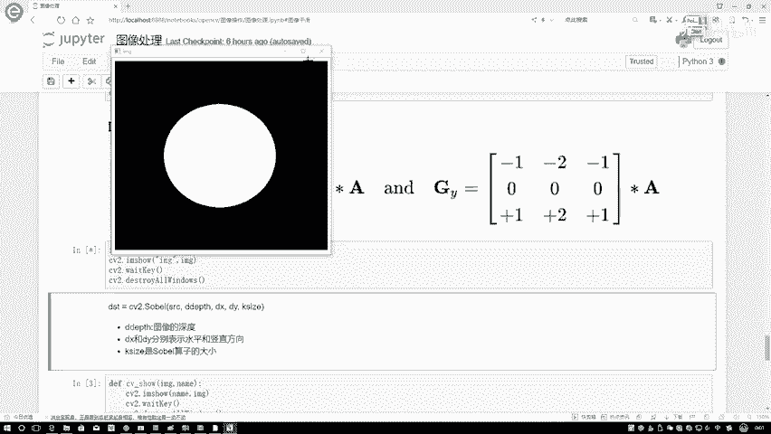
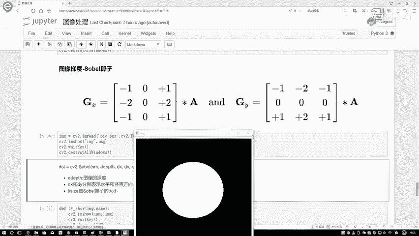
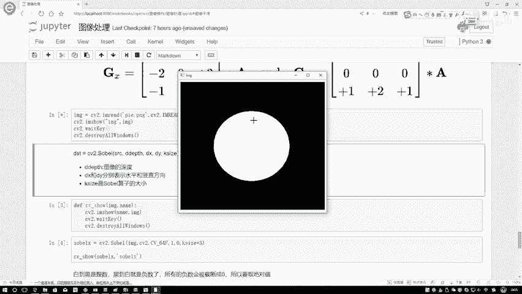
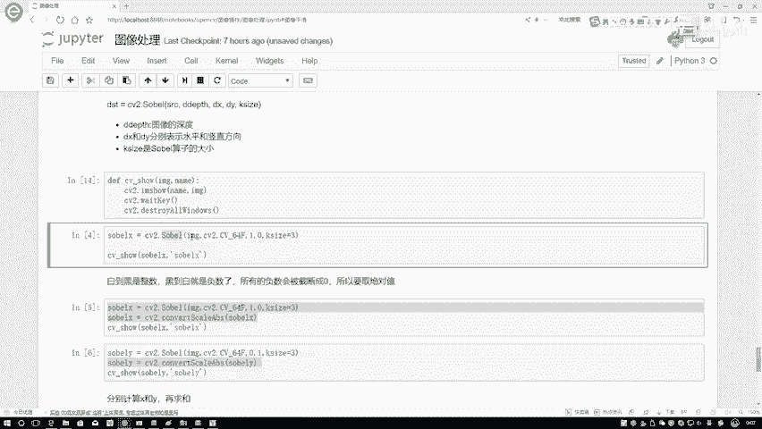
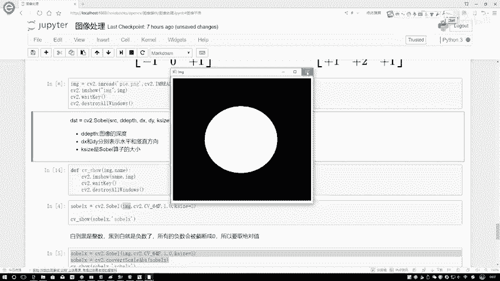
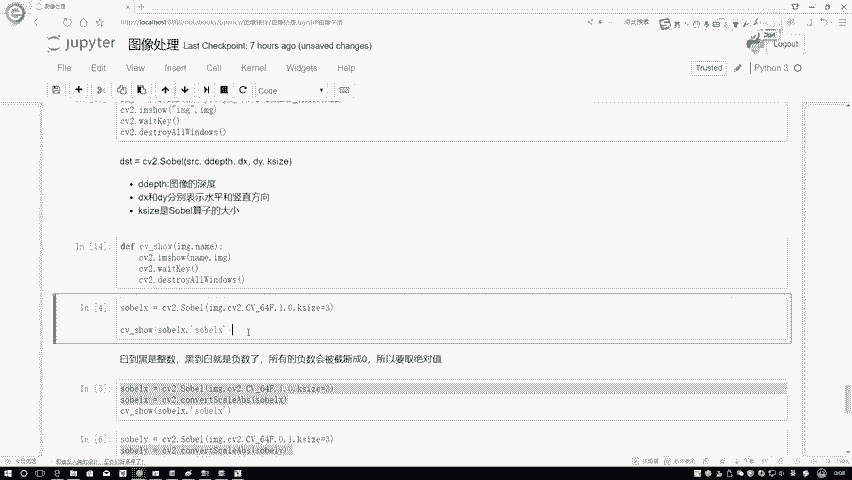
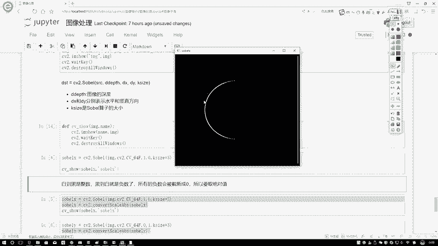

# 课程P12：Sobel算子 🧮 - 迪哥的AI世界





在本节课中，我们将要学习如何计算图像的梯度。首先，我们将介绍第一种方法——Sobel算子。我们将从整体上了解这个算子能做什么。


## 概述：什么是梯度？

我们先读取一张图像。


以这个圆为例，梯度是什么意思呢？它通常指图像中的边界点。我们来看，比如在白色区域内部，左边是白色，右边也是白色。在这条线上，它的左边和右边都是同样的白色，那么这条线能产生梯度吗？不能。因为左右两边的像素值相同。

那么，什么样的位置会产生梯度呢？应该是图像的边缘位置。我们来看这个点，它的左边是黑色的，右边是白色的。在像素层面，它们的数值完全不同。对于这样的边界点，一个是255（白色），一个是0（黑色），存在巨大的差异，我们就说它的梯度应该比较大。



因此，我们的第一个任务就是：如何在图像中计算梯度，或者说，如何找出图像中有梯度的位置。这本质上类似于边缘检测，因为只有边缘处的像素值会发生剧烈变化。在正常图像中，不同主体之间的连接缝隙就是边缘。我们可以通过Sobel算子来进行这种检测。

## 如何计算梯度？


我们该如何计算梯度呢？正如刚才所说，我们需要计算一个点与其左右、上下邻居的差异。在像素层面上，如何执行这个操作呢？之前我们在讲解形态学操作时，都使用一个卷积核（或滤波器）对图像中的点进行计算。在这里也是一样的。

我们分别定义了 **Gx** 和 **Gy**。其中，**Gx** 代表水平方向的梯度（即左右对比），**Gy** 代表垂直方向的梯度（即上下对比）。因此，在计算梯度时，我们主要考虑两个方向：水平方向（Gx）和垂直方向（Gy）。

现在的问题是，既然任务明确了——计算左右和上下的差异，那么我们该如何定义这个滤波器（卷积核）呢？

这里直接给出了核的数值。计算方式其实很简单。假设我们有一个3x3的图像区域，中心点是我们关注的点。按照卷积运算的规则，我们将核与图像区域对应位置相乘，然后求和。

对于水平梯度核 **Gx**：
```
核 = [[-1, 0, 1],
      [-2, 0, 2],
      [-1, 0, 1]]
```
计算过程本质上是 `(右侧像素值) - (左侧像素值)`。核中的权重（1和2）体现了距离中心点的远近，离中心越近的像素点权重越大（类似于高斯加权），这有助于更准确地捕捉边缘。

同理，对于垂直梯度核 **Gy**：
```
核 = [[-1, -2, -1],
      [ 0,  0,  0],
      [ 1,  2,  1]]
```
计算过程本质上是 `(下方像素值) - (上方像素值)`。

这样，我们就通过右减左、下减上的操作，得到了像素点在水平和垂直方向上的差异值，即梯度 **Gx** 和 **Gy**。

## 动手实践：使用OpenCV



现在，我们来做第一个实验。我们将读入一个中间为白色、周围为黑色的圆形图像。




我们来看一下在OpenCV中如何使用这个函数。主要使用 `cv2.Sobel()` 函数。


**函数参数说明：**
*   `src`: 输入图像。
*   `ddepth`: 输出图像的深度。通常指定为 `cv2.CV_64F`，这是因为梯度计算可能产生负值，我们需要一个能存储负值的数据类型。
*   `dx`: 在x方向（水平方向）求导的阶数。设为1表示计算Gx。
*   `dy`: 在y方向（垂直方向）求导的阶数。设为1表示计算Gy。
*   `ksize`: Sobel核的大小，通常是3x3（即`ksize=3`）。

**一个重要细节：**
OpenCV默认的图像像素值范围是0到255。如果梯度计算得到负值，OpenCV可能会将其截断为0。但我们关心的是差异的**大小**，而不是正负。因此，一种常见的做法是先使用 `cv2.CV_64F` 这类数据类型保存计算结果（包含负值），然后取绝对值。

让我们先计算水平方向的梯度（Gx）。




我们读入这个圆形图像，并将其传入Sobel函数。




设置参数：`ddepth=cv2.CV_64F`, `dx=1`, `dy=0`, `ksize=3`。这表示我们计算水平方向的Sobel梯度。





这是计算完成后得到的结果图像。计算出的梯度在哪里呢？大家想一想，只有边界位置才会有明显的梯度。




结果图像中的这些白点，正是圆形图像的边界位置。这表明Sobel算子成功地检测出了图像在水平方向上的边缘。

## 总结

本节课中，我们一起学习了图像处理中的Sobel算子。


*   我们首先理解了**图像梯度**的概念，它反映了图像中像素值变化的剧烈程度，通常出现在边缘区域。
*   接着，我们学习了Sobel算子的原理。它通过两个特定的卷积核（**Gx** 和 **Gy**）分别计算图像在**水平方向**和**垂直方向**的梯度，其核心思想是“右减左”和“下减上”。
*   最后，我们通过OpenCV进行了实践，使用 `cv2.Sobel()` 函数计算并可视化了一张图像的水平梯度图，成功检测出了图像的边缘。


Sobel算子是边缘检测的基础工具，理解它对于后续学习更复杂的图像处理技术至关重要。