# 课程 P13：梯度计算方法详解 📘

在本节课中，我们将学习图像处理中梯度计算的核心方法。我们将从原理出发，解释如何分别计算水平（X方向）和垂直（Y方向）的梯度，如何处理计算中出现的负值，以及如何将两个方向的梯度有效地融合在一起，最终得到清晰的图像轮廓信息。

---

## 🔍 梯度计算的基本原理

梯度计算的核心是衡量图像中每个像素点与其相邻像素在亮度上的变化。这种变化能有效反映出图像的边缘和轮廓信息。

在计算时，我们通常分别考虑水平方向（X方向）和垂直方向（Y方向）的变化。

---

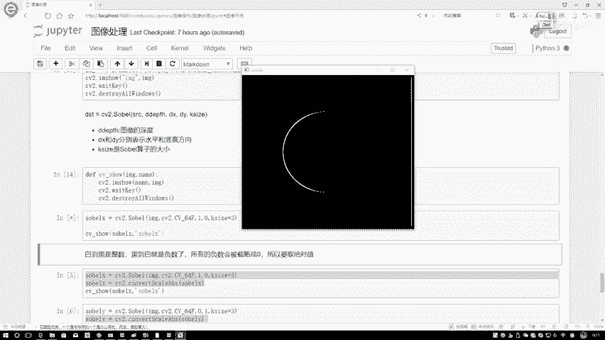

## ➡️ 水平梯度（GX）的计算与问题

上一节我们介绍了梯度的概念，本节中我们来看看水平方向梯度的具体计算方法。

水平梯度的计算规则是：对于图像中的每一个像素点，用其**右边**像素的亮度值减去其**左边**像素的亮度值。公式可以表示为：
`GX = 右边像素值 - 左边像素值`

然而，直接应用这个规则会遇到一个问题。请看下图示例：

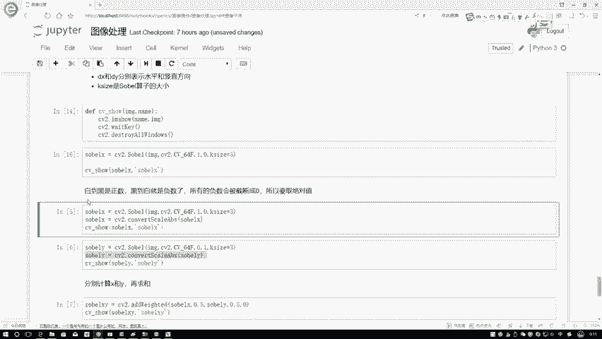


在图像左半部分，内部是白色（高亮度值），外部是黑色（低亮度值）。因此，`白 - 黑`的结果是一个**正数**，能够正常显示为边缘。

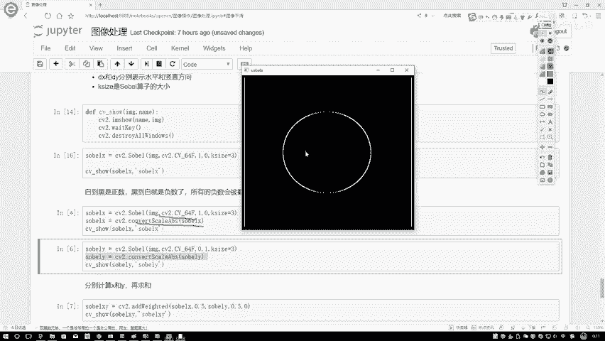

但在图像右半部分，情况正好相反：右边是黑色，左边是白色。计算`黑 - 白`会得到一个**负数**。在默认的图像显示中，负数值会被截断为0（即黑色），因此右半部分的边缘无法显示出来。

---

## ✅ 解决方案：绝对值转换

为了解决负数被截断导致边缘信息丢失的问题，我们需要对梯度计算结果进行转换。

核心思路是：我们只关心亮度变化的**幅度**，而不关心变化的方向（是变亮还是变暗）。因此，可以对计算出的梯度值取绝对值。

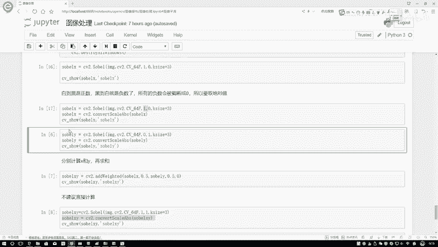

以下是处理步骤：
1.  先按照`右边减左边`的规则计算出原始梯度值（可能包含负数）。
2.  然后对结果应用`cv2.convertScaleAbs()`函数，该函数会计算每个值的绝对值。

经过绝对值转换后，无论是正梯度还是负梯度，都会以正数的形式显示其变化强度。效果如下图所示：

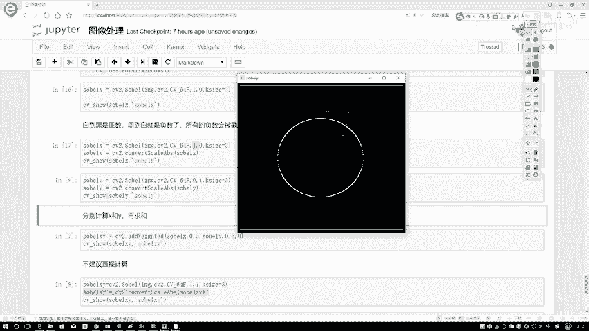


可以看到，经过处理，图像左右两边的轮廓都完整地显示出来了。

---

## ⬇️ 垂直梯度（GY）的计算

理解了水平梯度的计算后，垂直梯度的计算就很容易类推了。

垂直梯度的计算规则是：对于图像中的每一个像素点，用其**下方**像素的亮度值减去其**上方**像素的亮度值。公式表示为：
`GY = 下方像素值 - 上方像素值`

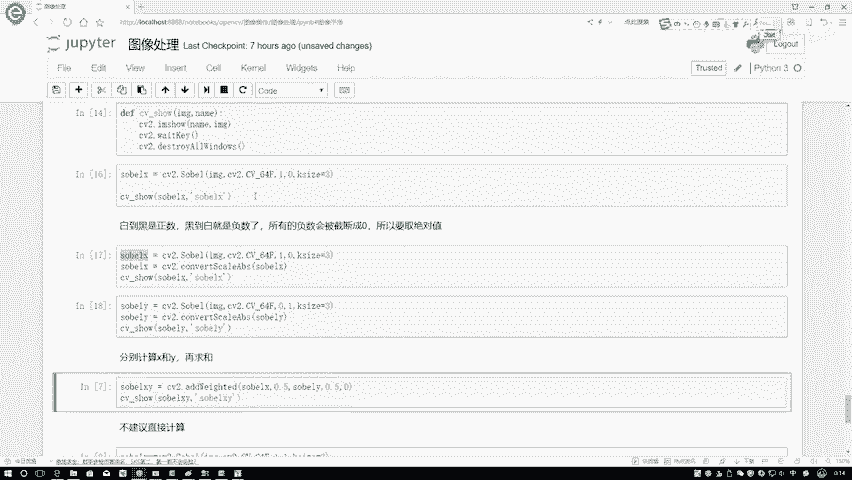

同样，在计算后也需要进行绝对值转换，以确保所有边缘信息得以保留。下图展示了垂直梯度的计算结果：

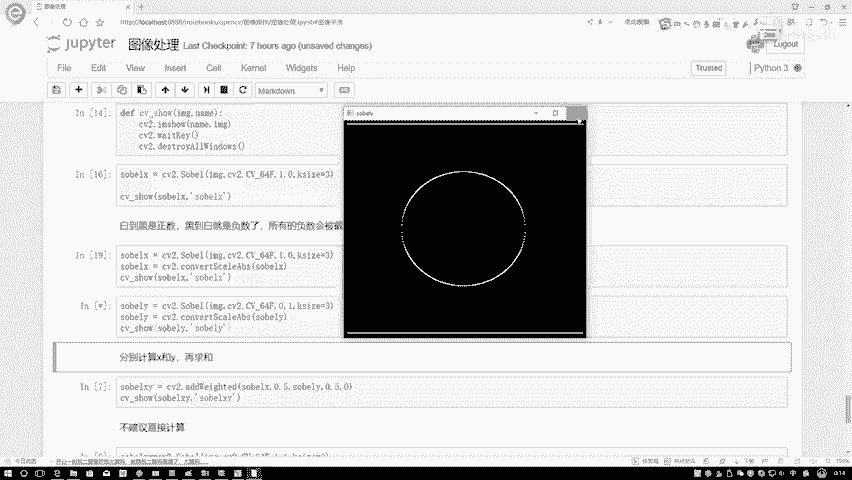


---

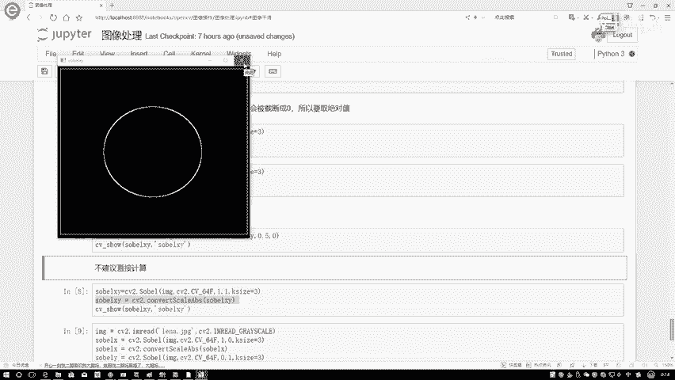

## 🧩 融合GX与GY：得到总梯度

在实际应用中，我们通常需要得到一个综合了水平和垂直方向变化的整体梯度图。这可以通过将GX和GY融合来实现。

常见的融合方法有两种：
1.  **平方和开方**：`G = sqrt(GX² + GY²)`
2.  **绝对值相加**：`G = |GX| + |GY|`

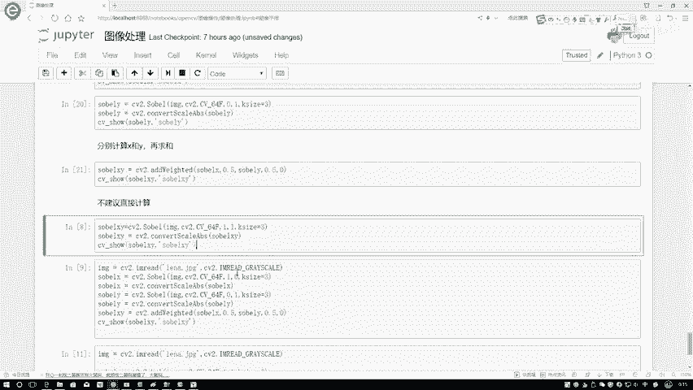

在OpenCV中，我们可以使用`cv2.addWeighted()`函数方便地实现加权融合。该函数的基本用法如下：
```python
G_total = cv2.addWeighted(GX, 0.5, GY, 0.5, 0)
```
其中，`0.5`是分配给GX和GY的权重，最后的`0`是偏置项（通常设为0）。

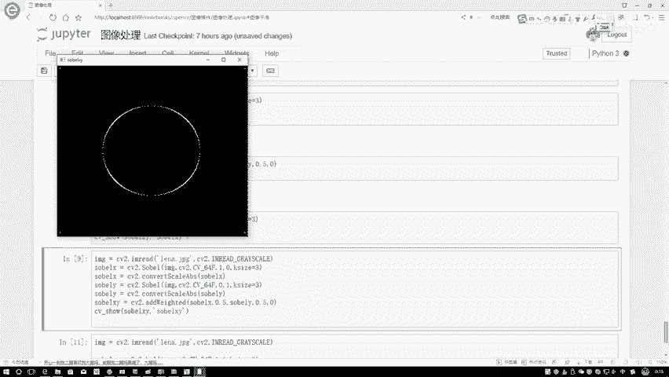

下图展示了分别计算的GX、GY以及它们融合后的总梯度G：


*（左：GX， 中：GY， 右：G_total）*

可以看到，融合后的图像（G_total）结合了两个方向的边缘信息，使得轮廓更加完整和连续。

---

## ⚠️ 为什么不建议直接计算整体梯度？

你可能会问，既然最终要融合，为什么不直接在Sobel算子中同时设置`dx=1`和`dy=1`来一次性计算整体梯度呢？

以下是直接计算与分别计算再融合的对比结果：


*（左：分别计算再融合， 右：直接设置dx=1， dy=1计算）*

通过对比可以发现：
*   **直接计算**的结果存在明显的**重影**和**模糊**，边缘不够清晰，部分区域还有断裂。
*   **分别计算再融合**的结果则**轮廓清晰**，边缘连续性好。

因此，在实践中建议采用**先分别计算GX和GY，再进行加权融合**的方法，这样可以获得更优的边缘检测效果。权重的具体分配可以根据实际任务进行调整。

---

## 📝 课程总结

本节课中我们一起学习了图像梯度计算的完整流程：

1.  **原理**：梯度反映了图像亮度的变化率，是边缘检测的基础。
2.  **分向计算**：
    *   水平梯度`GX` = 右边像素 - 左边像素
    *   垂直梯度`GY` = 下边像素 - 上边像素
3.  **关键处理**：计算出的梯度值可能为负数，需通过`cv2.convertScaleAbs()`取绝对值，以避免信息丢失。
4.  **融合策略**：使用`cv2.addWeighted()`函数将GX和GY按权重融合，得到总梯度图。**分别计算再融合**的效果优于一次性计算。
5.  **实践建议**：对于需要清晰轮廓的任务，推荐采用分步计算和融合的方法。

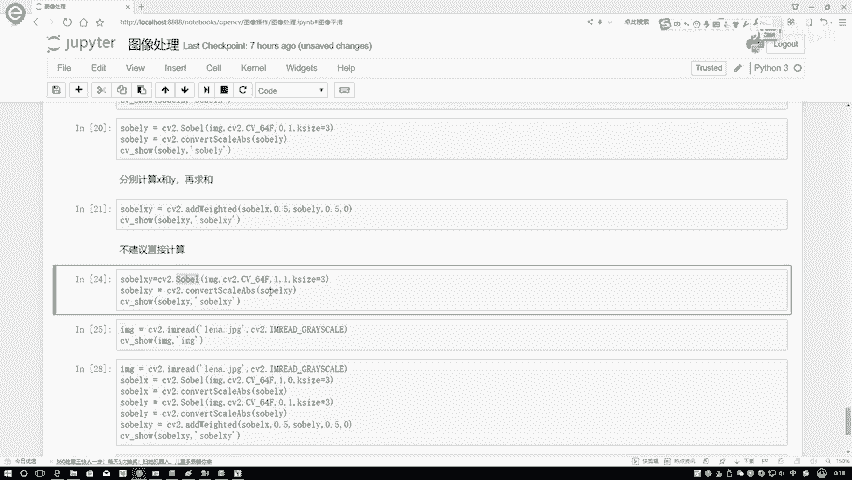

通过掌握这些步骤，你就能有效地计算出图像的梯度，并用于后续更复杂的图像分析和计算机视觉任务中。