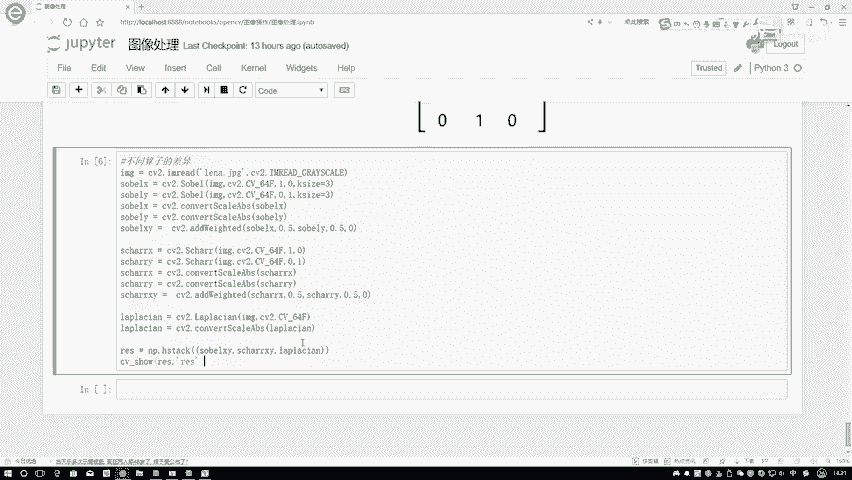
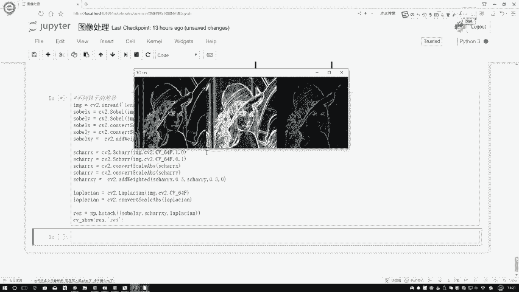
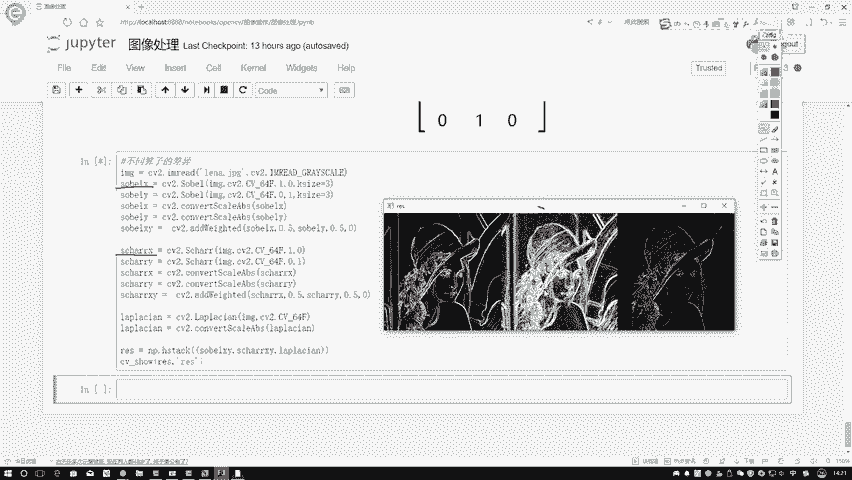
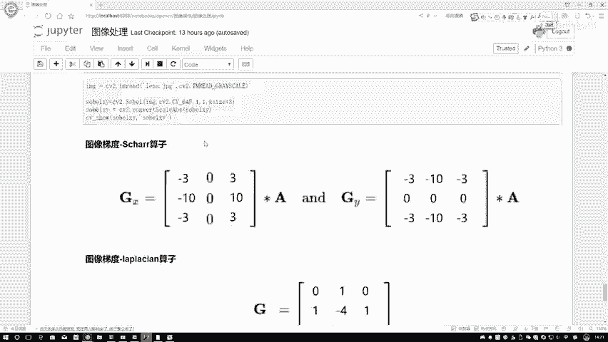
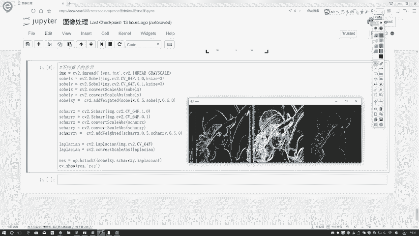
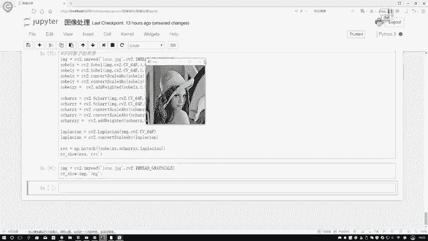
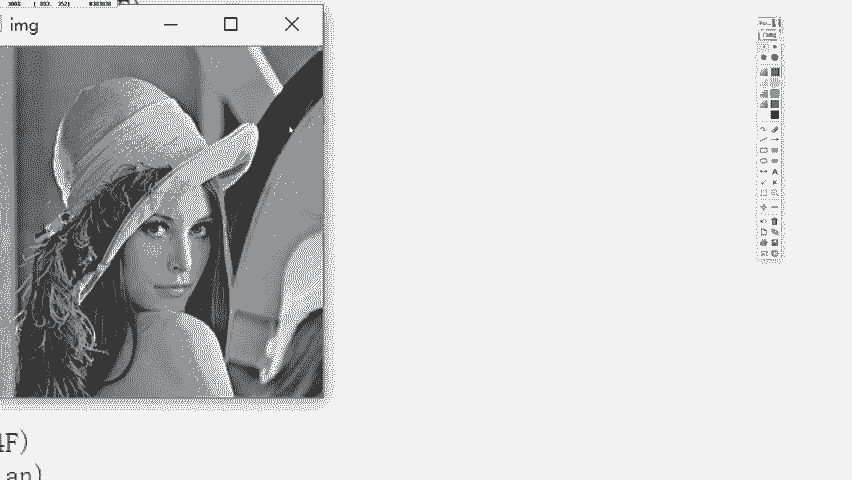
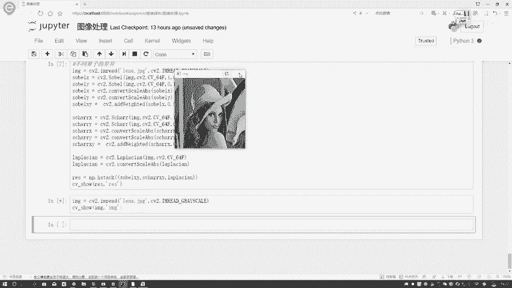
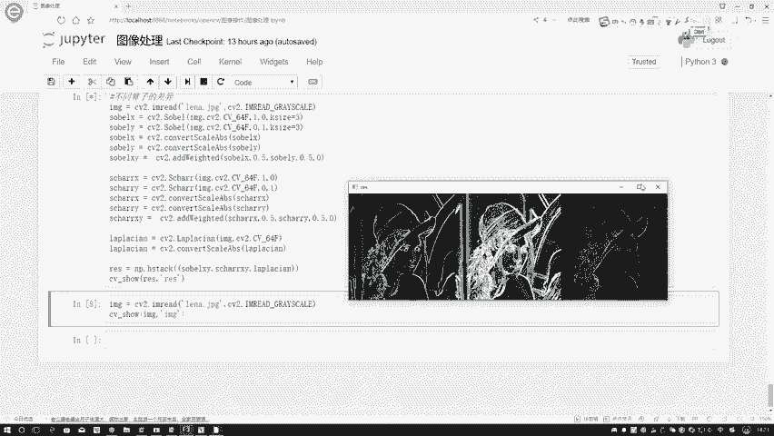

# 课程P14：Scharr与Laplacian算子 🧮

在本节课中，我们将学习图像梯度计算中的另外两种重要算子：Scharr算子和Laplacian算子。我们将了解它们与之前学过的Sobel算子的区别，并通过代码演示直观地比较它们的效果。

## Scharr算子：更敏感的梯度检测

上一节我们介绍了Sobel算子，本节中我们来看看Scharr算子。Scharr算子的核心思想与Sobel算子相同，但其卷积核中的数值被设计得更大，这使得它对图像中梯度的变化更为敏感。

以下是Scharr算子在x方向和y方向上的卷积核：

**x方向核：**
```
[ -3, 0,  3]
[-10, 0, 10]
[ -3, 0,  3]
```

**y方向核：**
```
[-3, -10, -3]
[ 0,   0,  0]
[ 3,  10,  3]
```

与Sobel算子相比，Scharr算子将离中心点较远的权重从2增大到3，将相邻点的权重从1增大到10。这种设计使得它对边缘的响应更强，能检测到更细微的梯度变化。

## Laplacian算子：基于二阶导的边缘检测

接下来我们介绍Laplacian算子。与Sobel和Scharr算子基于一阶导数不同，Laplacian算子基于二阶导数，即梯度的变化率。这使得它对图像中强度的快速变化（如边缘和噪声）都极为敏感。

Laplacian算子的一个常见卷积核如下：
```
[ 0,  1,  0]
[ 1, -4,  1]
[ 0,  1,  0]
```

其计算原理可以理解为：用中心像素点与其四个直接相邻的像素点进行比较。对于一个中心点`P5`及其上下左右邻居`P2`、`P4`、`P6`、`P8`，其响应值计算公式为：
`结果 = P2 + P4 + P6 + P8 - 4 * P5`

如果中心点与周围点差异很大（例如位于边界），计算结果就会是一个较大的值。然而，正因为它对变化极为敏感，所以对图像噪声也特别敏感，这通常不是一件好事。因此，Laplacian算子很少单独使用，而是常与其他图像处理方法结合使用。

## 代码实现与效果对比

了解了基本概念后，我们来看看如何在OpenCV中使用这些算子。它们的调用方式与Sobel算子类似，但各有特点。



以下是使用OpenCV实现三种算子的核心代码：



```python
import cv2
import numpy as np



# 读取图像并转为灰度图
img = cv2.imread('image.jpg', cv2.IMREAD_GRAYSCALE)



# 1. 使用Sobel算子
sobelx = cv2.Sobel(img, cv2.CV_64F, 1, 0, ksize=3)
sobely = cv2.Sobel(img, cv2.CV_64F, 0, 1, ksize=3)
sobel_combined = cv2.convertScaleAbs(cv2.addWeighted(cv2.convertScaleAbs(sobelx), 0.5, cv2.convertScaleAbs(sobely), 0.5, 0))

# 2. 使用Scharr算子
scharrx = cv2.Scharr(img, cv2.CV_64F, 1, 0)
scharry = cv2.Scharr(img, cv2.CV_64F, 0, 1)
scharr_combined = cv2.convertScaleAbs(cv2.addWeighted(cv2.convertScaleAbs(scharrx), 0.5, cv2.convertScaleAbs(scharry), 0.5, 0))



# 3. 使用Laplacian算子
# 注意：Laplacian算子直接计算，无需分x和y方向
laplacian = cv2.Laplacian(img, cv2.CV_64F)
laplacian_abs = cv2.convertScaleAbs(laplacian)
```

代码说明：
*   `cv2.Sobel` 和 `cv2.Scharr` 函数需要分别指定`dx`和`dy`参数来计算x方向和y方向的梯度，最后需要合并。
*   `cv2.Laplacian` 函数直接计算，无需指定方向，使用起来更简单。
*   `cv2.convertScaleAbs` 函数用于将结果转换为8位无符号整数并取绝对值，便于显示。

## 结果分析与对比



执行上述代码后，我们可以对比三种算子的效果：



以下是不同算子的效果差异总结：
1.  **Sobel算子**：能够有效检测出主要的边界信息，结果较为清晰。
2.  **Scharr算子**：与Sobel算子相比，它能捕捉到更丰富、更细致的梯度信息。例如，在头发丝或纹理密集的区域，Scharr算子能显示出更多线条，对边缘的描绘更细致。
3.  **Laplacian算子**：得到的结果对噪声非常敏感，边缘线条可能不够清晰或包含大量无关的噪声响应。因此，其单独使用的效果通常不理想。



从对比中可以得出结论：Scharr算子由于其对梯度更高的敏感性，在需要检测细微边缘时可能优于Sobel算子。而Laplacian算子因其特性，更适合作为其他高级图像处理技术（如图像锐化或斑点检测）中的一个组件，而非独立的边缘检测工具。

## 总结

本节课中我们一起学习了Scharr算子和Laplacian算子。
*   **Scharr算子**是Sobel算子的一个增强变体，通过增大卷积核权重来获得更高的梯度检测灵敏度。
*   **Laplacian算子**基于二阶导数，对变化极为敏感，但同时也易受噪声干扰，通常不单独用于边缘检测。



理解不同算子的特性有助于我们在实际应用中根据具体需求（如对噪声的容忍度、对细节的要求）选择合适的工具。在后续课程中，当我们学习更复杂的图像处理技术时，还会看到Laplacian算子如何与其他方法协同工作。