# 课程P15：1-Canny边缘检测流程 🧠

在本节课中，我们将学习经典的Canny边缘检测算法的完整流程。Canny算法由John Canny在1986年提出，并以他的名字命名。该算法通过一系列精心设计的步骤，能够有效地从图像中提取出清晰、准确的边缘信息。

---

## 第一步：高斯滤波去噪 🧹

上一节我们介绍了边缘检测的基本概念，本节中我们来看看Canny算法的第一步。在进行边缘检测时，原始图像可能包含噪声。这些噪声点在计算梯度时会产生干扰，影响检测效果。因此，第一步需要对图像进行平滑处理以去除噪声。

Canny算法使用**高斯滤波器**来实现平滑。高斯滤波器的核心思想是赋予中心像素点最高的权重，周围像素点的权重随着距离的增加而减小。

以下是高斯滤波的核心操作公式（以3x3核为例）：
```
新像素值 = 加权求和(核内所有像素值 * 对应高斯权重)
```
完成高斯滤波后，图像变得平滑，为后续的梯度计算做好了准备。

---

## 第二步：计算梯度幅值与方向 📈

在完成图像平滑后，下一步是计算图像的梯度。梯度能够反映图像灰度变化的强度和方向。Canny算法不仅需要梯度的大小（幅值），还需要梯度的方向。

这里使用**Sobel算子**来计算梯度。Sobel算子包含两个卷积核，分别用于计算水平方向（Gx）和垂直方向（Gy）的梯度。

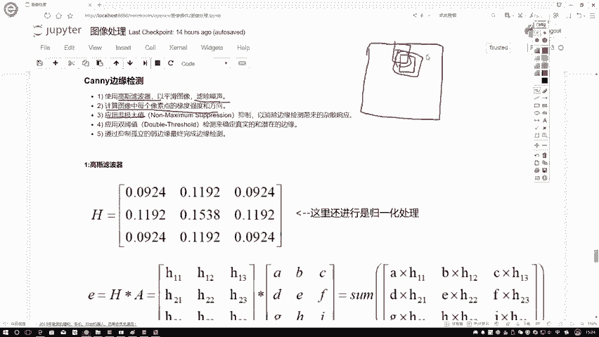

以下是Sobel算子的两个核心卷积核：
```
Gx = [[-1, 0, 1],
      [-2, 0, 2],
      [-1, 0, 1]]

Gy = [[-1, -2, -1],
      [0,  0,  0],
      [1,  2,  1]]
```

计算过程如下：
1.  分别用Gx和Gy核与图像进行卷积，得到每个像素点的水平梯度值`Gx`和垂直梯度值`Gy`。
2.  计算梯度幅值：`G = sqrt(Gx^2 + Gy^2)`
3.  计算梯度方向：`θ = arctan(Gy / Gx)`

至此，我们得到了每个像素点的边缘强度（幅值）和边缘方向。

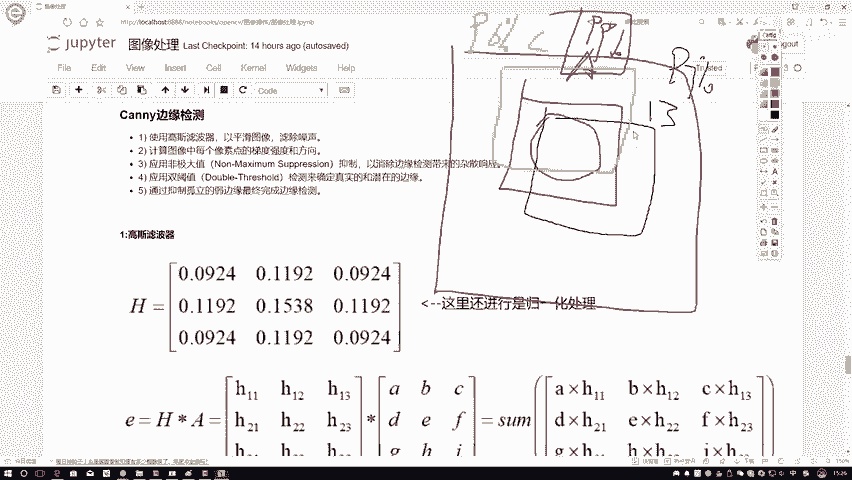

---

## 第三步：非极大值抑制 🎯

计算完梯度后，图像中可能存在许多较宽的边缘区域。非极大值抑制（Non-Maximum Suppression, NMS）的目的是“细化”边缘，只保留局部梯度最大的点，抑制非极大值。

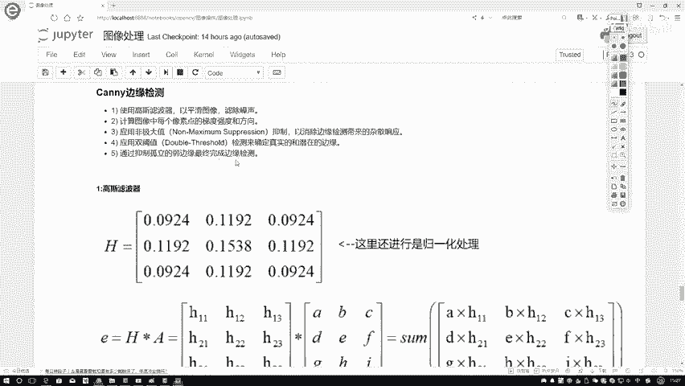

其核心思想是：在当前像素点的梯度方向上，比较该点与其前后两个邻接点的梯度幅值。如果当前点的幅值不是最大的，则将其抑制（置为0）。

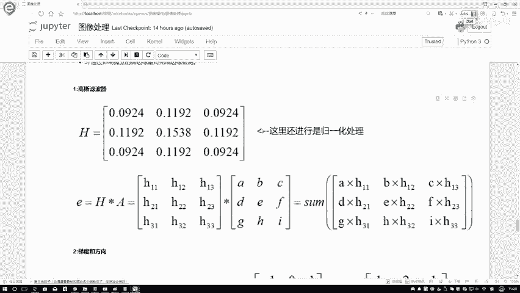

为了帮助理解NMS，我们可以看一个在目标检测中的类似应用：
*   假设人脸检测算法在同一个位置附近给出了三个重叠的检测框A、B、C，其置信度分别为99%、97%、96%。
*   NMS的作用就是只保留置信度最高的A框（99%），而抑制掉B框和C框。

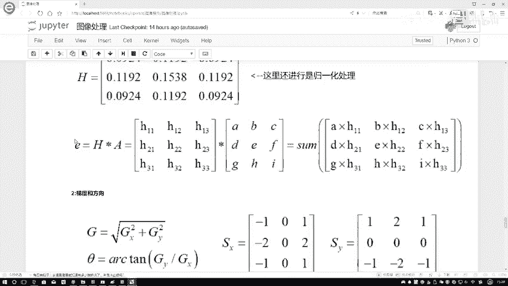

在Canny的边缘NMS中，我们比较的是梯度幅值，目的是确保检测到的边缘是单像素宽的细线。

---

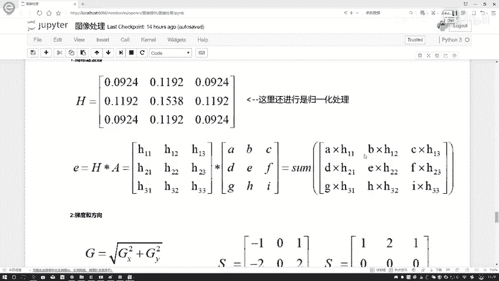

## 第四步：双阈值检测与边缘连接 🔗

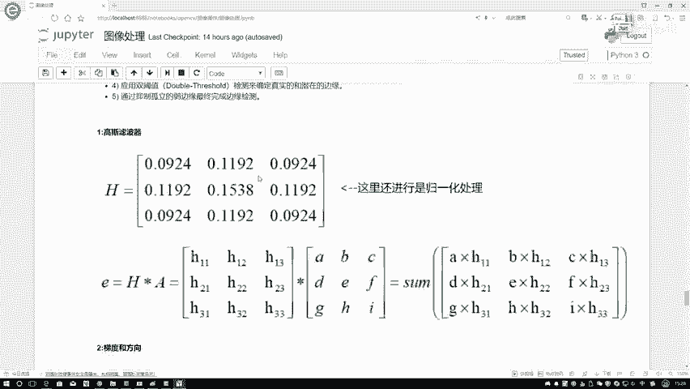

经过非极大值抑制后，图像中仍然可能包含一些由噪声或颜色变化引起的假边缘。双阈值检测用于进一步筛选出真正的强边缘。

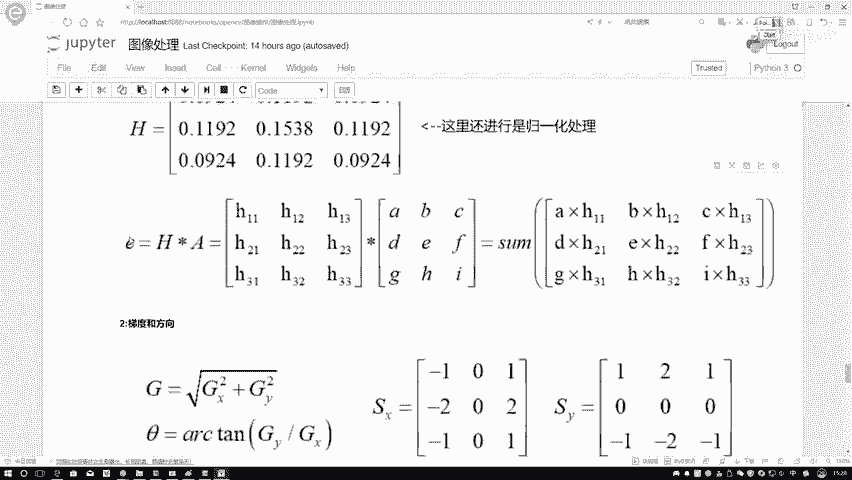

以下是双阈值处理的具体步骤：
1.  设定两个阈值：一个高阈值（`high_threshold`）和一个低阈值（`low_threshold`）。
2.  将梯度幅值高于高阈值的像素点标记为**强边缘**（确定是边缘）。
3.  将梯度幅值低于低阈值的像素点标记为**非边缘**并直接舍弃。
4.  对于梯度幅值介于两个阈值之间的像素点，标记为**弱边缘**（可能是边缘）。
5.  边缘连接：检查每一个弱边缘像素。如果它在8邻域内与任何一个强边缘像素相连，则将其保留为真正的边缘；否则，将其舍弃。

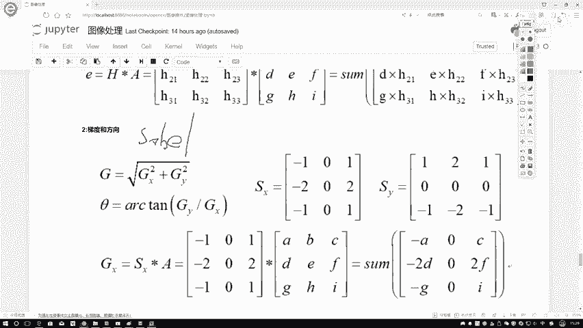

这种方法可以有效地连接断开的边缘，同时抑制孤立的噪声点。

---

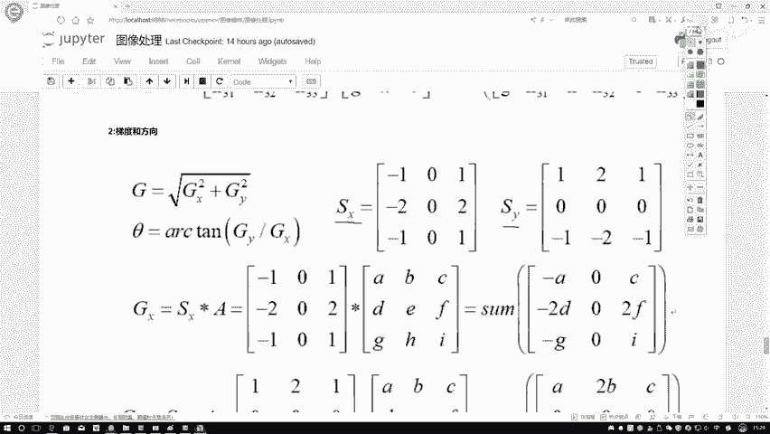

## 总结 📝

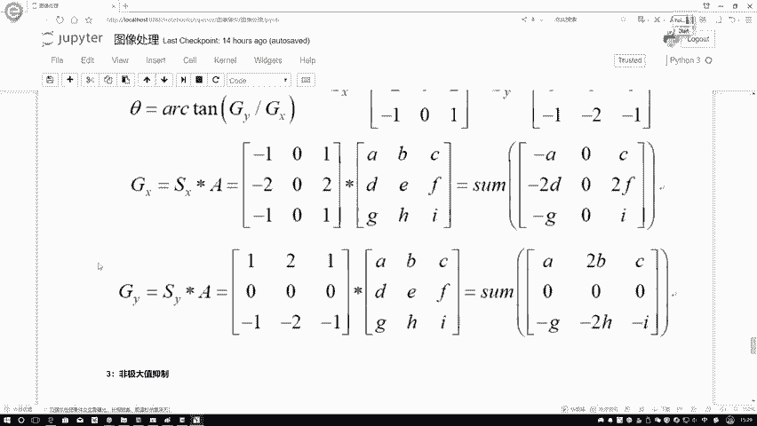

本节课中我们一起学习了Canny边缘检测算法的完整流程。我们首先使用高斯滤波器平滑图像以去除噪声；接着利用Sobel算子计算图像的梯度幅值和方向；然后通过非极大值抑制来细化边缘；最后应用双阈值检测和边缘连接来筛选并连接出最终准确、连贯的边缘。这个过程综合运用了图像平滑、梯度计算和阈值处理等技术，是计算机视觉中一个非常经典且实用的边缘检测方法。