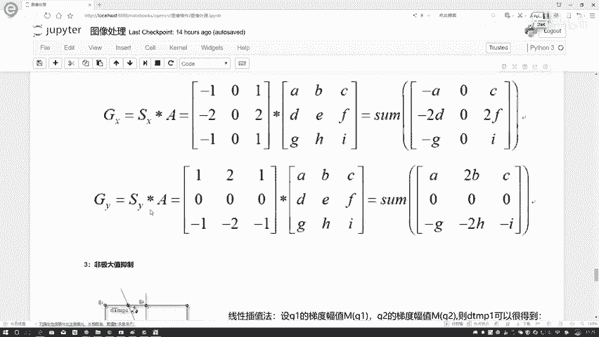
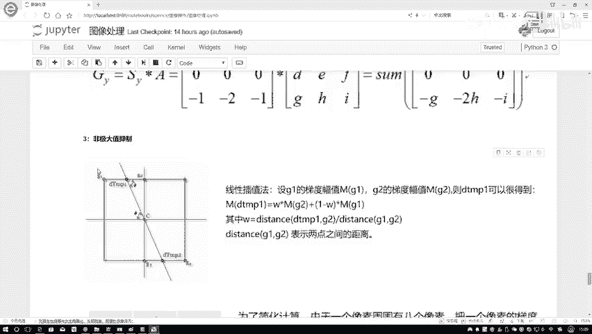
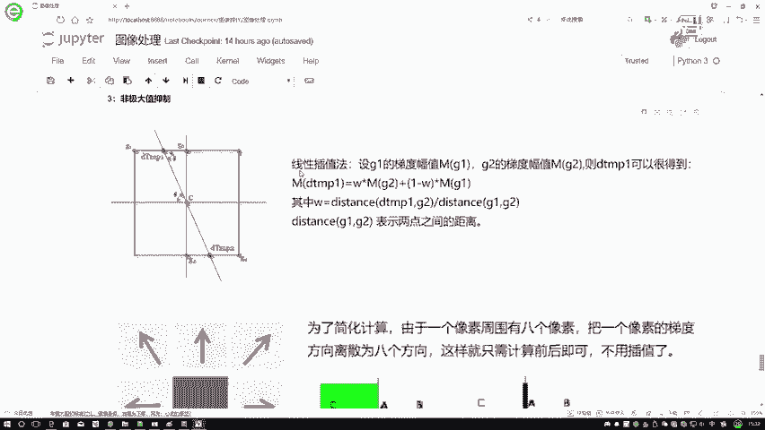
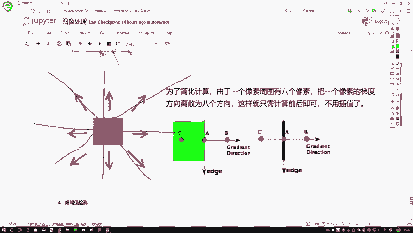
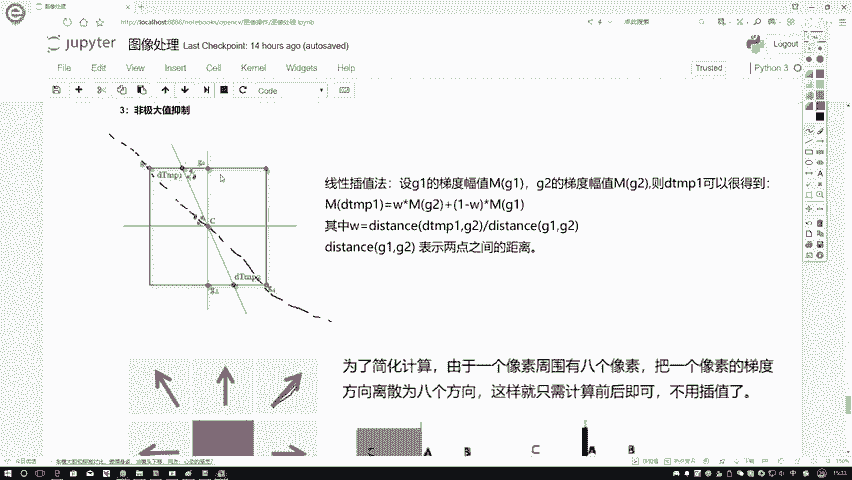
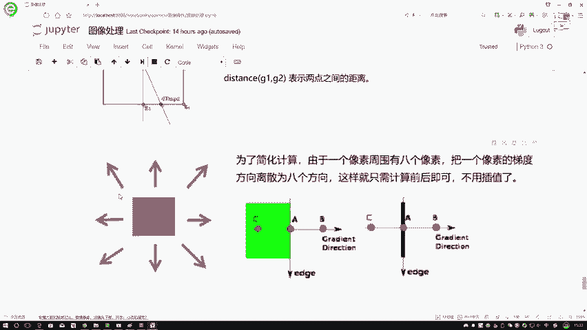
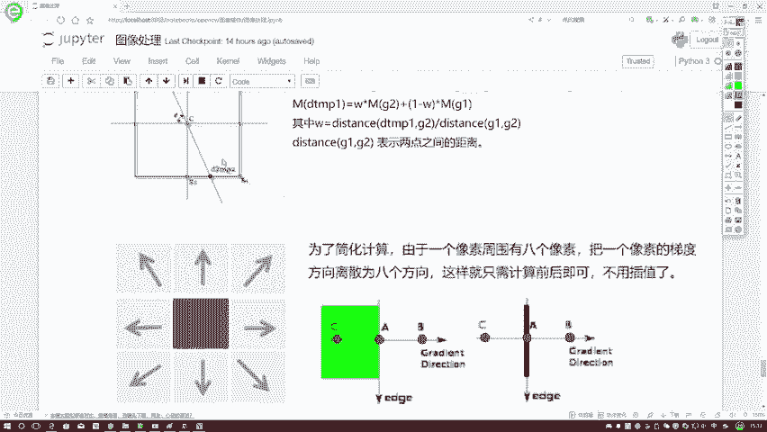
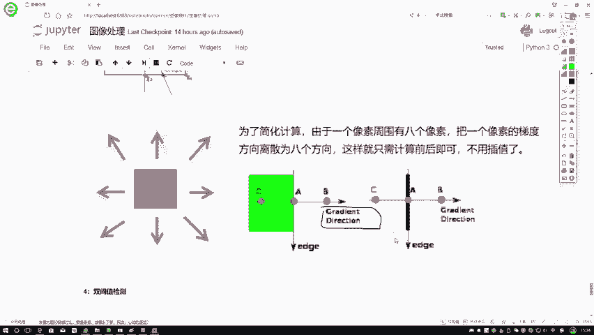
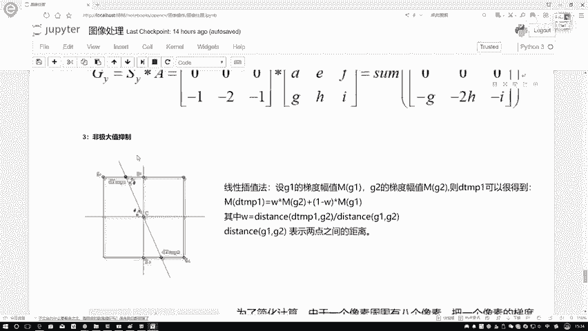
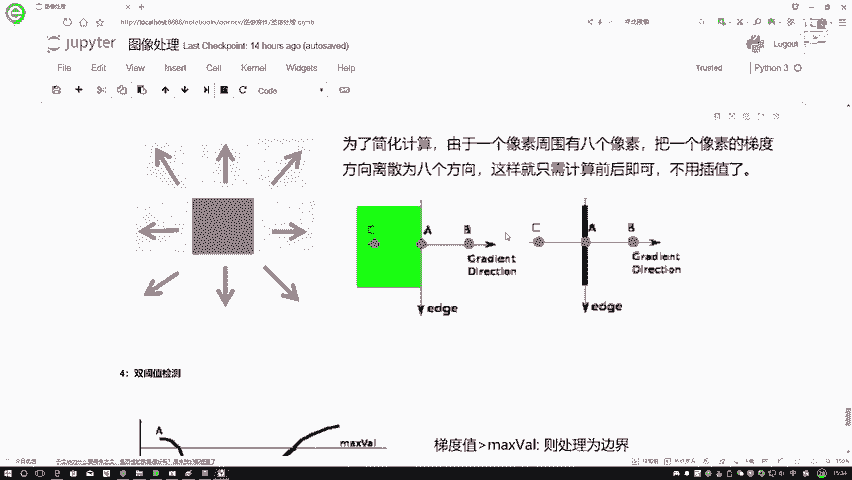

# 课程P16：2-非极大值抑制 🎯

在本节课中，我们将学习Canny边缘检测算法中的一个核心步骤——**非极大值抑制**。它的目的是在初步检测到的边缘中，只保留局部梯度最大的点，从而让边缘变得更细、更准确。

上一节我们介绍了如何计算图像的梯度和方向，本节中我们来看看如何利用这些信息来“细化”边缘。

## 非极大值抑制的原理

非极大值抑制的核心思想是：**只保留在梯度方向上局部梯度值最大的像素点，抑制所有非极大值的点**。

对于一个像素点C，我们已知它的梯度幅值（强度）和梯度方向。为了判断C是否为边缘，我们需要将其与**沿着梯度方向**的相邻两个像素点进行比较。如果C的梯度幅值比这两个相邻点都大，则保留C；否则，将C抑制（即不视为边缘点）。

## 方法一：线性插值法（精确方法）

这种方法更为精确，但计算稍复杂。关键在于，梯度方向上的相邻点（如图中的Q和Z）可能并不正好落在实际的像素坐标上（即亚像素点），因此我们需要通过插值来计算它们的梯度值。

以下是具体步骤：

1.  **确定比较点**：根据C点的梯度方向，找到该方向与相邻像素网格线的两个交点，记为Q和Z。
2.  **计算Q和Z的梯度值**：由于Q和Z不是实际像素点，其梯度值需要通过其周围的实际像素点（如G1, G2）的梯度值，通过**线性插值法**计算得出。
    *   公式可以表示为：`Q点的梯度值 = w1 * G1的梯度值 + w2 * G2的梯度值`
    *   其中，权重 `w1` 和 `w2` 由距离比例决定。例如，`w1 = 距离(Q, G2) / 距离(G1, G2)`，`w2 = 距离(Q, G1) / 距离(G1, G2)`。
3.  **进行比较**：将C点的梯度幅值与计算得到的Q点和Z点的梯度幅值进行比较。
4.  **做出决策**：
    *   如果 **C > Q 且 C > Z**，则保留C点作为边缘。
    *   否则，抑制C点。

虽然线性插值法更准确，但计算量较大。为了简化，我们通常采用第二种近似方法。

## 方法二：方向近似法（简化方法）

这种方法将连续的梯度方向近似到有限的几个离散方向上，从而直接使用实际的像素点进行比较，避免了插值计算。

以下是具体步骤：

1.  **离散化方向**：将一个像素点周围的360度方向，近似为4个或8个固定方向（例如：0°（水平）、45°、90°（垂直）、135°等）。
2.  **寻找比较点**：根据C点的梯度方向，找到与其最接近的那个离散方向。然后，沿着这个正、负方向，找到C点最近的两个实际像素点（例如，对于水平方向，就是左邻点和右邻点）。
3.  **进行比较**：直接使用这两个实际像素点的梯度幅值与C点进行比较。
4.  **做出决策**：如果C点的梯度幅值大于这两个邻点的梯度幅值，则保留C点。

OpenCV官网提供了一个清晰的例子：对于中心像素点A，其梯度方向为水平方向。那么我们就将其与水平方向上的两个实际像素点B和C进行比较。如果A的梯度值大于B和C，则A被保留为边缘点。

## 总结

本节课中我们一起学习了非极大值抑制的两种实现方法：

*   **线性插值法**：通过插值计算亚像素点的梯度值进行比较，结果精确但计算复杂。
*   **方向近似法**：将梯度方向近似到几个固定方向，直接使用实际像素点进行比较，计算简单高效，是实践中常用的方法。

无论采用哪种方法，非极大值抑制的本质都是**在梯度方向上，只保留局部梯度最大的像素点**，从而将粗宽的边缘“细化”为单像素宽的精确边缘，为后续的双阈值处理做好准备。

