# 课程P17：Canny边缘检测效果详解 🎯

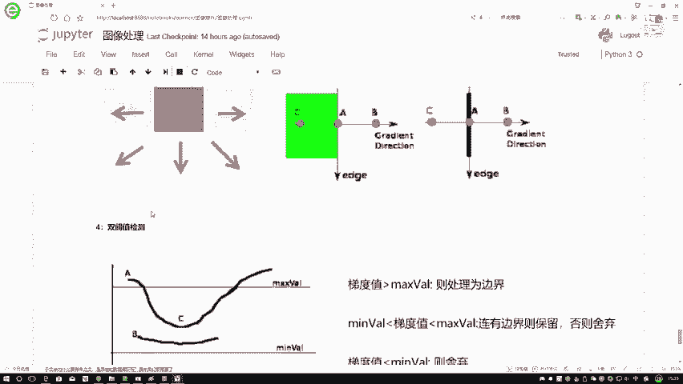

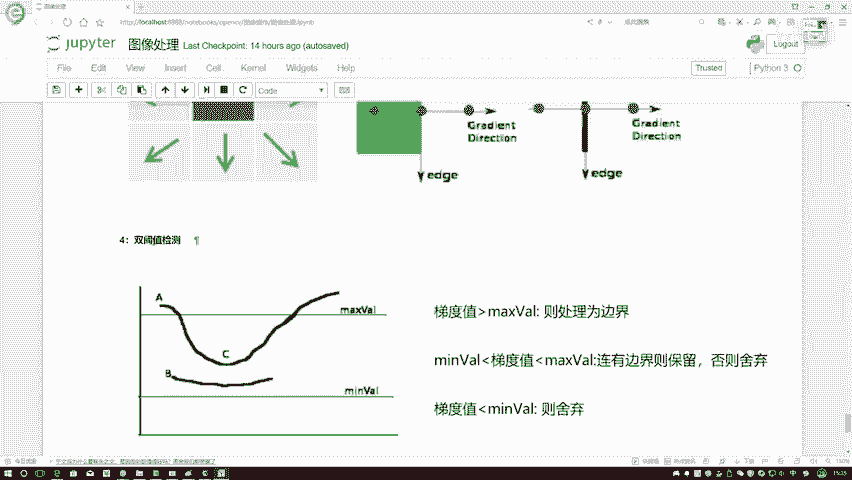

在本节课中，我们将深入学习Canny边缘检测算法中的关键步骤——双阈值检测，并了解如何在OpenCV中应用此算法。我们将通过对比不同参数设置的效果，来理解阈值选择对边缘检测结果的影响。

上一节我们介绍了Canny边缘检测的基本流程，本节中我们来看看其核心步骤之一：双阈值检测。

## 双阈值检测原理

双阈值检测是Canny边缘检测算法中的一个关键步骤。它涉及两个参数：`minVal`（最小阈值）和`maxVal`（最大阈值）。这两个参数用于对计算出的梯度幅值进行分类和筛选。

以下是梯度值处理的三种情况：

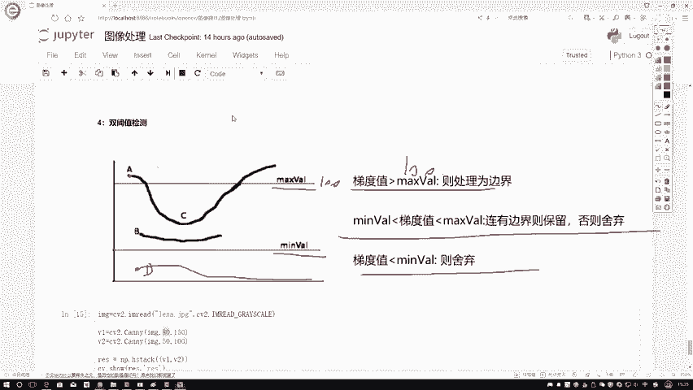

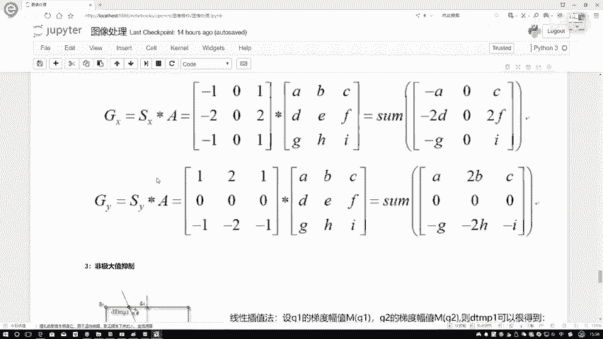

1.  **梯度值 > maxVal**：该点被直接判定为强边缘。
    *   **公式表示**：`gradient(x, y) > maxVal` → 强边缘点
2.  **梯度值 < minVal**：该点被直接舍弃，认为不是边缘。
    *   **公式表示**：`gradient(x, y) < minVal` → 非边缘点
3.  **minVal < 梯度值 < maxVal**：该点被标记为弱边缘候选点。其最终命运取决于它是否与强边缘点相连。
    *   如果该弱边缘点与任何强边缘点相连，则它被保留为最终边缘。
    *   如果该弱边缘点不与任何强边缘点相连，则它被舍弃。

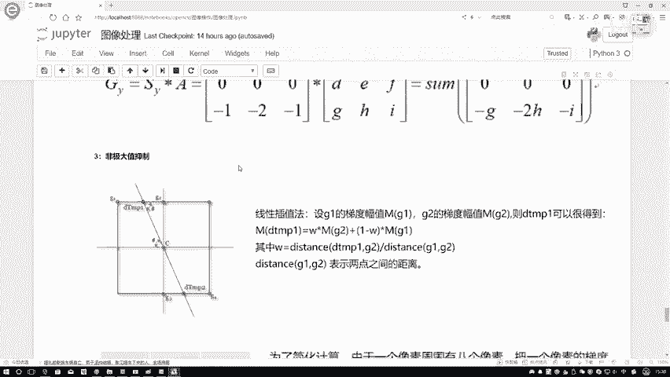

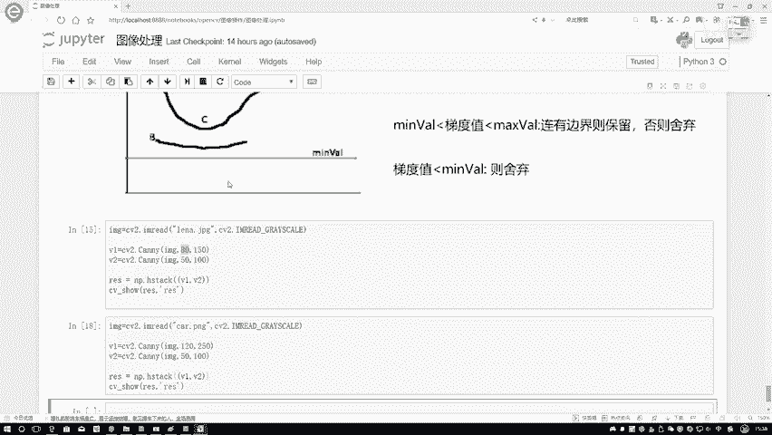

这个步骤有效地过滤了噪声和虚假边缘，只保留真正有意义的边缘信息。

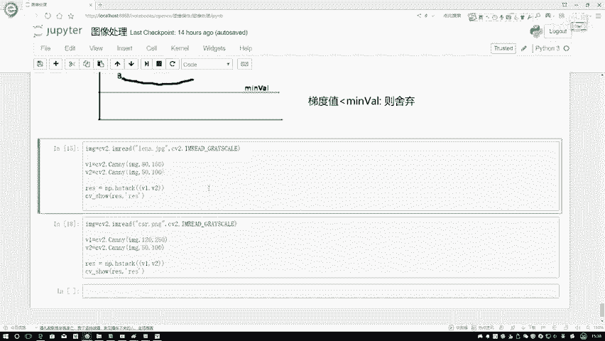

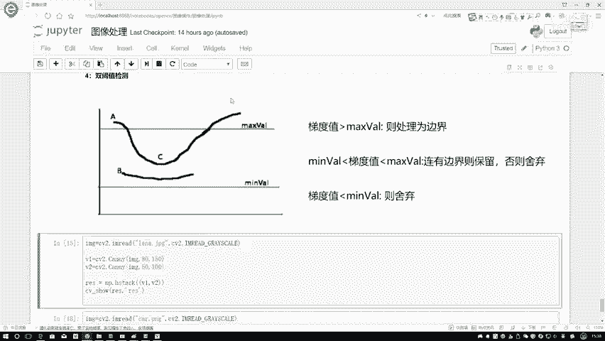

## OpenCV中的Canny边缘检测

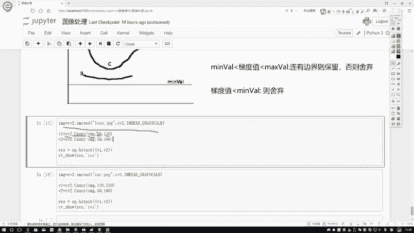

理解了双阈值检测的原理后，我们来看看如何在OpenCV中轻松实现Canny边缘检测。OpenCV将高斯滤波、梯度计算、非极大值抑制和双阈值检测等步骤封装成了一个简单的函数。

核心代码如下：

```python
import cv2

# 读取图像并转换为灰度图
img = cv2.imread('lena.png')
gray = cv2.cvtColor(img, cv2.COLOR_BGR2GRAY)

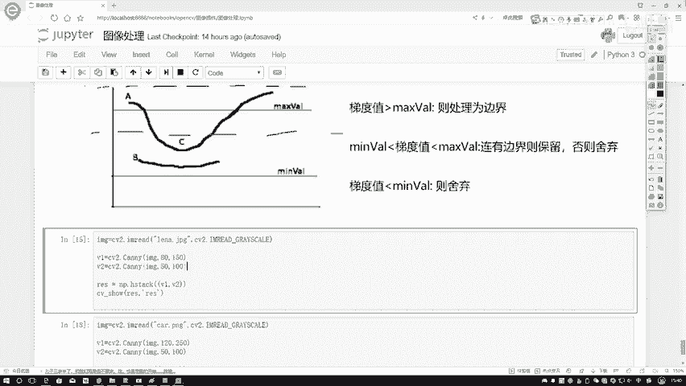

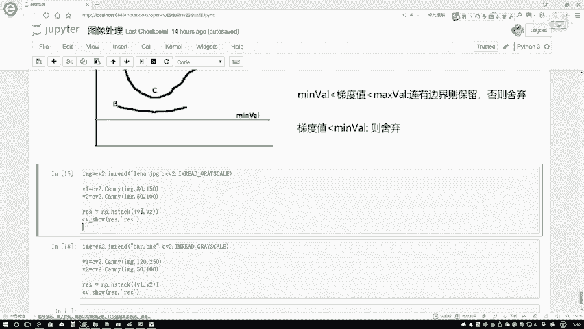

# 应用Canny边缘检测
# 参数：输入图像，最小阈值(minVal)，最大阈值(maxVal)
edges1 = cv2.Canny(gray, 80, 150)  # 阈值设置较高
edges2 = cv2.Canny(gray, 50, 100)  # 阈值设置较低
```

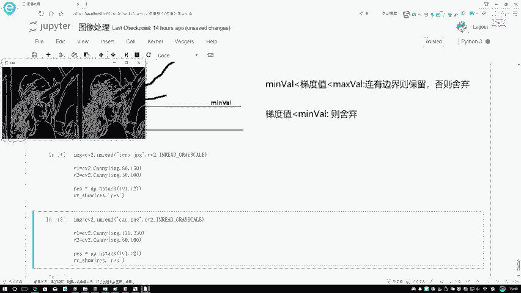

## 阈值参数的影响

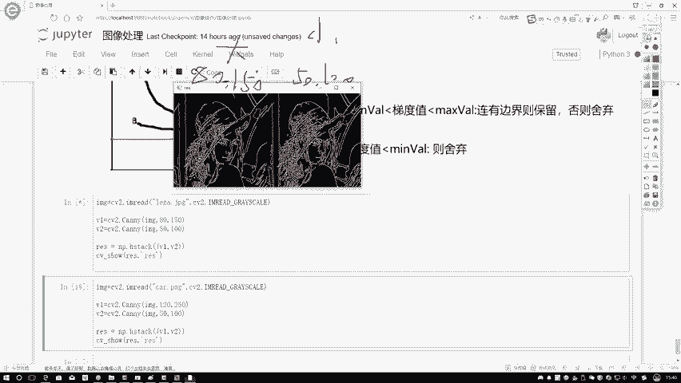

`minVal`和`maxVal`的取值会显著影响边缘检测的结果。以下是参数设置的一般规律：

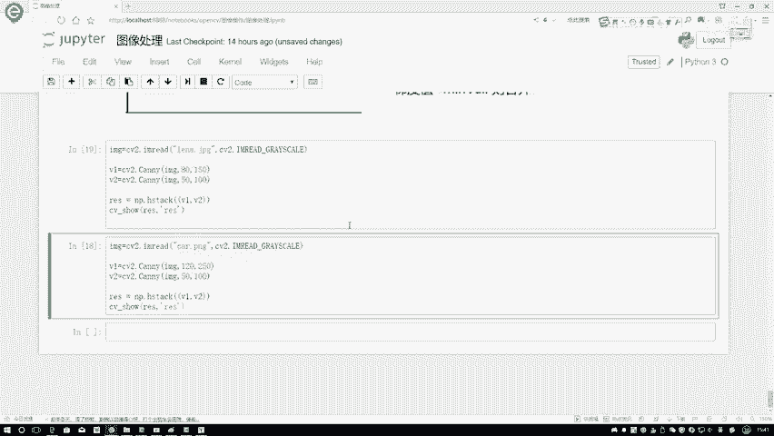

*   **阈值设置较高（如80, 150）**：标准严格。只检测梯度变化非常明显的强边缘，结果中的边缘线条较少、较粗，但可能丢失一些细节。
*   **阈值设置较低（如50, 100）**：标准宽松。会检测出更多的边缘，包括一些弱边缘和细节，但同时也可能引入更多噪声。

通过对比不同阈值下的输出图像，可以直观地看到这种差异。阈值较低时，图像的纹理和细节更丰富；阈值较高时，只保留最主体、最确信的边缘轮廓。

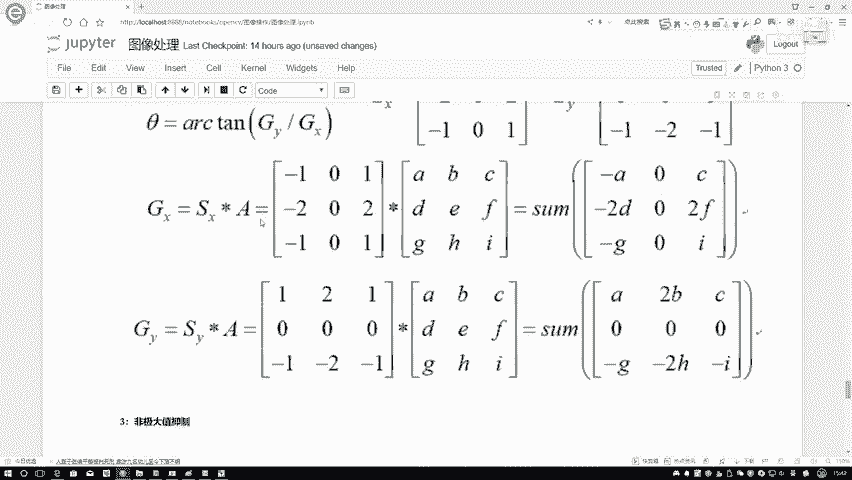

## 总结

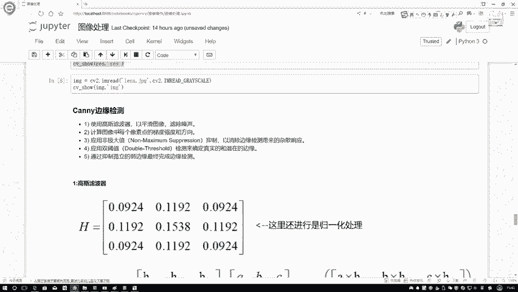

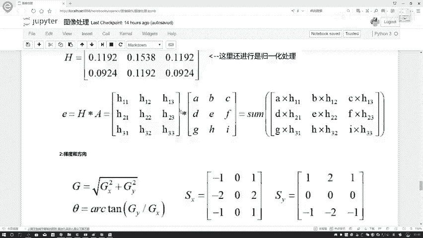

本节课中我们一起学习了Canny边缘检测算法的双阈值检测步骤。我们明确了`minVal`和`maxVal`两个参数如何将像素点分为强边缘、弱边缘和非边缘三类，并通过连接性分析确定最终的边缘。最后，我们掌握了使用OpenCV的`cv2.Canny()`函数进行边缘检测的方法，并通过实验对比，理解了阈值参数大小对检测结果的直接影响：阈值越低，边缘越丰富（可能包含噪声）；阈值越高，边缘越简洁（可能丢失细节）。在实际应用中，需要根据具体任务调整这两个参数以达到最佳效果。