# 课程P18：图像金字塔定义 🏛️

在本节课中，我们将要学习图像金字塔的概念。图像金字塔是一种将图像以多分辨率（即不同尺寸）进行表示的方法，其结构类似于金字塔，底层是原始的大尺寸图像，越往上尺寸越小。这种结构在计算机视觉的多个领域，如图像特征提取、图像融合和目标检测中，都有广泛应用。

## 图像金字塔概述

上一节我们介绍了课程主题，本节中我们来看看图像金字塔的具体形态。

金字塔的形状底层较大，越往上越小。图像金字塔就是将图像组合成类似金字塔的形状。

例如，底层可以是一张800×800像素的大图像。向上一层变换，图像尺寸缩小，例如变为400×400像素。继续向上，图像尺寸进一步缩小，例如变为200×200像素、100×100像素，最后可能变为50×50像素。这样，一张图像就被变换成了多种不同尺寸的形式。

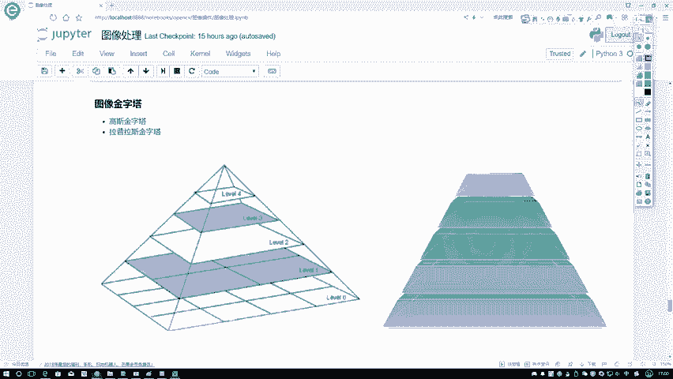

构建图像金字塔的用途很多。例如，在进行图像特征提取时，我们可能不仅需要对原始输入图像提取特征，还需要对整个金字塔的每一层图像进行特征提取。不同层提取出的特征可能不同，将这些特征结果汇总在一起，可以获得更丰富或更鲁棒的特征表示。

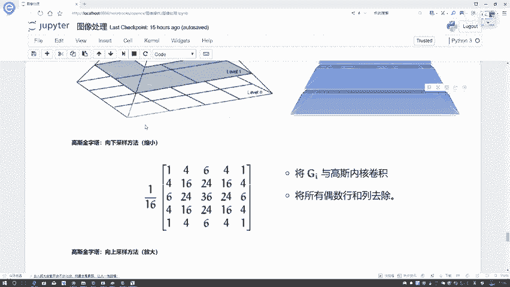

接下来，我们将主要讲解图像金字塔的两种类型：高斯金字塔和拉普拉斯金字塔。它们的核心原理相似，都是构建金字塔形状的多分辨率图像。

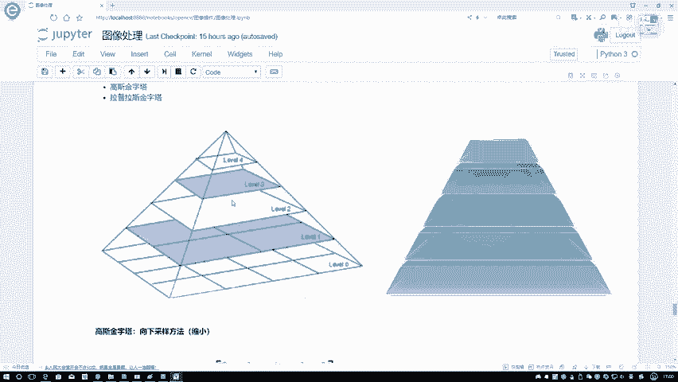

## 高斯金字塔

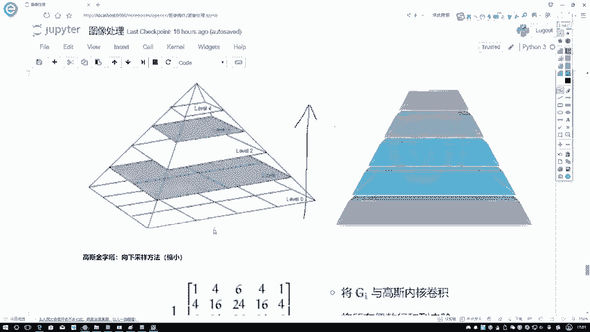

高斯金字塔是图像金字塔的一种常见形式，其构建过程涉及高斯滤波和下采样操作。下面我们来看看它的具体做法。

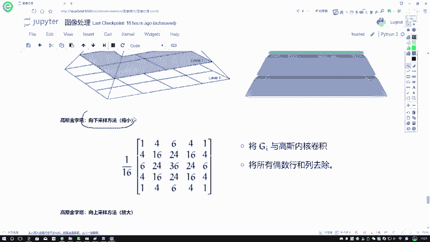

高斯金字塔主要包含两种操作：向下采样（缩小图像）和向上采样（放大图像）。首先，我们来了解向下采样。

### 向下采样

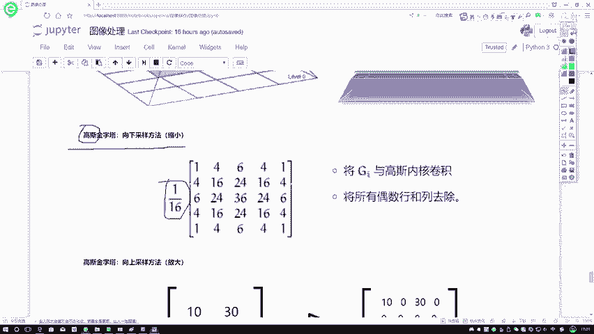

向下采样的方向是沿着金字塔从底层向顶层（即从大图像向小图像）进行。其目标是实现图像的缩小操作。

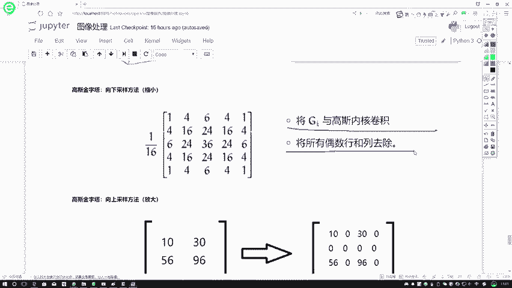

以下是构建高斯金字塔（向下采样）的两个核心步骤：

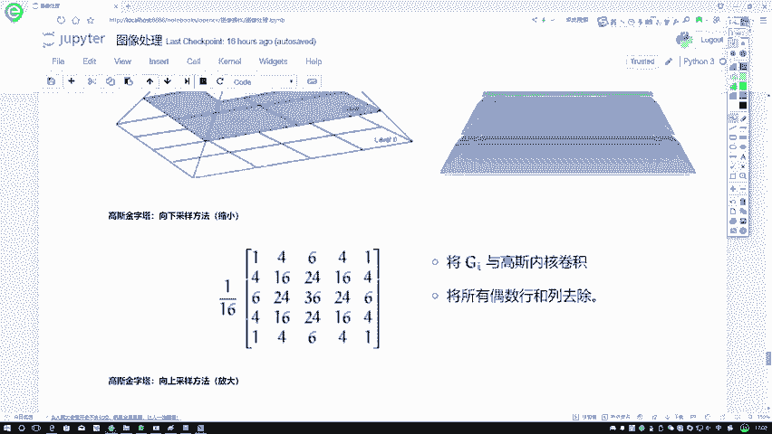

第一步，使用高斯核对原始图像进行卷积滤波。高斯核是一个权重符合高斯（正态）分布的矩阵，用于对图像进行平滑处理。卷积操作是图像中每个像素点与其邻域像素按照核的权重进行加权求和的过程。通常，卷积后需要进行归一化。

第二步，进行下采样，即缩小图像尺寸。具体做法是，删除经过高斯滤波后的图像中的所有偶数行和偶数列。

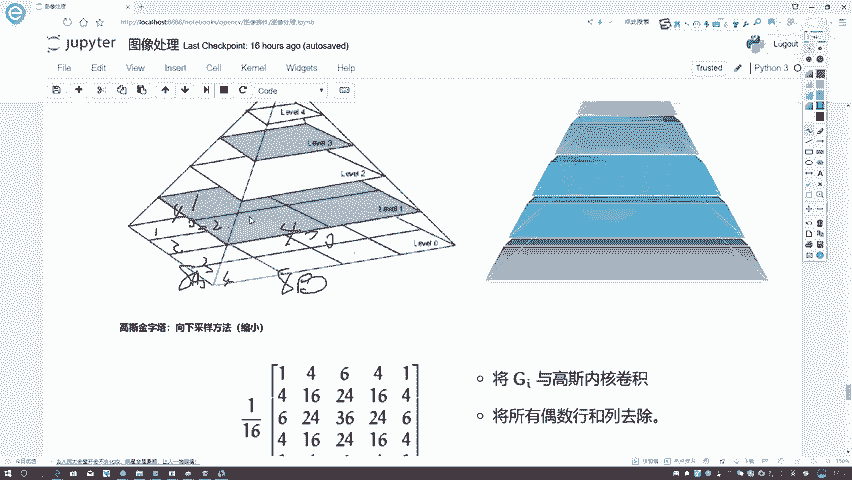

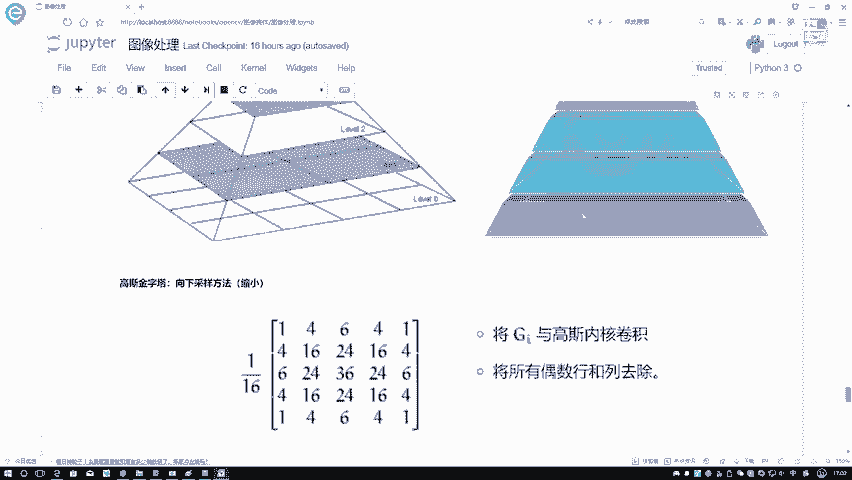

例如，假设原始图像尺寸为8×8像素。经过高斯滤波后，我们删除其第2、4、6、8行和第2、4、6、8列，最终得到一个4×4像素的图像。这样，图像的长度和宽度都变为原来的一半，总面积变为原来的四分之一。

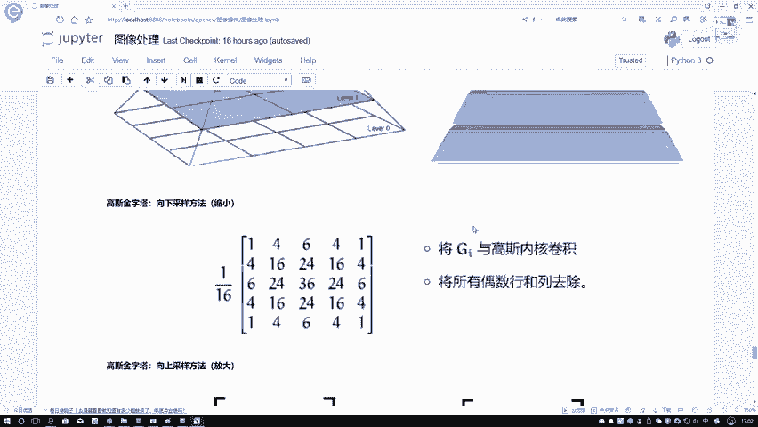

这个过程可以概括为：先高斯平滑，再隔行隔列删除像素。

### 向上采样

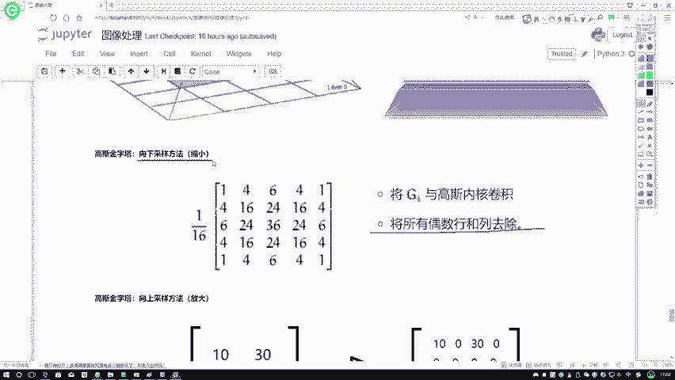

向上采样的方向与向下采样相反，是沿着金字塔从顶层向底层（即从小图像向大图像）进行。其目标是实现图像的放大操作。

以下是向上采样的具体步骤：

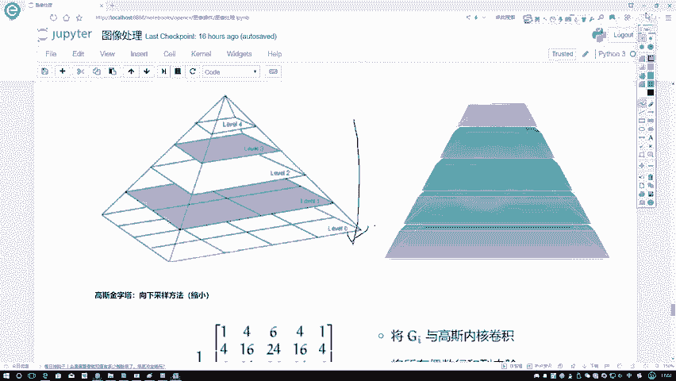

第一步，在每个方向上将图像尺寸扩大为原来的两倍。对于原始图像中的每个像素点，将其扩展成一个2×2的块。新增的像素位置用零值进行填充。

例如，一个2×2的原始图像，其像素值为 `[[10, 13], [15, 16]]`。扩大后，每个像素点变成2×2的块并用零填充，初步得到一个4×4的中间结果。

第二步，使用与向下采样中相同的高斯核，对这个填充零后的中间图像进行卷积操作。这个卷积过程会基于已有的像素值（如上例中的10, 13, 15, 16），计算出新插入位置（原为零值的位置）的像素值，从而生成最终的放大图像。其效果类似于将原始像素点的值“扩散”或“平均”到周围的区域。

## 总结

本节课中我们一起学习了图像金字塔的定义与构建方法。

我们首先了解了图像金字塔是一种多尺度图像表示方法，形状类似金字塔，底层图像尺寸最大，顶层最小。这种结构有助于进行多尺度的图像分析。

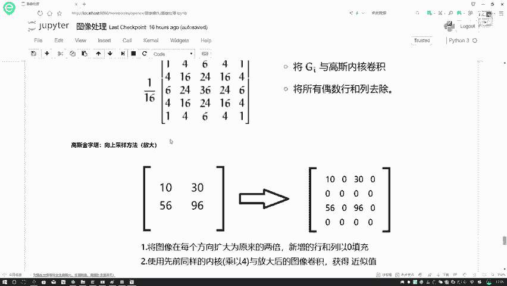

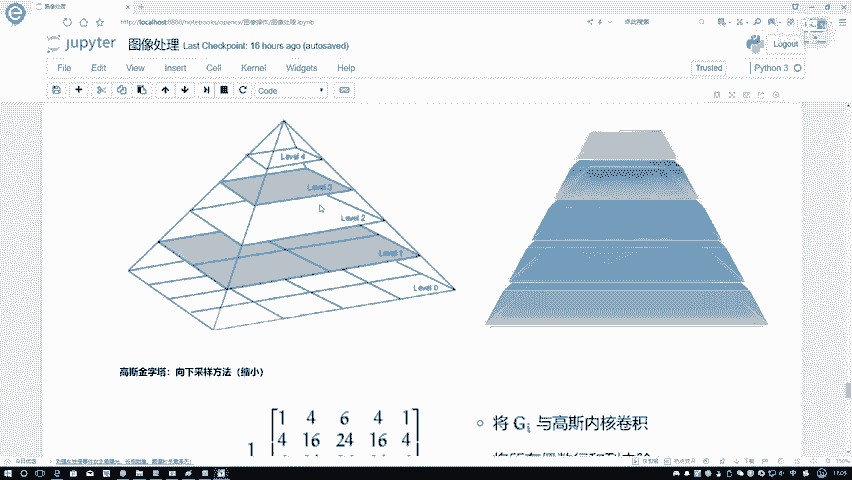

接着，我们重点学习了高斯金字塔的构建过程，它包含两种核心操作：
*   **向下采样**：通过**高斯滤波**后，**删除所有偶数行和偶数列**来实现图像缩小。
*   **向上采样**：通过**在每个方向插入零值并将尺寸扩大两倍**，再使用**相同的高斯核进行卷积**来实现图像放大。

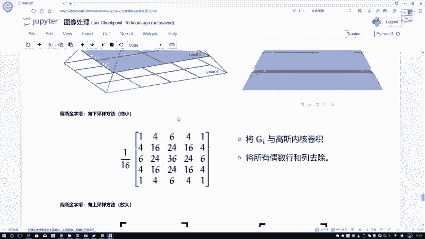

理解向下采样和向上采样的原理，是掌握图像金字塔及其后续应用的基础。