# OpenCV图像金字塔教程：P19 🏔️

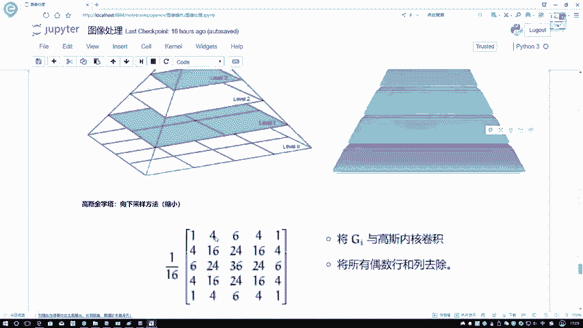

在本节课中，我们将学习OpenCV中图像金字塔的概念与操作方法。图像金字塔是一种多尺度图像表示方法，常用于图像缩放、图像融合和特征提取等任务。我们将重点介绍两种常见的金字塔：高斯金字塔和拉普拉斯金字塔。

## 读取与展示图像

首先，我们需要读取一张图像并展示其原始样貌。以下是读取和展示图像的代码。

```python
import cv2

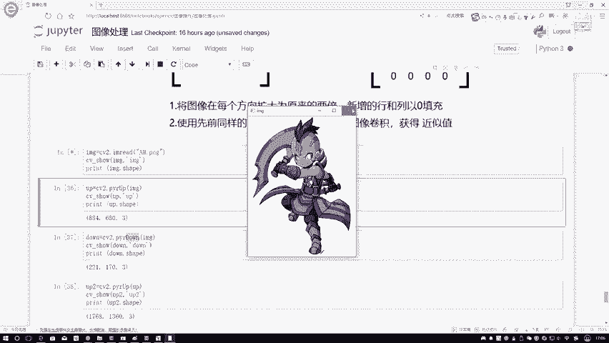

# 读取图像
img = cv2.imread('antimage.jpg')
# 展示图像
cv2.imshow('Original Image', img)
cv2.waitKey(0)
cv2.destroyAllWindows()
```

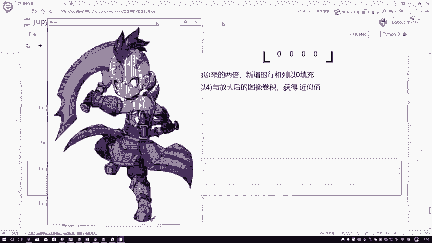

执行上述代码后，我们可以看到原始图像。这是一张“敌法师”的游戏角色图片。接着，我们打印图像的形状值，以了解其尺寸信息。

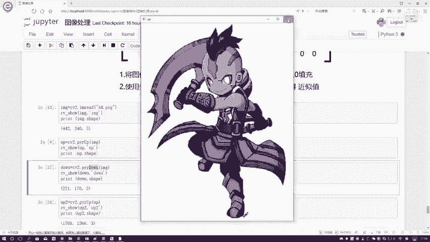

```python
print(img.shape)
```

输出结果为 `(442, 340, 3)`。前两个数字代表图像的高度和宽度（像素），第三个数字代表颜色通道数（RGB三通道）。

## 高斯金字塔：上采样与下采样

上一节我们介绍了如何读取图像，本节中我们来看看如何对图像进行缩放操作，即上采样和下采样，这构成了高斯金字塔的基础。

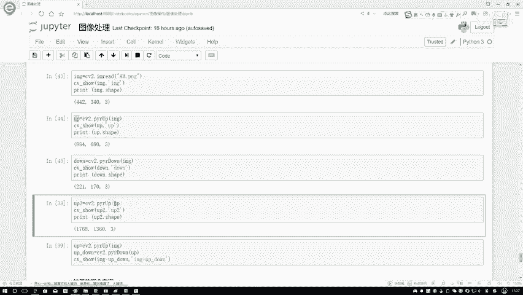

在OpenCV中，我们可以使用 `pyrUp` 函数进行上采样（放大图像），使用 `pyrDown` 函数进行下采样（缩小图像）。函数名中的 `pyr` 是金字塔（pyramid）的缩写。

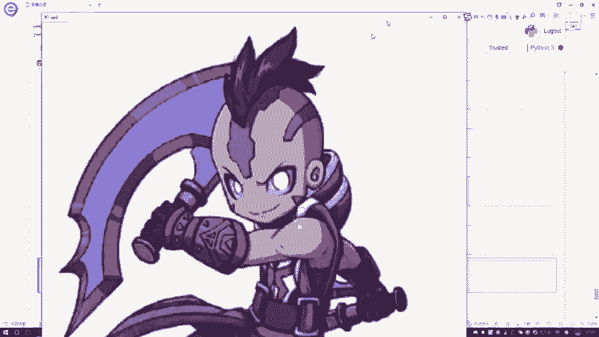

以下是执行上采样的方法。

```python
# 上采样
up_img = cv2.pyrUp(img)
cv2.imshow('Upsampled Image', up_img)
cv2.waitKey(0)
print(up_img.shape)
```

执行上采样后，图像尺寸会变为原来的两倍，打印出的形状值应为 `(884, 680, 3)`。从视觉上看，图像变大了，但清晰度会有所下降。

以下是执行下采样的方法。

```python
# 下采样
down_img = cv2.pyrDown(img)
cv2.imshow('Downsampled Image', down_img)
cv2.waitKey(0)
print(down_img.shape)
```

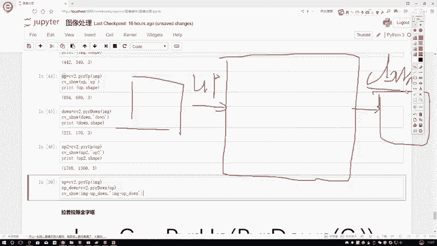

执行下采样后，图像尺寸会减半，打印出的形状值应为 `(221, 170, 3)`。图像变小，同时会损失部分细节信息。

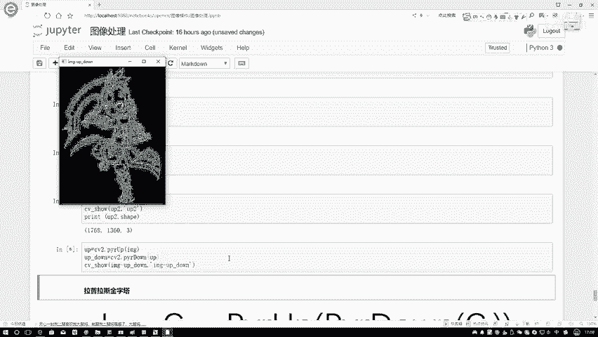

## 多次采样操作

我们不仅可以执行单次采样，还可以对采样结果进行连续操作。例如，对上采样的结果再次进行上采样。

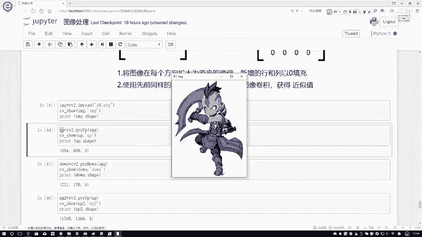

```python
# 连续两次上采样
up_img_once = cv2.pyrUp(img)
up_img_twice = cv2.pyrUp(up_img_once)
cv2.imshow('Twice Upsampled Image', up_img_twice)
cv2.waitKey(0)
print(up_img_twice.shape)
```

连续两次上采样后，图像尺寸变为原始的四倍。同样，下采样也可以连续进行。这种多尺度操作是构建图像金字塔的关键。

## 采样操作的信息损失

现在我们来思考一个问题：先对图像进行上采样，再对结果进行下采样，得到的图像会和原始图像完全一样吗？

答案是否定的。原因在于，上采样过程通常使用插值（如填充零值或平均）来生成新的像素，这会引入原图中不存在的信息。而下采样过程则会丢弃部分像素信息。因此，经过“上采样->下采样”这一过程后，图像会损失部分原始信息，导致清晰度下降。

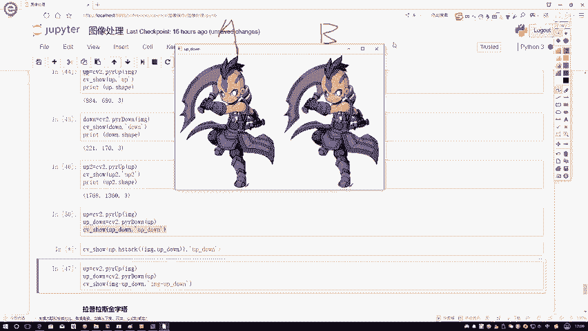

我们可以通过代码来验证这一点。

```python
# 先上采样，再下采样
up_then_down = cv2.pyrDown(cv2.pyrUp(img))

# 将原始图像与处理后的图像水平拼接对比
comparison = cv2.hconcat([img, up_then_down])
cv2.imshow('Original vs Up->Down', comparison)
cv2.waitKey(0)
cv2.destroyAllWindows()
```

在对比图中可以观察到，右侧经过“上采样->下采样”处理的图像，其边缘和细节会比左侧原始图像显得略微模糊。这直观地证明了两次采样过程带来的信息损失。

## 拉普拉斯金字塔

上一节我们探讨了高斯金字塔及信息损失，本节中我们来看看另一种金字塔——拉普拉斯金字塔。拉普拉斯金字塔用于保存图像在不同尺度下的细节信息，其每一层由高斯金字塔的某一层与其上一层的上采样结果之差构成。

拉普拉斯金字塔第 *i* 层的计算公式如下：

**LPᵢ = Gᵢ - PyrUp(Gᵢ₊₁)**

其中：
*   **LPᵢ** 是拉普拉斯金字塔的第 *i* 层。
*   **Gᵢ** 是高斯金字塔的第 *i* 层。
*   **Gᵢ₊₁** 是高斯金字塔的第 *i+1* 层（即 *Gᵢ* 下采样后的结果）。
*   **PyrUp(Gᵢ₊₁)** 表示对 *Gᵢ₊₁* 进行上采样，使其尺寸与 *Gᵢ* 相同。

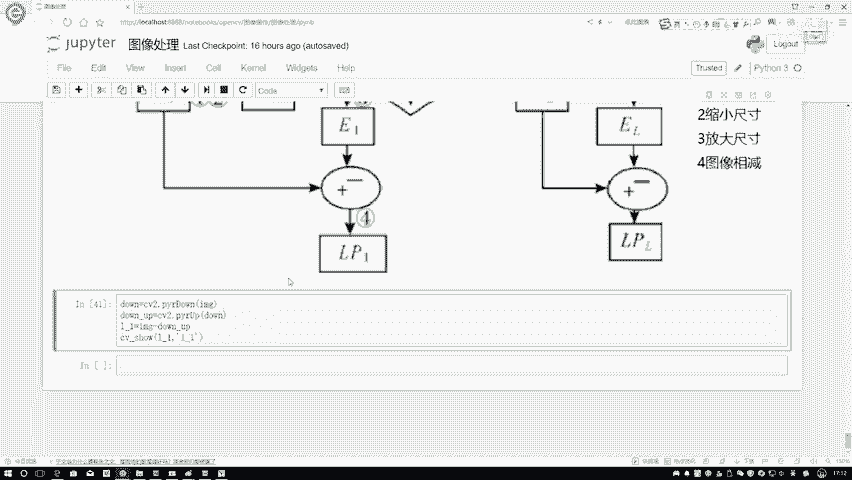

简单来说，拉普拉斯金字塔的每一层，记录的是高斯金字塔某一层与其经过“下采样再上采样”重建后的版本之间的差异，这个差异主要包含了图像的边缘和纹理等高频细节信息。

以下是计算拉普拉斯金字塔第一层的代码示例。

```python
# 生成高斯金字塔的下采样层（第一层）
gaussian_down = cv2.pyrDown(img)
# 对下采样结果进行上采样，使其尺寸与原始图像匹配
gaussian_up = cv2.pyrUp(gaussian_down)
# 计算拉普拉斯金字塔第一层：原始图像 - 上采样结果
laplacian_layer = cv2.subtract(img, gaussian_up)

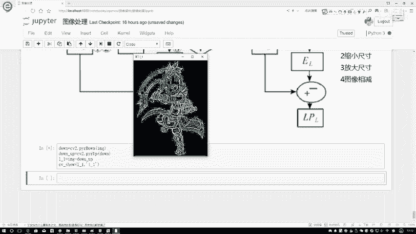

# 展示结果
cv2.imshow('Laplacian Pyramid Layer', laplacian_layer)
cv2.waitKey(0)
cv2.destroyAllWindows()
```

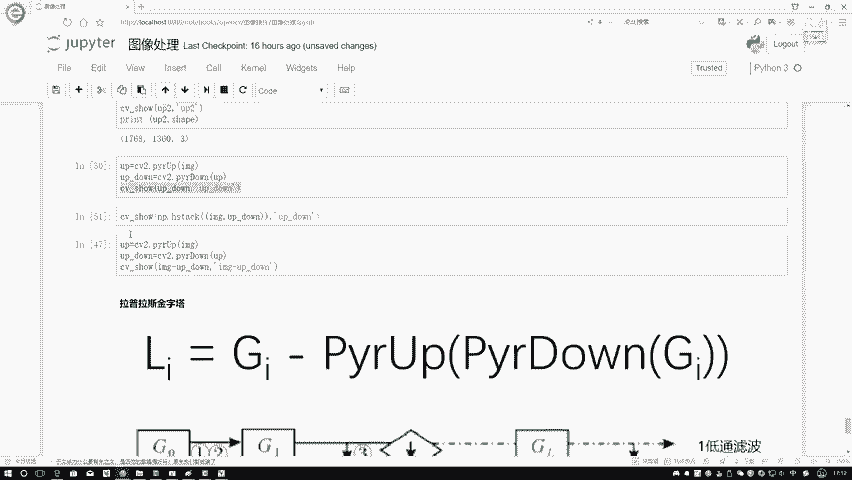

拉普拉斯金字塔的结果图像看起来像是原始图像的轮廓信息。通过组合拉普拉斯金字塔的不同层与高斯金字塔的顶层，可以无损地重建原始图像。在后续的实际案例中，我们可能会利用金字塔的不同层来抽取对任务有价值的特征信息。

## 总结

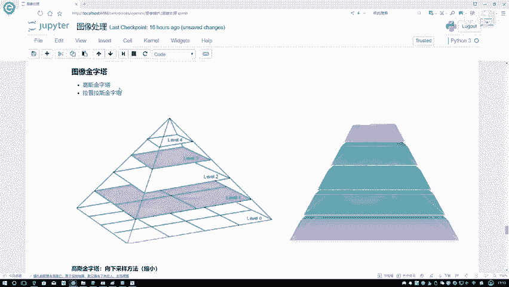

本节课中我们一起学习了OpenCV中的图像金字塔技术。我们首先介绍了如何读取和展示图像。然后，详细讲解了高斯金字塔的上采样（`pyrUp`）和下采样（`pyrDown`）操作，并通过实验观察了连续采样及“上采样->下采样”过程带来的信息损失。最后，我们探讨了拉普拉斯金字塔的原理与计算方法，它通过保存不同尺度下的细节差异，为图像的多尺度分析提供了有力工具。掌握这两种金字塔是进行图像缩放、融合及高级特征提取的基础。