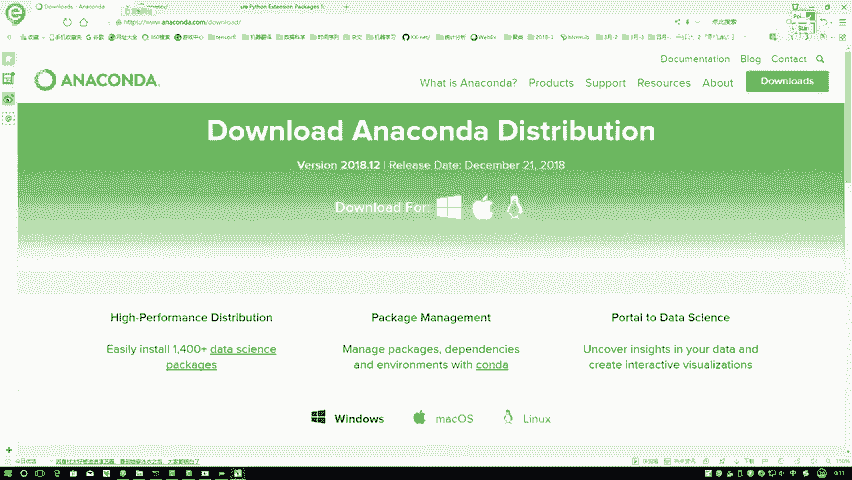
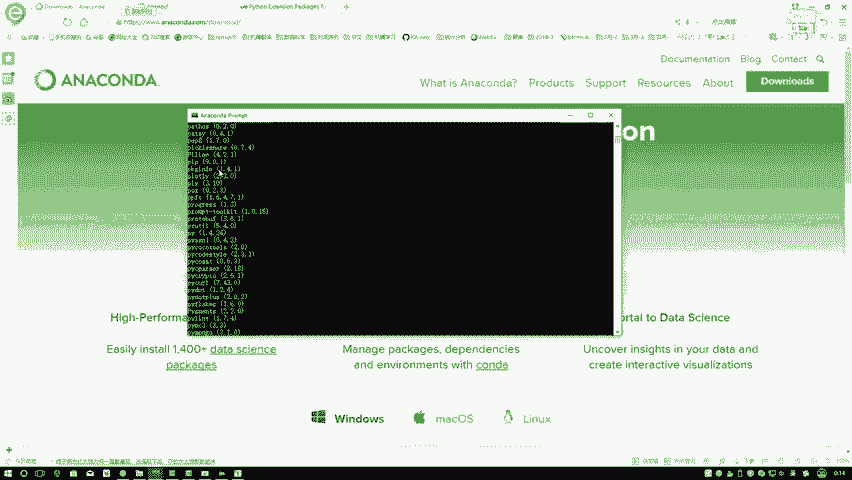
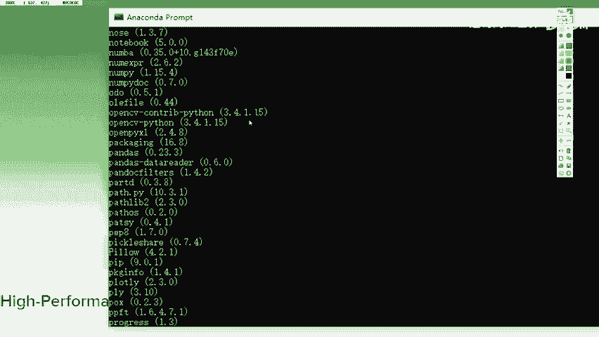
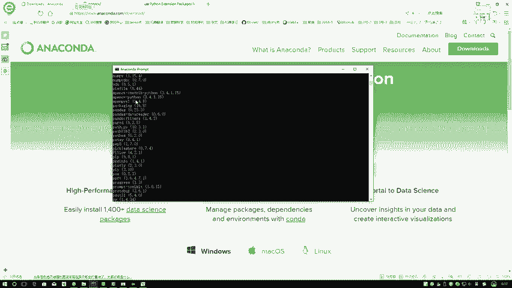
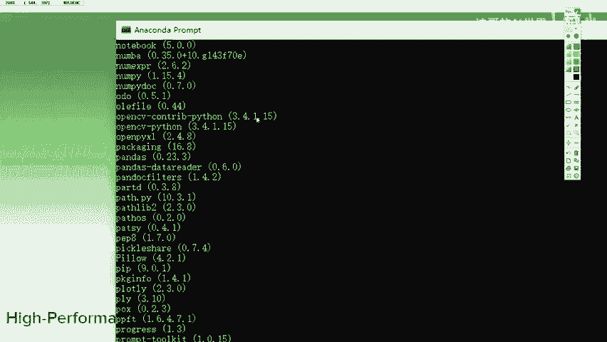
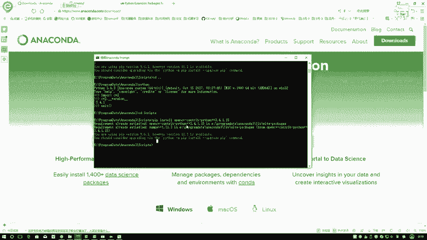

# 课程P2：Python与OpenCV环境配置安装 🛠️

在本节课中，我们将学习如何配置和安装本系列课程所需的Python与OpenCV开发环境。整个过程将分为几个清晰的步骤，确保即使是初学者也能顺利完成。

---

## 概述

本教程的核心目标是指导你完成Python环境的搭建，并安装OpenCV库。我们将使用Anaconda这一集成工具来简化安装过程，并详细说明如何通过命令行安装指定版本的OpenCV。

---

## 第一步：安装Python环境

首先，你需要安装Python。如果你已经安装过Python，可以直接使用现有环境。对于新用户，我们推荐使用Anaconda进行配置。

Anaconda是一个集成了Python、常用工具包和开发环境的“全家桶”。它包含了课程中所需的大部分组件，例如包管理工具`pip`和代码编写环境`Jupyter Notebook`，省去了单独配置的麻烦。



以下是安装Anaconda的步骤：

1.  访问Anaconda官网。
2.  根据你的操作系统（如Windows、macOS或Linux）选择对应的安装程序。
3.  在版本选择中，请务必选择**Python 3.x版本**（例如3.7或3.8），不要选择已被淘汰的Python 2.7版本。
4.  根据你的系统架构（通常是64位）下载对应的安装程序。
5.  在Windows系统中，运行下载的`.exe`文件，按照提示（下一步、选择安装目录、继续安装）即可完成安装。安装过程会自动配置好环境变量。

安装完成后，你无需进行任何额外配置。

---

## 第二步：验证与使用Anaconda环境

安装好Anaconda后，你可以在开始菜单中找到名为“Anaconda”的文件夹。其中有两个主要工具我们会用到：

*   **Anaconda Prompt**：这是一个命令行工具，类似于Windows的CMD，但已配置好Anaconda环境。
*   **Jupyter Notebook**：一个基于网页的交互式代码编写环境。

首先，我们打开**Anaconda Prompt**。接下来，我们将在这个命令行环境中安装OpenCV。

在安装前，需要确认你的Python环境。如果你只安装了一个Python环境（即Anaconda），可以直接使用`pip`命令。如果你有多个Python环境，则需要确保命令在正确的环境中执行。

你可以通过以下命令检查当前环境已安装的包：

```bash
pip list
```



执行该命令会列出所有已安装的Python包。你可以从中查找是否已存在`opencv-python`。



---

## 第三步：安装OpenCV

我们将使用`pip`命令来安装OpenCV，这是最简单的方法，无需下载源码进行复杂编译。

在课程中，我们使用OpenCV的特定版本 **3.4.1.15**。这是因为在3.4.2版本之后，一些特征提取算法因专利问题在开源版本中无法使用。为确保课程所有内容都能正常运行，建议安装此版本。

请在Anaconda Prompt中执行以下安装命令：

```bash
pip install opencv-python==3.4.1.15
```

这个命令会从网络下载OpenCV及其所有依赖包并自动安装。由于源服务器可能在国外，下载过程可能较慢，请耐心等待。

---

## 第四步：安装OpenCV扩展包

OpenCV从3.x版本开始，将部分额外功能（如某些特征提取算法）分离到了一个独立的扩展包中。为了使用完整功能，我们需要额外安装这个扩展包。

确保扩展包的版本号与核心包一致。在Anaconda Prompt中执行以下命令：

```bash
pip install opencv-contrib-python==3.4.1.15
```

---

## 第五步：验证安装

安装完成后，最好先在基础命令行环境中测试OpenCV是否能被正确导入，以排除IDE（集成开发环境）自身配置的问题。



在Anaconda Prompt中，输入Python进入交互模式，然后尝试导入OpenCV并查看版本：



```python
import cv2
print(cv2.__version__)
```

如果以上命令没有报错，并且打印出版本号 **3.4.1**，则说明OpenCV已成功安装并配置完毕。

---

## 总结



本节课中，我们一起完成了Python与OpenCV开发环境的搭建。我们首先通过安装Anaconda获得了完整的Python环境，然后使用`pip`命令分别安装了指定版本的`opencv-python`核心包和`opencv-contrib-python`扩展包，最后通过简单的导入测试验证了安装成功。现在，你的开发环境已经准备就绪，可以开始后续的OpenCV学习了。