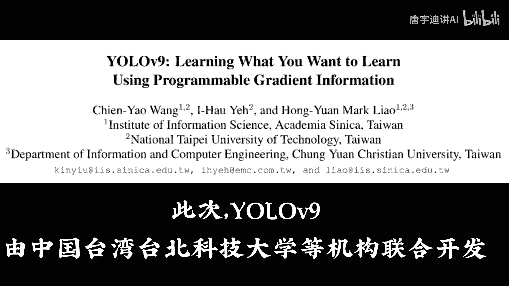
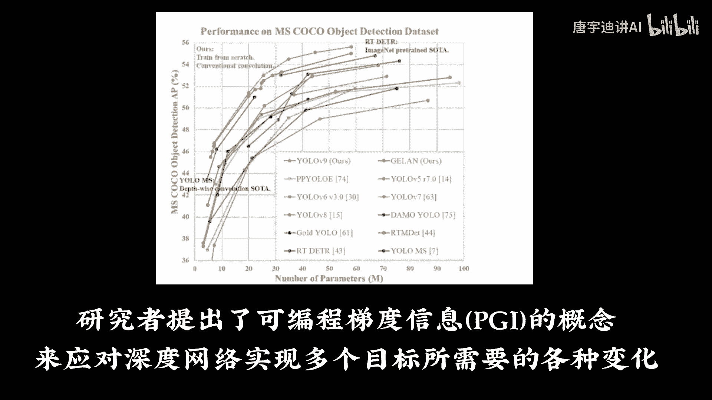
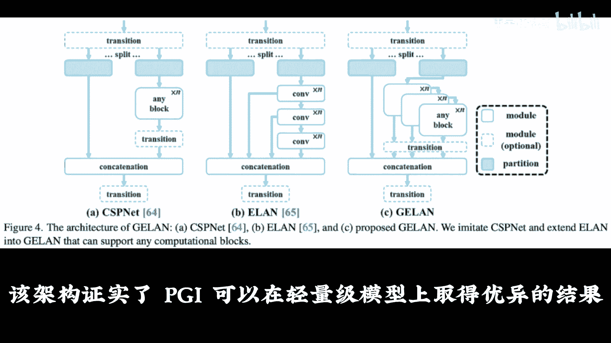
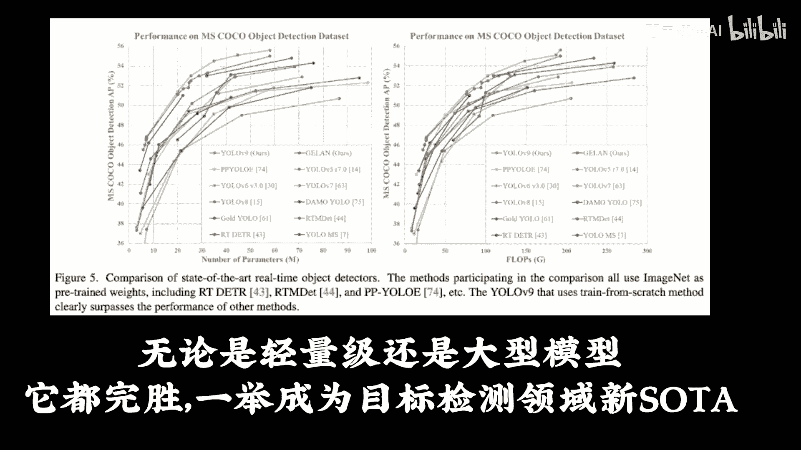
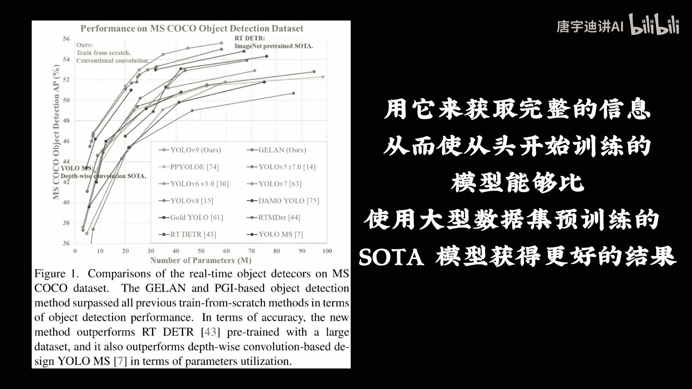
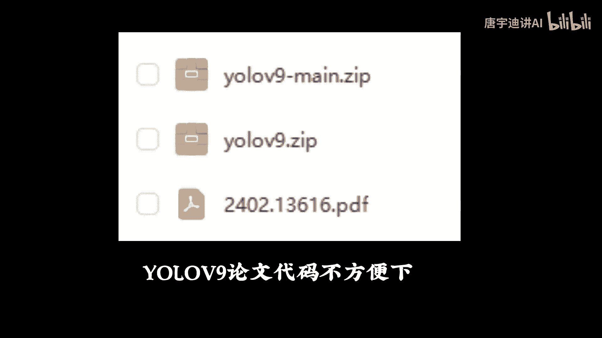
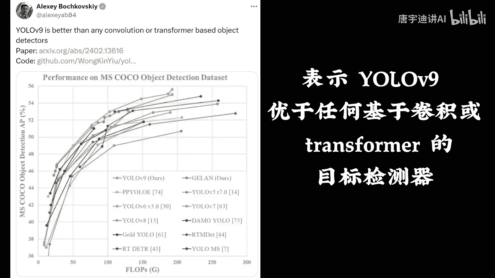
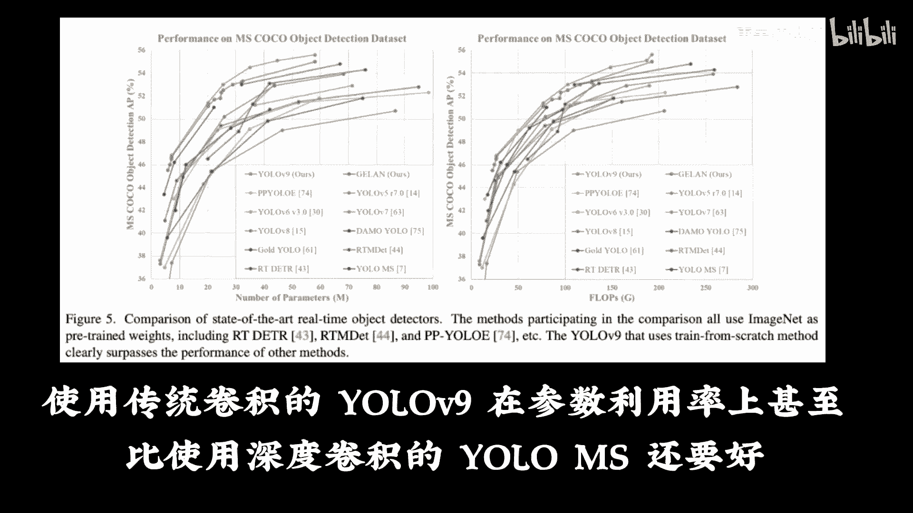
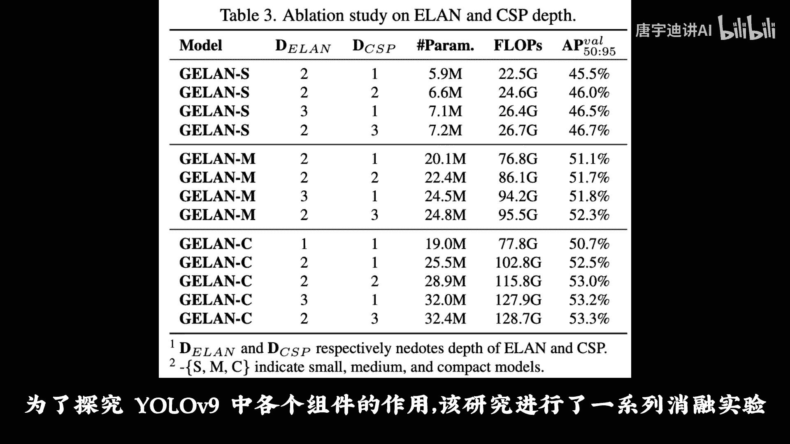
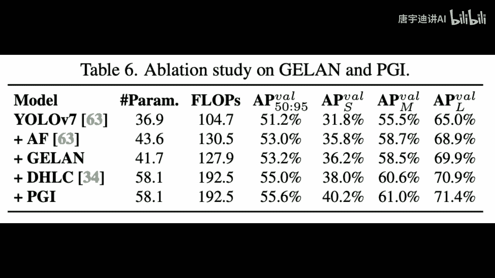

# 课程P2：YOLOv9详解 🚀

在本节课中，我们将学习目标检测领域的新星——YOLOv9。我们将了解其核心创新点、技术优势以及它如何超越前代模型。

距离YOLOv8发布仅一年，YOLOv9便已诞生。此次YOLOv9由中国台湾的台北科技大学等机构联合开发。

## 核心创新：可编程梯度信息（PGI）💡

上一节我们介绍了YOLOv9的诞生背景，本节中我们来看看其核心创新。研究者提出了**可编程梯度信息**的概念，以应对深度网络在实现多个目标时所需的各种变化。

该技术主打用可编程梯度信息来学习任何所需内容。此外，研究者基于梯度路径规划，设计了一种新的轻量级网络架构，即通用高效层聚合网络。

该架构证实了，PGI可以在轻量级模型上取得优异的结果。

## 性能表现：全面领先 🏆

了解了PGI的概念后，我们来看看YOLOv9的实际表现。无论是轻量级还是大型模型，YOLOv9都表现卓越，一举成为目标检测领域的新标杆。

与基于深度卷积开发的先进方法相比，YOLOv9仅使用传统卷积算子即可实现更好的参数利用率。

## PGI的广泛适用性与优势 🔧

PGI的适用性很强，可用于从轻型到大型的各种模型。它能够帮助模型获取更完整的信息。

从而使从头开始训练的模型，能够比使用大型数据集预训练的先进模型获得更好的结果。

## 资源与社区评价 📚

YOLOv9的论文和代码已由社区整理。此外，YOLOv8到YOLOv9的全套课件与代码也已共享。

对于新发布的YOLOv9，曾参与开发YOLOv7等的作者给予了高度评价，表示YOLOv9优于任何基于卷积或Transformer架构的目标检测器。

## 对比实验与组件分析 ⚖️

为了更深入了解，研究者将YOLOv9与其他从头开始训练的目标检测器进行了全面比较。

使用传统卷积的YOLOv9，在参数利用率上，甚至比使用深度卷积的YOLO-MS模型还要好。

为了探究YOLOv9中各个组件的作用，研究者进行了深入的消融实验分析。

---

本节课中我们一起学习了YOLOv9的核心创新——可编程梯度信息，了解了其卓越的性能表现和广泛的适用性，并查看了相关的资源与对比实验。YOLOv9通过其新颖的设计，在目标检测领域树立了新的标准。