# 课程P20：轮廓检测方法 🖼️


在本节课中，我们将要学习图像处理中的一个重要概念——轮廓检测。我们将了解轮廓与边缘的区别，并掌握使用OpenCV库进行轮廓检测的具体步骤和方法。

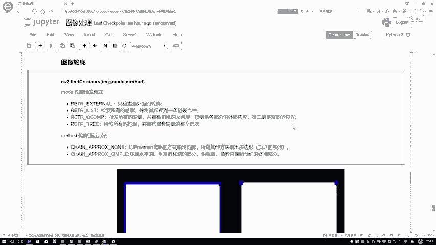

## 轮廓与边缘的区别

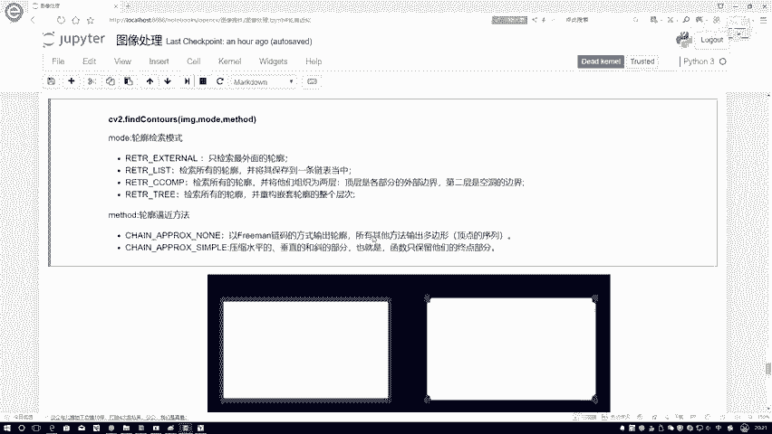

上一节我们介绍了图像处理的基础，本节中我们来看看轮廓检测。首先需要明确轮廓与边缘的区别。

边缘检测通常得到的是图像中梯度变化显著的点，这些点可能形成零零散散的线段。然而，从轮廓的定义出发，轮廓必须是一个**整体**，其各个部分需要连接在一起。因此，轮廓是连续的、完整的边界，而边缘可能是离散的、不完整的线段。

## 轮廓检测函数

了解了轮廓的概念后，我们来看看如何进行轮廓检测。OpenCV提供了一个核心函数来实现此功能。

该函数的基本调用格式如下：
```python
contours, hierarchy = cv2.findContours(image, mode, method)
```
该函数返回两个值：检测到的轮廓列表 `contours` 和轮廓之间的层次结构 `hierarchy`。

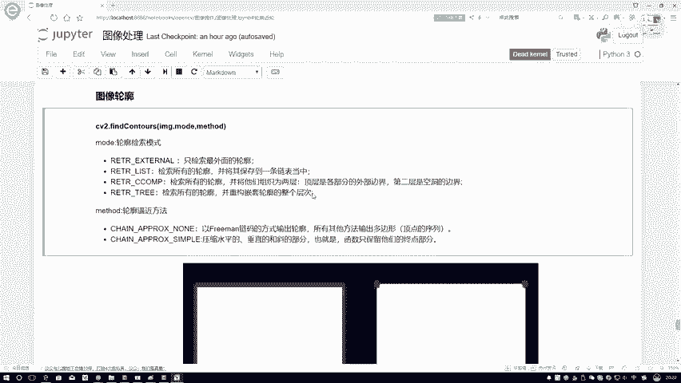

以下是该函数三个主要参数的解释：

*   **image**: 输入图像。需要注意的是，该函数要求输入图像必须是**二值图像**。
*   **mode**: 轮廓检索模式。它决定了函数如何检索和返回轮廓。
*   **method**: 轮廓逼近方法。它决定了如何存储轮廓上的点。

### 轮廓检索模式 (mode)

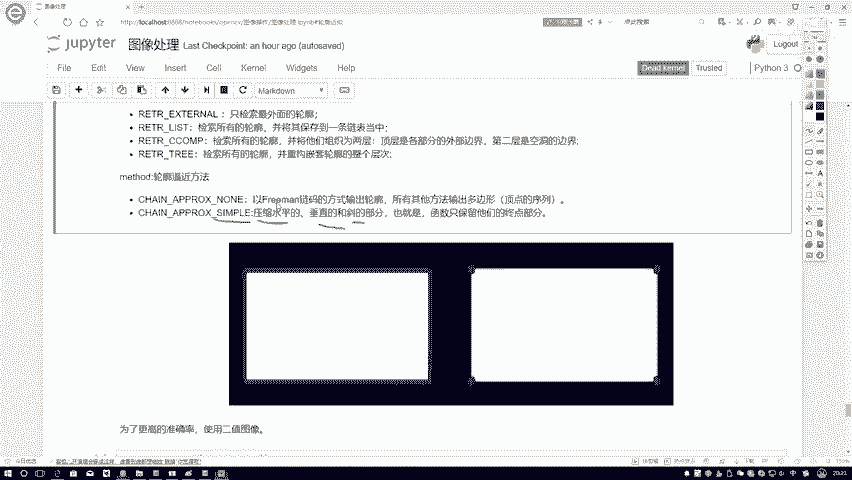

对于 `mode` 参数，有多个可选值，但最常用的是 `cv2.RETR_TREE`。该模式会检测图像中所有的轮廓，并建立一个完整的层次结构（嵌套关系）来保存它们。这样，无论你需要最外层的轮廓还是所有内部轮廓，都可以方便地获取。

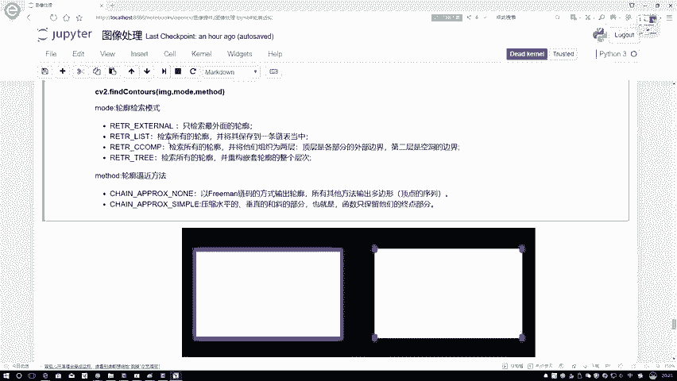

### 轮廓逼近方法 (method)

对于 `method` 参数，有两种最常用的方法。

*   **`cv2.CHAIN_APPROX_NONE`**: 存储轮廓上的**所有**点。例如，一个矩形的轮廓会存储四条边上的每一个像素点。
*   **`cv2.CHAIN_APPROX_SIMPLE`**: 对轮廓进行压缩，仅存储关键点。例如，一个矩形的轮廓经过压缩后，只会存储四个顶点。这种方法可以显著减少内存占用和计算负担。

## 轮廓检测步骤

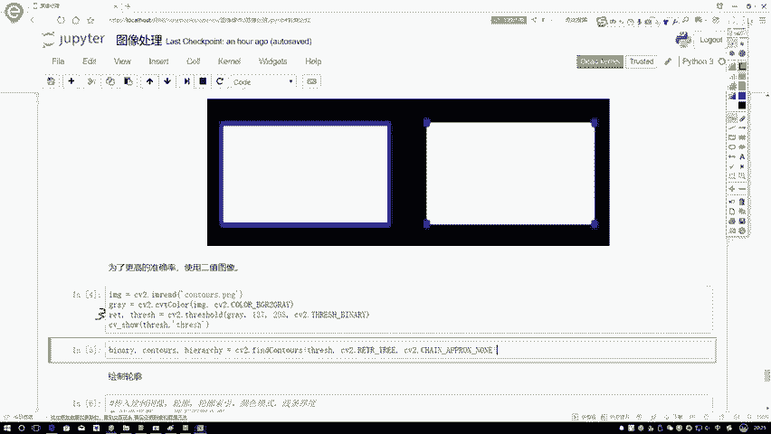

上一节我们介绍了检测函数，本节中我们来看看具体如何操作。轮廓检测不能直接应用于彩色或灰度图，需要遵循特定的预处理流程。

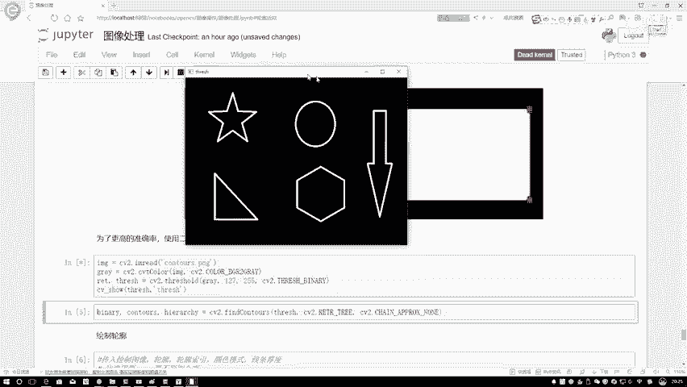

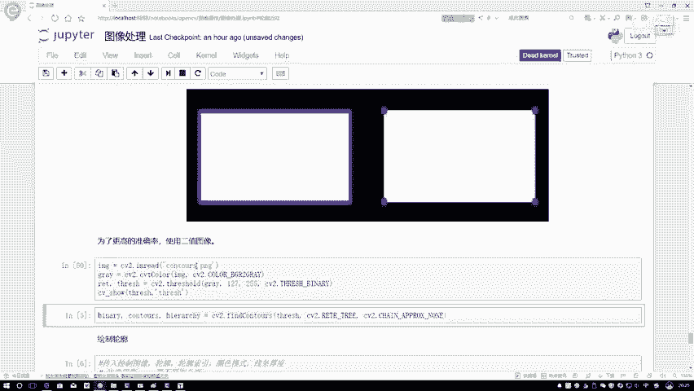

以下是进行轮廓检测的标准步骤：

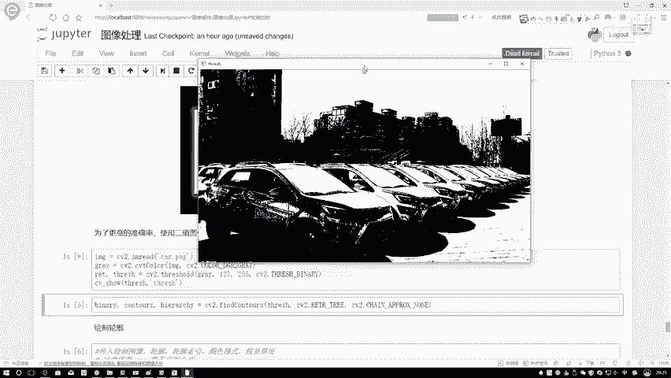

1.  **读取图像**：使用 `cv2.imread()` 函数加载原始图像。
2.  **转换为灰度图**：使用 `cv2.cvtColor()` 函数将彩色图像转换为灰度图像，这是图像处理的常见第一步。
3.  **图像二值化**：使用 `cv2.threshold()` 函数将灰度图转换为二值图像（只有黑色0和白色255）。这是轮廓检测的关键前提，因为 `cv2.findContours()` 函数只在二值图像上工作。
4.  **执行轮廓检测**：在得到的二值图像上调用 `cv2.findContours()` 函数，获取轮廓信息。

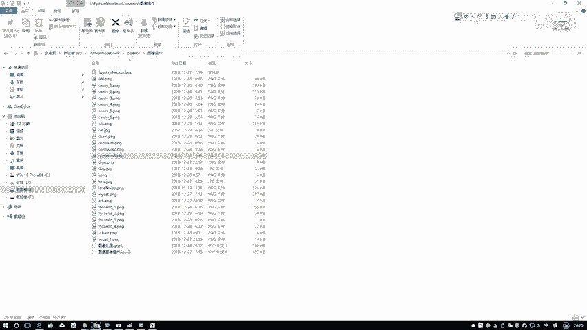

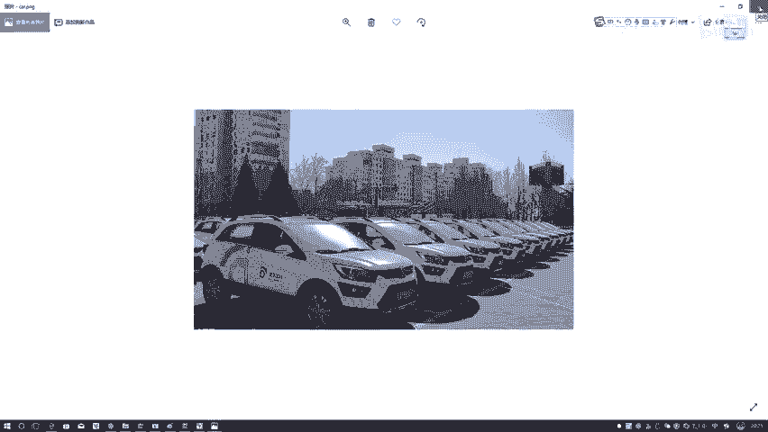

### 步骤演示

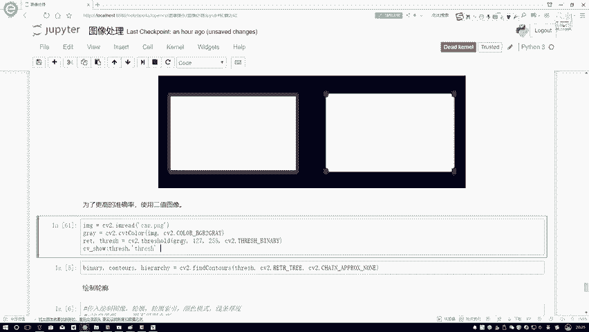

我们以一张汽车图片为例进行说明。

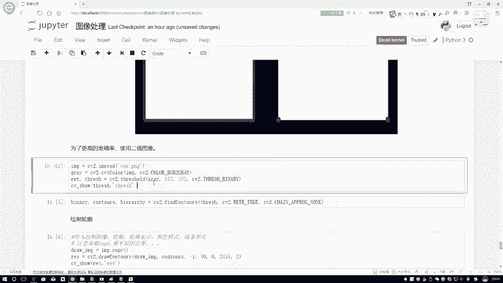

*   **原始图像**：一张彩色的汽车图片。
*   **灰度图像**：将彩色图转换为灰度图。
*   **二值图像**：对灰度图应用阈值处理（例如，大于127的设为255白色，小于等于127的设为0黑色），得到黑白分明的二值图。
*   **检测轮廓**：最后，将这张二值图输入到 `cv2.findContours()` 函数中，即可得到汽车的所有轮廓。

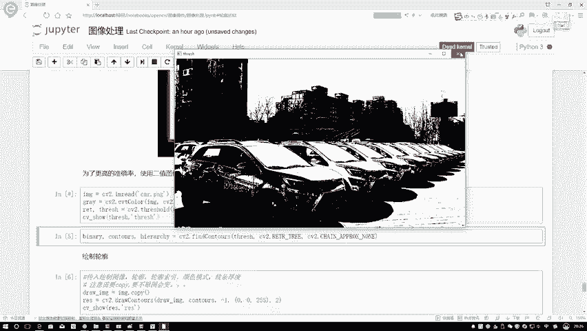

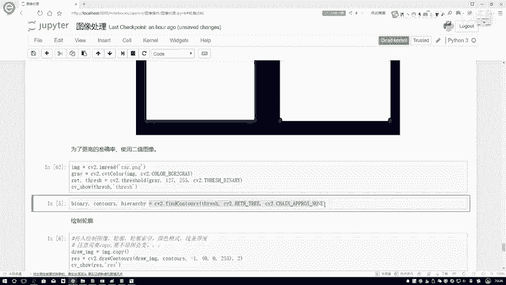

## 总结

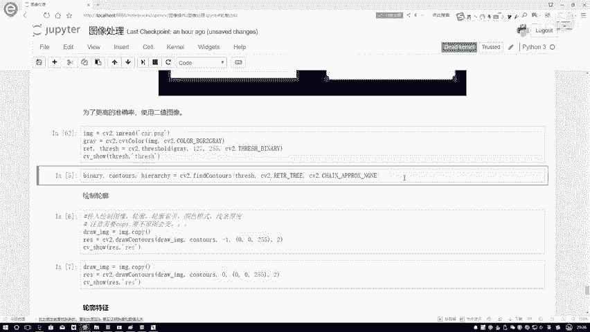

本节课中我们一起学习了图像轮廓检测的核心知识。我们首先区分了**轮廓**（连续整体）与**边缘**（离散线段）的概念。然后，重点介绍了OpenCV中 `cv2.findContours()` 函数的使用，包括其参数含义，特别是 `mode`（检索模式）和 `method`（逼近方法）的选择。最后，我们明确了轮廓检测的标准流程：**读取图像 -> 转灰度图 -> 二值化 -> 检测轮廓**。掌握这些步骤是进行后续轮廓分析（如绘制、计算面积周长等）的基础。