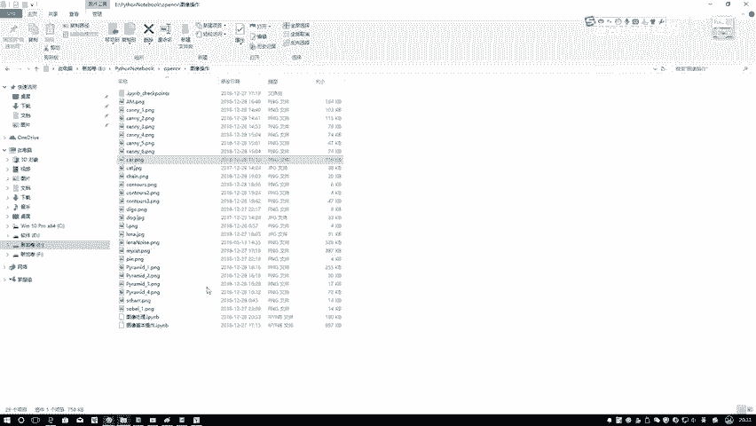
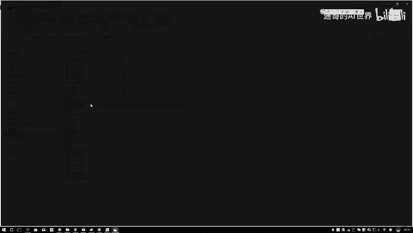
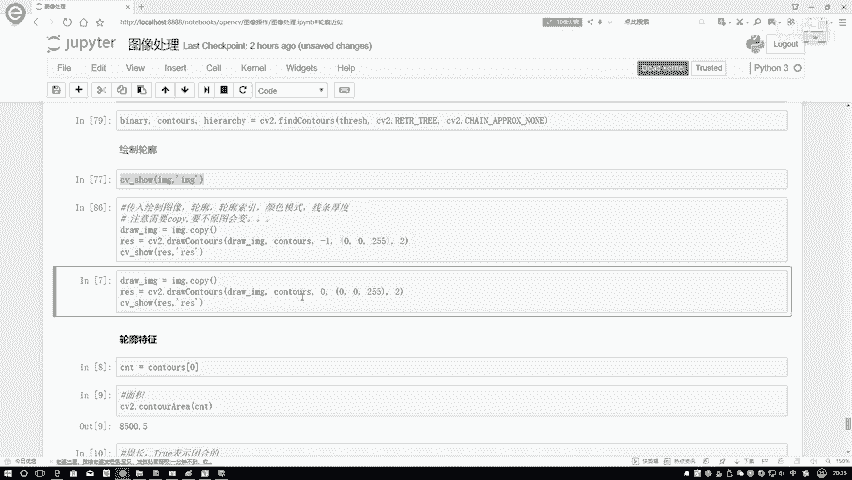

# 课程P21：轮廓检测结果详解 🎯

在本节课中，我们将学习如何使用OpenCV的`findContours`函数检测图像中的轮廓，以及如何将检测到的轮廓绘制在图像上。我们将详细讲解函数的参数、返回值，并重点解决一个常见的绘图陷阱。

## 概述

上一节我们介绍了图像二值化的预处理步骤。本节中，我们来看看如何对处理后的二值图像进行轮廓检测，并正确地将轮廓可视化。

## 轮廓检测操作

以下是执行轮廓检测的核心代码步骤。首先，我们需要调用`cv2.findContours`函数。

```python
contours, hierarchy = cv2.findContours(binary_image, cv2.RETR_TREE, cv2.CHAIN_APPROX_SIMPLE)
```

该函数接收几个关键参数：
*   **binary_image**: 经过二值化处理后的图像。
*   **cv2.RETR_TREE**: 轮廓检索模式。此模式会检测所有轮廓并重建完整的嵌套层次结构。
*   **cv2.CHAIN_APPROX_SIMPLE**: 轮廓近似方法。此方法压缩水平、垂直和对角线段，仅保留其端点，从而节省内存。

执行这行代码后，函数会返回两个值：
1.  **contours**: 一个Python列表，其中包含了图像中所有轮廓的信息。每个轮廓本身又是一个由点构成的数组。
2.  **hierarchy**: 一个包含轮廓之间层级关系（如父子关系）的数组。本节课我们暂时不深入讨论这个参数。

## 绘制检测到的轮廓

检测到轮廓后，我们需要将其绘制出来以观察效果。我们将使用`cv2.drawContours`函数。

在绘制轮廓前，有一个非常重要的步骤。`drawContours`函数会直接在传入的原图上进行修改。为了避免污染原始图像数据，我们需要先创建原图的一个副本。

```python
# 创建原图的副本，用于绘制轮廓
image_copy = original_image.copy()
```

如果不进行复制，原始图像会在每次绘制轮廓时被改变，这会影响后续的任何操作或分析。

以下是绘制轮廓的完整代码：

```python
# 在图像副本上绘制所有轮廓
result = cv2.drawContours(image_copy, contours, -1, (0, 0, 255), 2)
```

`cv2.drawContours`函数的参数含义如下：
*   **image_copy**: 要在其上绘制的图像（我们使用副本）。
*   **contours**: 之前检测到的轮廓列表。
*   **-1**: 要绘制的轮廓索引。-1 表示绘制列表中的所有轮廓。
*   **(0, 0, 255)**: 轮廓的颜色，使用BGR格式。此处(0,0,255)代表红色。
*   **2**: 轮廓线条的宽度（以像素为单位）。

## 参数效果演示





为了更好地理解参数的作用，我们可以进行一些调整。

以下是`drawContours`函数中`contourIdx`参数（第三个参数）的演示：
*   设置为 **-1 或 1** 时，会绘制`contours`列表中的所有轮廓。
*   设置为 **0** 时，只绘制列表中的第一个轮廓（索引为0）。
*   设置为 **1** 时，只绘制列表中的第二个轮廓（索引为1），依此类推。

以下是线条宽度参数（最后一个参数）的演示：
*   将线条宽度从 **2** 改为 **5**，轮廓线会明显变粗。
*   注意：如果线条宽度设置过大，相邻的轮廓（尤其是嵌套轮廓）可能会在视觉上融合在一起，难以区分。

## 总结



本节课中我们一起学习了OpenCV轮廓检测的核心流程。我们首先使用`findContours`函数从二值图像中提取轮廓信息，然后重点强调了在调用`drawContours`绘制轮廓前，必须创建原图副本以避免数据被意外修改。最后，我们探讨了如何通过调整绘制函数的参数来控制显示哪些轮廓以及轮廓的外观。掌握这些步骤是进行物体识别、形状分析等高级计算机视觉任务的基础。