# 课程P24：模板匹配效果展示与多对象匹配 🎯

在本节课中，我们将学习OpenCV中模板匹配的六种不同方法，并比较它们的结果差异。同时，我们还将探讨如何从图像中匹配多个对象，而不仅仅是单个最佳匹配。

---

## 模板匹配方法差异对比

上一节我们介绍了模板匹配的基本原理，本节中我们来看看不同匹配方法得到的结果有何不同。

在代码中，我们使用 `cv2.matchTemplate` 函数，传入图像模板和指定的匹配方法（`method`）。

```python
result = cv2.matchTemplate(img, template, method)
```

关于 `method` 参数，需要注意以下几点：
*   可以传入一个数值（如 `0`、`1`），也可以传入 `cv2.` 开头的常量（如 `cv2.TM_CCOEFF`）。
*   不能传入字符串形式（例如 `"TM_CCOEFF"`），否则会报错。

为了判断匹配结果的最佳位置，我们根据方法类型进行判断：
*   如果方法是寻找最小值（如 `cv2.TM_SQDIFF`），则取结果中的最小值位置。
*   如果方法是寻找最大值（如 `cv2.TM_CCOEFF`），则取结果中的最大值位置。

这涉及到 `cv2.minMaxLoc` 函数返回的 `min_loc` 和 `max_loc`。

```python
min_val, max_val, min_loc, max_loc = cv2.minMaxLoc(result)
```

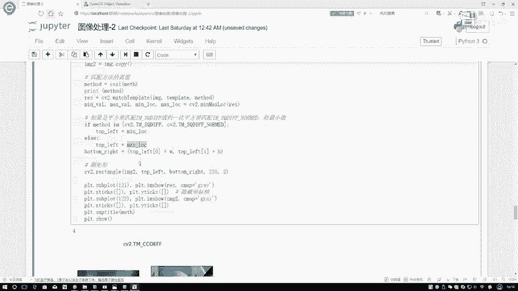

匹配任务类似于检测任务，我们需要将最佳匹配位置用矩形框标注出来。我们已经通过模板的宽高（`w, h`）和最佳位置坐标确定了矩形框。

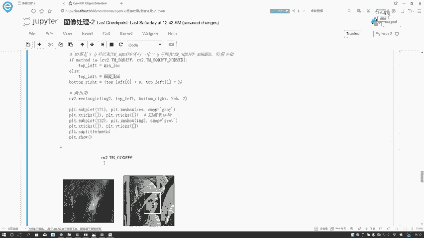

以下是绘制矩形的代码：
```python
cv2.rectangle(img, top_left, bottom_right, color, thickness)
```

`result` 矩阵是根据不同方法计算出的每个滑动窗口的匹配结果值。对于某些方法（如相关系数法），最亮的位置就代表最接近模板的区域。

下面展示了不同匹配方法的效果对比图：

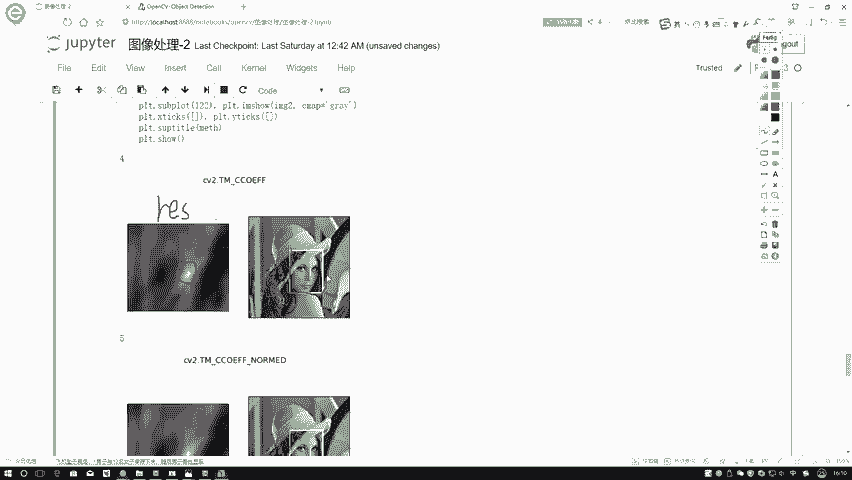


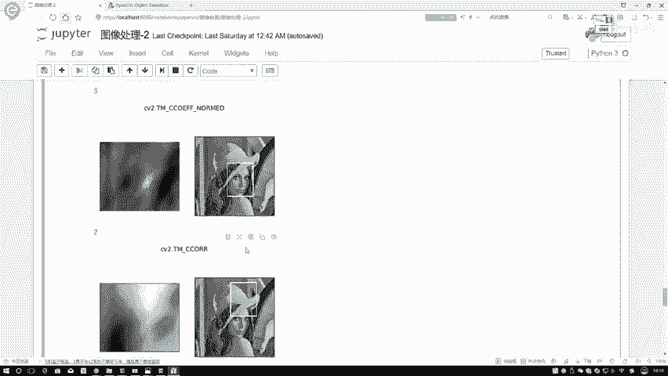


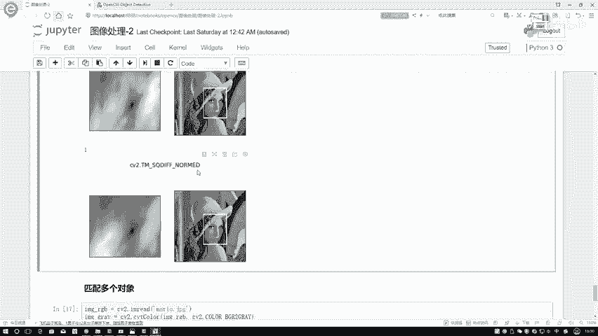


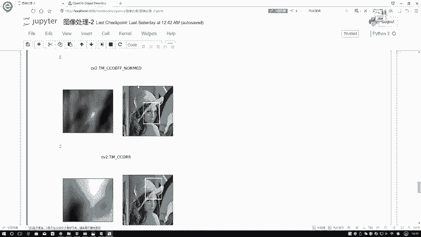

观察发现，只要方法名称中带有“归一化”（`_NORMED`）后缀的，匹配结果通常更稳定、更准确。

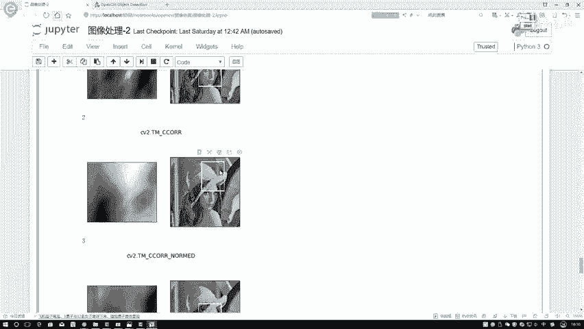


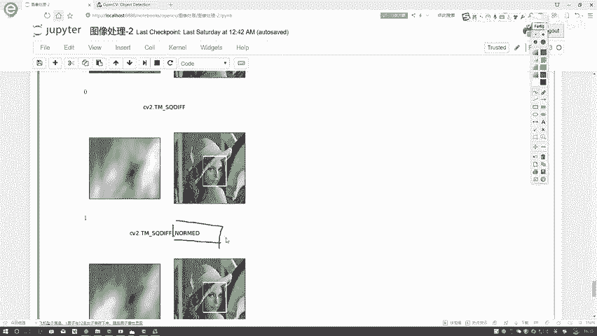


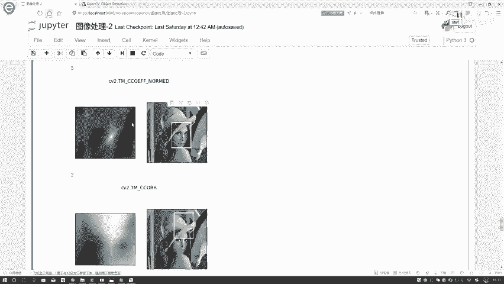

因此，建议在实际使用中优先选择归一化的方法。

---

## 多对象模板匹配 🎮

我们已经学会了如何匹配单个最佳对象。但新的问题来了：如果图像中有多个相似对象（例如，一张图中有两张人脸），而我们有一个模板，如何找到所有匹配的位置，而不是仅仅一个？

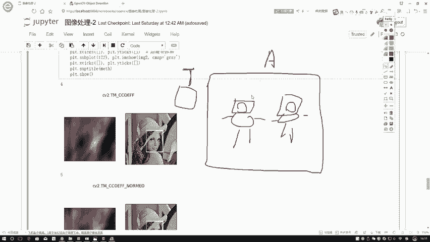


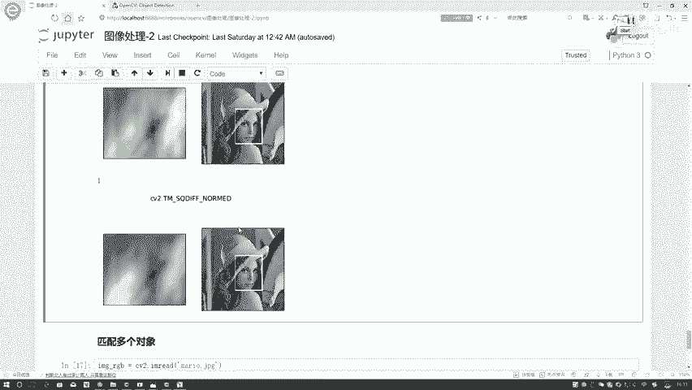

这就需要用到多对象模板匹配。其核心思想是：不再只取一个最小值或最大值，而是自己设定一个阈值，找出所有符合该阈值的匹配位置。

以下是实现多对象匹配的关键步骤：

首先，读取图像并转换为灰度图，这与单对象匹配的第一步相同。

```python
img = cv2.imread('image.jpg')
img_gray = cv2.cvtColor(img, cv2.COLOR_BGR2GRAY)
```

然后，进行模板匹配，得到结果矩阵 `result`。

接着，设定一个阈值。例如，使用相关系数法（`cv2.TM_CCOEFF_NORMED`）时，值越接近1表示匹配度越高。我们可以设定阈值为 `0.8`。

```python
threshold = 0.8
```

使用 `np.where` 函数在 `result` 矩阵中找出所有匹配度大于该阈值的位置。

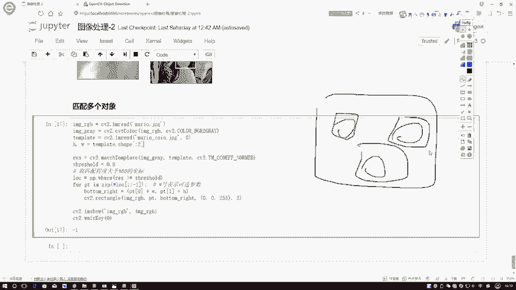

```python
locations = np.where(result >= threshold)
```

最后，遍历这些找到的所有位置，并在每个位置绘制矩形框。

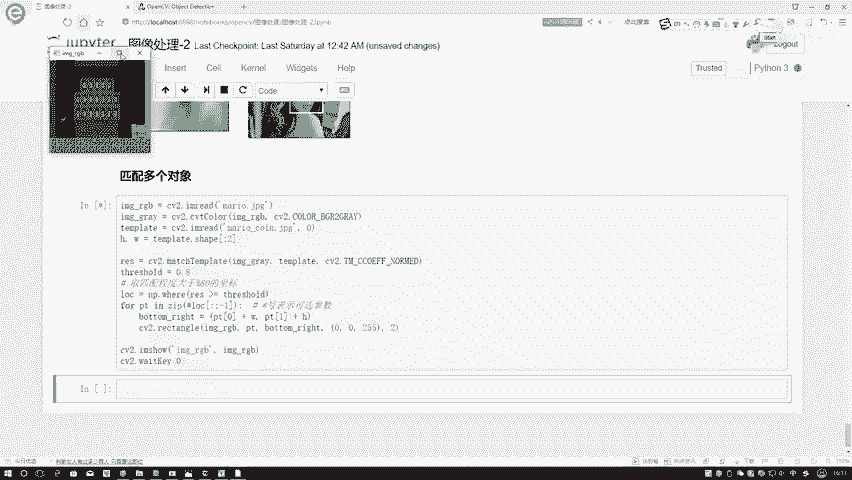

```python
for pt in zip(*locations[::-1]):
    cv2.rectangle(img, pt, (pt[0] + w, pt[1] + h), (0, 0, 255), 2)
```

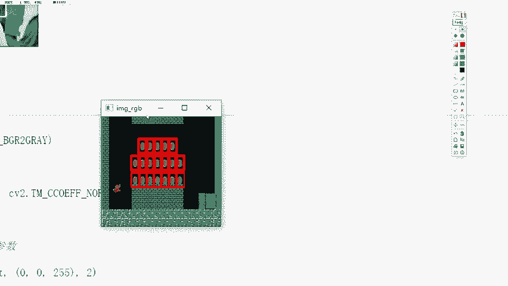

让我们看一个具体例子。我们的模板是一个金币：

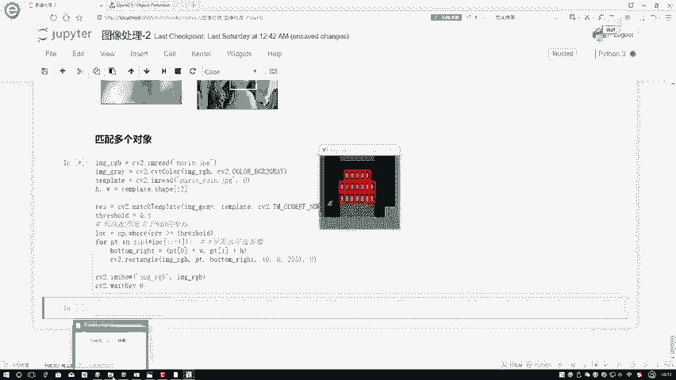


输入图像是《超级玛丽》的游戏画面，其中包含多个金币：

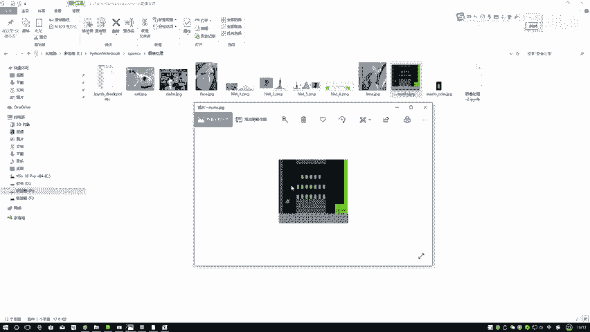


应用多对象匹配后，我们可以将所有的金币都框选出来：

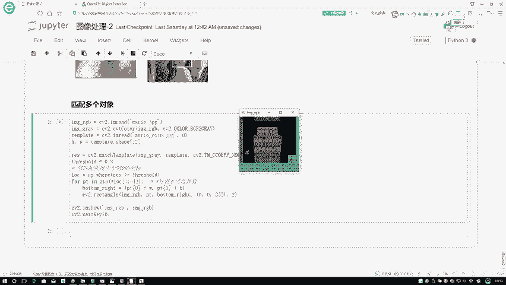


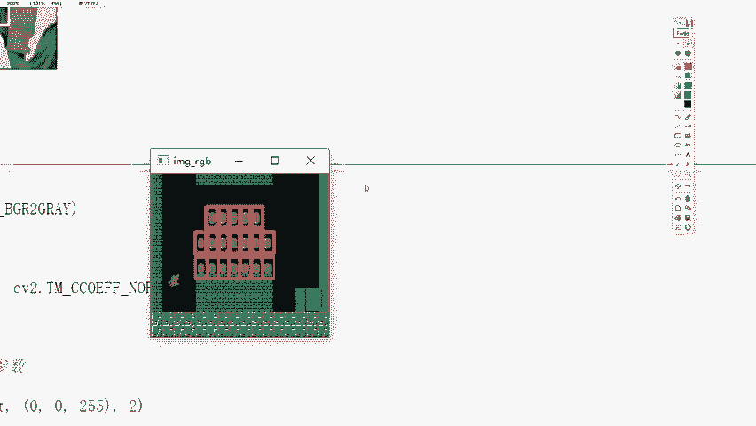


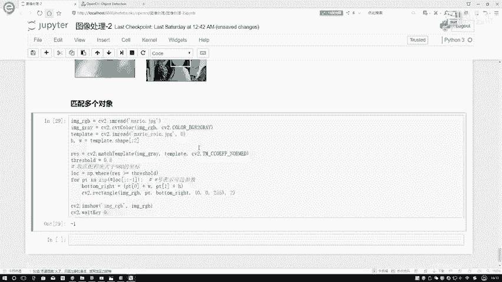

---


## 课程总结 📝

本节课中我们一起学习了OpenCV模板匹配的进阶应用。

我们首先对比了六种不同匹配方法的效果，了解到归一化方法（如 `TM_CCOEFF_NORMED`）通常能提供更稳定的结果。其原理是从图像左上角开始滑动窗口，计算模板与图像局部区域的差异程度。

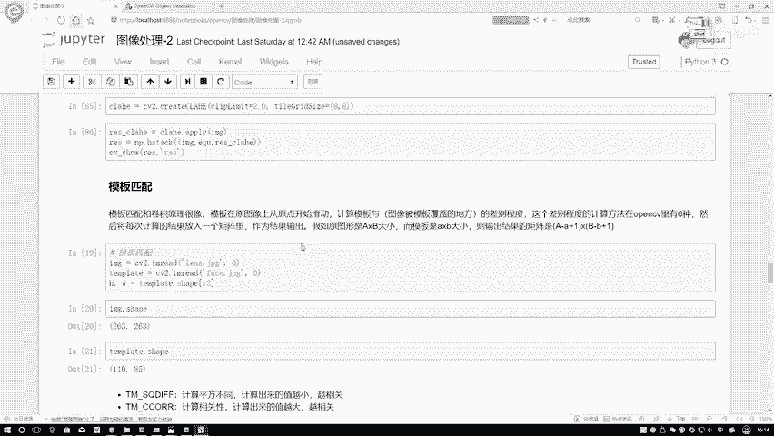

`cv2.matchTemplate` 函数返回一个结果矩阵，我们可以通过 `cv2.minMaxLoc` 找到单个最佳匹配位置（`min_loc` 或 `max_loc`）。

当需要匹配图像中出现的多个相似对象时，我们可以通过**自行设定阈值**，并使用 `np.where` 来找出所有满足条件的匹配位置，从而实现多对象模板匹配。

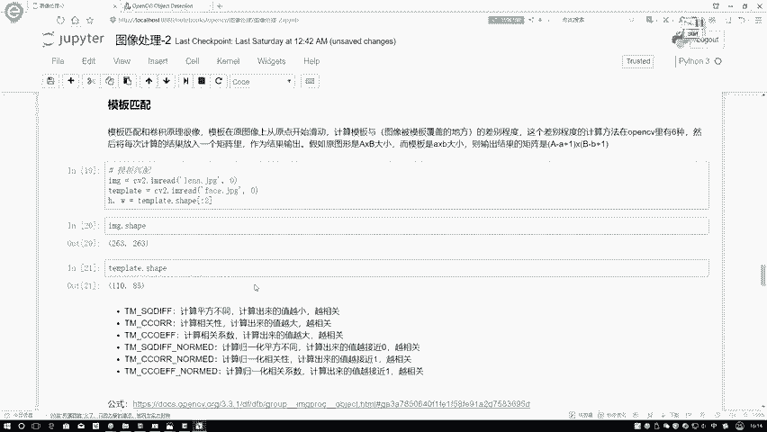

这就是OpenCV中模板匹配从单对象到多对象的核心操作方法。