# 图像处理基础课程 P25：直方图定义 📊

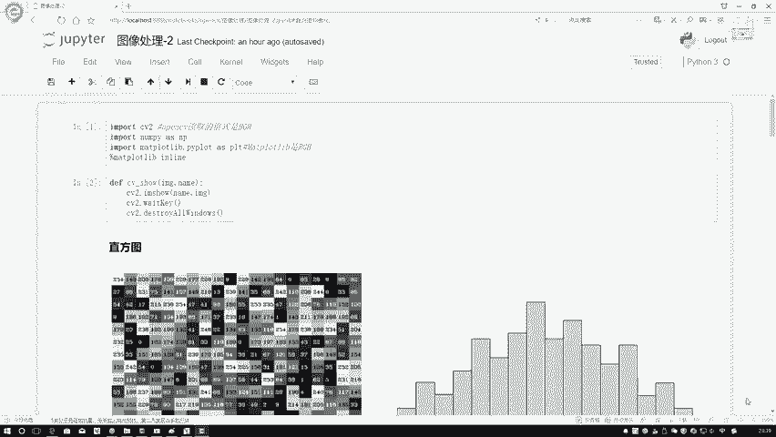

在本节课中，我们将要学习图像处理中的一个核心概念——直方图。我们将了解直方图的定义、如何在OpenCV中计算直方图，并初步探索其应用场景。

## 什么是直方图？ 📈

直方图是一种统计图表。当我们第一次听到“直方图”时，可能会联想到统计数值。然而，我们现在处理的对象是图像。我们需要将图像分解为像素点，统计的对象就是这些像素点。


上图左侧的A图展示了一张灰度图像及其像素点。右侧则是对应的直方图。那么，直方图与像素点之间是如何联系的呢？

例如，图中有一个像素值为109的点。这个值并非唯一，图像中其他位置也可能存在值为109的像素点。图中就有两个值为120的像素点。由于像素值范围是0到255，总共256个值，因此相同的像素值在图像中会重复出现。

我们要统计的是：在图像中，每个像素值（或称为灰度级）出现的次数。

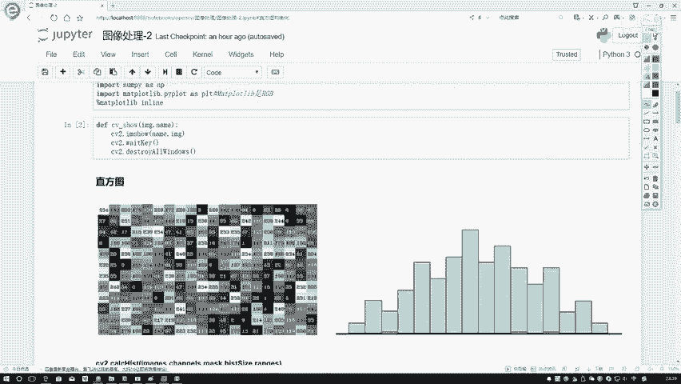


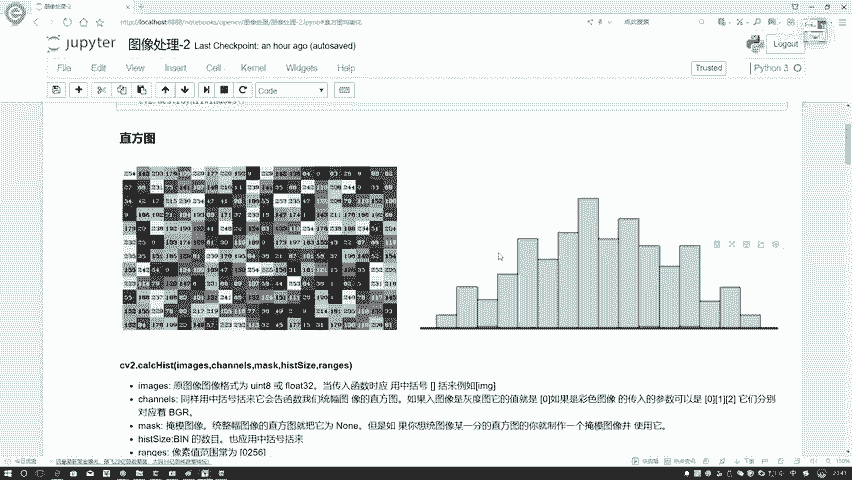

直方图的横坐标通常是像素值，从0到255。纵坐标则是对应像素值在图像中出现的个数。这样，我们就得到了一个描述图像像素值分布的直方图。

## 如何在OpenCV中计算直方图？ 🛠️

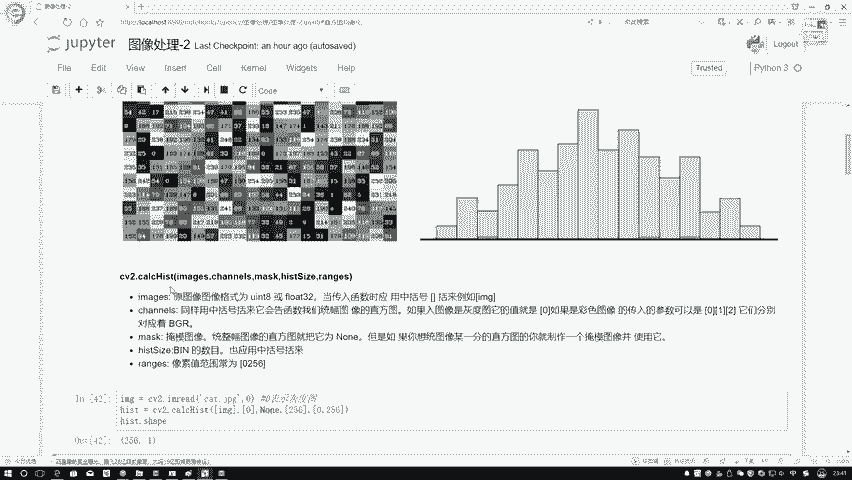

上一节我们介绍了直方图的基本概念，本节中我们来看看如何在OpenCV中具体计算它。

OpenCV提供了一个专门计算直方图的函数：`cv2.calcHist`。


以下是该函数主要参数的解释：

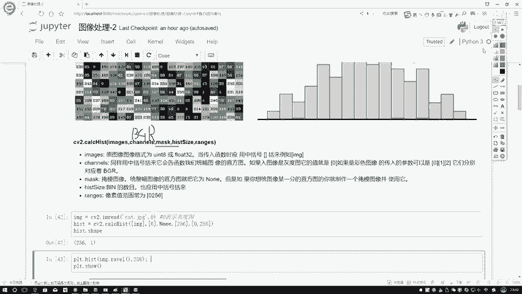

*   **images**：输入图像。通常我们输入灰度图像。
*   **channels**：指定要统计的通道索引。对于BGR彩色图像，可以用0、1、2分别表示B、G、R通道。
*   **mask**：掩码。用于指定只统计图像的某一部分区域。如果不使用，则统计整张图像。
*   **histSize**：直方图的柱子（bins）数量。例如，设置为256表示统计0到255每个值的出现次数。也可以分组，如设置为[10]，则表示将0-255分成10组进行统计。
*   **ranges**：像素值的取值范围。对于8位灰度图，通常是[0, 256]。

对于后两个参数，如果我们希望得到每个像素值的精确统计，通常固定设置为 `histSize=[256]`, `ranges=[0, 256]`。


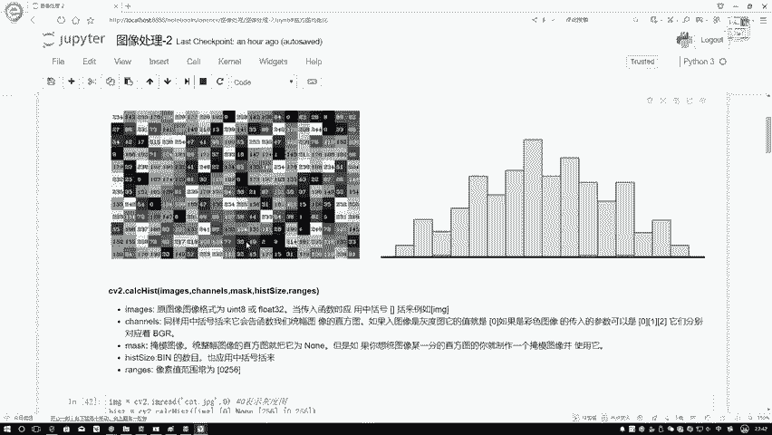

## 动手实践：计算并绘制直方图 🎨

现在，让我们通过代码来实际计算一张图像的直方图。

首先，读取一张图像。这里我们读取一张小猫的图像并将其转换为灰度图。

```python
import cv2
img = cv2.imread('cat.jpg', 0) # 参数0表示以灰度模式读取
```

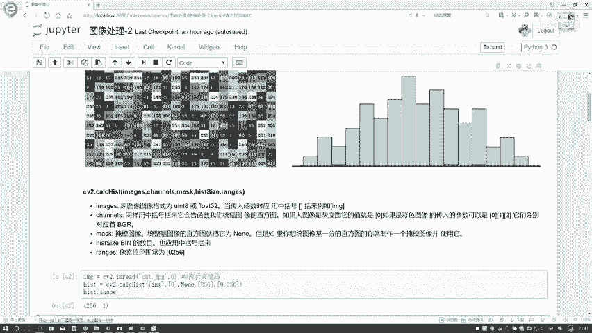

接下来，使用 `cv2.calcHist` 函数计算直方图。**需要注意**，`images` 参数需要放在中括号 `[]` 内传入。

```python
hist = cv2.calcHist([img], [0], None, [256], [0, 256])
print(hist.shape) # 输出类似 (256, 1)，表示有256个值，每个值对应一个计数
```

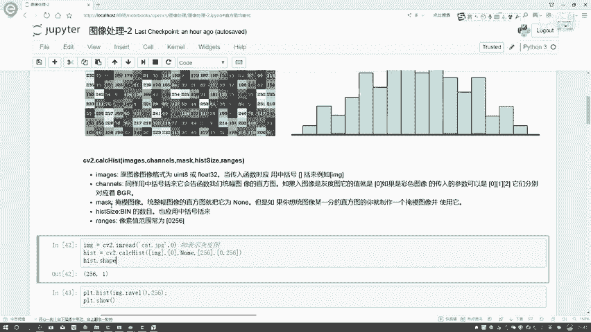

执行后，我们得到了一个包含256个值的数组，每个值代表对应像素值（0-255）在图像中出现的次数。


最后，我们可以使用Matplotlib库将直方图绘制出来。

```python
import matplotlib.pyplot as plt
plt.figure()
plt.title("Grayscale Histogram")
plt.xlabel("Bins") # 像素值
plt.ylabel("# of Pixels") # 像素数量
plt.plot(hist)
plt.xlim([0, 256]) # 限制x轴范围
plt.show()
```

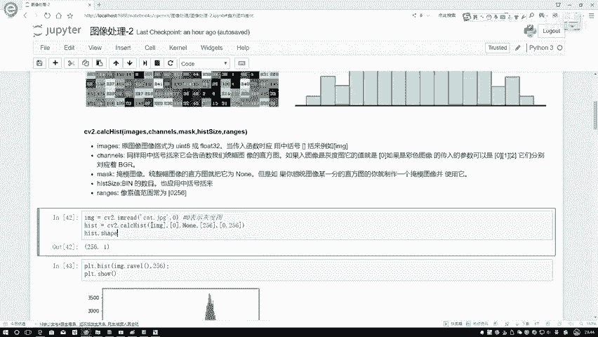


## 彩色图像的直方图 🌈

对于彩色图像，我们可以分别计算B、G、R三个通道的直方图。以下是操作方法：

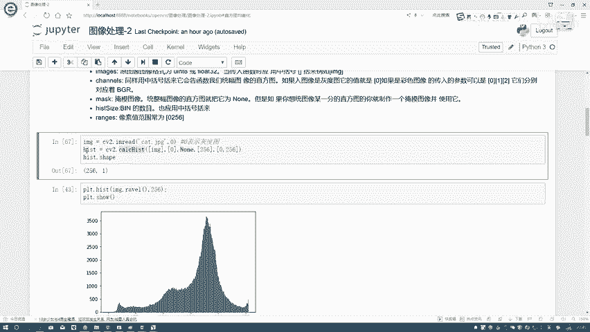

```python
img_color = cv2.imread('cat.jpg') # 读取彩色图像
colors = ('b', 'g', 'r') # 对应BGR通道的颜色

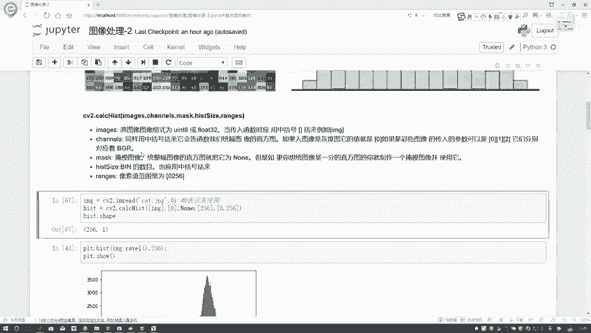

plt.figure()
plt.title("Color Histogram")
plt.xlabel("Bins")
plt.ylabel("# of Pixels")

for i, color in enumerate(colors):
    # 计算每个通道的直方图
    hist = cv2.calcHist([img_color], [i], None, [256], [0, 256])
    plt.plot(hist, color=color) # 用对应颜色绘制
    plt.xlim([0, 256])

plt.show()
```

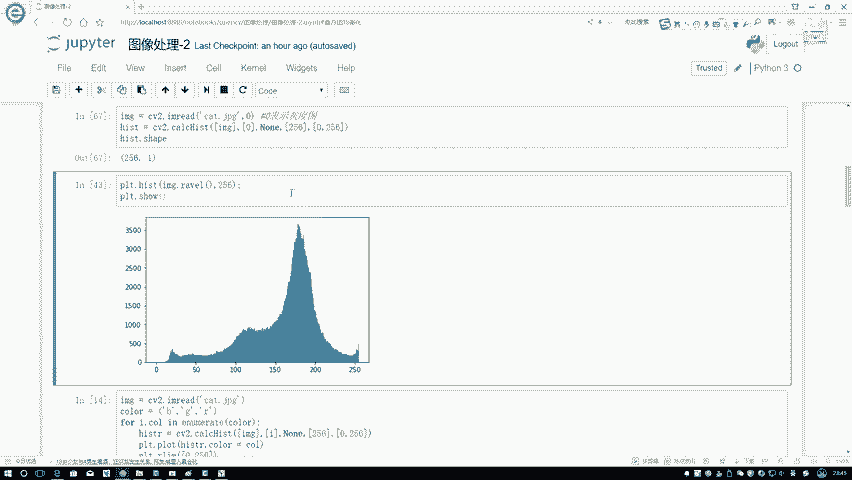


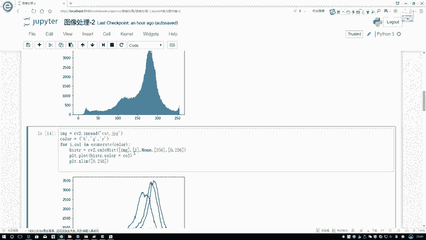

## 观察与分析直方图 🔍

观察我们得到的小猫图像直方图，可以发现其分布并不均匀。

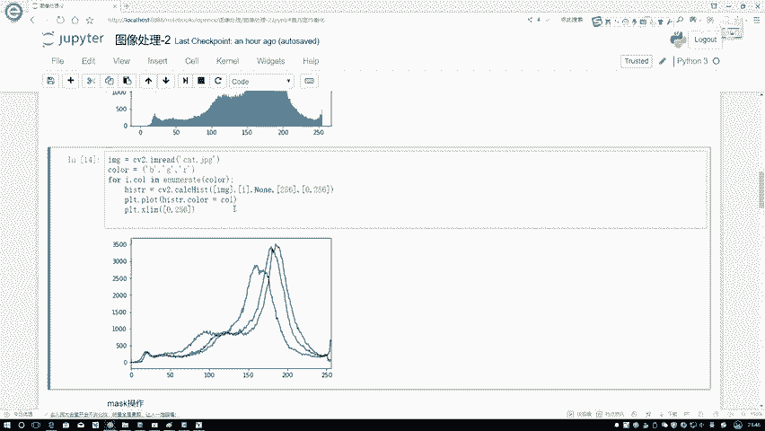

在像素值150到200的区间内，像素点数量非常集中，而其他区间的像素点则相对较少。这种分布特点反映了图像本身的明暗和对比度信息。

直方图是图像分析的重要工具。通过观察直方图，我们可以判断图像是偏亮、偏暗还是对比度不足。在下一节课中，我们将学习如何利用直方图进行图像增强，例如直方图均衡化，来改善图像的视觉效果。


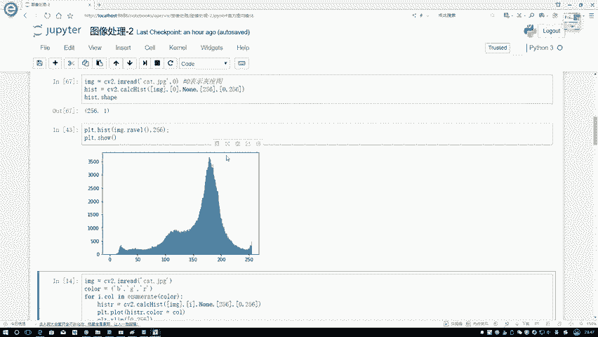

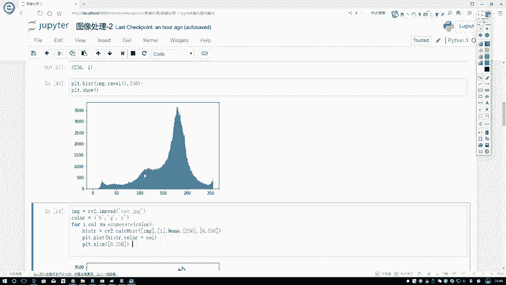

## 总结 📝

本节课中我们一起学习了：
1.  **直方图的定义**：统计图像中每个像素值出现次数的图表。
2.  **OpenCV计算直方图**：使用 `cv2.calcHist(images, channels, mask, histSize, ranges)` 函数。
3.  **绘制直方图**：使用Matplotlib库可视化灰度图及彩色图各通道的直方图。
4.  **直方图的分析**：直方图形状反映了图像的亮度、对比度等整体特征。


理解直方图是进行更高级图像处理（如图像增强、分割、识别）的基础。