# 课程 P26：直方图均衡化原理与掩码操作 📊

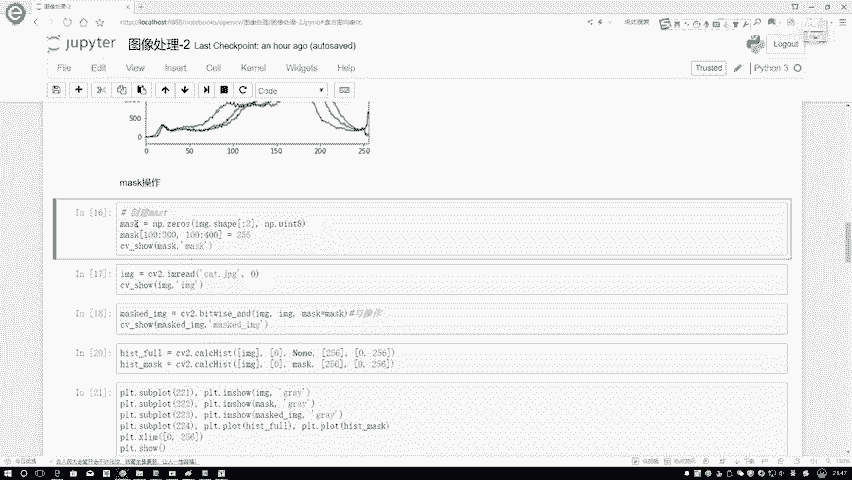

在本节课中，我们将学习图像处理中的两个核心概念：掩码（Mask）操作与直方图均衡化（Histogram Equalization）的基本原理。我们将了解如何创建和使用掩码来选取图像特定区域，并深入探讨直方图均衡化的数学原理，以实现图像对比度的增强。

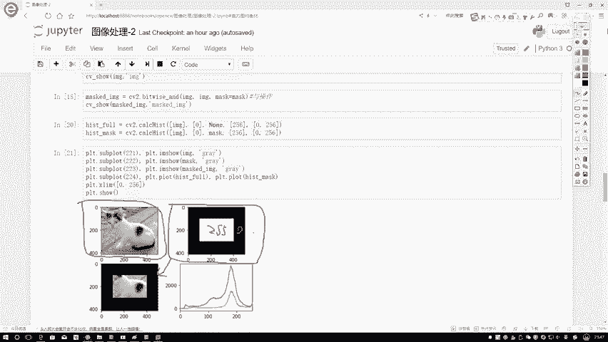

## 🎭 掩码（Mask）操作

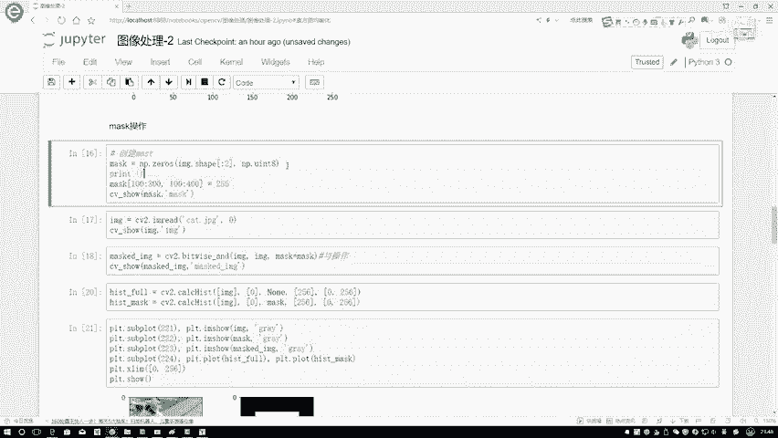

上一节我们介绍了直方图的基本概念，本节中我们来看看如何利用掩码对图像的特定区域进行操作。

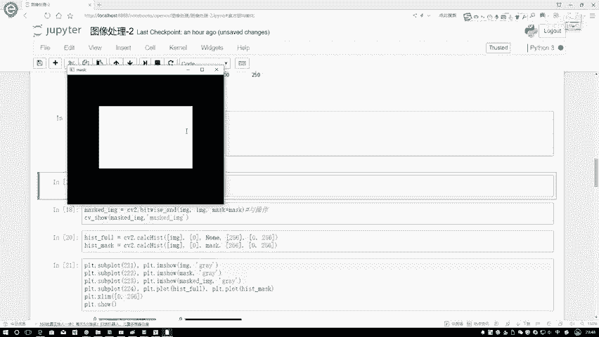

掩码是一个与原始图像尺寸相同的矩阵，用于指定图像中需要处理或保留的区域。在OpenCV中，掩码通常由0和255两种值构成，其中255代表需要保留的区域，0代表需要忽略的区域。

以下是创建和使用掩码的基本步骤：

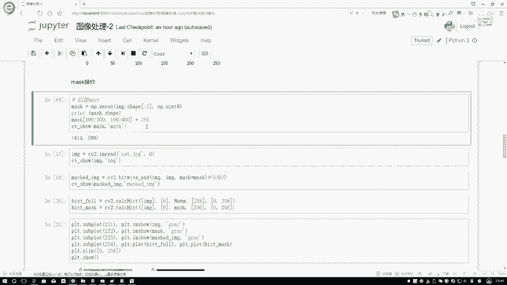

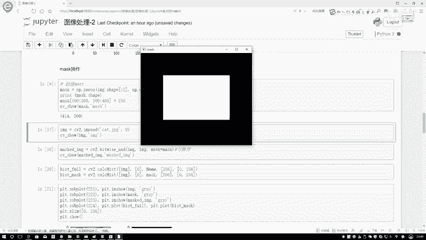

1.  **创建掩码矩阵**：使用`np.zeros`函数创建一个与原始图像尺寸相同的全零矩阵。
    ```python
    mask = np.zeros(image.shape[:2], dtype=np.uint8)
    ```
    代码解释：`image.shape[:2]`获取图像的高度和宽度，`dtype=np.uint8`指定数据类型为8位无符号整数（范围0-255）。

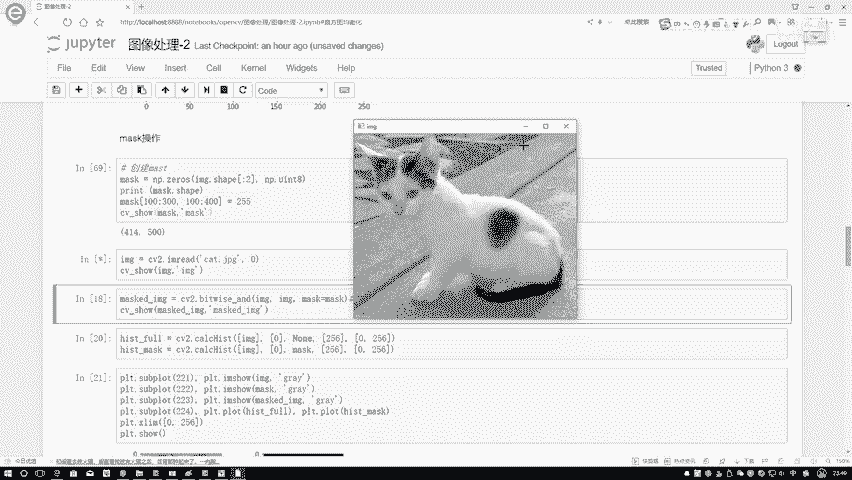

2.  **指定保留区域**：将需要保留的区域像素值设置为255。
    ```python
    mask[100:300, 150:400] = 255
    ```
    代码解释：此操作将掩码矩阵中行100到300、列150到400的矩形区域设置为白色（255）。

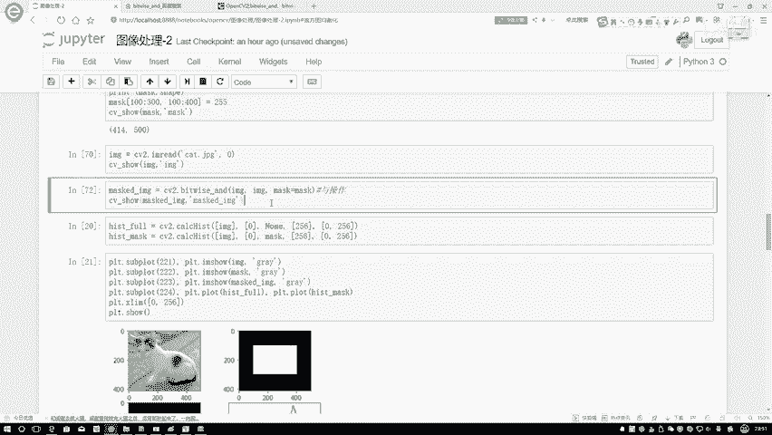

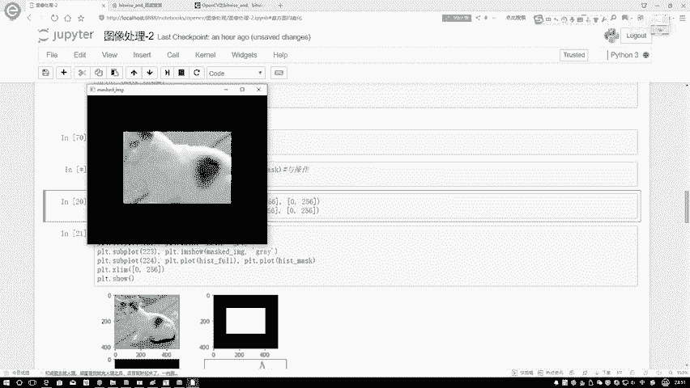

3.  **应用掩码**：使用按位与操作（`cv2.bitwise_and`）将原始图像与掩码结合，仅保留掩码中白色区域对应的图像部分。
    ```python
    masked_image = cv2.bitwise_and(image, image, mask=mask)
    ```
    公式解释：`masked_image(x, y) = image(x, y) if mask(x, y) > 0 else 0`。即，当掩码值大于0时，输出原图像素值；否则输出0。

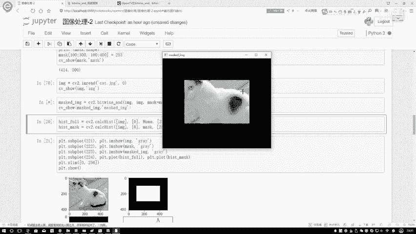

掩码操作的核心作用在于**区域截取**。通过构造特定的掩码矩阵并与原始图像组合，我们可以精确地提取出图像中感兴趣的部分，例如猫的脸部，而忽略背景。

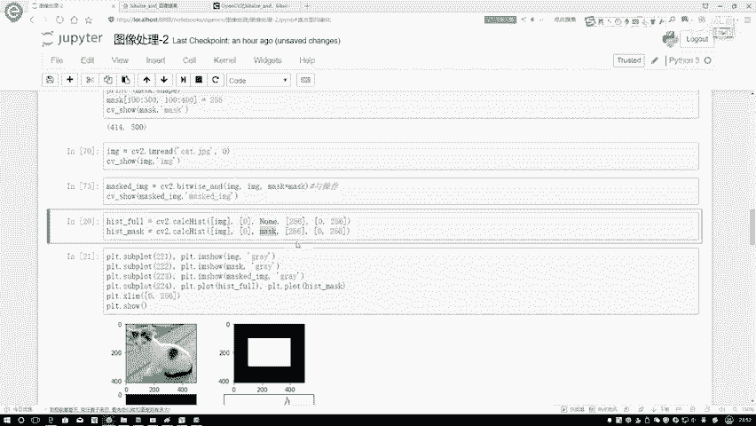

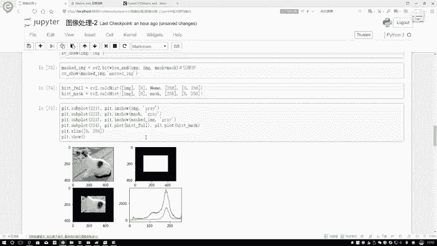

## ⚖️ 直方图均衡化原理

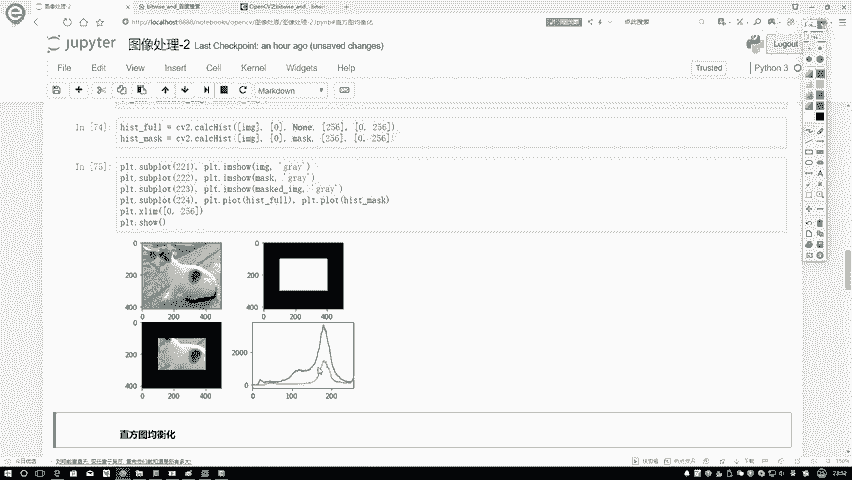

了解了如何利用掩码操作图像局部后，我们回到直方图本身。观察图像的直方图，我们常发现像素灰度值分布不均，导致图像对比度低、细节不清。直方图均衡化的目标就是将“瘦高”的直方图分布转换为“矮胖”的、更均匀的分布，从而增强图像的整体对比度。

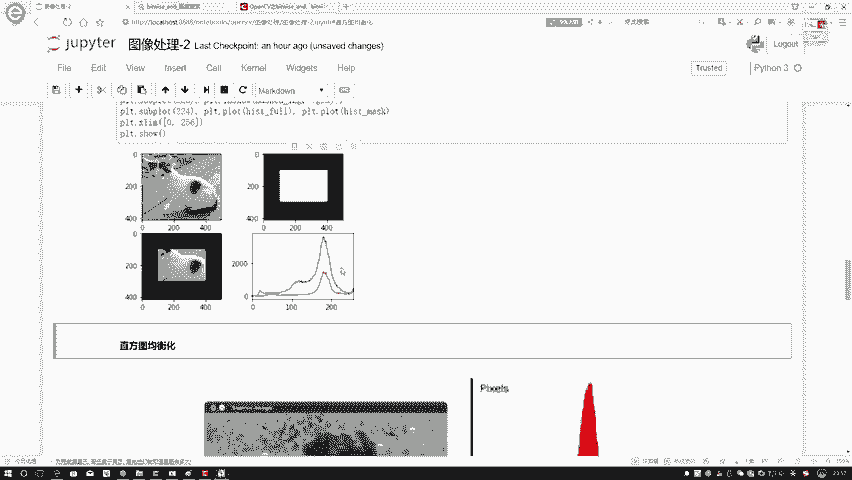

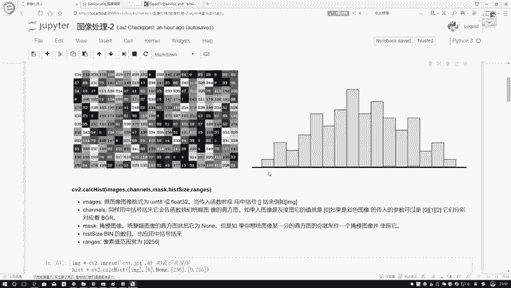

那么，如何实现从一种分布到另一种分布的映射呢？其核心是一个基于累积分布函数（CDF）的变换。

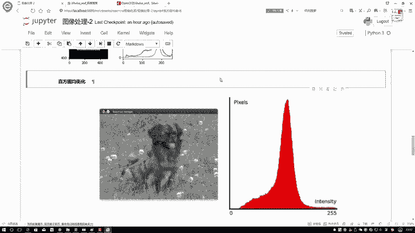

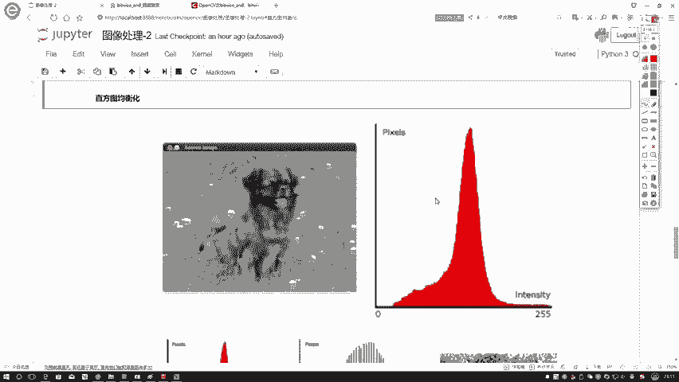

以下是直方图均衡化的计算原理：

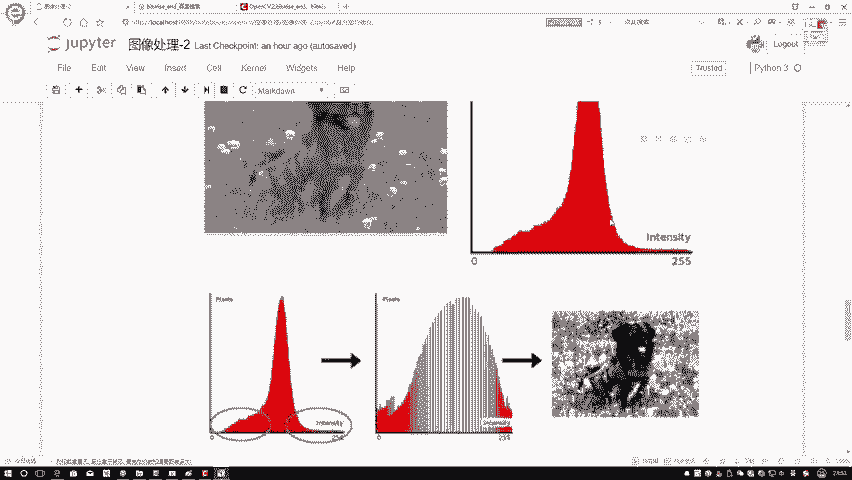

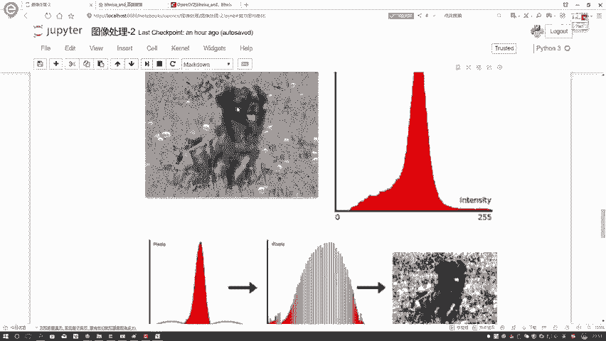

1.  **统计原始直方图**：计算图像中每个灰度级 `r_k` 出现的像素数目 `n_k`。
    *   设图像总像素数为 `N`，则灰度级 `r_k` 的概率为：`p_r(r_k) = n_k / N`。

2.  **计算累积分布函数（CDF）**：计算从最小灰度级到当前灰度级的累积概率。
    *   灰度级 `r_k` 的累积概率 `cdf(r_k)` 计算公式为：`cdf(r_k) = Σ_{j=0}^{k} p_r(r_j)`。

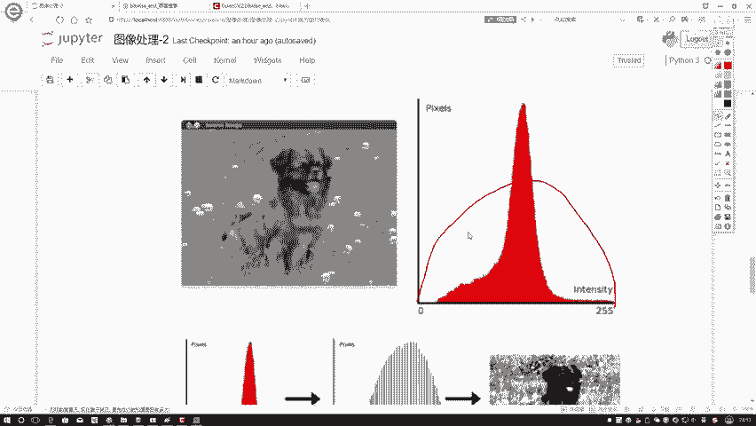

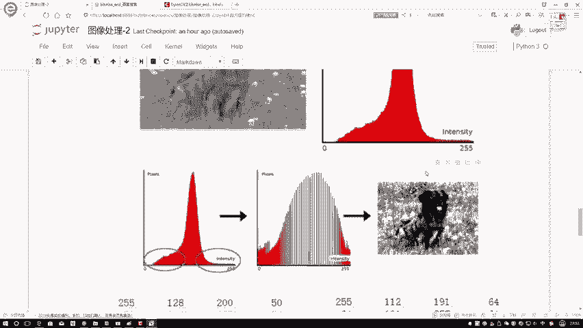

3.  **进行灰度映射**：利用CDF将原始灰度值 `r_k` 映射到新的灰度值 `s_k`。
    *   映射公式为：`s_k = round( cdf(r_k) * (L - 1) )`。
    *   公式解释：`L` 是灰度级总数（例如对于8位图像，L=256）。`round()` 表示四舍五入取整。此步骤将累积概率范围 `[0, 1]` 线性映射到新的灰度范围 `[0, L-1]`。

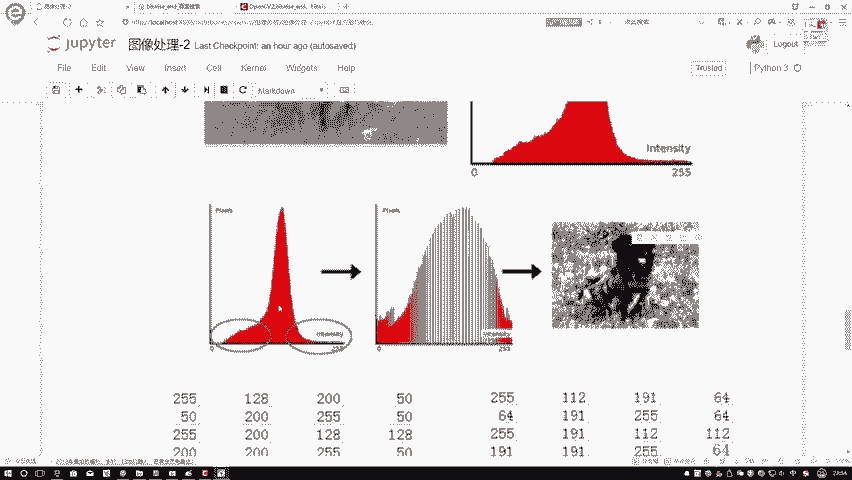

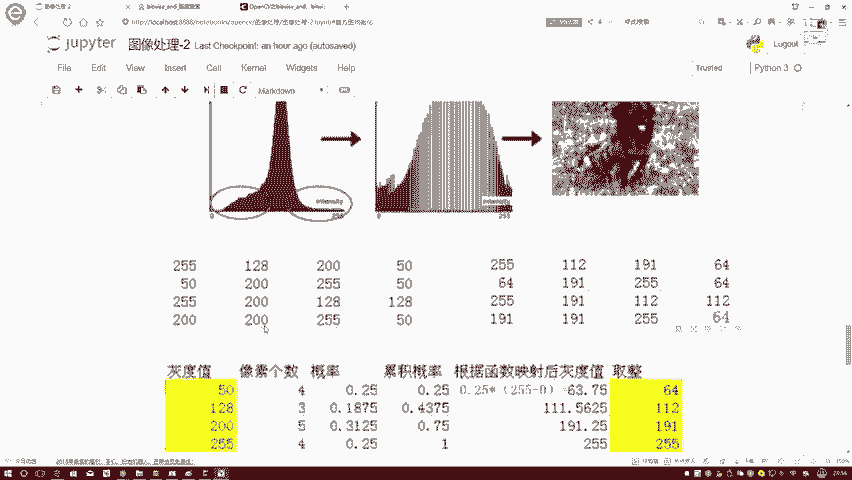

**举例说明**：
假设有一小片图像的灰度值集合为 `[50, 50, 50, 50, 128, 128, 128, 200, 200, 200, 200, 200, 255, 255, 255, 255]`，共16个像素（N=16）。

*   **统计概率**：
    *   p(50) = 4/16 = 0.25
    *   p(128) = 3/16 = 0.1875
    *   p(200) = 5/16 = 0.3125
    *   p(255) = 4/16 = 0.25

*   **计算累积概率（CDF）**：
    *   cdf(50) = 0.25
    *   cdf(128) = 0.25 + 0.1875 = 0.4375
    *   cdf(200) = 0.4375 + 0.3125 = 0.75
    *   cdf(255) = 0.75 + 0.25 = 1.0

*   **映射到新灰度值（L=256）**：
    *   s(50) = round(0.25 * 255) = 64
    *   s(128) = round(0.4375 * 255) = 112
    *   s(200) = round(0.75 * 255) = 191
    *   s(255) = round(1.0 * 255) = 255

经过均衡化，原始灰度值被重新分配。原本聚集在少数灰度级的像素被分散到一个更宽的范围内，使得直方图分布更为平坦，图像的亮度和对比度从而得到增强。

## 📝 课程总结

本节课中我们一起学习了：
1.  **掩码操作**：我们掌握了如何创建二值掩码矩阵，并通过按位与运算提取图像的特定区域。这是许多高级图像处理任务（如ROI分析）的基础。
2.  **直方图均衡化原理**：我们深入理解了均衡化的核心数学原理——基于累积分布函数（CDF）的灰度映射。通过将原始直方图的累积概率线性拉伸到整个灰度范围，实现了图像对比度的有效增强。

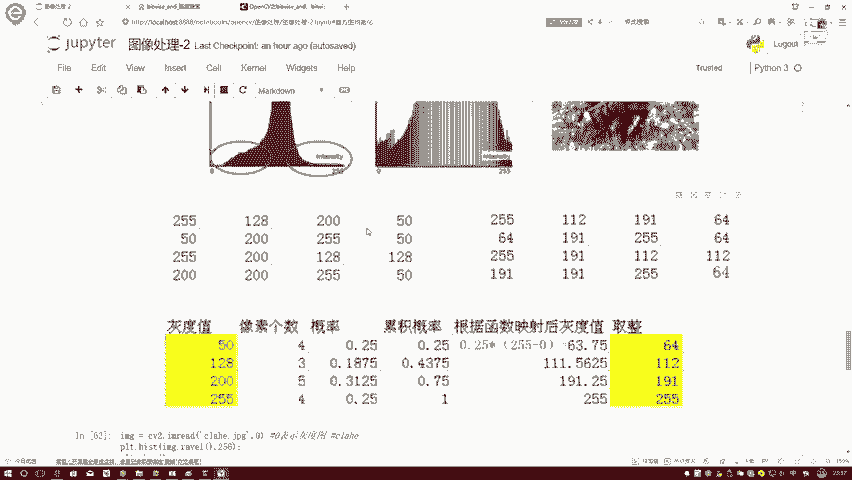

理解这些基本原理，是后续应用OpenCV等库中相应函数（如`cv2.equalizeHist`）进行实际图像处理的关键。下一节课，我们将学习如何在代码中实现这些操作。