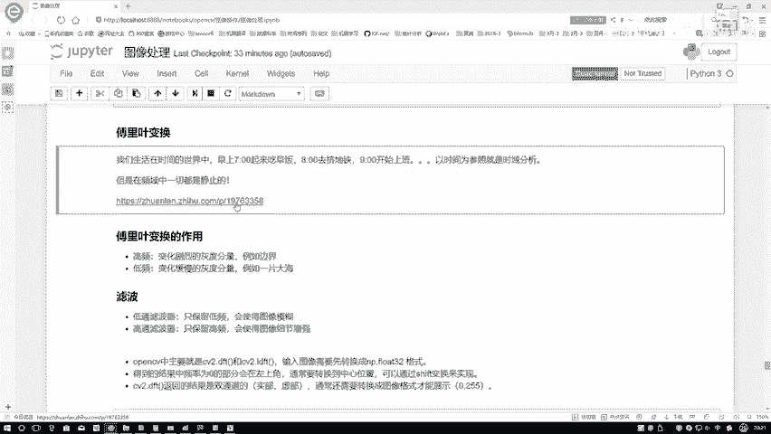
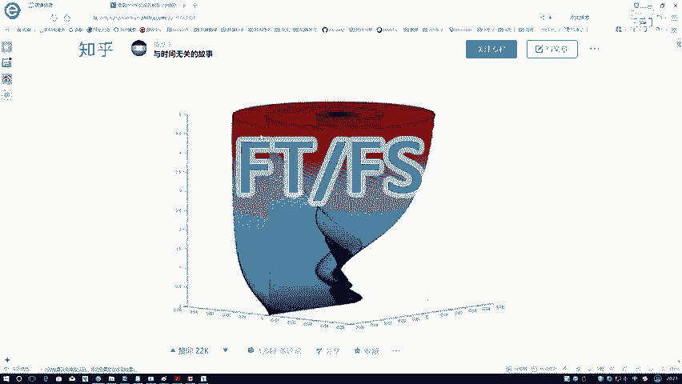
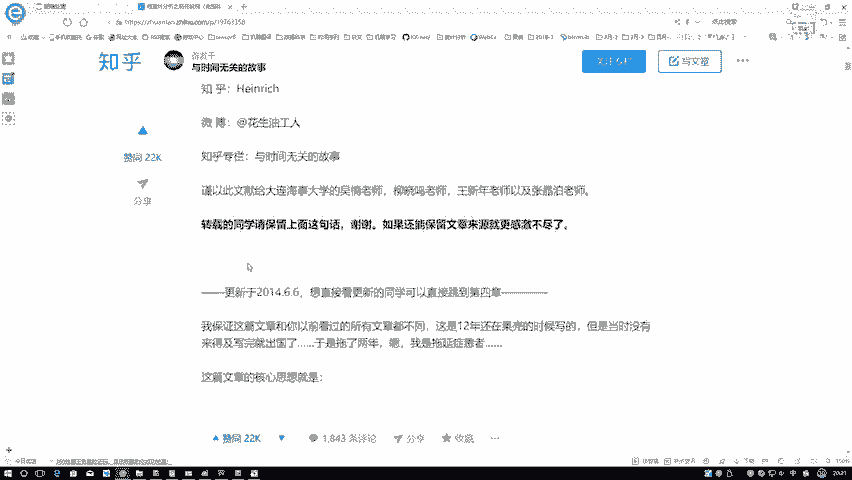
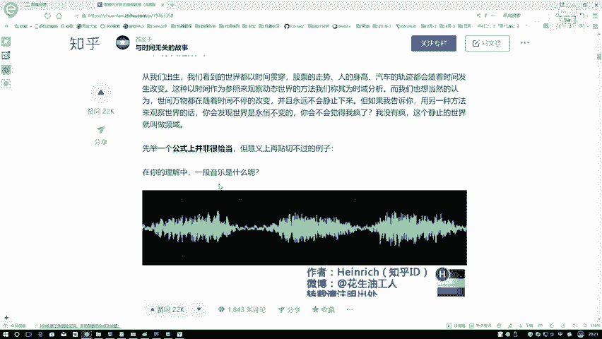
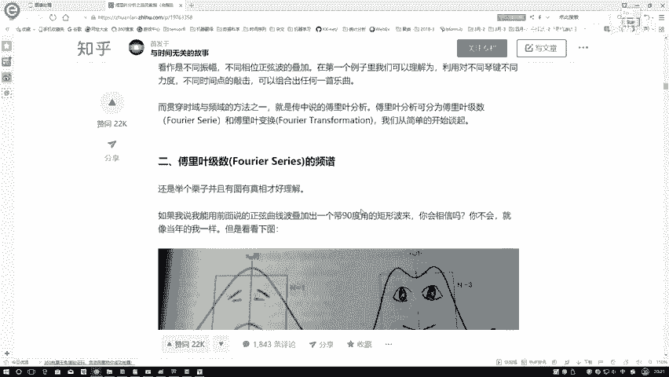
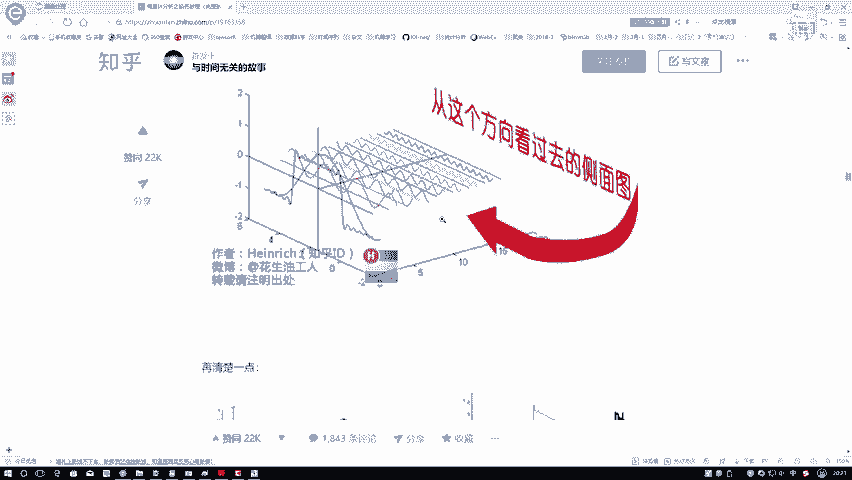
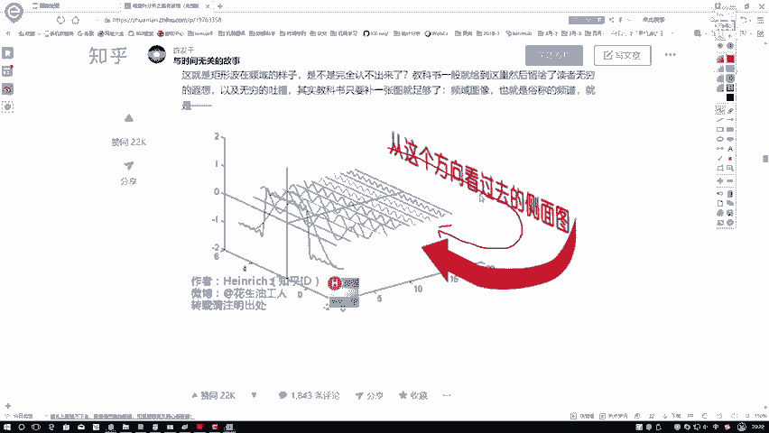
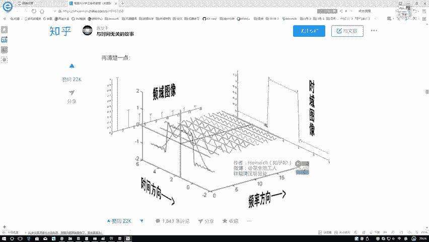

# 课程P28：傅里叶变换概述 🌀

在本节课中，我们将学习傅里叶变换的基本概念，并探讨它在图像处理领域能够完成哪些任务。

## 什么是傅里叶变换？

首先，我们来理解什么是傅里叶变换。想象一个现实生活中的场景：我们早上七点起床吃早饭，八点去挤地铁，九点开始上班，十点工作，十一点开会，十二点吃午饭，下午四点盼着下班，五点等大家走得差不多了再离开。

这段话是以时间为参照进行描述的，我们称之为**时域分析**。生活中绝大多数事情都与时间相关，例如篮球比赛分为上半场、中场休息和下半场，每节比赛打满12分钟。我们的生活也是如此，随着时间推移，我们长大并经历各种事情。

然而，傅里叶变换从一个更抽象的视角来看待问题，可以理解为一种“上帝视角”。在这个视角下，它并不关心你每天具体按顺序做了什么，而是关注你**做了哪些事**以及这些事发生的**间隔或频率**。

例如，从上帝视角看：
*   你每天都要吃早饭。
*   你每个工作日（而非休息日）都要挤地铁。
*   你每个工作日都需要上班。

因此，傅里叶变换更关心的是在**频域**中发生的事情。时域描述的是随着时间进行、不断运动的序列；而频域描述的则是事件发生的规律和频率，更像是一种静止的、模式化的描述。

为了更清晰地说明，我们来看一个篮球比赛的例子。假设球星库里在8分钟的比赛中得分，我们以分钟为单位记录他投进三分球和两分球的情况。

在时域中，我们这样描述：
*   第1分钟：投进1个三分球，0个两分球。
*   第2分钟：投进0个三分球，1个两分球。
*   第3分钟：投进1个三分球，0个两分球。
*   ... 以此类推。

这描述了随着比赛时间推进，库里得分事件的具体序列。

而在频域中，描述则简化为：
*   在整个比赛中，**每隔一分钟**投进一个三分球。
*   同时，**每隔一分钟**投进一个两分球。

频域描述的核心在于**规律和频率**。

## 时域与频域的直观联系

上一节我们介绍了时域和频域的基本概念。本节中，我们通过一个生动的例子来看看它们如何联系起来。

这里分享一篇讲解得非常通俗易懂的文章（非本人所写），它逐步阐述了傅里叶变换的原理。虽然其中涉及较多知识点，图像处理中未必全部用到，但其核心图示极具启发性。

傅里叶提出：**任何周期函数都可以用一系列正弦波叠加而成**。如下图所示，作者试图用正弦波来近似表示一个矩形波。

观察上图：
*   仅用一个正弦波（第一排）无法表示矩形。
*   叠加两个正弦波（第二排）后，近似效果有所改善。
*   叠加的正弦波数量越多（第三排及之后），对矩形的近似就越精确。

这直观地展示了傅里叶变换的核心思想：用不同频率的正弦波组合来构建复杂波形。

那么，这如何从时域转换到频域呢？关键在于一句话：**换个方向观察**。

当我们从侧面观察这些叠加的正弦波时，就得到了**频域**的结果。在上图右侧：
*   **横轴**代表**频率**（即正弦波变化的快慢，频率 = 1/周期）。越靠右，频率越高，波形变化越剧烈。
*   **纵轴**代表**振幅**（即正弦波振动的幅度）。不同频率的正弦波对应不同的振幅。

因此，只需理解一点：时域中的波形，**换个角度（侧面）观察**，就映射到了频域。在频域中，我们以频率和振幅来描述信号，这使得分析某些问题（如图像中的纹理、噪声）变得更加容易。

## 总结

本节课我们一起学习了傅里叶变换的概述。我们首先通过生活实例对比了**时域**（随时间变化的序列）和**频域**（描述事件发生规律和频率）的区别。然后，我们借助正弦波叠加的图示，直观理解了傅里叶变换如何将复杂的时域信号分解为不同频率的正弦波组合，并通过“换个方向观察”这一比喻，建立了时域信号与其频域表示之间的对应关系。理解时域与频域这两种观察世界的不同视角，是掌握傅里叶变换及其在图像处理中应用的基础。