# 课程P29：2-频域变换结果 🔄

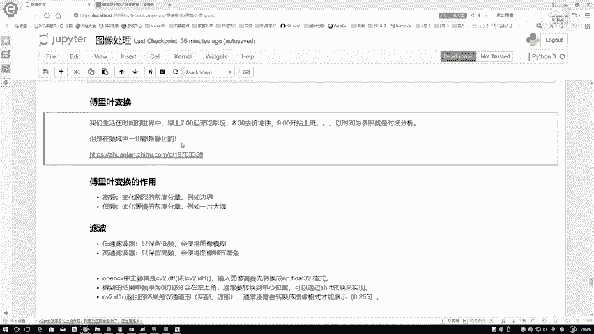

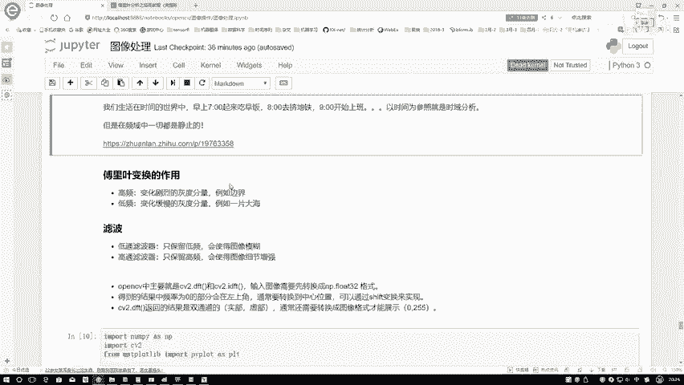

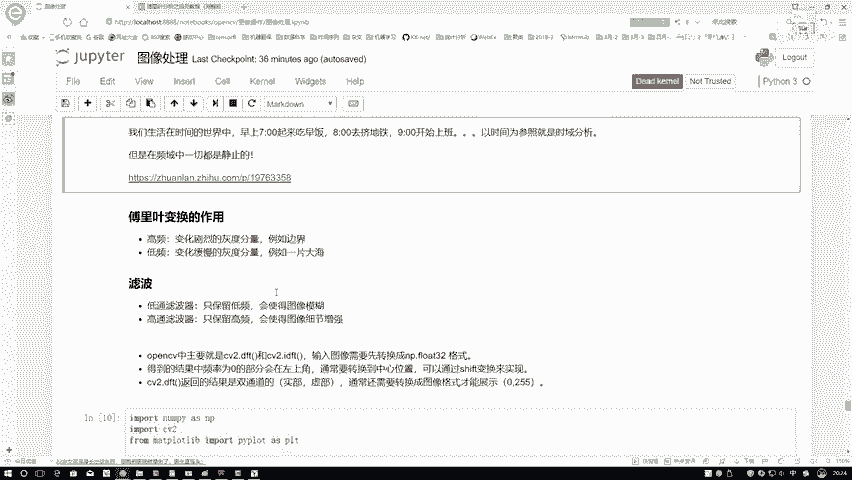

在本节课中，我们将要学习傅里叶变换在图像处理中的具体应用，特别是低通与高通滤波器的概念和作用。我们将通过OpenCV的代码实践，展示如何将图像转换到频域，并理解不同频率分量在图像中的意义。

上一节我们介绍了傅里叶变换的基本概念，本节中我们来看看它在图像处理中的具体作用。

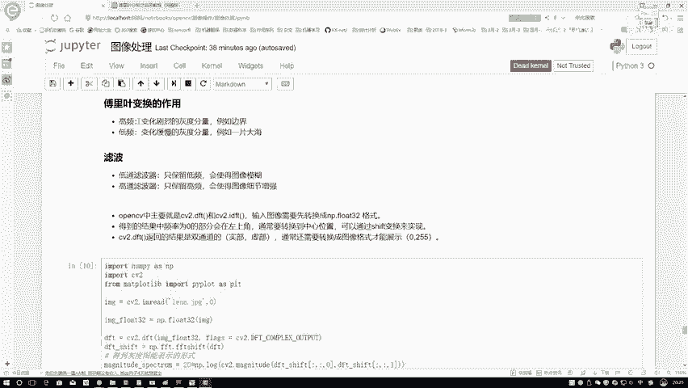

## 傅里叶变换的作用 📊

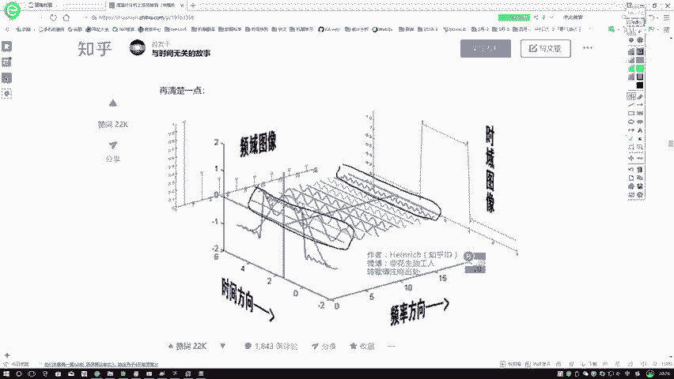

傅里叶变换将图像从空间域转换到频域。在频域中，我们可以分析图像的不同频率分量。

## 低通与高通滤波器 🎛️

既然提到滤波器，其目的是保留一些成分并排除另一些成分。以下是低通和高通滤波器的定义：

*   **低频**：在图像中，变化缓慢的灰度分量。例如，一片颜色均匀的大海或草原，其像素值变化不大。
*   **高频**：在图像中，变化剧烈的灰度分量。例如，物体与背景之间的边界，其像素值在短距离内发生显著变化。

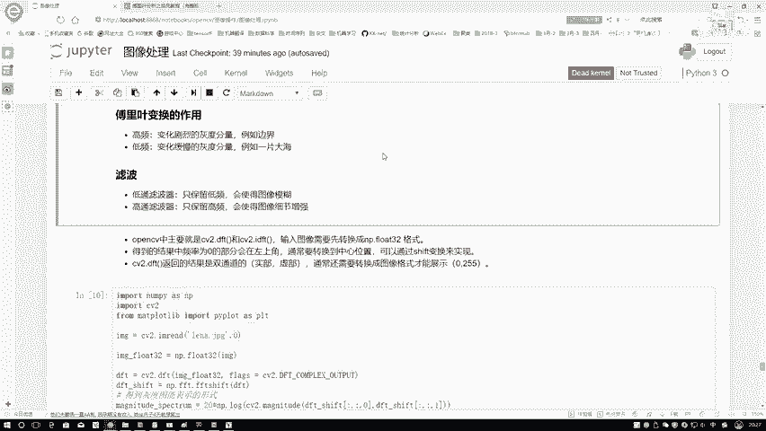

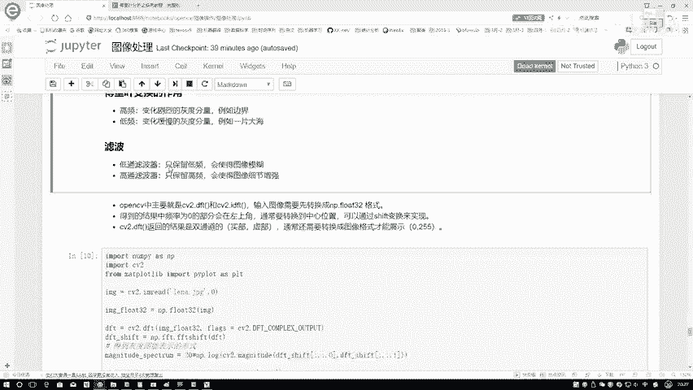

以下是两种滤波器的具体作用：

*   **低通滤波器**：只保留低频信息，去除高频信息。由于图像边界（高频）被模糊，处理后的图像会变得模糊。
*   **高通滤波器**：只保留高频信息，去除低频信息。这会增强图像的边缘和细节，产生锐化的效果。

## OpenCV中的DFT与IDFT ⚙️

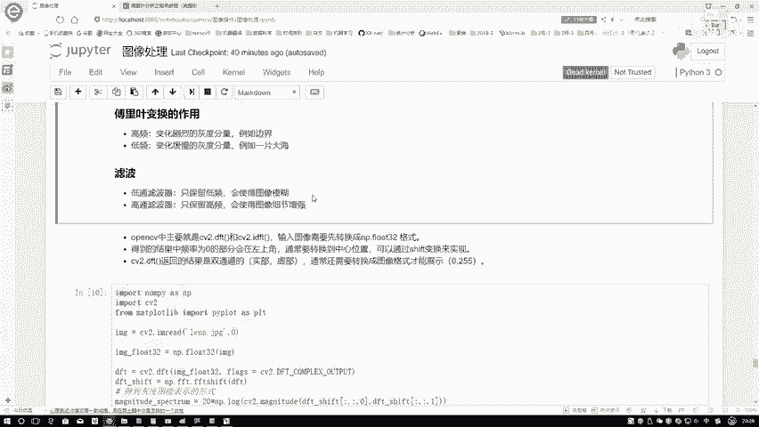

在OpenCV中，我们主要使用两个函数进行傅里叶变换及其逆变换。

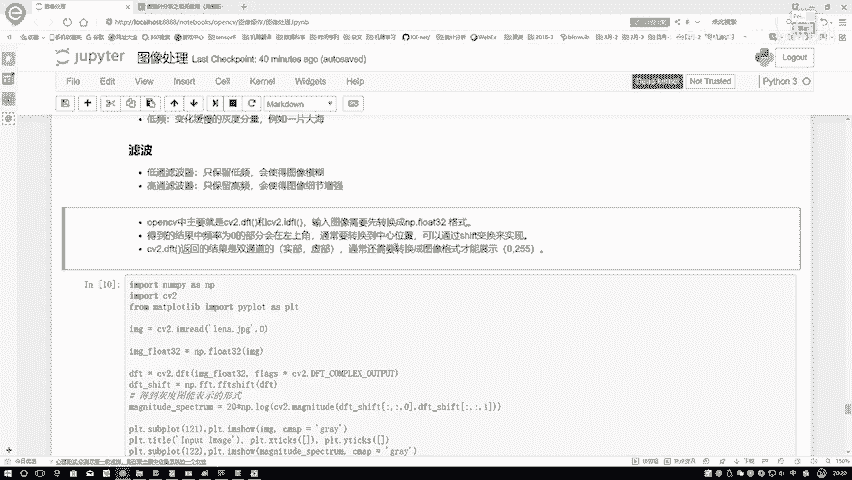

*   **`cv2.dft()`**：执行离散傅里叶变换，将图像从空间域转换到频域。
*   **`cv2.idft()`**：执行逆离散傅里叶变换，将图像从频域转换回空间域。

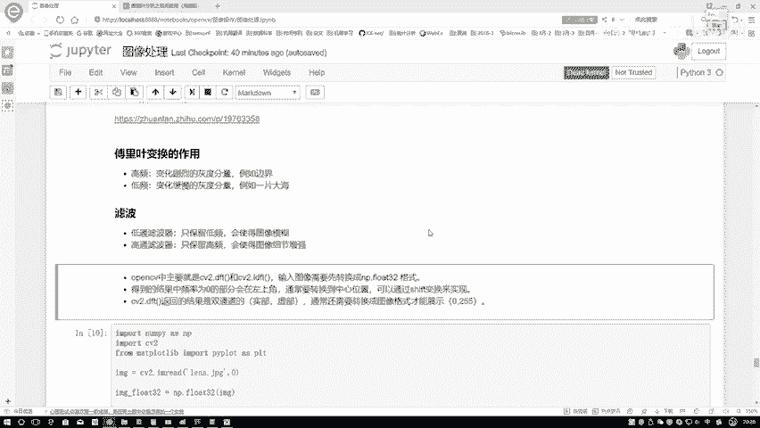

频域数据（包含实部和虚部）无法直接显示，通常需要逆变换回图像才能观察效果。

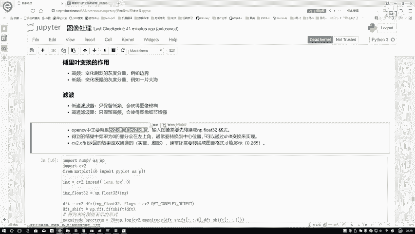

## 代码实现要点 💻

使用OpenCV进行傅里叶变换时，需要注意以下几点：

1.  **输入格式**：输入图像必须转换为`np.float32`格式。
2.  **频谱中心化**：变换后得到的频谱，其低频部分默认在四角。为了方便观察和处理，通常使用`np.fft.fftshift()`函数将低频部分移动到频谱中心。
3.  **结果转换**：`cv2.dft()`输出的是双通道（实部和虚部）结果。为了将其显示为图像，需要转换为单通道的幅度谱。公式为：
    `magnitude_spectrum = 20 * np.log(cv2.magnitude(real, imag))`
    此公式计算幅度并对数缩放，以便更好地显示。

## 代码演示与结果分析 🖼️

以下是核心代码步骤分析：

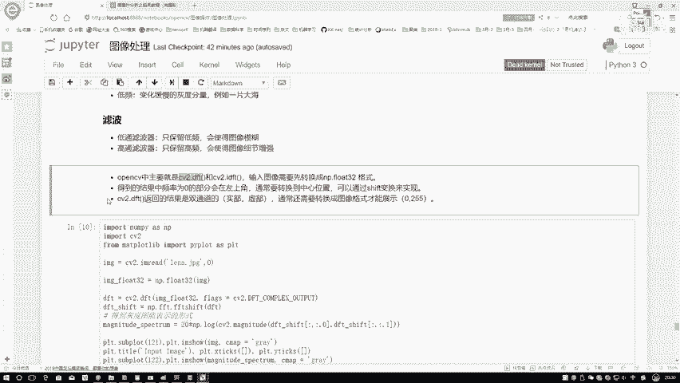

```python
import cv2
import numpy as np

# 1. 读取图像并转换为灰度图
img = cv2.imread('lena.png', 0)

# 2. 将图像转换为np.float32格式
dft_input = np.float32(img)

# 3. 执行傅里叶变换
dft_output = cv2.dft(dft_input, flags=cv2.DFT_COMPLEX_OUTPUT)

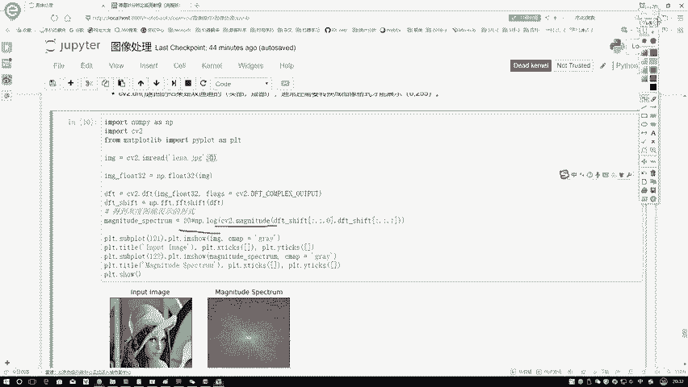

# 4. 将频谱的低频部分移动到中心
dft_shift = np.fft.fftshift(dft_output)

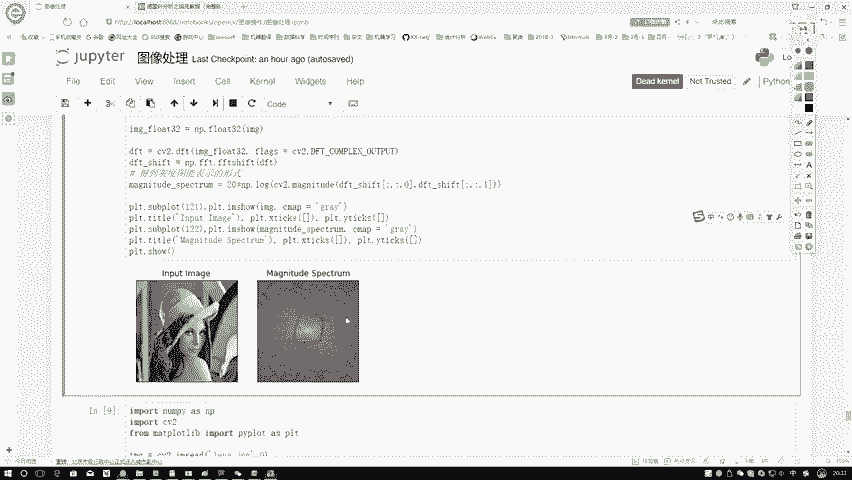

# 5. 计算幅度谱（实部real和虚部imag）
real, imag = cv2.split(dft_shift)
magnitude_spectrum = 20 * np.log(cv2.magnitude(real, imag))

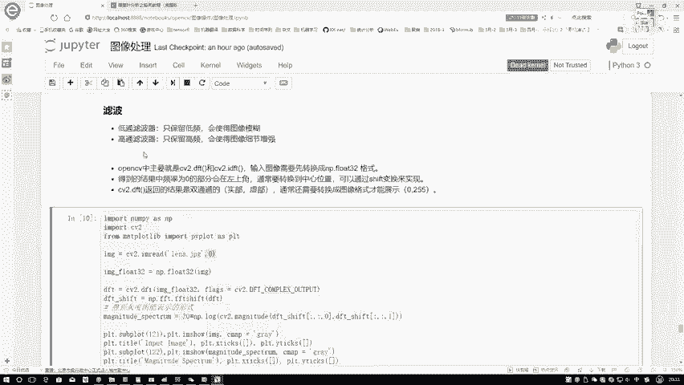

# 6. 将幅度谱值缩放到0-255范围以便显示
magnitude_spectrum_normalized = cv2.normalize(magnitude_spectrum, None, 0, 255, cv2.NORM_MINMAX, cv2.CV_8U)
```

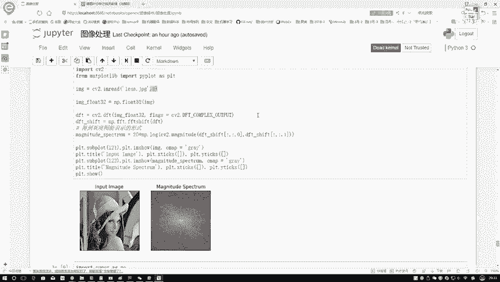

运行代码后，我们将得到原始图像和其对应的频域幅度谱图。

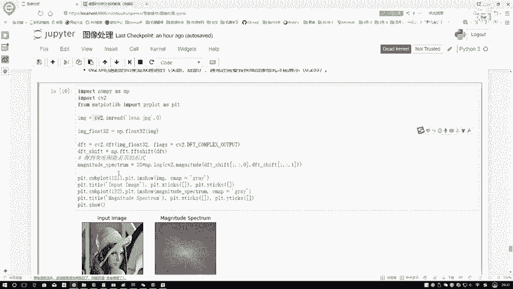

在幅度谱图中，越亮的点代表该频率成分的幅度越大。中心区域最亮，代表低频成分（图像的主体和缓慢变化部分）能量最高。从中心向外发散，亮度逐渐降低，代表高频成分（图像的边缘和细节）能量较低。

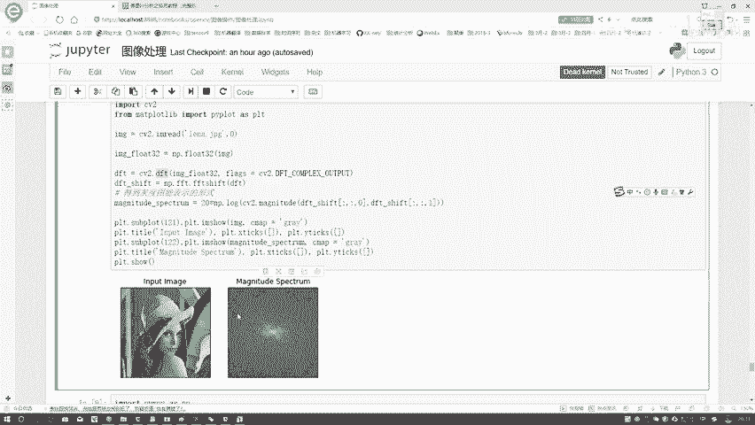

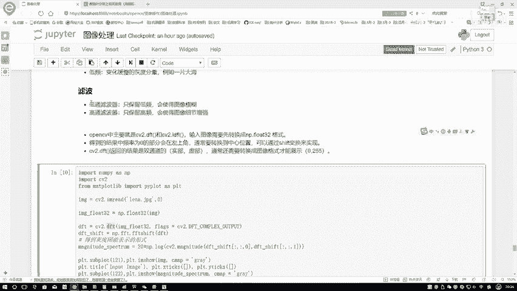

本节课中我们一起学习了傅里叶变换在图像处理中的应用，理解了低频与高频分量的图像意义，掌握了低通与高通滤波器的概念，并实践了使用OpenCV进行傅里叶变换及频谱可视化的完整流程。