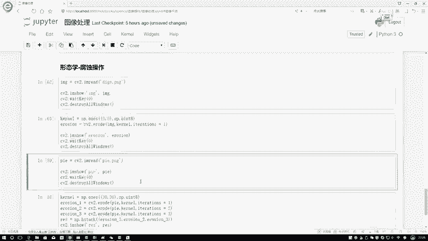
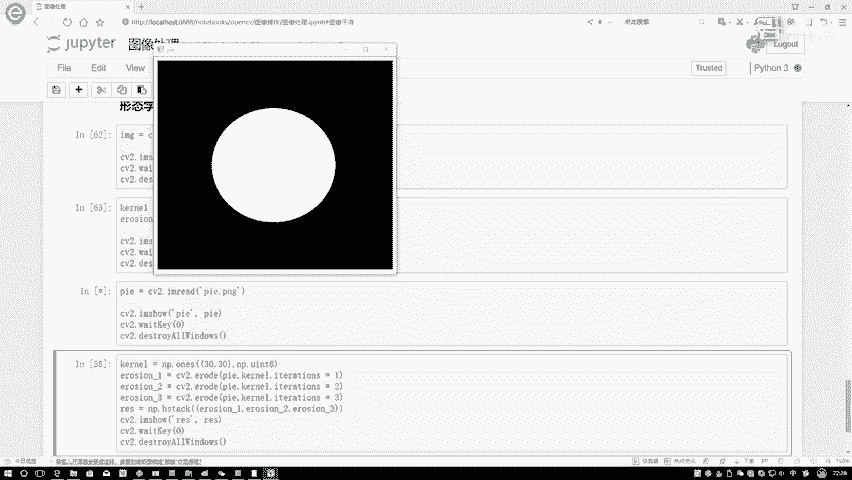
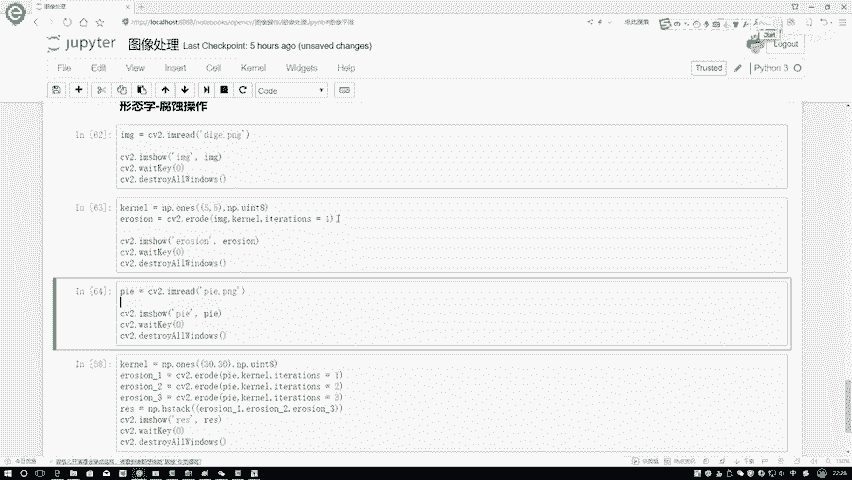
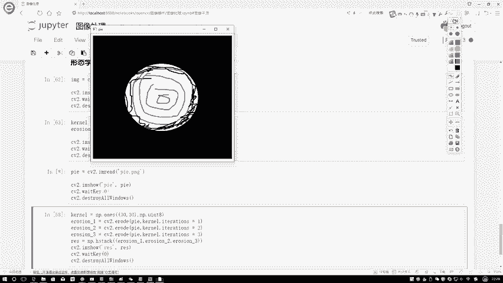
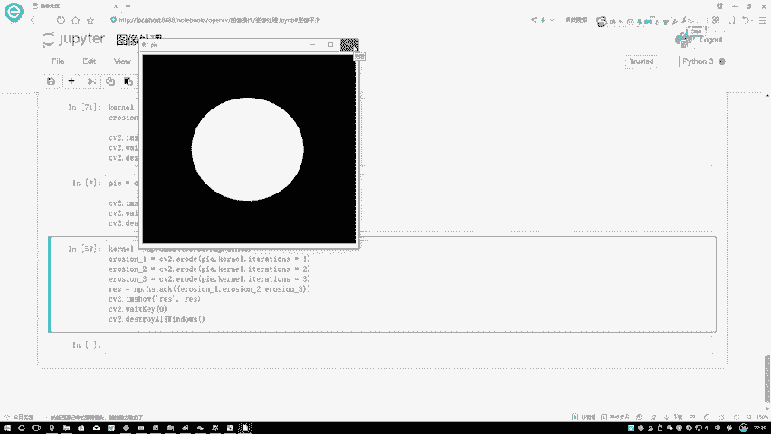
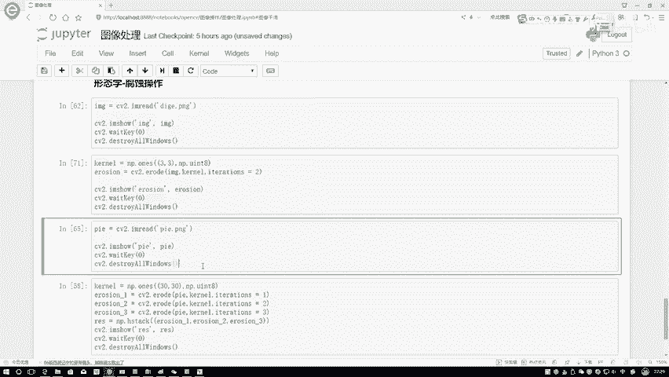
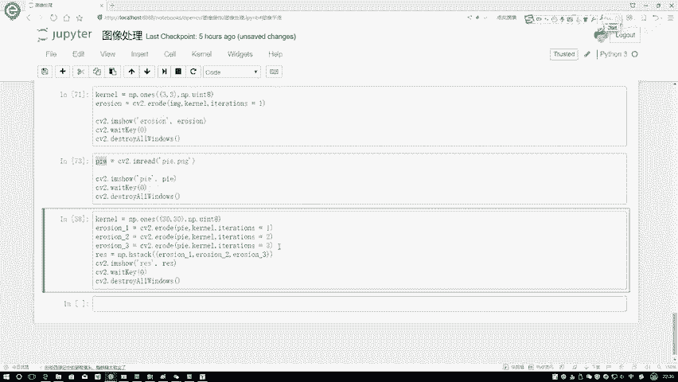
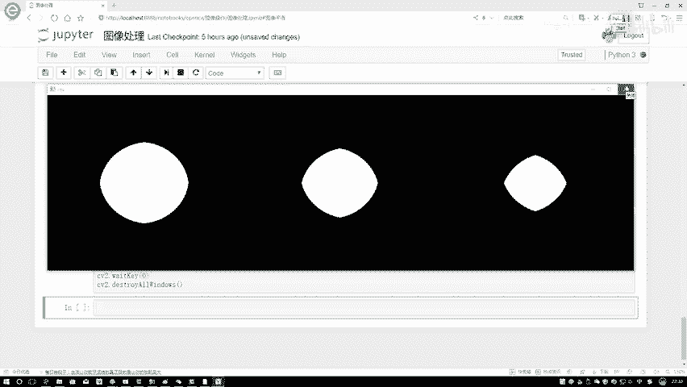

# 课程P3-1：腐蚀操作详解 🧽

在本节课中，我们将要学习图像形态学处理中的基础操作之一——腐蚀操作。腐蚀操作主要用于处理二值图像，能够有效地去除图像中的细小毛刺、分离粘连的物体，并使前景物体的边界向内收缩。

## 概述

腐蚀操作是形态学处理的核心操作之一。它通常应用于二值图像（即像素值仅为0或255的图像），通过一个预定义的“核”在图像上滑动并进行逻辑判断，使得图像中的白色前景区域（高亮部分）根据其邻域情况被“侵蚀”或缩小。

## 腐蚀操作原理

上一节我们介绍了腐蚀操作的基本概念，本节中我们来看看其具体的工作原理。

腐蚀操作的核心思想是：使用一个结构元素（通常是一个小矩阵，称为“核”）扫描图像中的每一个像素。对于每一个像素位置，只有当核覆盖下的所有像素值都为前景值（例如255）时，该中心像素才被保留为前景；否则，该像素将被置为背景值（例如0）。

这个过程可以用一个简单的公式来描述。假设 `A` 是原始二值图像，`B` 是结构元素核，腐蚀操作 `A ⊖ B` 定义为：

```
A ⊖ B = { z | (B)_z ⊆ A }
```

其中，`(B)_z` 表示将核 `B` 的原点平移到位置 `z`。这意味着，只有当核 `B` 完全包含在图像 `A` 的前景区域内时，输出图像在位置 `z` 的点才为前景。



为了更直观地理解，我们可以看一个简单的代码示例。在OpenCV中，腐蚀操作通过 `cv2.erode()` 函数实现。

```python
import cv2
import numpy as np

# 读取一张二值图像（例如黑色背景，白色前景）
image = cv2.imread('di_ge.png', cv2.IMREAD_GRAYSCALE)

# 定义一个3x3的矩形核，所有值均为1
kernel = np.ones((3, 3), np.uint8)

# 应用腐蚀操作，迭代次数为1
eroded_image = cv2.erode(image, kernel, iterations=1)

# 显示结果
cv2.imshow('Original', image)
cv2.imshow('Eroded', eroded_image)
cv2.waitKey(0)
cv2.destroyAllWindows()
```

执行上述代码后，可以观察到图像中的白色线条变细，并且一些细小的毛刺被去除了。

## 核的大小与迭代次数



理解了腐蚀的基本原理后，我们来看看影响腐蚀效果的两个关键参数：核的大小和迭代次数。



核的大小决定了在每次判断时，考察的邻域范围。一个较大的核意味着在判断一个点是否被腐蚀时，需要其周围更大范围内的点都是前景，因此腐蚀效果更强烈，物体收缩得更快。

迭代次数则决定了腐蚀操作被重复执行的次数。每次腐蚀都会在前一次结果的基础上，使前景区域进一步向内收缩。

以下是不同参数设置对腐蚀效果影响的说明：



*   **核的大小**：核越大，腐蚀作用越强，前景物体收缩得越明显。
*   **迭代次数**：迭代次数越多，腐蚀操作被重复应用的次数越多，前景物体收缩得越小。

我们可以通过一个实验来观察迭代次数的影响。对同一张图像（例如一个白色的圆形）分别进行1次、2次和3次腐蚀操作。





原始输入图像是一个圆形。经过不同次数的腐蚀后，结果如下：







从结果可以清晰地看到，随着迭代次数（i）的增加，圆形区域逐渐变小。i=1时，边界均匀内缩一圈；i=2时，内缩更明显；i=3时，圆形已经变得非常小。这直观地展示了迭代次数对腐蚀效果的影响。


## 总结


本节课中我们一起学习了形态学中的腐蚀操作。

我们首先了解了腐蚀操作能够去除图像毛刺、细化线条和分离物体的作用。然后，我们深入探讨了其工作原理，即通过一个结构元素核在图像上滑动，仅当核完全覆盖前景区域时才保留中心像素。最后，我们分析了影响腐蚀效果的两个关键参数——核的大小和迭代次数，并通过实验观察了它们如何改变处理结果。



掌握腐蚀操作是理解更复杂形态学操作（如膨胀、开运算、闭运算）的重要基础。