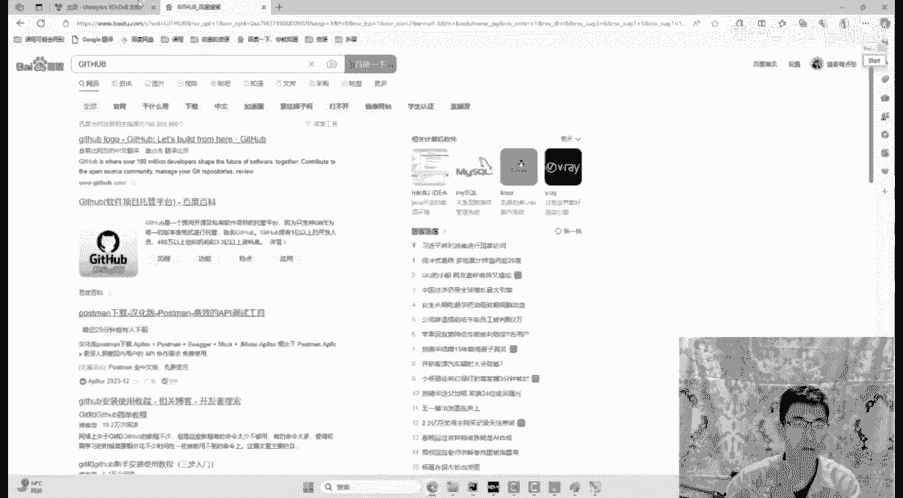
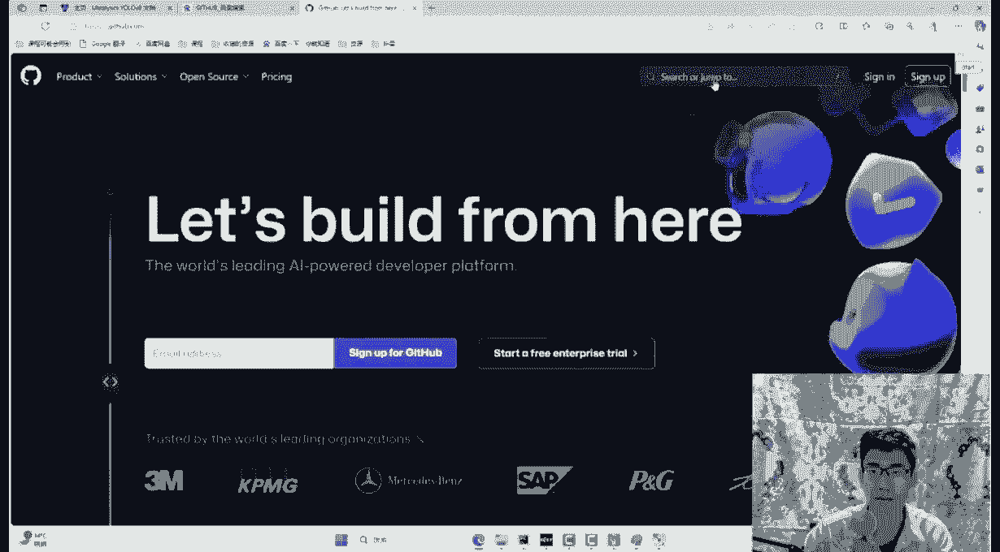
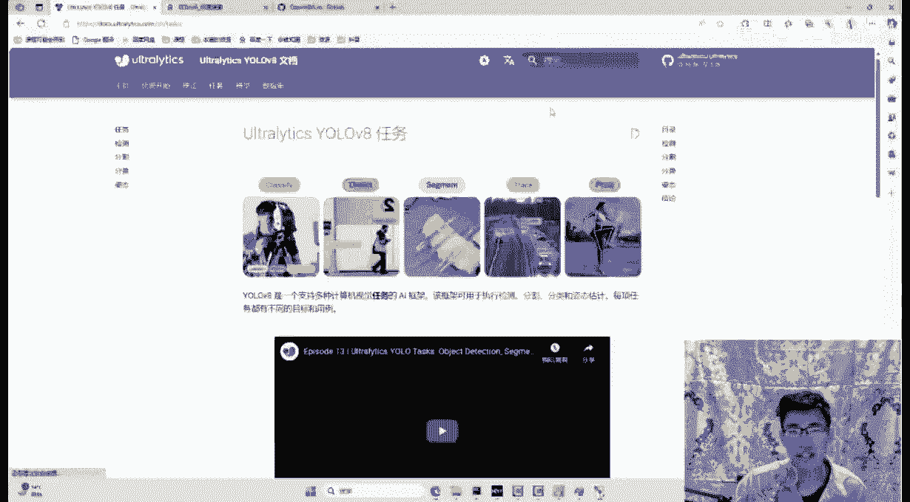
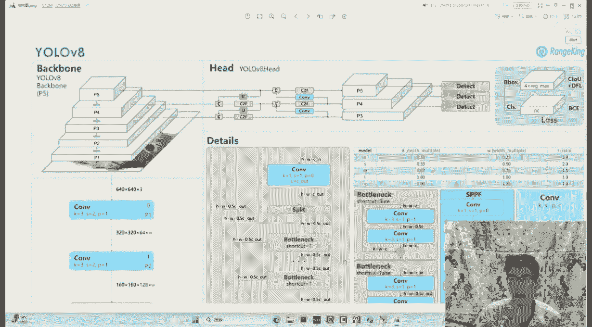
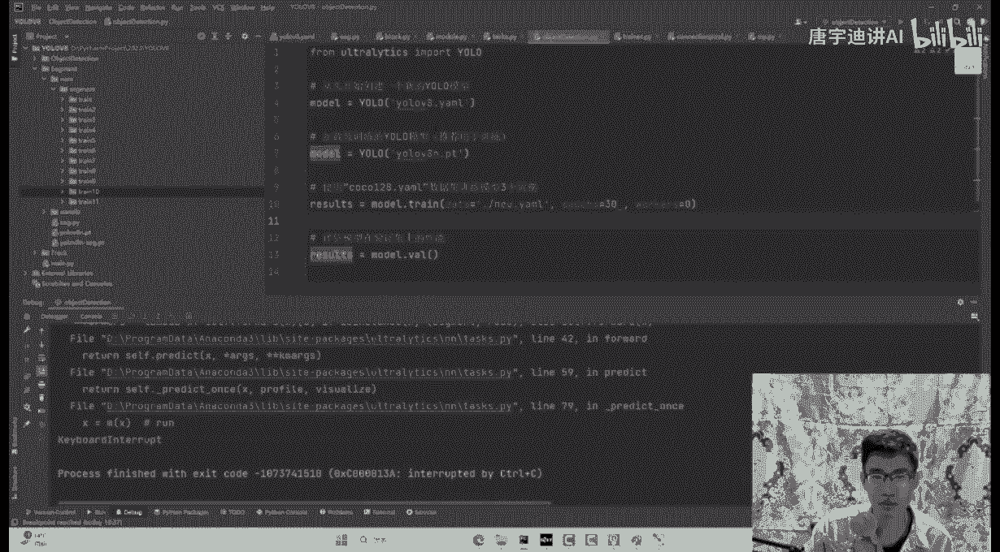
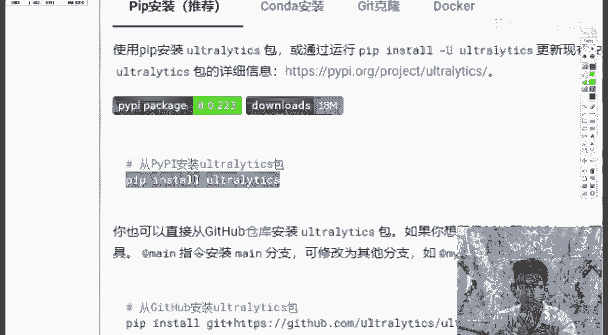
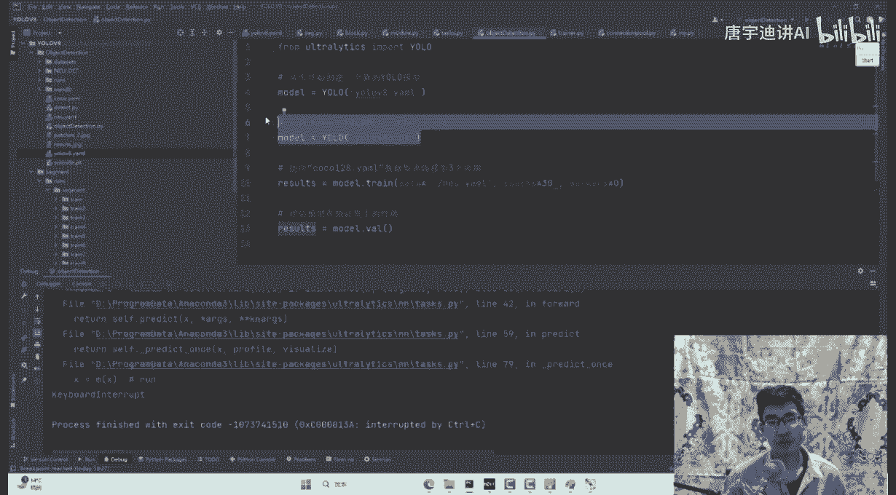
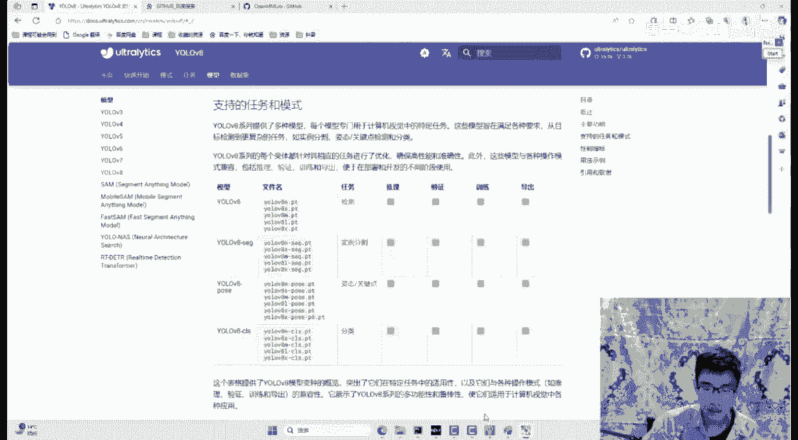
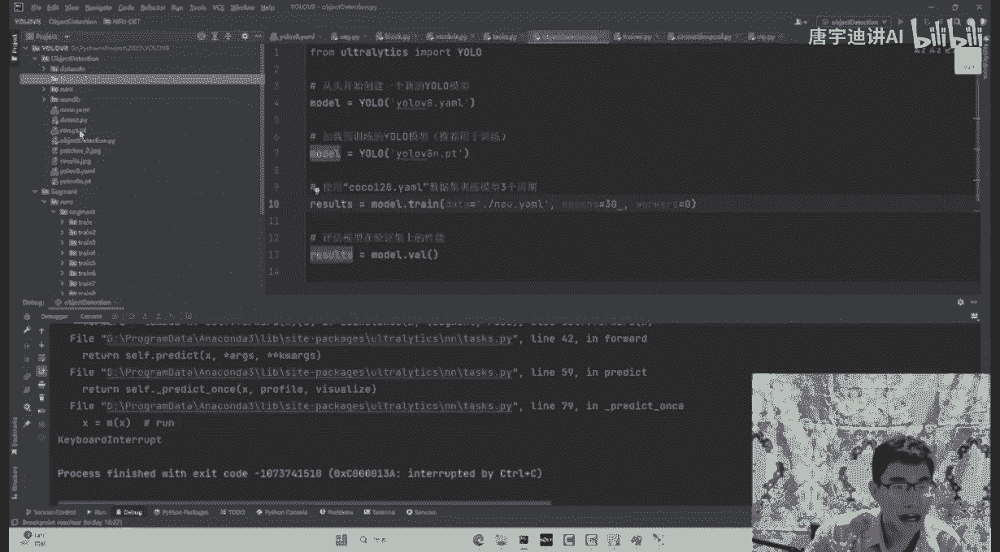
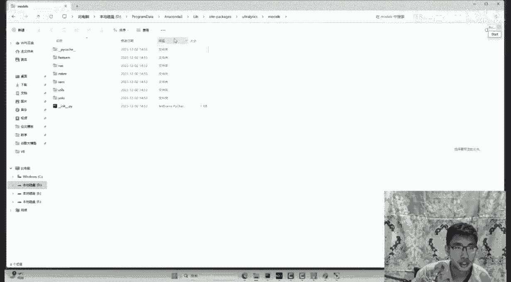

# 课程P3：YOLOv8详解与实战 🚀

在本节课中，我们将要学习物体检测的核心概念，并重点掌握当前前沿的YOLOv8模型。我们将梳理YOLO系列的发展历程，理解每一代版本的核心改进，并最终学习如何使用YOLOv8进行训练、推理以及源码层面的理解与自定义修改。

## 概述：什么是物体检测？

物体检测是计算机视觉中的一项核心任务。其目标是识别图像中特定物体的位置，并用边界框将其标注出来。

具体来说，物体检测需要完成两件事：
1.  确定物体在图像中的位置（即边界框的坐标）。
2.  识别该物体是什么（即物体的类别）。

无论是YOLO系列还是其他检测算法，其根本目标都是一致的。

## YOLO系列发展简史 📜

上一节我们介绍了物体检测的基本概念，本节中我们来看看YOLO系列是如何一步步演进的。

### YOLOv1 (2016)：奠定基础框架

YOLOv1在2016年出现，奠定了YOLO系列的基本框架。其核心思想非常直接：
1.  将输入图像通过卷积神经网络提取特征，得到特征图。
2.  特征图上的每个点都对应原始图像中的一个区域。
3.  对每个区域，模型需要预测两个核心信息：
    *   该区域存在物体的置信度（Confidence）。
    *   如果存在物体，则预测该物体边界框的精确位置（中心点坐标和长宽）。

因此，每个区域需要预测5个值：`(置信度, 中心点x, 中心点y, 宽度w, 高度h)`。

YOLOv1从一开始就确立了追求**速度快**的目标。

### YOLOv2 (2018)：引入锚框（Anchor Boxes）

YOLOv1中，每个区域只预测一种形状的边界框。但在现实中，物体有“高矮胖瘦”之分。

YOLOv2的改进在于：**为每个区域预设多种不同尺寸和比例的锚框（Anchor Boxes）**。这样，模型在每个区域会同时检查是否存在符合不同锚框形状的物体，使得检测更加全面。

### YOLOv3 (2020)：多尺度预测（FPN）

在YOLOv1和v2中，模型只在网络最深层的特征图上进行预测，这主要适合检测**大目标**。因为深层特征感受野大，能看到全局信息。

YOLOv3引入了**特征金字塔网络（FPN）** 的思想，实现了多尺度预测：
*   **深层特征**：感受野大，负责预测**大目标**。
*   **中层特征**：感受野适中，负责预测**中等目标**。
*   **浅层特征**：感受野小，关注细节，负责预测**小目标**。

这种“术业有专攻”的设计，显著提升了模型对不同尺寸目标的检测能力，尤其是小目标的召回率。

### YOLOv4 & YOLOv5 (2020)：集大成与工程化

YOLOv4可以看作是一个“集百家之长”的算法。它广泛吸收了当时计算机视觉领域各种有效的技巧和模块（如新的激活函数、注意力机制、数据增强方法等），并将其融合到YOLO框架中，使网络结构更复杂、性能更强。

YOLOv5与v4几乎同期出现。可以简单理解为：**YOLOv4是侧重创新的研究论文，而YOLOv5是高度优化、易于使用的工程项目**。YOLOv5因其出色的工程实现和易用性，被广泛应用于工业界。

### YOLOv6 & YOLOv7 (2022)：效率与结构优化

YOLOv6和v7发布时间非常接近。其中YOLOv7的应用更广泛，其主要改进点包括：
1.  **层级堆叠的模块设计**：在网络中并行地融合不同层级的特征，再进行聚合。这种设计能综合利用不同感受野的信息，相当于为模型提供了多条学习路径，增强了鲁棒性。
2.  **改进的正负样本分配策略**：在训练时，更精细地定义哪些锚框是正样本（对应真实物体），哪些是负样本（对应背景），这有助于模型更有效地学习。

### YOLOv8 (2023)：统一、便捷的新框架

现在，让我们聚焦到今天的重点——YOLOv8。它给人的整体印象可以用两个词概括：**方便**和**统一**。

*   **方便**：相比前几代，YOLOv8的使用门槛极低。通过pip安装一个包，几行代码就能开始训练或推理，2分钟即可上手。
*   **统一**：YOLOv8不再仅仅是一个目标检测框架，而是一个**统一的视觉框架**。它使用相同的主干网络（Backbone），通过不同的输出头（Head）来支持多种任务，包括：
    *   目标检测
    *   实例分割
    *   图像分类
    *   姿态估计
    *   目标跟踪

这意味着，学习一个框架，就能解决多种视觉任务，极大地提升了学习和使用效率。

## YOLOv8 网络结构解析 🏗️

了解了YOLO的发展史后，我们具体来看YOLOv8的网络结构。其整体架构与前几代一脉相承，主要由三部分组成：
1.  **主干网络（Backbone）**：负责从输入图像中提取多层次的特征。
2.  **颈部网络（Neck）**：负责融合和聚合来自主干网络不同层级的特征（例如，使用FPN+PAN结构）。
3.  **检测头（Head）**：基于融合后的特征，进行最终的分类和边界框回归预测。

YOLOv8在结构上一个显著的变化是引入了 **`C2f` 模块**（替换了YOLOv5中的`C3`模块）。`C2f`模块的设计借鉴了梯度流的思想，通过更丰富的跨层连接，在保证轻量化的同时，促进了信息流动。

以下是`C2f`模块的一个简化示意代码，帮助理解其多分支结构：

```python
# 伪代码，示意C2f模块结构
class C2f(nn.Module):
    def __init__(self, c1, c2, n=1, shortcut=False):
        super().__init__()
        self.c = c2 // 2  # 通道数减半
        self.cv1 = Conv(c1, 2 * self.c, 1)  # 初始卷积，通道数翻倍以用于分割
        self.cv2 = Conv((2 + n) * self.c, c2, 1)  # 最终融合卷积
        # 多个Bottleneck模块构成的核心处理块
        self.m = nn.ModuleList(Bottleneck(self.c, self.c, shortcut) for _ in range(n))

    def forward(self, x):
        y = list(self.cv1(x).chunk(2, 1))  # 将特征图在通道维度切分成两部分
        y.extend(m(y[-1]) for m in self.m)  # 一部分经过多个Bottleneck处理
        return self.cv2(torch.cat(y, 1))  # 将所有分支的结果拼接并融合
```

## YOLOv8 实战：快速训练自定义模型 ⚡

理论部分已经清晰，本节我们将手把手学习如何使用YOLOv8训练你自己的模型。整个过程非常简单。

### 第一步：安装与环境准备

YOLOv8的安装极其简单，只需一行命令：

```bash
pip install ultralytics
```

这个`ultralytics`包包含了YOLOv8的所有源码和依赖。

### 第二步：准备数据配置文件



YOLOv8要求将数据集的路径和类别信息写在一个YAML配置文件中。这是你需要准备的核心文件。



以下是一个数据配置文件的示例模板：

```yaml
# 数据集配置文件示例：data_custom.yaml
path: /home/user/datasets/my_custom_data  # 数据集根目录
train: images/train  # 训练集图像路径（相对于path）
val: images/val      # 验证集图像路径（相对于path）
test: images/test    # 测试集图像路径（可选）



# 类别名称列表
names:
  0: person
  1: bicycle
  2: car
  # ... 你的其他类别
```

你需要按照此格式，将自己的数据集整理好，并修改`path`和`names`等内容。

### 第三步：选择模型与开始训练

准备好数据后，只需几行Python代码即可启动训练。

以下是训练代码示例：

```python
from ultralytics import YOLO

# 1. 加载一个预训练模型（YOLOv8提供了不同尺寸的模型，如n, s, m, l, x）
model = YOLO('yolov8n.pt')  # 这里加载最小的 yolov8n 模型



# 2. 使用自定义数据训练模型
results = model.train(
    data='path/to/your/data_custom.yaml',  # 上一步准备的数据配置文件路径
    epochs=100,                            # 训练轮数
    imgsz=640,                             # 输入图像尺寸
    batch=16,                              # 批次大小
    name='my_custom_model'                 # 本次训练实验的名称
)
```



训练完成后，模型权重会自动保存，你可以直接使用训练好的模型进行推理。



### 第四步：使用模型进行推理

训练完成后，对新图像或视频进行检测同样简单。

以下是推理代码示例：

```python
from ultralytics import YOLO

# 加载训练好的最佳模型
model = YOLO('runs/detect/my_custom_model/weights/best.pt')

# 对图像进行推理
results = model('path/to/your/test_image.jpg')
# 结果会自动保存，并可视化显示检测框



# 对视频进行推理
results = model('path/to/your/test_video.mp4', save=True)
```

## 总结



本节课中我们一起学习了YOLOv8的方方面面。



我们从**物体检测的基本概念**出发，回顾了**YOLO系列从v1到v8的发展历程**，理解了每一代的核心贡献：v1奠定快速检测框架，v2引入锚框，v3实现多尺度预测，v4/v5集大成并工程化，v7优化模块与样本分配，直至最新的v8成为一个**统一、便捷**的视觉框架。

我们解析了YOLOv8的**网络结构**，认识了其标志性的`C2f`模块。最后，我们通过一个完整的实战流程，学习了如何**安装YOLOv8、准备数据、训练自定义模型并进行推理**。整个过程凸显了YOLOv8设计哲学：**让最先进的技术变得简单易用**。



希望本教程能帮助你快速入门YOLOv8，并将其应用到你的实际项目中。