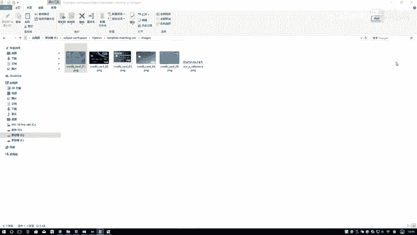
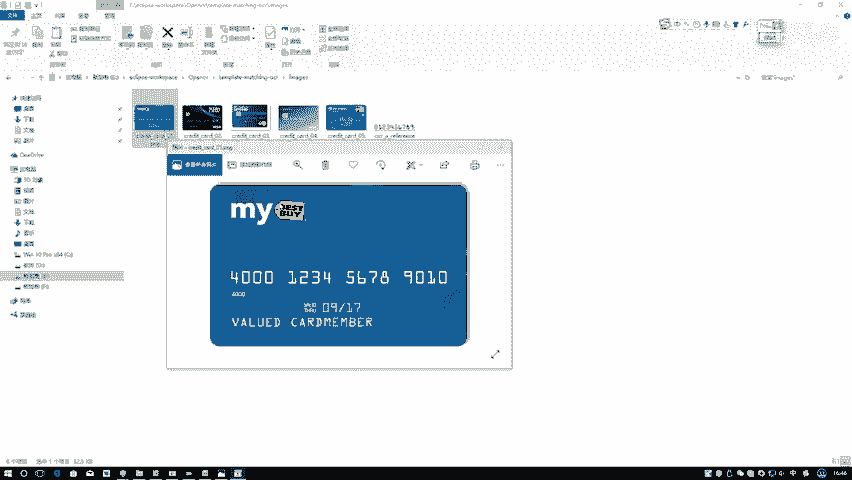
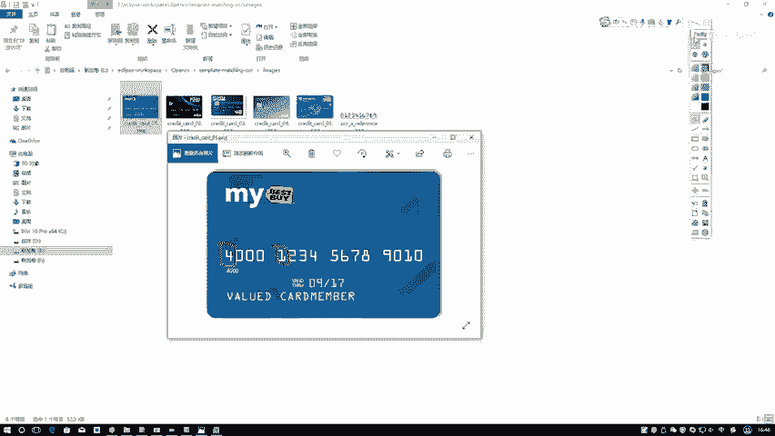
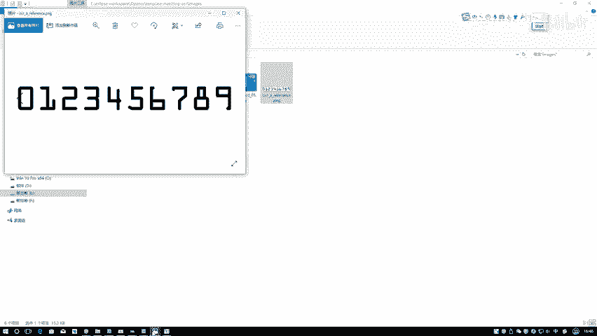
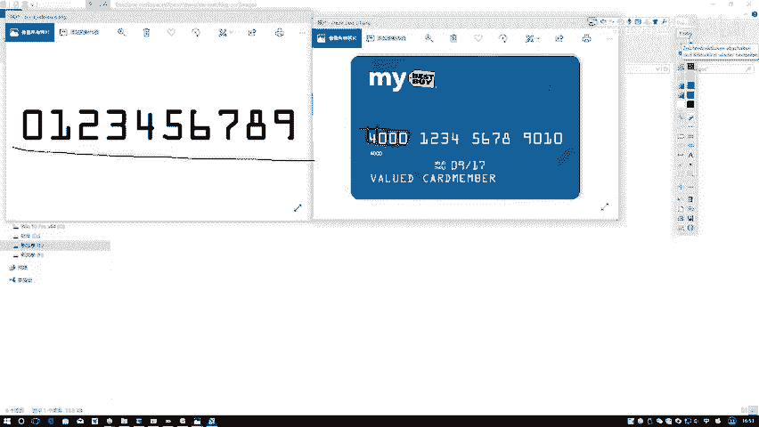
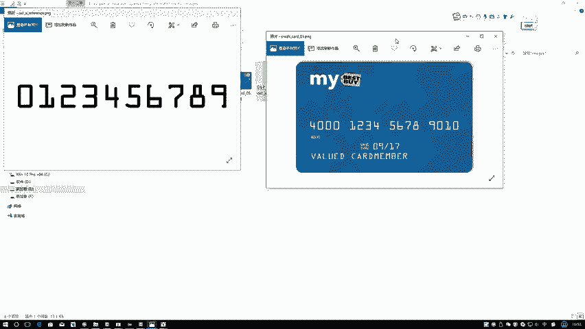
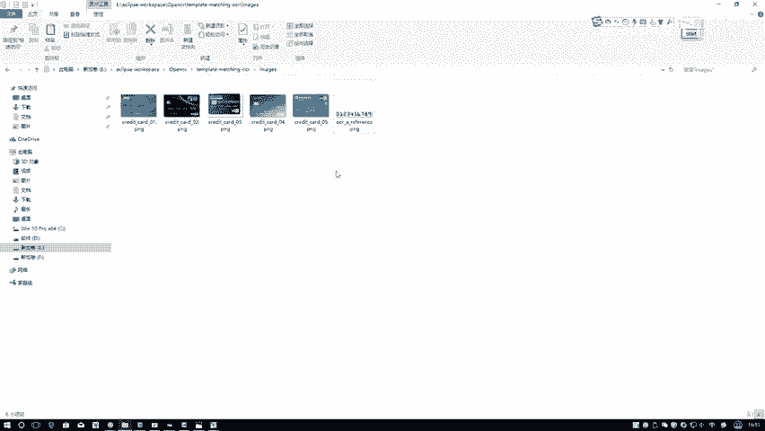

# 课程31：银行卡号识别项目实战流程与方法讲解 💳

在本节课中，我们将学习如何利用OpenCV完成一个银行卡号识别的实战项目。我们将把之前学过的图像处理、轮廓检测、模板匹配等知识点串联起来，实现从一张银行卡图像中定位并识别出卡号的功能。

## 项目概述与目标

我们要做的是：输入一张银行卡图像，程序需要完成两件事。第一，识别出卡上的数字序列，例如“4000 1234 5678 9010”。第二，不仅要输出数字，还需要在图像上标出每组数字对应的位置，例如用方框将第一组“4000”框起来。

这个任务与我们生活中停车场自动识别车牌的原理类似，只不过我们处理的对象是银行卡图像。

## 总体流程与方法

上一节我们明确了项目目标，本节中我们来看看实现这个目标的具体流程和方法。核心思想是结合轮廓检测与模板匹配。

### 核心方法：模板匹配

识别单个数字的核心方法是模板匹配。我们需要预先准备一个包含数字0-9的模板图像。当程序从银行卡上截取到一个数字区域（例如一个“4”）后，会拿这个区域与模板中的每一个数字进行匹配计算（例如计算平方差）。匹配度最高（即差异最小或相似度最大）的那个模板数字，就被判定为当前截取的数字。

**核心公式/概念**：
在模板匹配中，常使用归一化平方差匹配法，其公式可表示为：
`R(x, y) = Σ [T(x', y') - I(x + x', y + y')]^2`
其中，`T` 是模板图像，`I` 是输入图像，`R` 是结果矩阵，值越小表示匹配度越高。

### 关键步骤：轮廓检测与外接矩形

为了进行模板匹配，我们首先需要从模板图像和银行卡图像中分别提取出每个独立的数字区域。

以下是实现这一目标的关键步骤：

1.  **准备专用模板**：模板的字体必须与待识别银行卡上的数字字体高度相似，否则匹配准确率会很低。
2.  **轮廓检测**：对模板图像和预处理后的银行卡图像进行轮廓检测。我们需要的是每个数字的外轮廓。
3.  **获取外接矩形**：对检测到的每个轮廓，计算其外接矩形。这个矩形框定了每个数字的区域。
4.  **模板数字提取**：根据外接矩形，从模板图像中裁剪出每个数字（0-9）的独立图像，并存储起来以备匹配使用。
5.  **银行卡数字区域提取**：同样，根据银行卡图像上检测到的轮廓和外接矩形，初步定位可能的数字区域。

### 预处理与轮廓过滤

在实际操作中，直接从原始图像进行轮廓检测会得到大量无关轮廓（如卡面上的文字、Logo等）。因此，需要一系列预处理和过滤操作。

以下是关键的预处理与过滤步骤：

1.  **图像预处理**：将彩色银行卡图像转换为灰度图，然后通过阈值处理（二值化）为后续轮廓检测做准备。
2.  **形态学操作**：利用膨胀、腐蚀等形态学操作，帮助连接数字笔画、去除细小噪声，使数字区域的轮廓更完整、更易于检测。
3.  **轮廓过滤**：对检测到的所有轮廓，根据其外接矩形的**长宽比**和**面积**进行过滤。银行卡数字具有特定的长宽比例，而“MC”、“VISA”等标志的轮廓比例与之不同。通过设定合理的阈值，可以过滤掉大部分非数字轮廓。
4.  **轮廓排序**：银行卡号通常分为4组。我们需要将过滤后得到的数字轮廓，按照其水平位置（x坐标）进行排序，以确保最终输出的数字顺序是正确的。

### 执行匹配与输出

经过上述步骤，我们得到了模板数字库和银行卡上待识别的数字区域列表。

以下是匹配与输出的最终步骤：

1.  **尺寸归一化**：将银行卡上截取到的每个数字区域图像，缩放（`resize`）到与模板数字相同的尺寸。
2.  **循环匹配**：对于银行卡上的每一个数字区域，循环与模板中的10个数字进行匹配，找到最相似的那个，并记录其值。
3.  **绘制与输出**：根据匹配结果，在原始银行卡图像上，在每个数字区域的外接矩形位置绘制方框，并标注识别出的数字。同时，在控制台输出完整的卡号序列。

## 总结

本节课中，我们一起学习了银行卡号识别项目的完整流程。我们首先明确了项目目标，即定位并识别卡号。然后，我们深入探讨了实现这一目标的核心方法——**模板匹配**，并详细阐述了支撑该方法的**轮廓检测与外接矩形提取**技术。最后，我们梳理了从图像预处理、轮廓过滤到最终匹配输出的全链路步骤，其中涉及了灰度转换、二值化、形态学操作等关键预处理技术。这个项目是将OpenCV多个基础知识点综合应用的典型范例。