# 课程P34：4-输入数据处理方法 📊

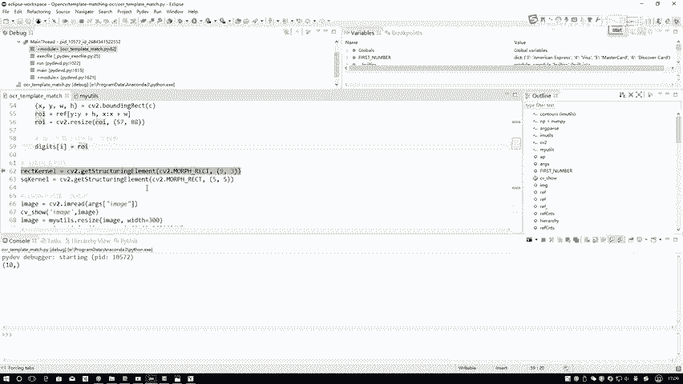

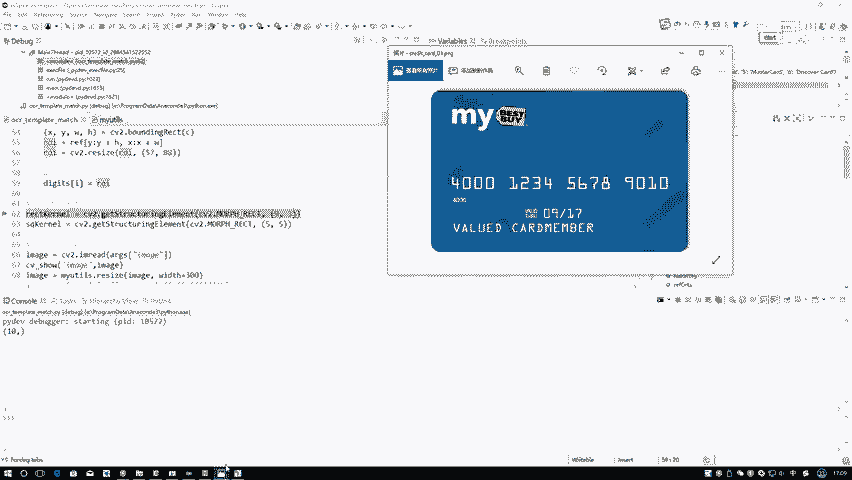

在本节课中，我们将学习如何对输入图像进行一系列预处理操作，以提取信用卡上的数字区域。原始图像包含背景干扰，因此需要通过形态学操作、边缘检测和阈值处理等方法，将目标区域清晰地分离出来。

## 定义形态学操作核

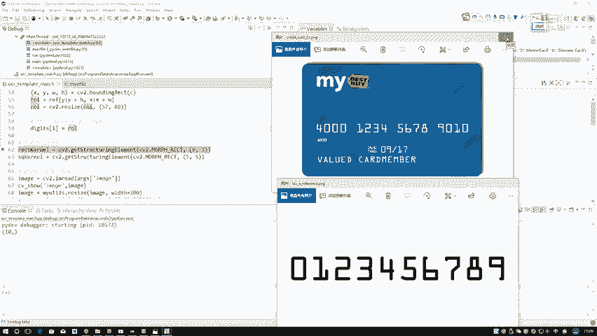

上一节我们介绍了模板图像的简单处理。本节中我们来看看如何处理更复杂的信用卡图像。首先，我们需要定义形态学操作中使用的核。

以下是定义两个不同大小核的代码：

```python
# 定义第一个核，大小为9x3
kernel_9x3 = cv2.getStructuringElement(cv2.MORPH_RECT, (9, 3))
# 定义第二个核，大小为5x5
kernel_5x5 = cv2.getStructuringElement(cv2.MORPH_RECT, (5, 5))
```

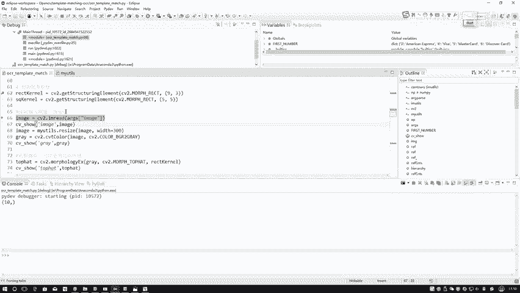

核的大小需要根据实际任务指定，目的是为了突出特定大小的区域，例如信用卡上的数字区域。

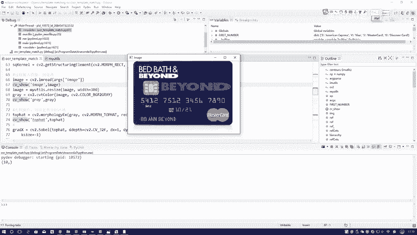

## 图像读取与初步处理

接下来，我们开始对输入数据进行预处理。第一步是读取图像并进行基础调整。

以下是读取图像并进行初步处理的步骤：

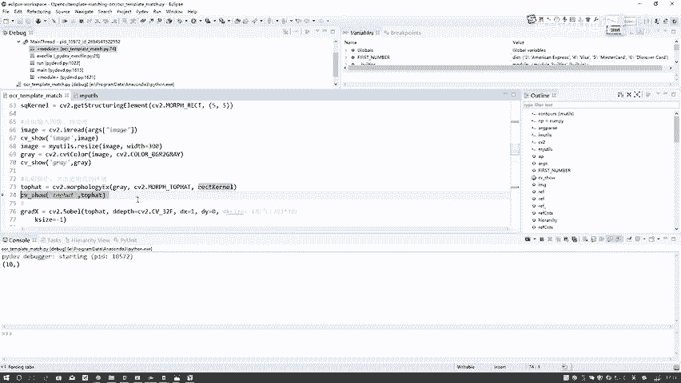

1.  读取原始图像数据。
2.  使用`resize`函数将图像调整至合适大小。
3.  将彩色图像转换为灰度图。

完成这些步骤后，我们得到了一个便于后续处理的灰度图像。

## 顶帽操作突出明亮区域

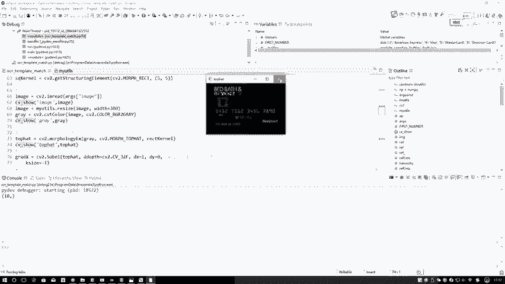

得到灰度图后，我们希望突出图像中的明亮区域（如数字），同时过滤掉背景。这可以通过形态学中的顶帽操作实现。

顶帽操作使用之前定义的核，能够突出比周围更亮的区域。以下是执行顶帽操作的代码：

```python
tophat = cv2.morphologyEx(gray, cv2.MORPH_TOPHAT, kernel_9x3)
```

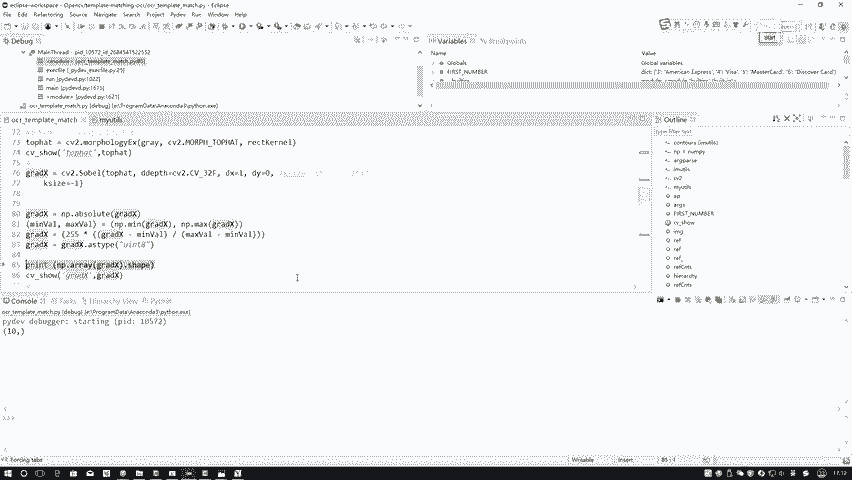

此操作并非必需，但能有效帮助我们聚焦于数字区域。预处理方法多样，可根据实际情况选择。

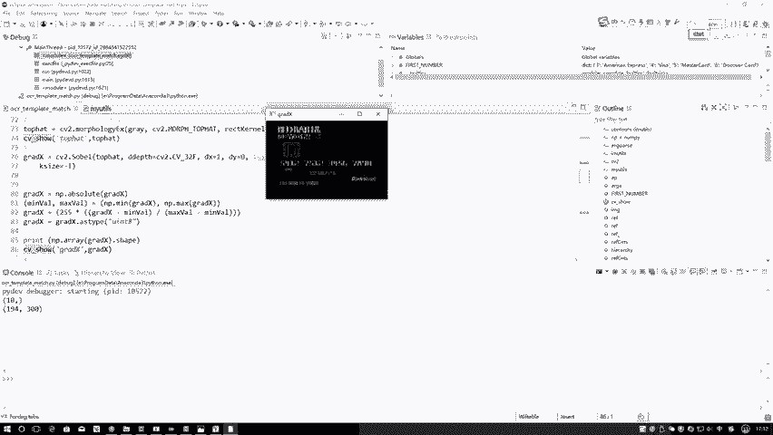

## 索贝尔算子边缘检测

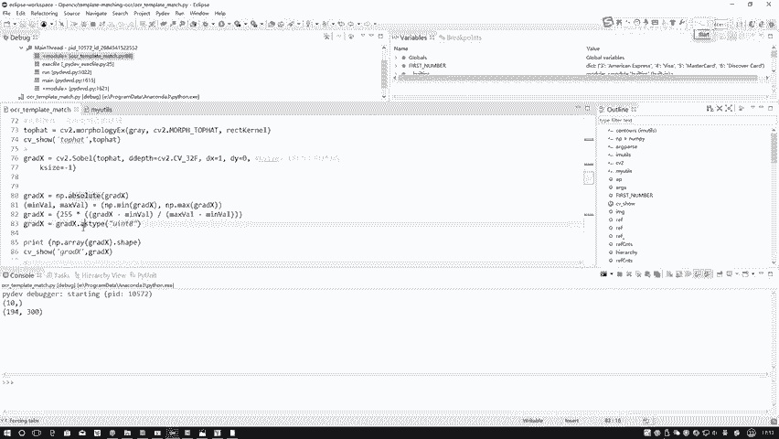

突出明亮区域后，我们需要进一步检测数字的边缘。这里使用索贝尔算子计算图像在X方向的梯度。

以下是计算X方向梯度的步骤：

1.  使用`cv2.Sobel`函数计算X方向的梯度。
2.  取计算结果的绝对值。
3.  将结果归一化到0-255范围。

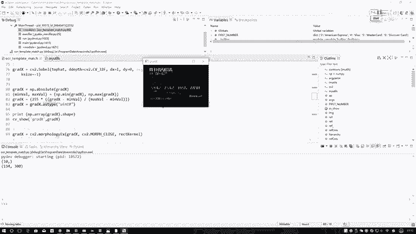

实验发现，在此任务中仅使用X方向梯度比结合Y方向效果更好。索贝尔算子帮助我们得到了数字的边缘信息。

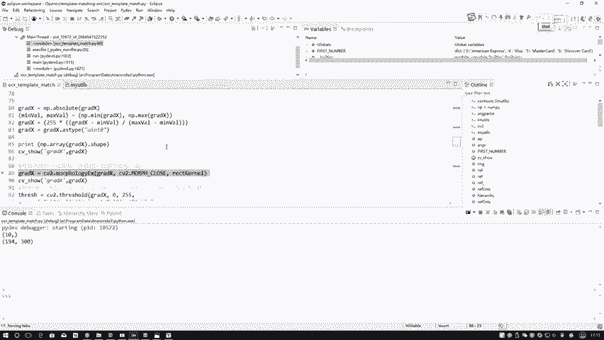

## 闭操作连接区域

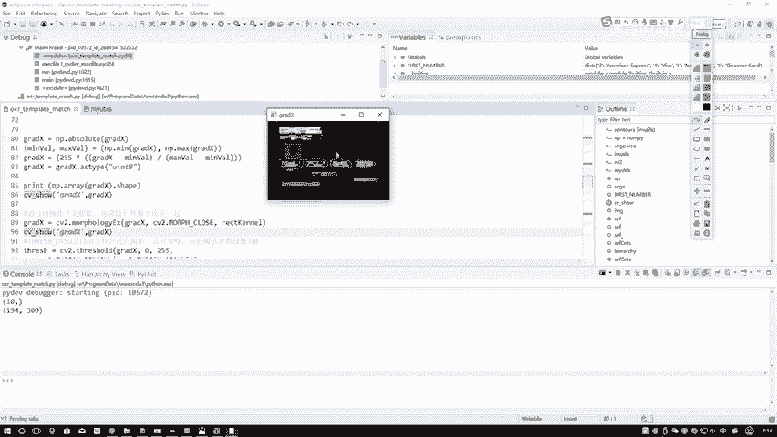

边缘检测后，数字的笔画可能还是分离的。我们希望将属于同一个数字的笔画连接起来，形成一个完整的“块”。

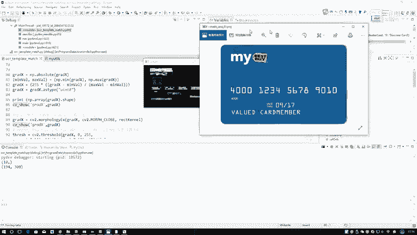

形态学中的闭操作（先膨胀后腐蚀）可以实现这个目的。以下是执行闭操作的代码：

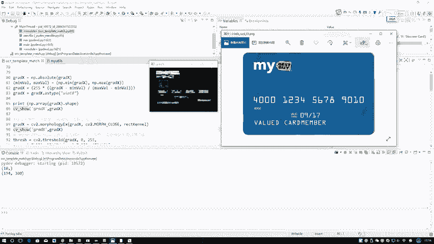

```python
closed = cv2.morphologyEx(gradX, cv2.MORPH_CLOSE, kernel_9x3)
```

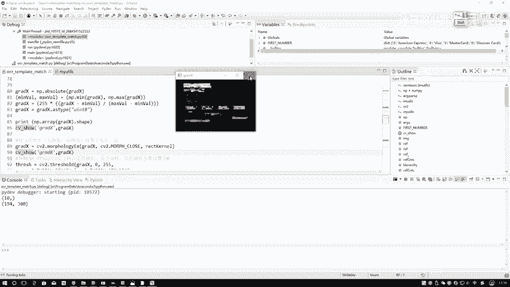

执行闭操作后，原本分散的笔画被连接起来，每个数字区域更接近一个完整的白色块状结构，同时背景干扰被进一步过滤。

## 自动阈值二值化

为了将前景（数字）和背景完全分离，需要进行二值化处理。由于图像灰度直方图呈现双峰形态，适合使用Otsu方法自动寻找最佳阈值。

以下是使用Otsu方法进行自动阈值二值化的代码：

```python
thresh = cv2.threshold(closed, 0, 255, cv2.THRESH_BINARY | cv2.THRESH_OTSU)[1]
```

参数`0`表示让OpenCV自动判断阈值，而非使用固定值。二值化后，数字区域为白色，背景为黑色。

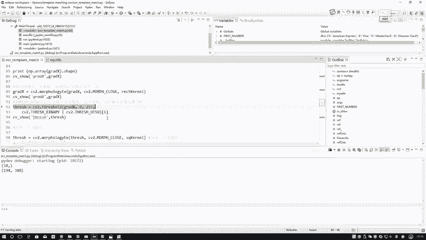

## 二次闭操作填充空隙

二值化图像中，数字块内部可能存在一些小孔洞。为了使轮廓检测更准确，需要填充这些空隙。

我们可以再次使用闭操作来填充白色区域内部的黑点。以下是代码：


```python
thresh = cv2.morphologyEx(thresh, cv2.MORPH_CLOSE, kernel_5x5)
```

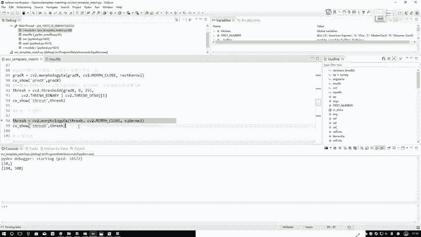

经过这次操作，数字区域变得更加饱满和连续，为轮廓检测做好了准备。

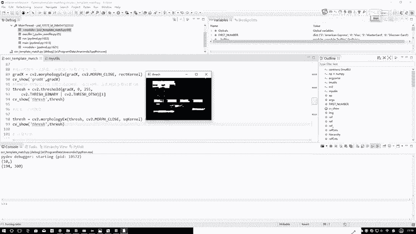

## 轮廓检测与筛选

最后，我们在处理后的二值图像上检测所有轮廓。但检测到的轮廓包含许多不规则形状，我们需要从中筛选出代表四个数字组的轮廓。

以下是轮廓检测与绘制的基本步骤：

1.  使用`cv2.findContours`函数在二值图像`thresh`上查找轮廓。
2.  将找到的轮廓绘制到原始彩色图像上以便观察。
3.  根据轮廓的宽高比、面积等特征，编写过滤逻辑，只保留代表数字的四个主要轮廓。

轮廓检测是在经过所有预处理的二值图像上进行的，绘制则是为了在原始图像上可视化结果。

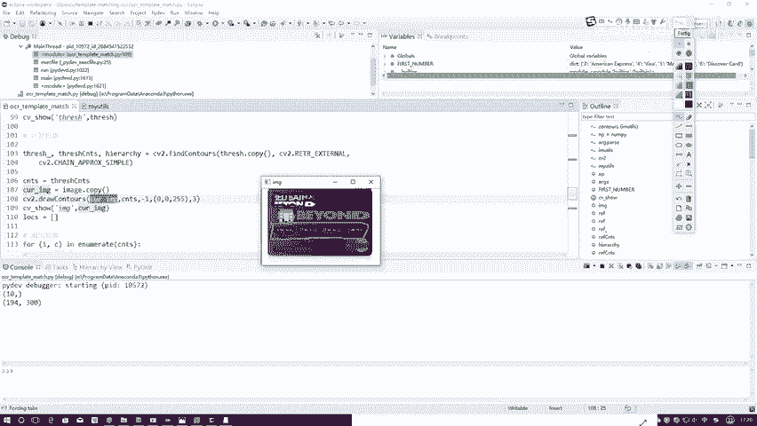

本节课中我们一起学习了信用卡数字识别的完整预处理流程。我们从读取图像开始，依次进行了顶帽操作、索贝尔边缘检测、闭操作连接区域、Otsu自动阈值二值化、二次闭操作填充空隙，最后进行轮廓检测与筛选。这一系列步骤有效地去除了背景干扰，将四个数字区域清晰地分离出来，为后续的数字识别奠定了坚实基础。