# 课程 P35：5-模板匹配得出识别结果 📊

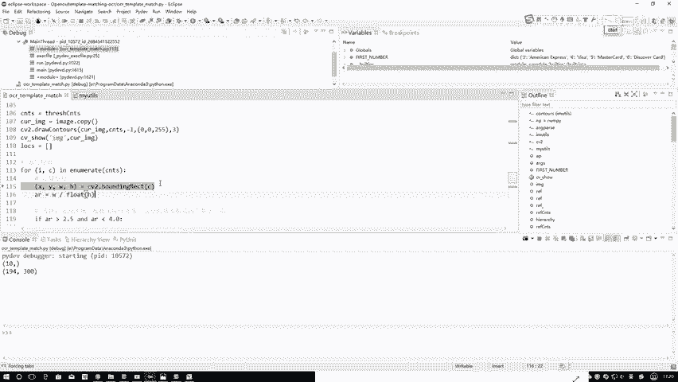

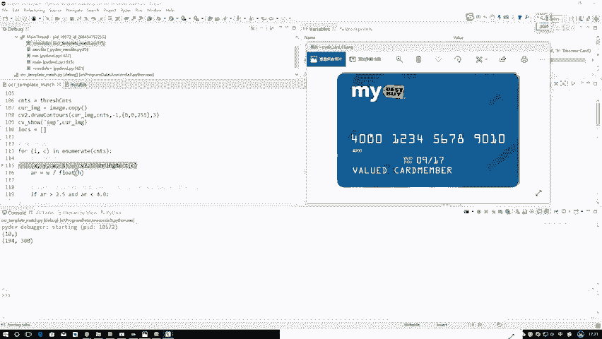

在本节课中，我们将学习如何通过模板匹配技术，从信用卡图像中识别出数字。整个过程分为两大步：首先定位数字所在的区域，然后在这些区域内与预先准备好的数字模板进行匹配，从而得出最终的识别结果。

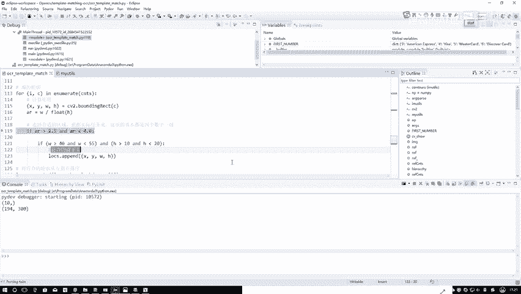

---

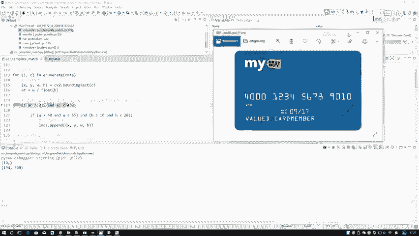

## 轮廓筛选与排序 🔍

上一节我们介绍了如何检测图像中的轮廓。本节中我们来看看如何从众多轮廓中筛选出我们需要的数字区域，并对它们进行排序。

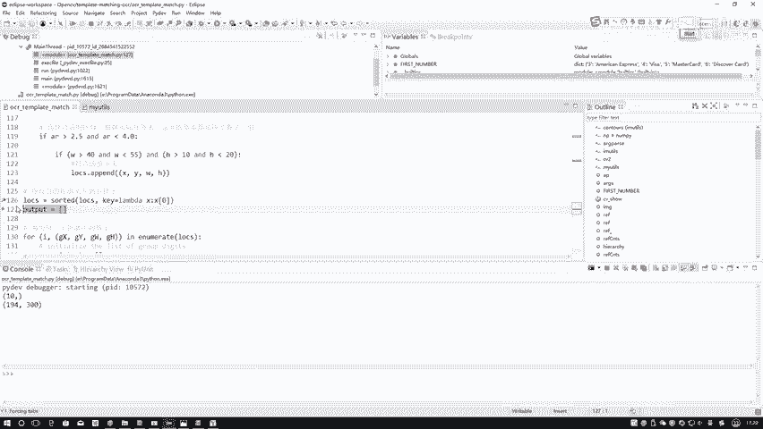

首先，我们需要遍历检测到的所有轮廓。对于每一个轮廓，计算其外接矩形。这是因为我们需要根据轮廓的特征（如长宽比）来判断它是否是我们想要的数字区域。


```python
# 伪代码示例：计算轮廓的外接矩形
x, y, w, h = cv2.boundingRect(contour)
```

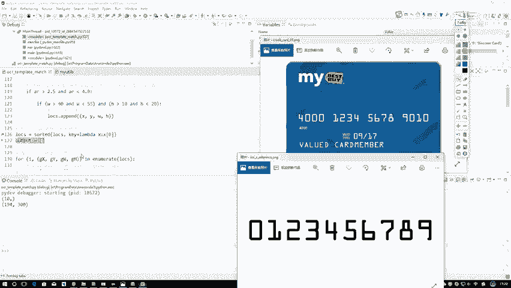

计算外接矩形后，我们可以根据其长宽比进行筛选。信用卡上的数字区域有其特定的长宽比例，通过设定合适的阈值，可以过滤掉不相关的轮廓。

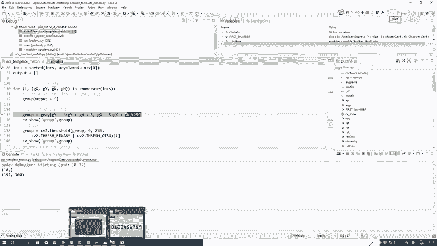

以下是筛选轮廓的步骤：
1.  计算每个轮廓的外接矩形。
2.  根据外接矩形的长宽比进行判断。
3.  将符合条件（即可能是数字组）的轮廓保存起来。

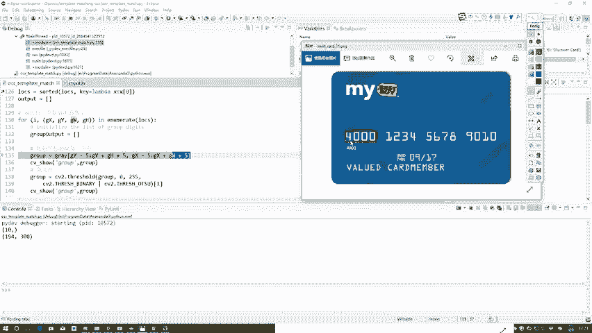

经过筛选，我们得到了四个大的轮廓区域，每个区域对应信用卡上的一组数字。接下来，我们需要对这些轮廓从左到右进行排序，以确保按正确的顺序处理数字组。

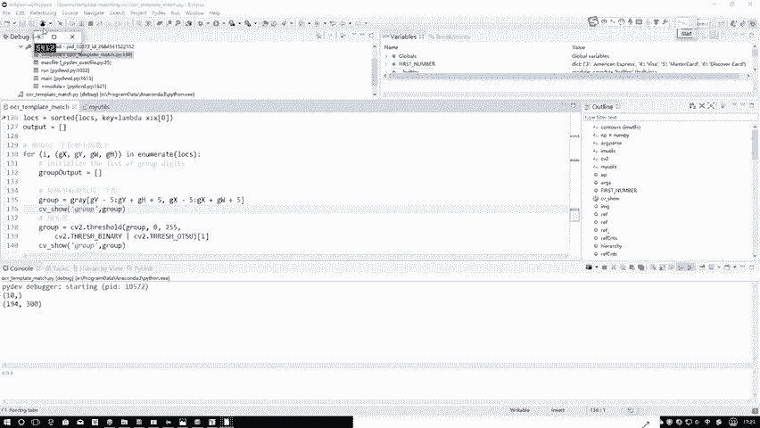

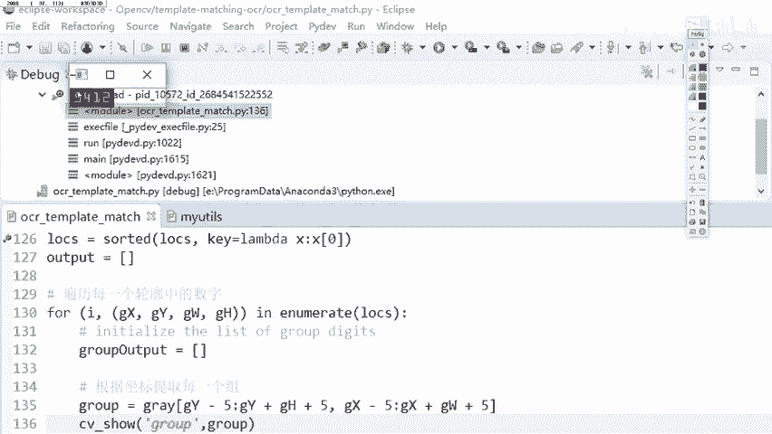

```python
# 伪代码示例：对轮廓按x坐标排序
locations = sorted(locations, key=lambda loc: loc[0])
```

---

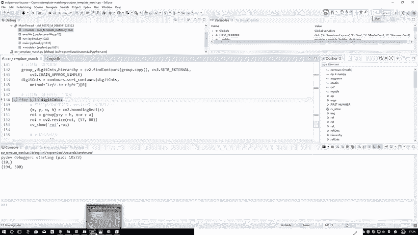

## 提取并处理单个数字区域 🔢

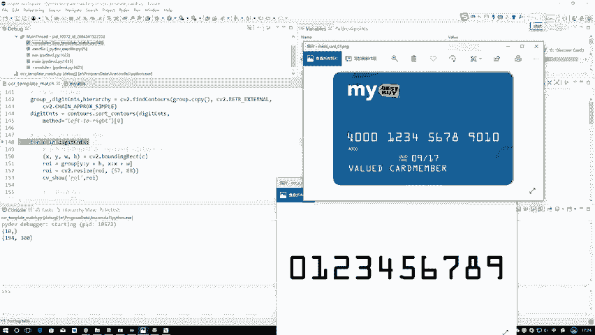

在定位并排序了数字组的大轮廓后，我们需要在每个大轮廓内部进一步提取出单个的数字。

首先，取出第一个大轮廓（例如对应数字“5412”的区域）。为了确保提取完整，我们通常会将轮廓区域稍微向外扩展一些像素。

```python
# 伪代码示例：扩展轮廓区域
x_expanded = x - 5
y_expanded = y - 5
w_expanded = w + 10
h_expanded = h + 10
group_image = original_image[y_expanded:y_expanded+h_expanded, x_expanded:x_expanded+w_expanded]
```

然后，对这个扩展后的区域图像进行预处理（如灰度化、二值化），并再次进行轮廓检测。这次检测是为了找到该组数字内部的每一个小数字的轮廓。

找到所有小轮廓后，同样需要按从左到右的顺序进行排序，以确保数字顺序正确。

---

## 执行模板匹配 🎯

现在，我们有了单个数字的图像。接下来，就是通过模板匹配来判断这个数字具体是几。

首先，需要将待识别的数字图像调整到与模板图像完全相同的大小。这是因为模板匹配要求输入图像和模板图像尺寸一致。

```python
# 伪代码示例：调整图像大小以匹配模板
digit_resized = cv2.resize(digit_roi, (57, 88))
```

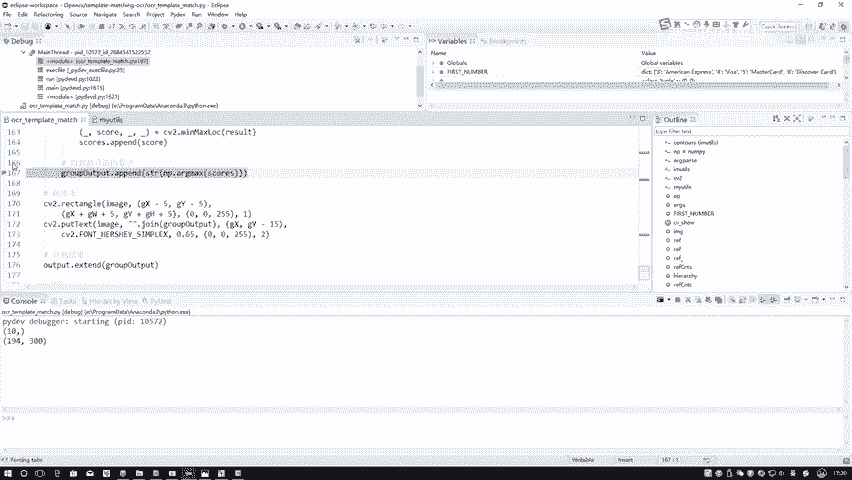

然后，让这个调整后的数字图像与0到9这十个数字模板依次进行匹配。OpenCV提供了多种匹配方法，这里我们使用相关系数法（`cv2.TM_CCOEFF`）。

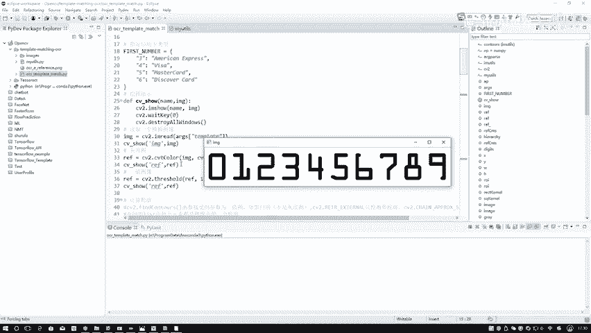

以下是匹配过程的步骤：
1.  初始化一个列表`scores`，用于存储与每个模板（0-9）的匹配得分。
2.  遍历十个数字模板。
3.  对每个模板，使用`cv2.matchTemplate`函数进行匹配，并获取匹配得分。
4.  将得分存入`scores`列表。

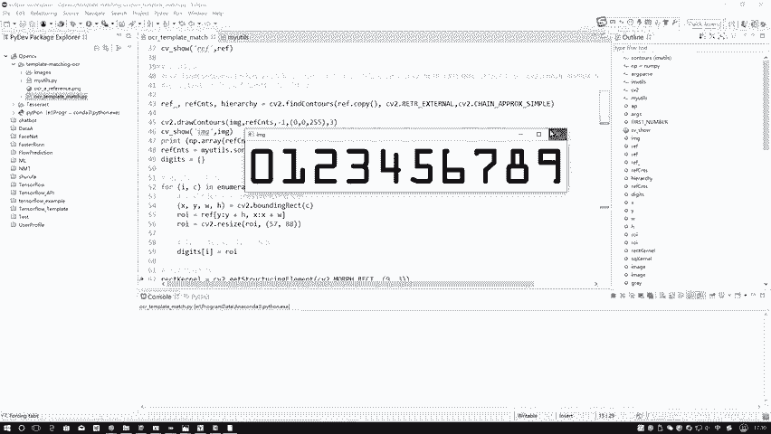

匹配完成后，`scores`列表中得分最高的那个索引，就对应了识别出的数字。例如，如果`scores[5]`的值最大，那么识别结果就是数字5。

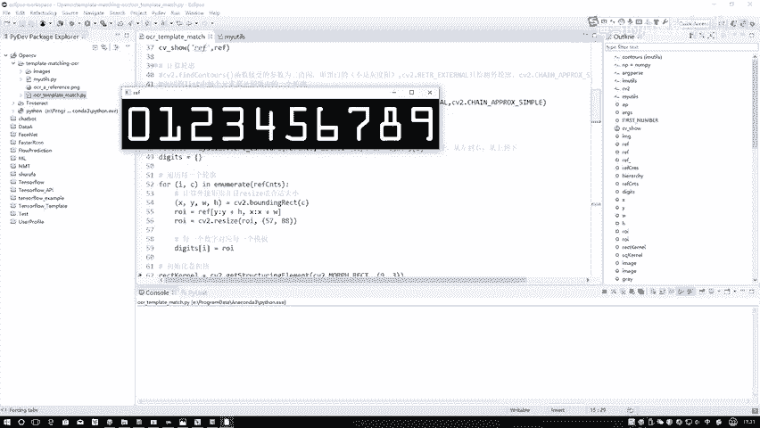

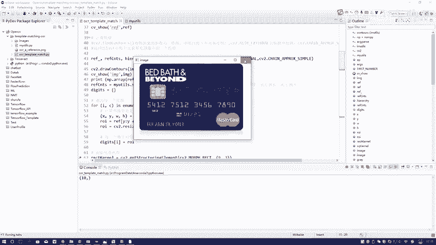

```python
# 伪代码示例：模板匹配并找出最佳匹配
method = cv2.TM_CCOEFF
scores = []
for digit in template_digits:
    result = cv2.matchTemplate(digit_resized, digit, method)
    _, max_val, _, _ = cv2.minMaxLoc(result)
    scores.append(max_val)

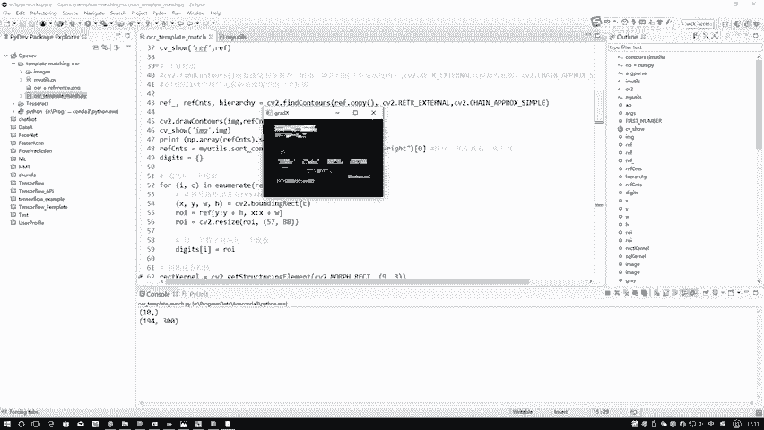

recognized_digit = scores.index(max(scores))
```

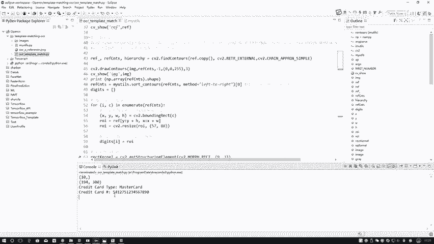

对一组数字中的每一个都重复上述过程，就能识别出整组数字（如“5412”）。最后，在原图上绘制出识别出的数字和边界框进行可视化。

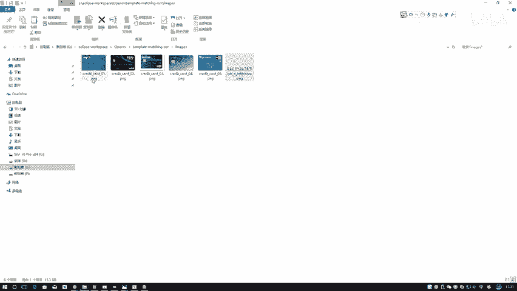

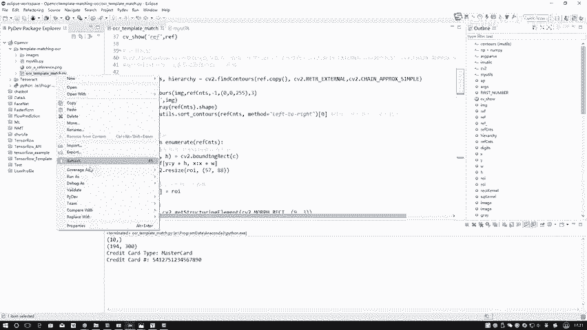

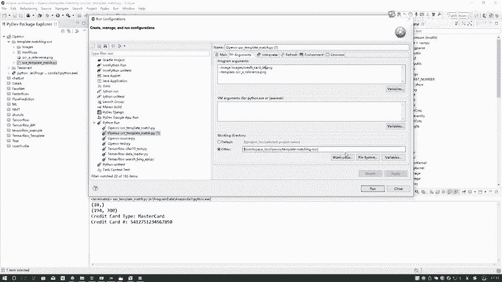

---

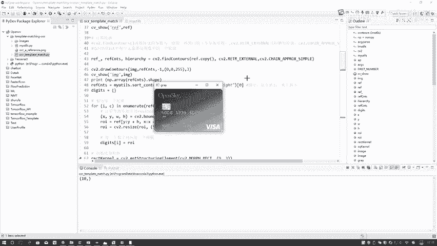

## 流程总结与扩展应用 📈

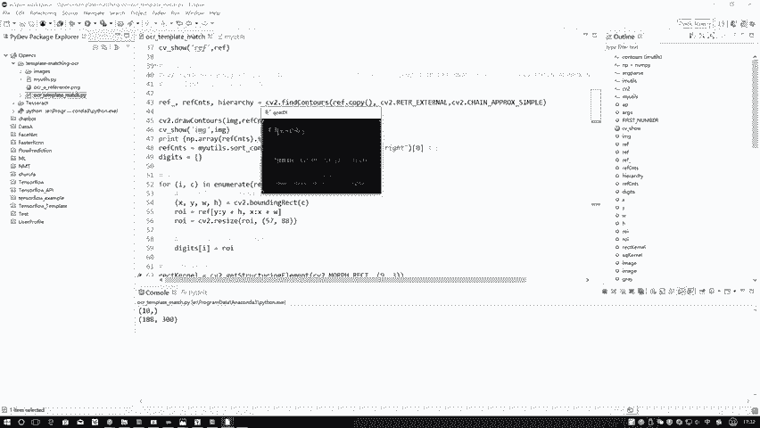

本节课中我们一起学习了如何利用模板匹配完成信用卡数字识别的完整流程。

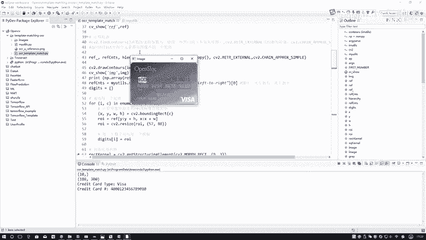

整个流程可以总结为以下几个核心步骤：
1.  **模板准备**：预处理0-9的数字模板，并调整至统一大小。
2.  **图像输入与预处理**：对输入的信用卡图像进行灰度化、二值化等操作。
3.  **轮廓检测与筛选**：检测图像轮廓，根据长宽比等特征筛选出数字组区域，并进行排序。
4.  **数字提取**：在每个数字组区域内，再次检测并提取出单个数字轮廓。
5.  **模板匹配**：将每个数字与模板库匹配，得分最高者即为识别结果。
6.  **结果输出**：在原图上标注识别出的数字。

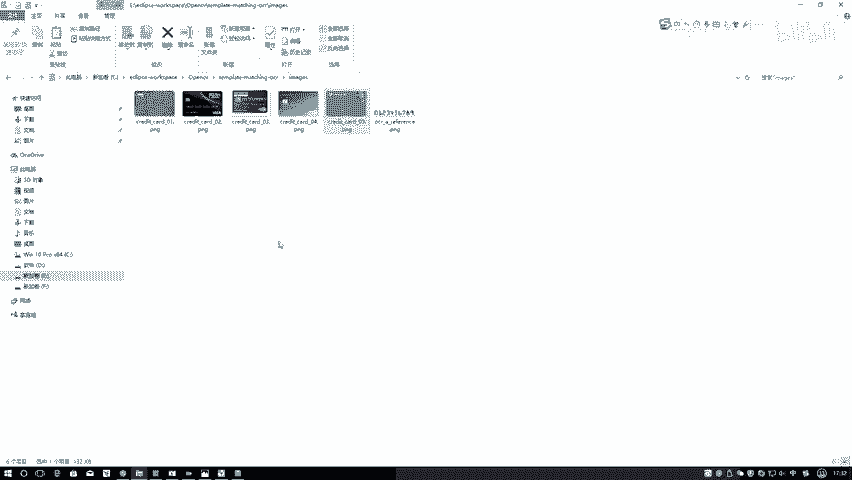

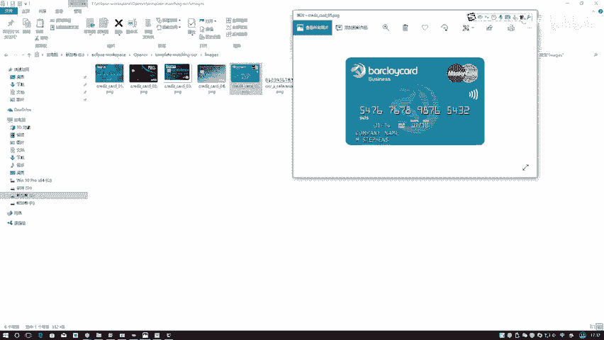

这个方法的原理不仅适用于信用卡识别，稍加修改即可应用于其他类似场景，例如车牌号码识别。其核心思想都是**先定位目标区域，再在区域内进行特征匹配**。

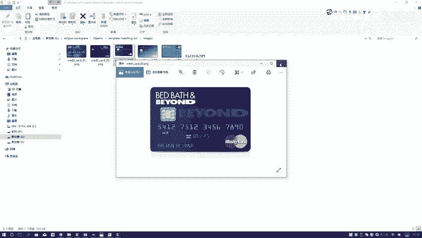

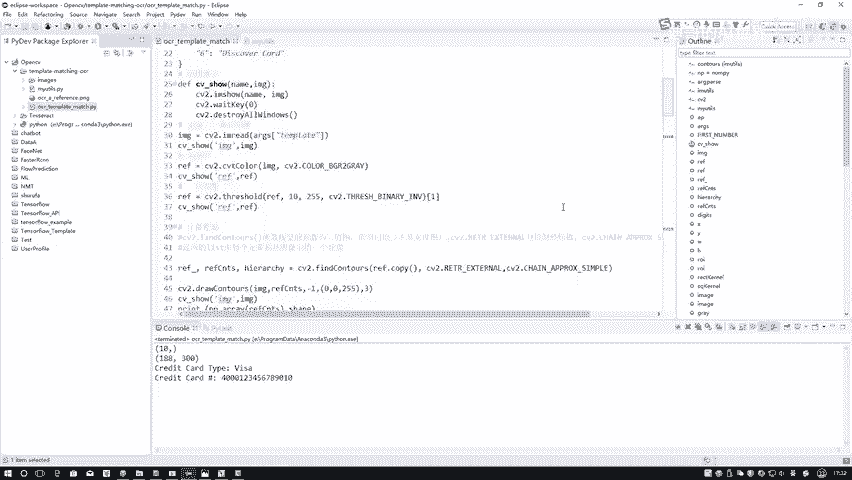

通过本课程，你掌握了使用OpenCV基础函数解决实际图像识别问题的完整思路。