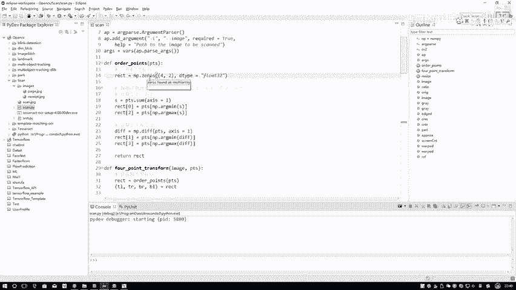
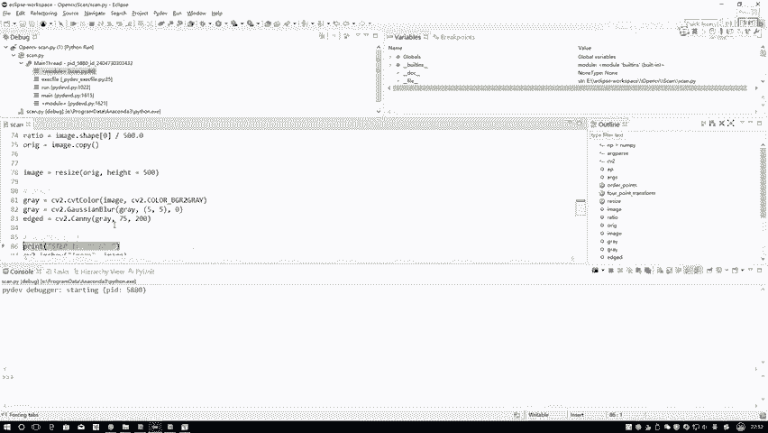
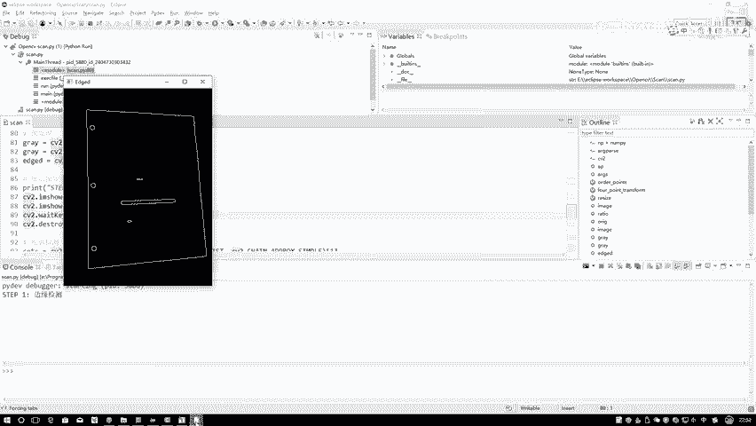
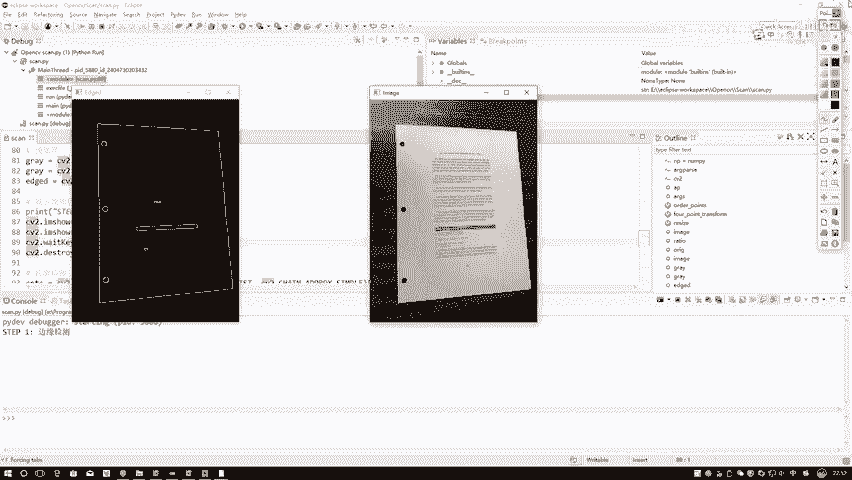
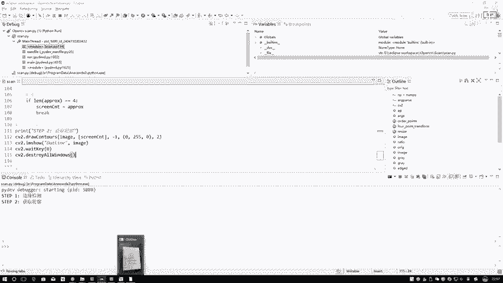
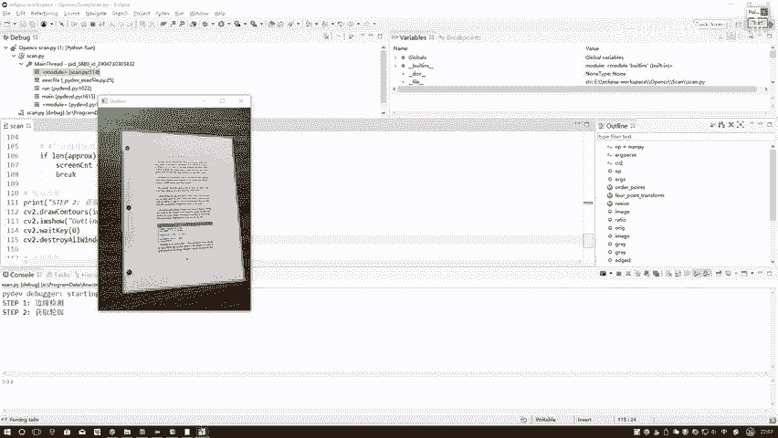
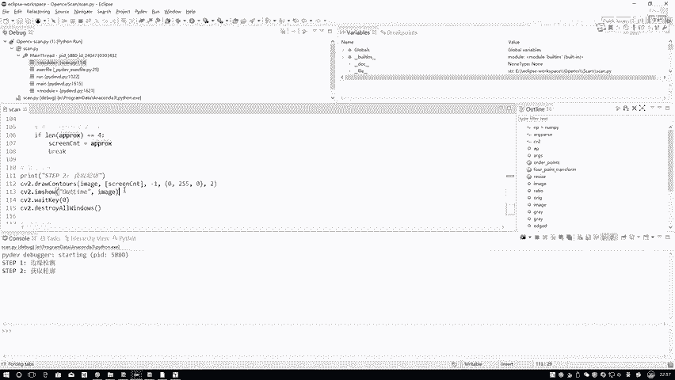

# 课程P36：文档轮廓提取 📄



在本节课中，我们将学习如何从一张图像中提取文档的轮廓。整个过程涉及图像读取、预处理、边缘检测、轮廓查找以及关键区域的定位。我们将通过代码一步步实现，并解释每个步骤的作用。

## 概述

文档轮廓提取是计算机视觉中的一项常见任务，例如在扫描文档时，我们需要自动识别并校正文档的边界。本节课将介绍实现这一功能的核心步骤。

## 第一步：读取输入图像

首先，我们需要将目标图像读入程序。这是所有图像处理任务的第一步。

```python
# 读取图像
image = cv2.imread('document.jpg')
```

## 第二步：计算图像缩放比例

在对图像进行缩放操作前，我们需要计算缩放比例。这是因为后续的坐标变换（如轮廓点坐标）需要根据原始图像尺寸进行还原。

假设我们将图像的高度（H）固定为500像素，宽度（W）会按比例自动计算。

```python
# 定义目标高度并计算缩放比例
ratio = image.shape[0] / 500.0
orig = image.copy()
# 执行缩放操作
image = imutils.resize(image, height=500)
```



**公式解释**：`ratio = 原始图像高度 / 目标高度`。这个比例将用于后续将处理后的坐标映射回原始图像尺寸。



## 第三步：图像预处理

在检测轮廓之前，需要对图像进行预处理以消除噪声并增强特征。



### 转换为灰度图
将彩色图像转换为灰度图，简化后续处理。

```python
gray = cv2.cvtColor(image, cv2.COLOR_BGR2GRAY)
```

### 应用高斯滤波
使用高斯滤波来平滑图像并减少噪声干扰。

```python
gray = cv2.GaussianBlur(gray, (5, 5), 0)
```

### 边缘检测
使用Canny边缘检测算法来找出图像中的边缘，这是轮廓提取的基础。

```python
edged = cv2.Canny(gray, 75, 200)
```

**代码解释**：`cv2.Canny`函数需要两个阈值参数，用于控制边缘检测的灵敏度。

## 第四步：轮廓检测与筛选

上一节我们通过边缘检测得到了图像的边缘信息，本节中我们来看看如何从这些边缘中找出我们需要的文档轮廓。

### 查找轮廓
使用OpenCV的`findContours`函数从边缘检测的结果中找出所有轮廓。

```python
cnts = cv2.findContours(edged.copy(), cv2.RETR_LIST, cv2.CHAIN_APPROX_SIMPLE)
cnts = imutils.grab_contours(cnts)
```

### 筛选轮廓
图像中可能检测到多个轮廓，我们需要找到代表文档外部边界的那一个。通常，文档轮廓是面积最大或周长最长的轮廓。

以下是筛选轮廓的步骤：

1.  **对所有检测到的轮廓进行排序**：我们可以根据轮廓面积或外接矩形大小进行降序排序。
2.  **遍历排序后的轮廓**：检查每个轮廓，寻找符合我们条件的轮廓（例如，近似后为四边形）。
3.  **轮廓近似**：使用`cv2.approxPolyDP`函数对轮廓进行多边形近似。这可以将一个复杂的轮廓简化为由更少顶点组成的多边形。
4.  **判断是否为四边形**：如果近似后的轮廓恰好有4个顶点，那么它很可能就是我们寻找的文档矩形边界。

```python
# 按轮廓面积降序排序，取前5个可能的轮廓
cnts = sorted(cnts, key=cv2.contourArea, reverse=True)[:5]

# 遍历轮廓
for c in cnts:
    # 计算轮廓周长
    peri = cv2.arcLength(c, True)
    # 进行多边形近似，epsilon是近似精度，通常取周长的百分比
    approx = cv2.approxPolyDP(c, 0.02 * peri, True)
    # 如果近似后有4个点，则认为找到了文档轮廓
    if len(approx) == 4:
        screenCnt = approx
        break
```

**公式解释**：在`cv2.approxPolyDP`函数中，`epsilon`参数是关键。我们使用公式 **`epsilon = 0.02 * 轮廓周长`** 来动态确定近似精度。值越小，近似轮廓越接近原始形状；值越大，轮廓越规则（趋向于矩形）。

## 第五步：绘制并展示结果

找到目标轮廓后，我们可以在图像上将其绘制出来以进行可视化验证。



```python
# 在原始图像（缩放后的）上绘制找到的轮廓
cv2.drawContours(image, [screenCnt], -1, (0, 255, 0), 2)
cv2.imshow("Outline", image)
cv2.waitKey(0)
```

## 总结



本节课中我们一起学习了文档轮廓提取的完整流程：
1.  **读取图像**并计算**缩放比例**以备坐标还原。
2.  进行图像**预处理**，包括灰度转换、高斯滤波和边缘检测。
3.  执行**轮廓检测**，并从所有轮廓中通过排序和**多边形近似**的方法筛选出代表文档边界的四边形轮廓。
4.  最后**绘制并展示**提取到的轮廓。



通过这一系列步骤，我们能够从一张可能倾斜、包含背景杂物的图片中，准确地定位出文档的主体区域，为后续的透视变换等操作奠定了基础。