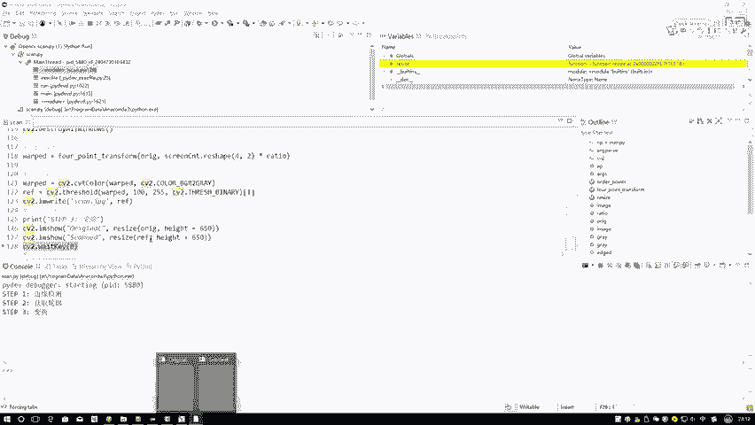
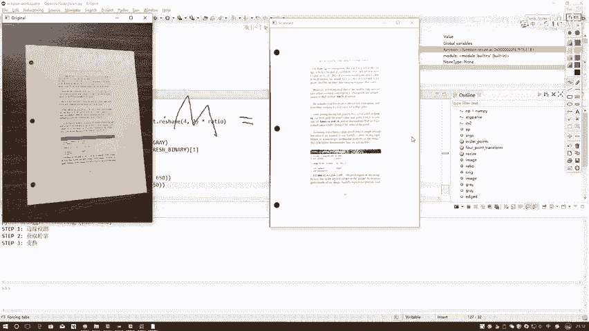
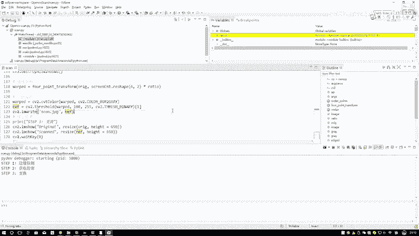
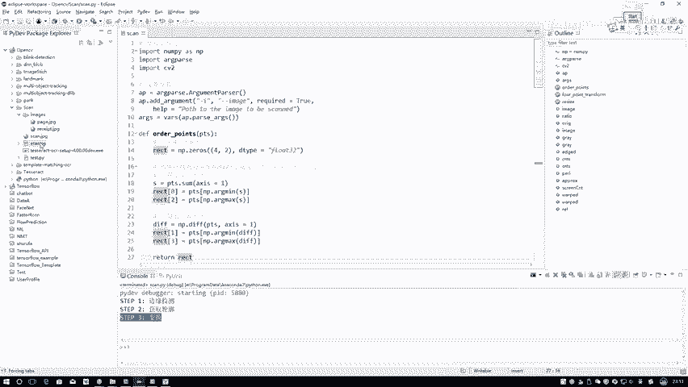
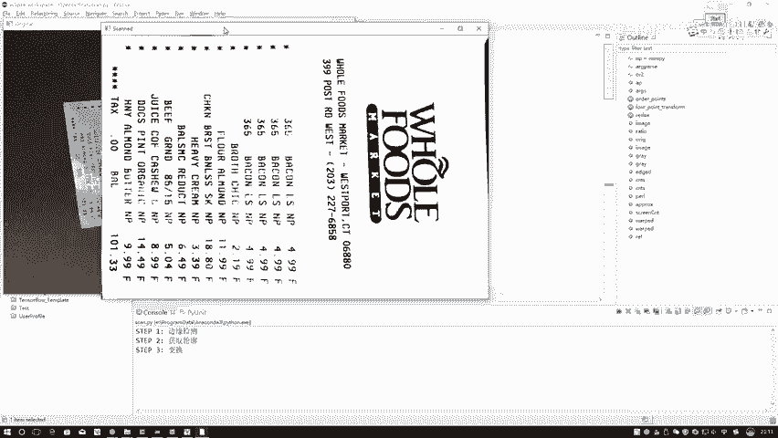
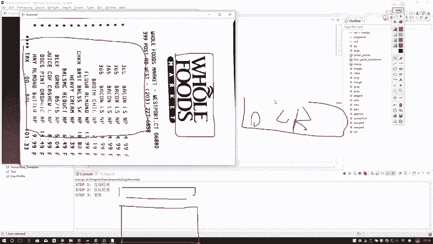

# 课程P38：透视变换原理与实现 📐

在本节课中，我们将学习计算机视觉中的透视变换。我们将了解其数学原理，并学习如何使用OpenCV库来实现一个文档扫描效果。

透视变换的核心在于找到一个变换矩阵，它能将图像从一个视角（如倾斜的）转换到另一个视角（如正面的）。这需要两组对应的坐标点：原始图像中的点，以及我们希望它们变换后到达的目标点。

## 从坐标到变换矩阵

上一节我们介绍了如何获取图像的轮廓和角点。本节中我们来看看如何利用这些点进行透视变换。

想要进行变换，我们需要两组点：输入的四个源点，以及输出的四个目标点。有了这两组点，我们就能计算当前的变换矩阵了。这个变换涉及投影，因此它是一个3×3的矩阵。

原始坐标和目标坐标都已具备，但我们不知道原始坐标如何通过平移、旋转和翻转等操作综合变成目标坐标。这需要一个变换矩阵。我们需要求解这个变换矩阵，这要求提供两组值：第一组是输入的坐标，第二组是期望输出的坐标。

## 透视变换的数学原理

透视变换的过程可以这样理解：一开始我们得到的是二维坐标(X, Y)。但变换矩阵会先将它转换到三维空间，再从三维空间映射回二维，从而完成透视变换。这需要一个3×3的矩阵。

因为涉及三维，我们需要先将坐标转换为齐次坐标。齐次坐标就是往二维坐标里增加一个维度，通常添加一个1。例如，二维点(X, Y)的齐次坐标表示为(X, Y, 1)。这样做是为了方便进行矩阵运算，而不改变坐标的本质。

变换过程可以用以下公式描述：

设输入点的齐次坐标为 `[x, y, 1]^T`，变换矩阵为 `M`，输出点的齐次坐标为 `[x', y', w']^T`。那么变换关系为：

```
[x', y', w']^T = M * [x, y, 1]^T
```

最终输出的二维坐标 `(u, v)` 需要通过齐次坐标归一化得到：

```
u = x' / w'
v = y' / w'
```

其中，变换矩阵 `M` 是一个3x3的矩阵，包含8个未知参数（因为通常将 `M[2,2]` 设为1或某个常数来固定尺度）：

```
M = [[H11, H12, H13],
     [H21, H22, H23],
     [H31, H32,   1]]
```

## 求解变换矩阵的条件

以下是求解变换矩阵 `M` 所需的条件：

一组坐标点 `(x, y)` 通过上述公式可以建立两个方程（分别对应 `u` 和 `v`）。矩阵 `M` 有8个未知数，因此需要8个独立的方程来求解。

这意味着我们需要4组对应的坐标点（因为4组点 * 2个方程/点 = 8个方程）。就像我们用一个矩形框选区域，正好提供四个角点。

此外，这些点必须满足一个前提条件：其中任意三个点不能共线。例如，如果四个点中有三个点在一条直线上，就无法构成有效的四边形，也就无法求解出正确的透视变换矩阵。因此，最好选择能构成一个规则四边形的点。

## 使用OpenCV实现变换

OpenCV库为我们封装了上述复杂的计算过程。我们只需要提供源坐标点和目标坐标点，它会自动联立方程，帮我们计算出变换矩阵 `M`。

以下是实现的关键步骤代码示例：

```python
import cv2
import numpy as np



# 假设我们已经获得了源点 src_points 和目标点 dst_points
# 它们都是包含4个(x,y)坐标的NumPy数组，形状为(4,2)

# 计算透视变换矩阵 M
M = cv2.getPerspectiveTransform(src_points, dst_points)





# 对原始图像应用透视变换
# image 是输入的原始图像
# (width, height) 是输出图像的期望尺寸
transformed_image = cv2.warpPerspective(image, M, (width, height))
```

有了变换矩阵 `M` 之后，就可以对输入的原始图像进行变换，最终返回变换后的结果图像。

为了使结果更清晰，在显示前通常还会对图像进行一些后处理，例如灰度化和二值化，以突出有价值的信息。

## 文档扫描应用实例



结合边缘检测和轮廓查找，透视变换可以用于实现文档扫描功能。整个过程可以总结为三步：

1.  **边缘检测**：识别图像中的边缘。
2.  **轮廓查找**：找到文档的轮廓并获取其四个角点。
3.  **透视变换**：利用角点进行变换，得到“摆正”后的文档图像。


我们知道为什么需要四个坐标点：每个点提供X和Y两个值，相当于两个方程。求解3x3变换矩阵中的8个未知参数需要8个方程，因此正好需要4个点。虽然求解过程复杂，但我们无需关心，交给OpenCV即可。



最终，利用求得的矩阵 `M` 对原始图像进行变换，就能得到扫描后的规整结果。

---



本节课中我们一起学习了透视变换的核心原理。我们了解到，透视变换的本质是求解一个3x3的投影变换矩阵，这需要至少四组不共线的对应点。OpenCV的 `getPerspectiveTransform` 和 `warpPerspective` 函数极大地简化了这一过程的实现。掌握这个工具，我们就能实现诸如文档扫描、图像校正等多种有趣的计算机视觉应用。