# 课程P39：Tesseract-OCR安装与配置教程 🛠️

在本节课中，我们将学习如何安装和配置Tesseract-OCR工具，并利用它进行基本的字符识别操作。Tesseract是一款开源的OCR识别工具，功能丰富，默认支持英文，也可通过训练支持中文。

## 概述

上一节我们介绍了图像处理的基本概念，本节中我们来看看如何将扫描后的图像转换为可编辑的文本。我们将从Tesseract的安装开始，逐步完成环境配置，并通过实例演示其使用方法。

## 安装Tesseract-OCR

以下是安装Tesseract-OCR的步骤。

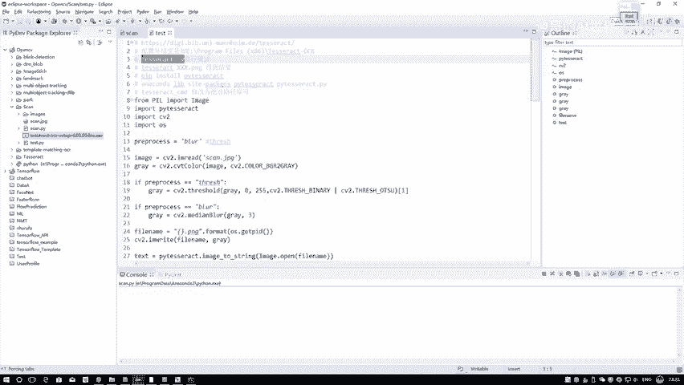

1.  **访问下载页面**：首先，需要访问Tesseract的GitHub页面或Windows版本的下载地址。建议下载最新的4.0版本，该版本集成了递归神经网络，识别效果更佳。
2.  **运行安装程序**：下载完成后，双击`.exe`文件进行安装。安装过程中，请记住选择的安装路径。
3.  **配置环境变量**：安装完成后，需要将Tesseract的安装目录添加到系统的环境变量中。
    *   打开“系统属性” -> “高级” -> “环境变量”。
    *   在“系统变量”或“用户变量”中找到并编辑`Path`变量。
    *   点击“新建”，将Tesseract的安装路径（例如`C:\Program Files\Tesseract-OCR`）添加进去。
4.  **验证安装**：打开命令行，输入以下命令验证是否安装成功。
    ```bash
    tesseract -v
    ```
    如果命令行显示出版本信息（例如`tesseract 4.0.0`），则表明安装和环境变量配置成功。

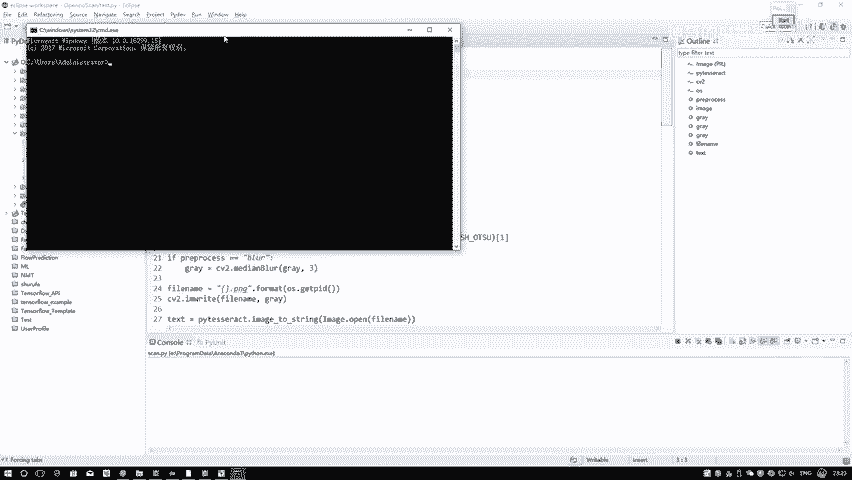

## 使用Tesseract进行OCR识别

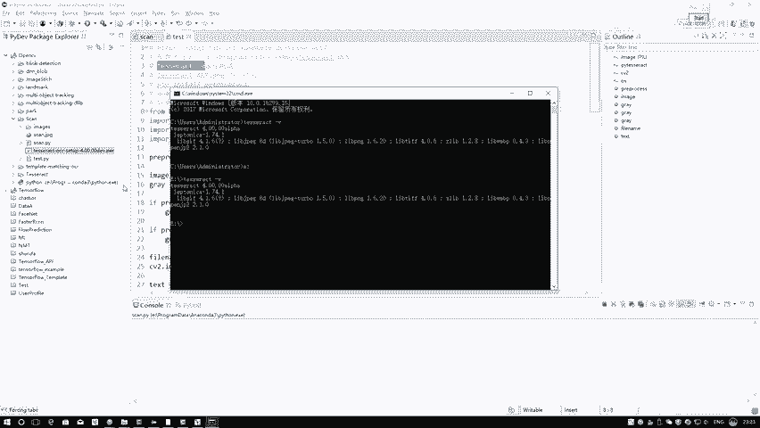

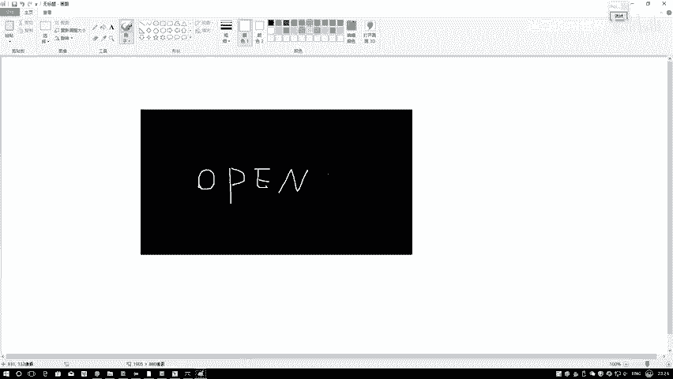

配置好环境后，我们可以通过命令行直接使用Tesseract进行文字识别。

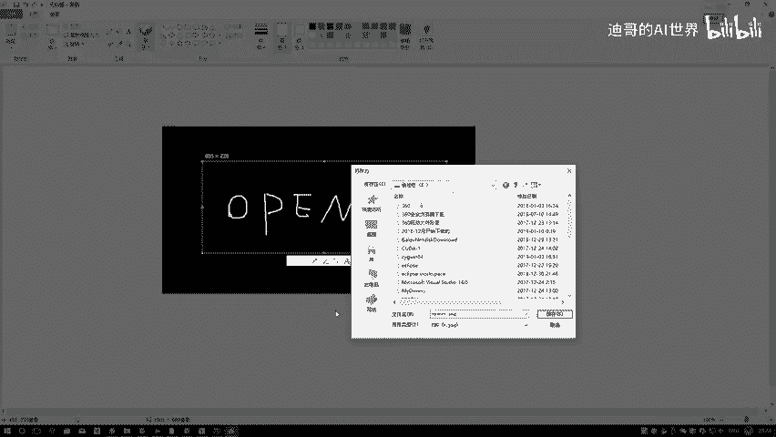

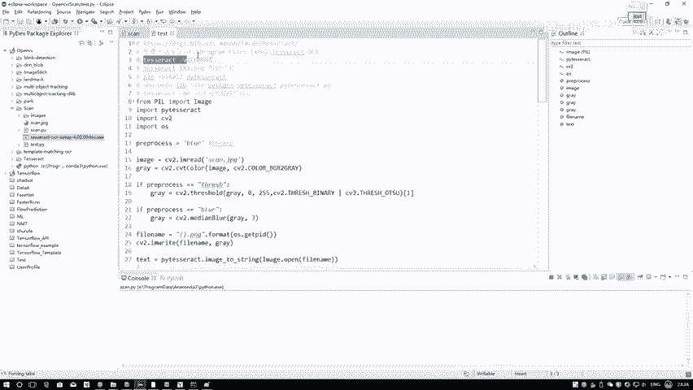

以下是基本的使用命令格式。
```bash
tesseract [图片路径] [输出文本文件路径（不含后缀）]
```
例如，要对`E:\opencv.png`图片进行识别，并将结果保存到`E:\result.txt`，命令如下。
```bash
tesseract E:\opencv.png E:\result
```
执行后，Tesseract会生成`result.txt`文件，其中包含了识别出的文本内容。

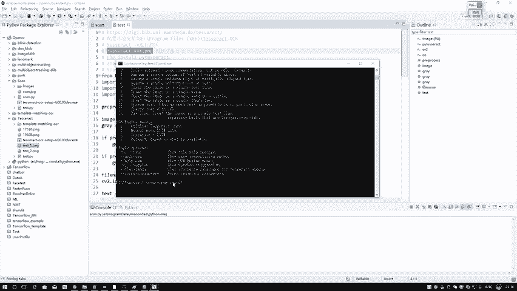

## 在Python中调用Tesseract

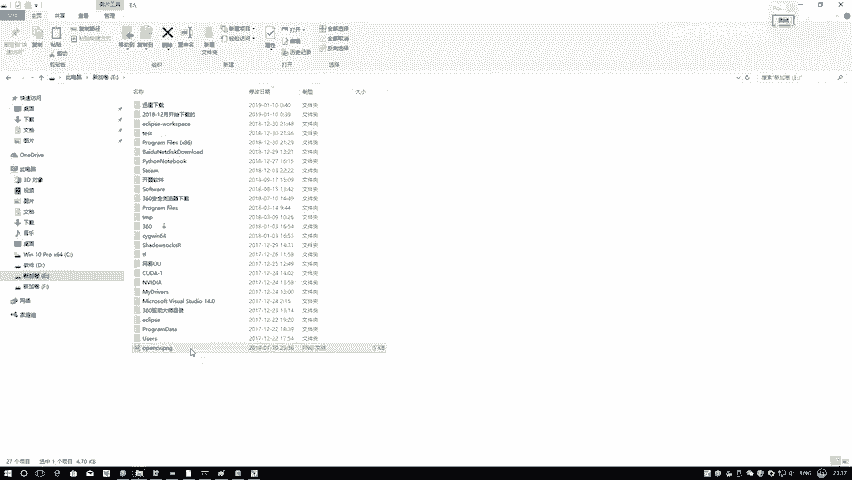

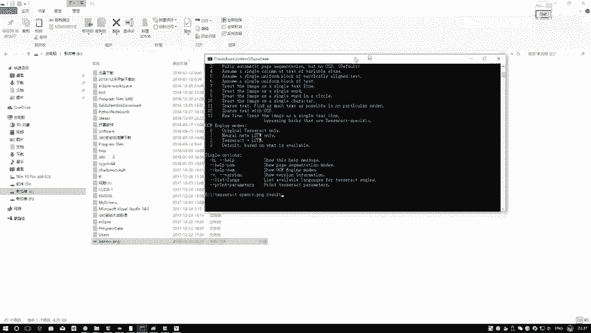

在实际项目中，我们更倾向于在Python程序中集成OCR功能。这需要安装Python的Tesseract封装库。

以下是安装和使用的步骤。

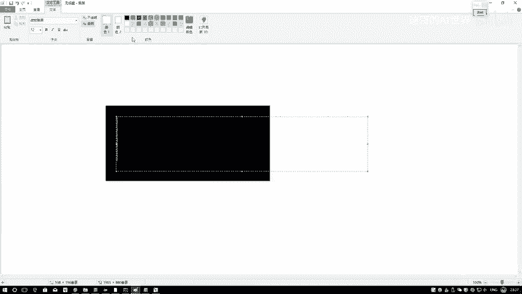

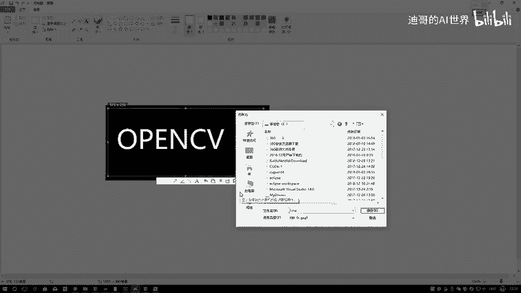

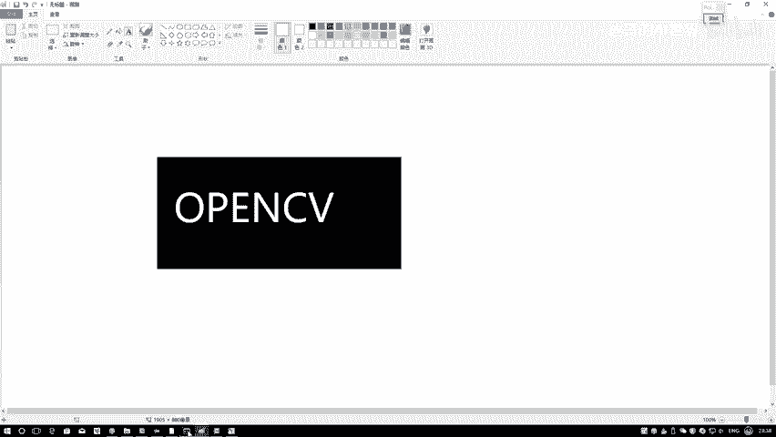

1.  **安装Python库**：在命令行中使用pip安装`pytesseract`。
    ```bash
    pip install pytesseract
    ```
    > **注意**：如果你有多个Python环境，请确保在目标环境的`Scripts`目录下执行此命令，或使用`conda`进行安装。

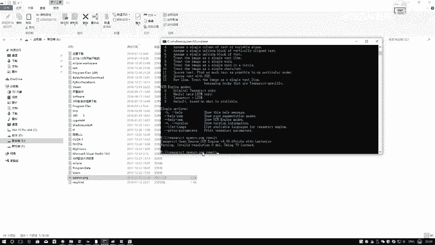

2.  **在Python代码中使用**：安装完成后，即可在Python脚本中调用Tesseract。
    ```python
    import pytesseract
    from PIL import Image

    # 指定Tesseract可执行文件的路径（如果环境变量已配置，通常可省略）
    # pytesseract.pytesseract.tesseract_cmd = r‘C:\Program Files\Tesseract-OCR\tesseract.exe’

    # 打开图片
    image = Image.open(‘opencv.png’)
    # 进行OCR识别
    text = pytesseract.image_to_string(image)
    print(text)
    ```
    这段代码会打开名为`opencv.png`的图片，并打印出识别出的文字。

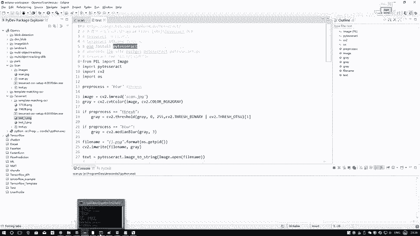

## 总结

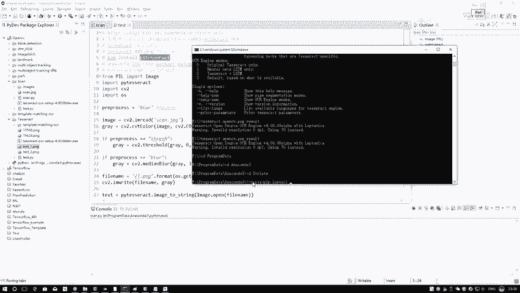

本节课中我们一起学习了Tesseract-OCR工具的安装、环境配置以及基本使用方法。我们首先在系统中安装并配置了Tesseract，然后通过命令行测试了其OCR功能，最后学习了如何在Python项目中通过`pytesseract`库集成该功能，为后续的自动化文本处理任务奠定了基础。