# 课程P4-1：计算机眼中的图像 👁️💻

在本节课中，我们将要学习OpenCV中图像最基本的操作。首先，我们需要理解在计算机眼中，图像究竟是什么样子。

## 图像的本质：像素矩阵

我们观察一张名为“LINA”的图片。这张图片被分成了许多小方格。实际上，这些方格还可以被进一步细分。我们取出其中一个方格进行观察，会发现它由更多的小块组成。

其中每一个小格被称为一个**像素点**。在计算机中，图像就是由这些像素点构成的。

那么，像素点是什么呢？本质上，它是一个数值。观察右边的图示（暂时忽略RGB部分），可以看到其中包含81、116、133、201等数值。这些数值构成了像素点。

这些数值的大小意味着什么？在计算机中，一个像素点的值在**0到255**之间浮动。最小值0代表黑色，最大值255代表白色。中间的不同数值则表示不同的亮度级别。

## 颜色通道：RGB

接下来，我们观察RGB部分。RGB代表图像的**颜色通道**。通常我们看到的彩色图像都是RGB三通道的。

例如，一个区域可能对应着R（红色）、G（绿色）、B（蓝色）三个通道的值。数值201表示在红色通道上的亮度，155表示在绿色通道上的亮度，165表示在蓝色通道上的亮度。

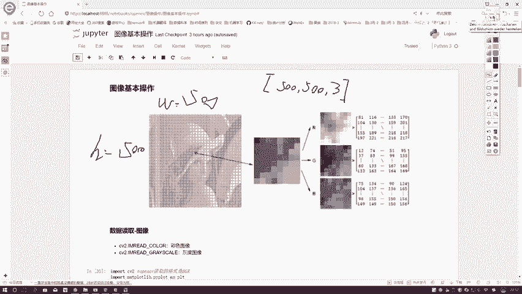

我们通常获取的图像都是这种三通道的彩色图。那么，黑白图像呢？黑白图像，或称**灰度图**，只有一个通道，仅表示亮度就足够了，不需要RGB三个通道。

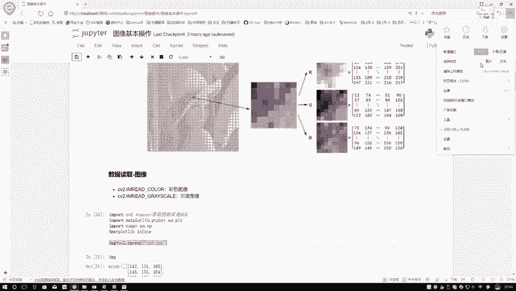

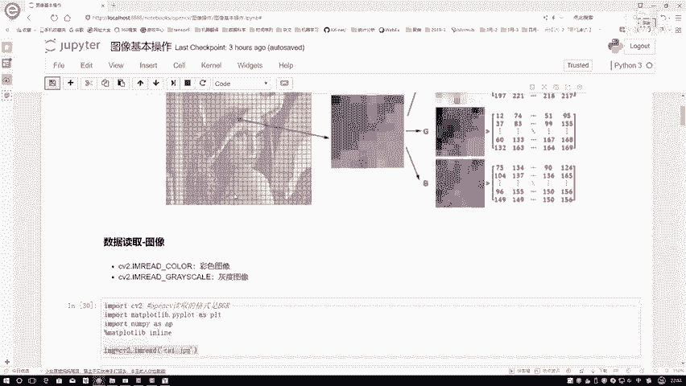

## 总结图像结构

综上所述，在计算机眼中：
*   图像由众多像素点组成。
*   这些像素点排列成一个**矩阵**，这个矩阵代表了图像的大小。例如，一个500x500的图像，其高度（H）和宽度（W）都是500。
*   对于彩色（RGB）图像，每个颜色通道（R、G、B）都有一个独立的500x500矩阵。因此，整个图像的维度（shape）是 `(500, 500, 3)`。
*   对于灰度图像，则只有一个通道，其维度为 `(500, 500, 1)` 或简化为 `(500, 500)`。

公式表示彩色图像结构：`图像形状 = (高度 H, 宽度 W, 通道数 C)`，其中C通常为3（RGB）。

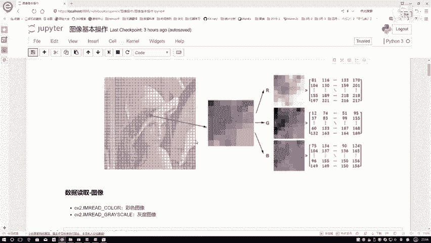

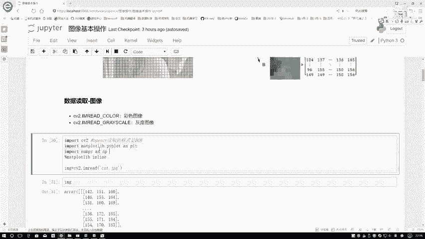

---

上一节我们介绍了计算机眼中图像的本质，本节中我们来看看如何在OpenCV中进行最基本的图像操作。

## 第一步：读取图像

无论后续要做什么处理，第一步总是需要将图像加载到计算机中。我们需要将图像转换成像素矩阵，以便计算机进行分析和识别工作。

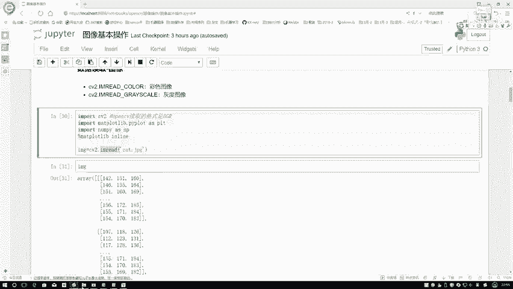

以下是读取图像所需的步骤：

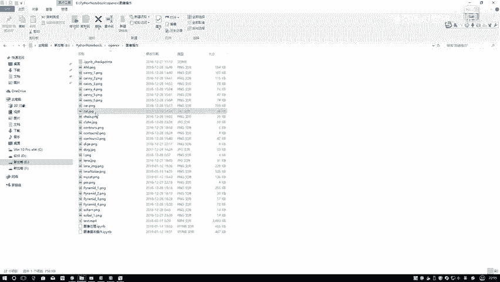

首先，导入必要的工具包。

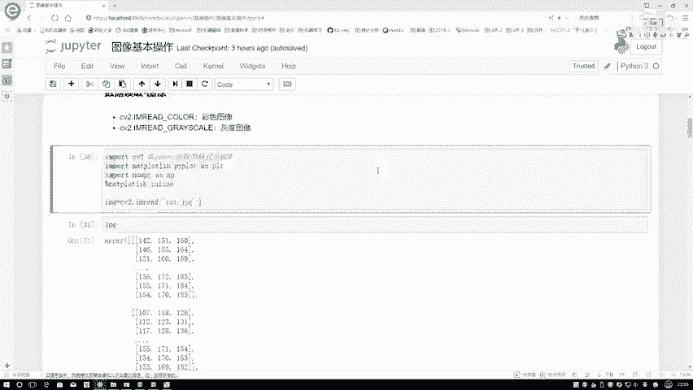

```python
import cv2  # OpenCV库
import matplotlib.pyplot as plt  # 绘图库
import numpy as np  # 数值计算库
%matplotlib inline  # 在Notebook中内嵌显示图像
```

`%matplotlib inline` 是一个“魔法指令”，它使得在Jupyter Notebook中绘图后能直接显示图像，无需额外调用 `plt.show()` 函数。这个指令通常在Notebook环境中使用。

读取图像非常简单，使用OpenCV的 `cv2.imread()` 函数，并指定图像文件的路径即可。

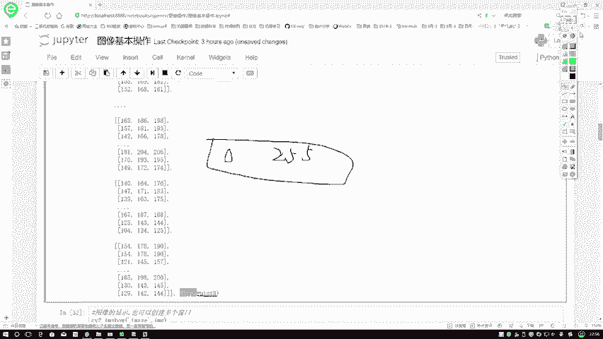

```python
img = cv2.imread(‘cat.jpg’)  # 读取名为‘cat.jpg’的图像
```

执行上述代码后，图像数据被存储在变量 `img` 中。让我们查看一下这个变量。

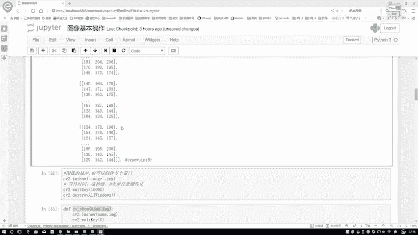

```python
print(img)
print(img.dtype)
print(img.shape)
```

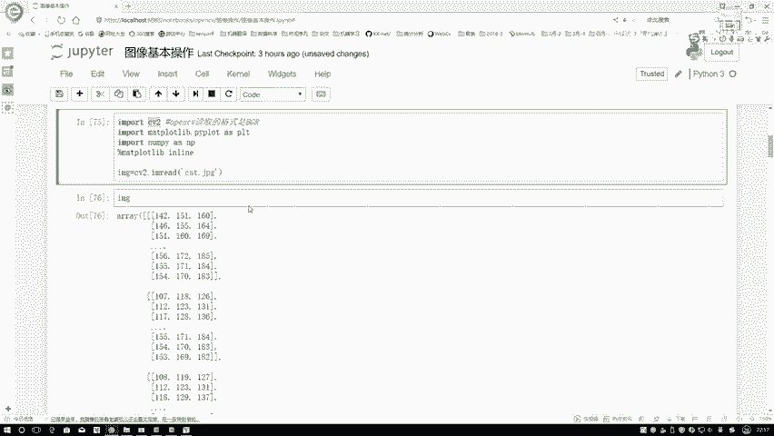

输出结果分析：
*   `img` 是一个NumPy的 `ndarray`（多维数组）结构。
*   `dtype` 是 `uint8`，这表示数组中每个值（像素值）的数据类型是8位无符号整数，取值范围正是之前提到的 **0到255**。
*   `shape` 显示了数组的维度，例如 `(414, 500, 3)`，这对应着 **(高度H, 宽度W, 通道数C)**。

这样，我们就成功地将图像读取到程序中。

## 第二步：显示图像

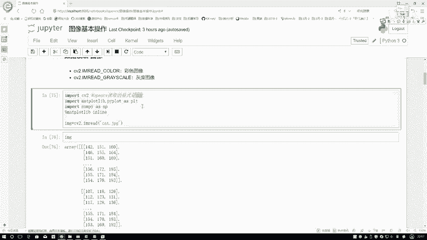

在对图像进行处理的过程中，我们经常需要观察图像的变化。这里介绍如何使用OpenCV自带的函数来显示图像。

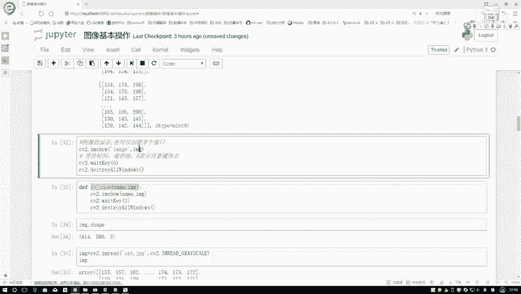

**注意**：OpenCV默认读取图像的格式是 **BGR**，而非常见的RGB。这与Matplotlib等库的默认格式存在冲突。因此，使用OpenCV自带的显示函数可以避免颜色通道转换的麻烦。

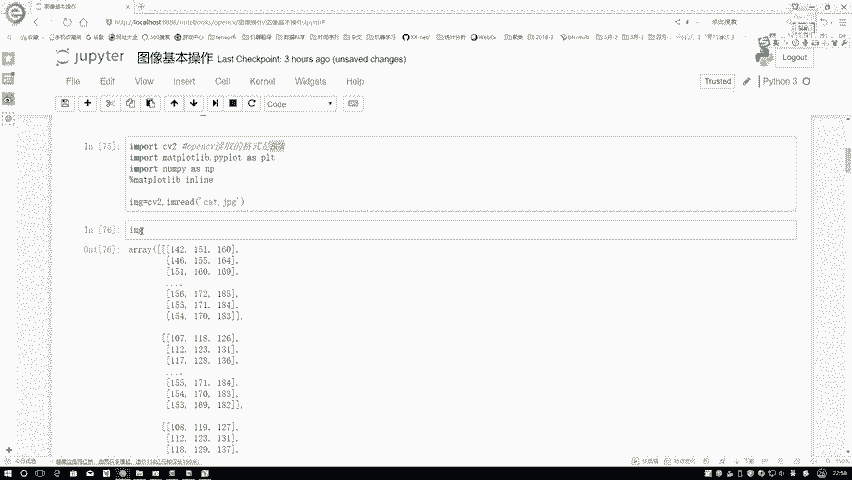

显示图像的方法如下：

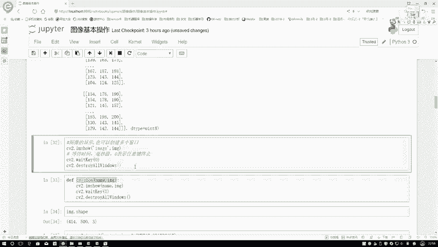

```python
cv2.imshow(‘window_name‘, img)  # 创建一个窗口并显示图像
cv2.waitKey(0)  # 等待键盘输入
cv2.destroyAllWindows()  # 关闭所有窗口
```

*   `cv2.imshow(‘window_name‘, img)`：第一个参数是窗口的名称，可以任意指定；第二个参数是要显示的图像变量。
*   `cv2.waitKey(0)`：参数 `0` 表示程序将无限期等待，直到用户在键盘上按下任意键后，程序才会继续执行。
*   `cv2.destroyAllWindows()`：关闭所有由OpenCV创建的窗口。

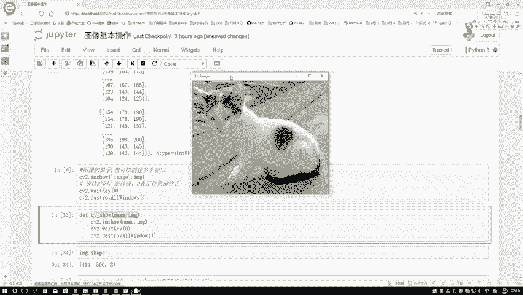

`waitKey` 函数的参数含义：
*   **参数为0**：等待任意键盘按键。
*   **参数为1000**：等待1000毫秒（即1秒），时间到后自动继续执行。
*   **参数为10000**：等待10000毫秒（即10秒）。

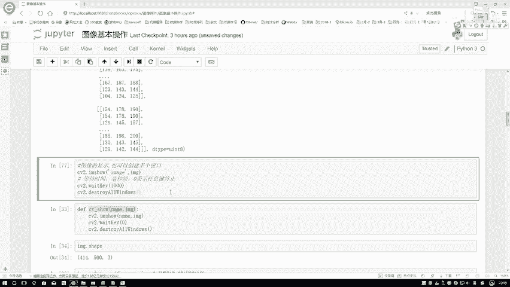

通常，在调试和观察时，建议使用 `waitKey(0)`，这样可以有充足的时间查看图像结果，并在查看完毕后通过按键关闭窗口。

---

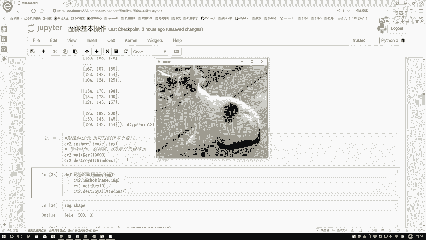

本节课中我们一起学习了：
1.  **图像的本质**：计算机眼中的图像是由像素点组成的矩阵，像素值在0-255之间表示亮度。彩色图像包含RGB三个颜色通道，而灰度图只有一个通道。
2.  **图像的基本操作**：我们学会了如何使用OpenCV读取图像（`cv2.imread`），并理解了读取后图像的NumPy数组结构（`shape`, `dtype`）。
3.  **图像的显示**：我们掌握了使用OpenCV显示图像（`cv2.imshow`）和控制显示窗口的方法（`cv2.waitKey`），并注意到了OpenCV默认使用BGR格式这一重要细节。

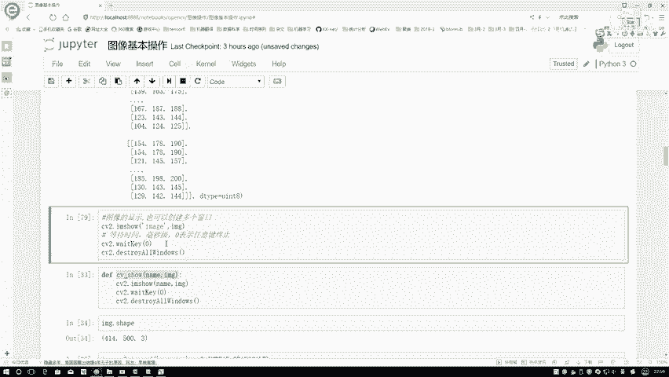

理解这些基础概念是进行后续所有图像处理和分析的基石。