# 课程P40：文档扫描与OCR识别实践 📄➡️📝

在本节课中，我们将学习如何完成文档扫描，并使用OCR（光学字符识别）工具包将扫描图像中的文字提取出来。整个过程包括环境配置、扫描结果处理以及文字识别。

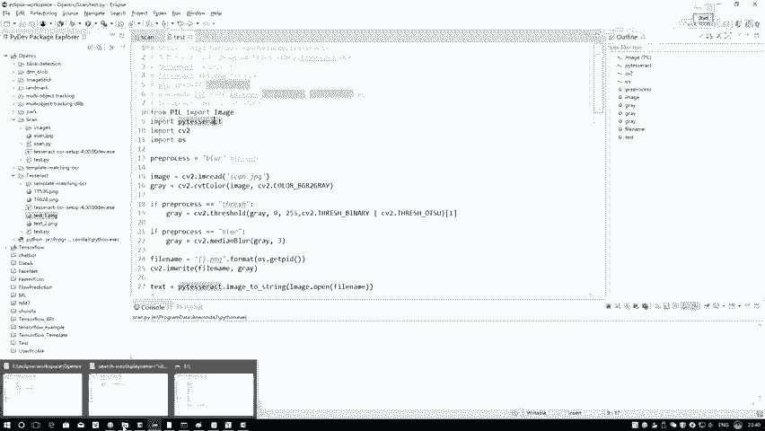

---

## 环境配置与问题解决 🔧

安装完必要的工具包后，需要将其导入到项目中。然而，仅完成此步骤可能无法在Python中直接调用。以下是一个在Windows系统中常见的配置问题及其解决方法。

上一节我们介绍了工具包的安装，本节中我们来看看如何解决调用时可能遇到的路径问题。


你需要进入Python的安装目录。例如，在Anaconda环境中，路径可能类似于 `.../Anaconda3/`。请按照以下步骤操作：

以下是具体的修改步骤：
1.  进入 `Lib` 文件夹。
2.  进入 `site-packages` 文件夹。
3.  找到你安装的工具包对应的文件夹（例如 `pytesseract`）。
4.  在该文件夹中找到 `__init__.py` 文件并用编辑器打开。
5.  在文件中找到指定 `tesseract` 命令的代码行。默认可能为 `tesseract_cmd = ‘tesseract’`。

关键修改点在于，由于Windows系统路径中反斜杠 `\` 可能引发歧义，导致IDE无法正确识别全局变量，因此建议将路径改为绝对路径。

**修改示例**：
```python
# 将默认的相对路径命令
tesseract_cmd = ‘tesseract‘
# 修改为你的tesseract.exe的绝对路径
tesseract_cmd = r‘C:\Program Files\Tesseract-OCR\tesseract.exe‘
```

指定绝对路径后，可以避免大多数因路径问题导致的“命令未找到”错误。

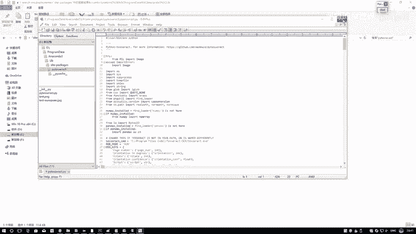


---

## 文档扫描与结果保存 📸

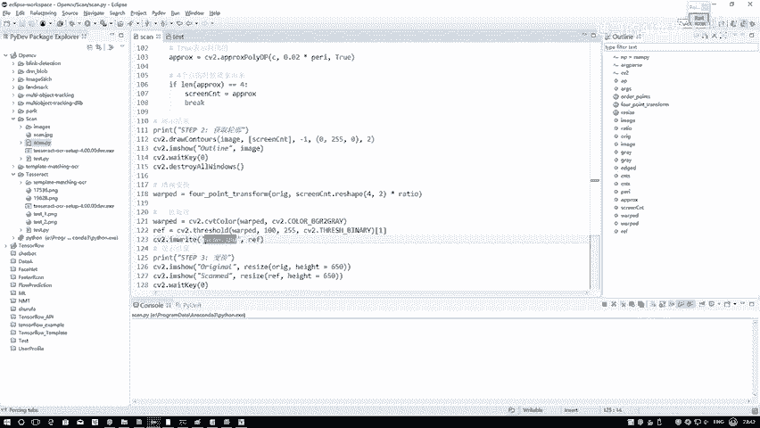

完成环境配置后，我们可以开始进行文档扫描。以下步骤将演示如何执行扫描并将结果保存为图像文件。

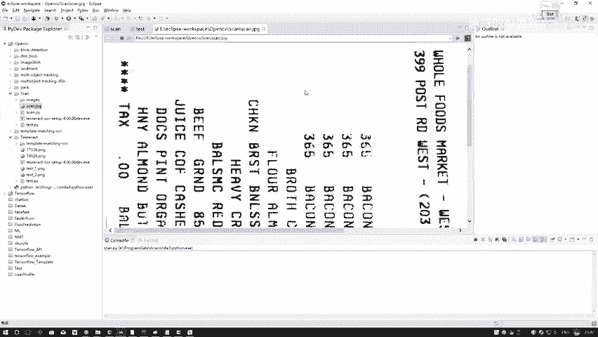

以下是核心代码逻辑：
```python
# 执行扫描操作
scanned_image = scanner.scan(document_image)
# 将扫描结果保存为文件
cv2.imwrite(‘scanned_result.jpg‘, scanned_image)
```

执行上述代码后，扫描结果将保存为 `scanned_result.jpg` 文件。

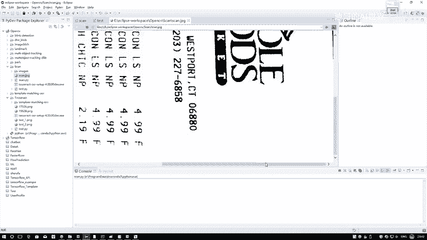


如图所示，`scanned_result.jpg` 即为生成的扫描图像结果。


---

## OCR文字识别 🔍

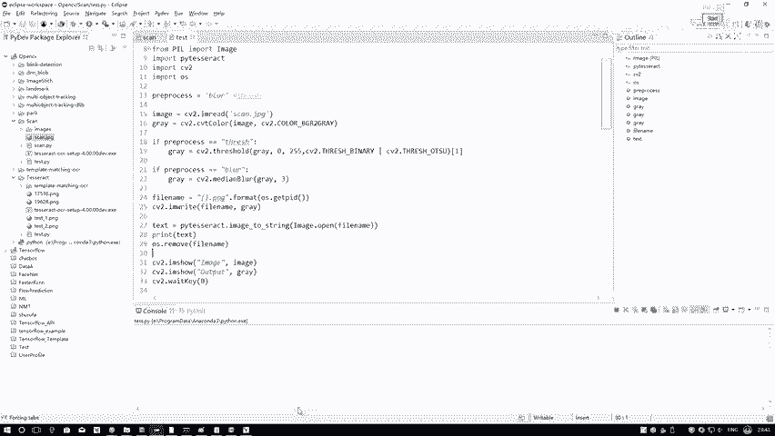

获得扫描图像后，下一步是提取其中的文字信息。我们将使用OCR工具包对图像进行处理和识别。

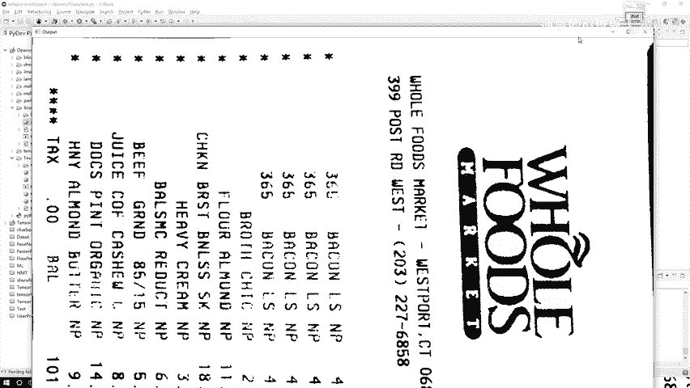

上一节我们得到了扫描图像，本节中我们来看看如何从中提取文字。

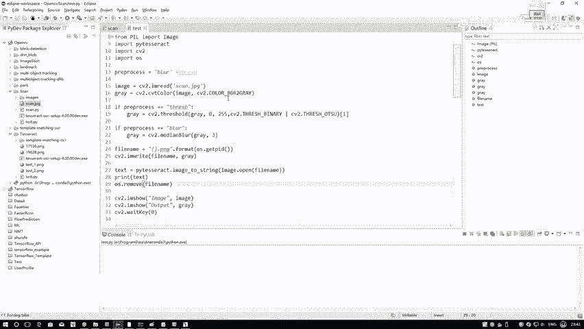

首先，需要读取图像并进行基本的预处理。

以下是图像预处理与识别的步骤：
1.  **读取图像**：使用OpenCV读取扫描得到的文件。
2.  **预处理**：将图像转换为灰度图，并可选择进行滤波或二值化操作以提升识别效果。不同预处理方法的效果可以对比选择。
    ```python
    gray_image = cv2.cvtColor(image, cv2.COLOR_BGR2GRAY)
    # 可选：二值化
    _, binary_image = cv2.threshold(gray_image, 127, 255, cv2.THRESH_BINARY)
    ```
3.  **文字识别**：调用OCR工具包的 `image_to_string` 函数，将处理后的图像转换为文本。
    ```python
    text = pytesseract.image_to_string(processed_image)
    print(text)
    ```

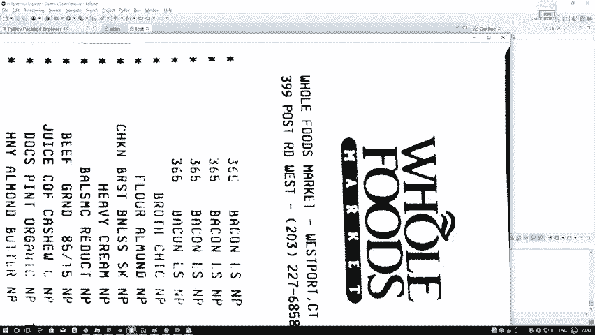

运行脚本，稍等片刻即可获得识别出的文本内容。

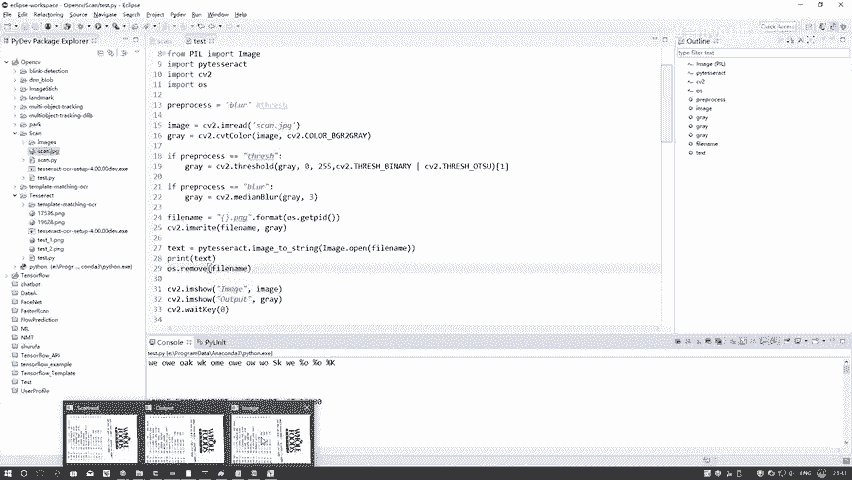


识别完成后，可以将输出的文本与原始扫描图像进行对比验证。例如，识别出的数字和字符序列应与图像中的内容一致。


通过对比可以确认，OCR工具包成功地将图像中的文字准确提取了出来。


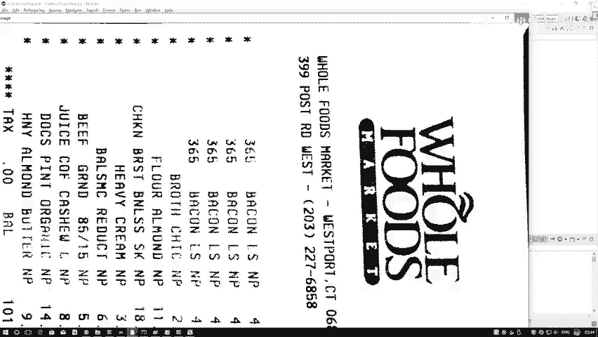

---

## 总结 📚

本节课中我们一起学习了完整的文档扫描与OCR识别流程。

我们首先解决了Windows系统下Python调用OCR引擎的路径配置问题，然后演示了如何对文档进行扫描并将结果保存为图像。最后，我们使用OCR工具包对扫描图像进行预处理和文字识别，成功提取出其中的文本内容。

与命令行操作相比，在Python环境中完成这些步骤更便于集成和后续处理，例如将识别结果直接用于程序逻辑或展示。希望本教程能帮助你掌握使用Python进行文档扫描和文字识别的基本方法。

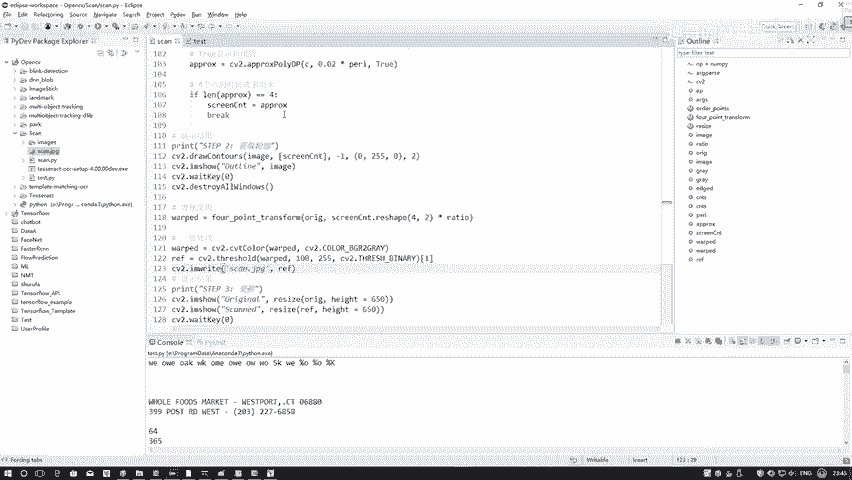

