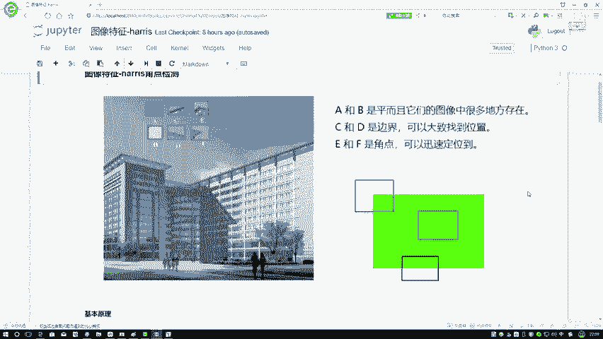
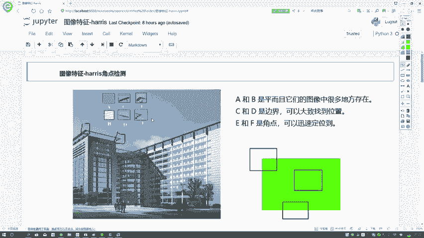
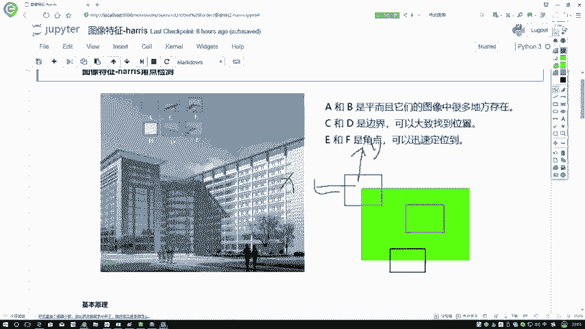
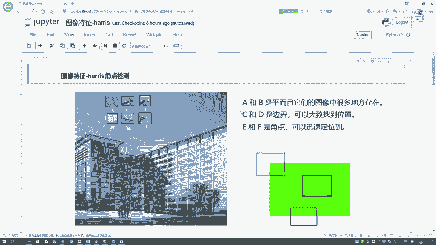
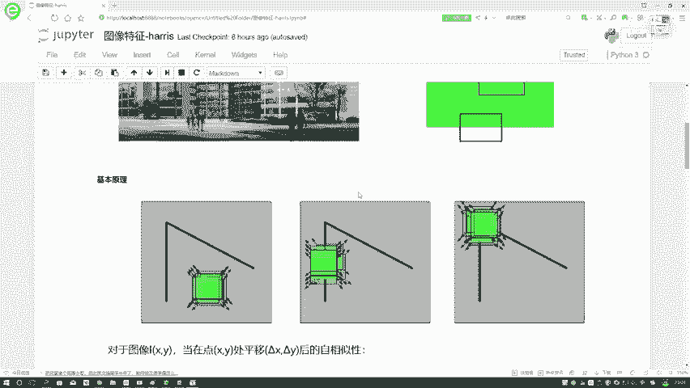
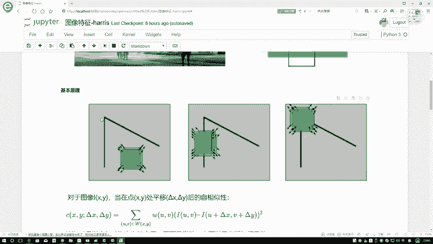
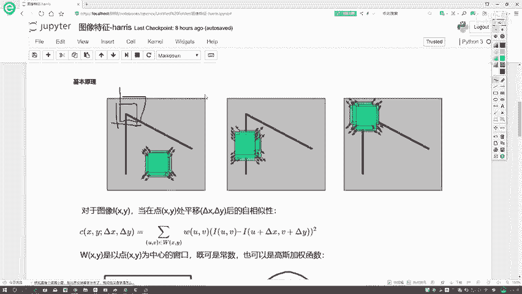

# 课程P41：1-角点检测基本原理 🧐

在本节课中，我们将要学习图像特征提取中的一个重要概念——HARRIS角点检测。我们将从理解什么是角点开始，逐步深入到其背后的数学原理，并学习如何让计算机识别出图像中的角点。

## 什么是角点？ 🎯

首先，我们需要明确“角点”的定义。观察左边的图片，我们的注意力很可能会被蓝天与楼房之间的交界处所吸引。这些交界处，尤其是那些凸出的部分，就是典型的角点。

角点具有一个关键特性：无论你沿着水平方向还是竖直方向移动一个小窗口，窗口内图像的灰度值都会发生**显著**的变化。相比之下，在平坦区域（如一片蓝天）移动窗口，灰度值变化很小；在边缘区域（如楼房的垂直边界）移动窗口，灰度值可能只在一个方向（如竖直方向）变化剧烈，而在另一个方向（如水平方向）变化平缓。

因此，我们可以将图像区域分为三类：
*   **平坦区域**：在任意方向移动，灰度值变化都很小。
*   **边缘区域**：在某个特定方向移动，灰度值变化很小；在与之垂直的方向移动，灰度值变化剧烈。
*   **角点区域**：在任意方向移动，灰度值变化都很剧烈。

角点之所以重要，是因为它们包含了比平坦区域和边缘区域更丰富的特征信息，在图像匹配、目标跟踪等任务中非常有用。

上一节我们介绍了角点的直观概念，本节中我们来看看如何用数学语言来描述它。

## 角点的数学描述 📐

我们刚才的判断是基于人眼的观察。接下来，我们要让计算机也能识别角点，这就需要为它提供一个可计算的数学公式。

核心思路是：**量化图像窗口移动时，其内部灰度值的变化程度**。

假设我们有一个图像窗口（比如一个3x3的小区域），其中心位于 `(x, y)`。当这个窗口在图像上发生一个微小位移 `(u, v)` 后，窗口内像素灰度值的变化量 `E(u, v)` 可以用以下公式近似表示：

`E(u, v) ≈ Σ [I(x+u, y+v) - I(x, y)]²`

其中，`I(x, y)` 是图像在点 `(x, y)` 处的灰度值。这个公式计算了位移前后窗口内所有像素灰度差的平方和。

为了便于计算和分析，我们通常使用泰勒展开对其进行简化。最终，`E(u, v)` 可以表示为以下矩阵形式：

`E(u, v) ≈ [u, v] M [u, v]ᵀ`

这里的 **M** 是一个2x2的矩阵，称为**结构张量**，它由图像在x和y方向上的梯度（即导数 `I_x` 和 `I_y`）计算得出：

`M = Σ [ I_x²   I_x I_y; I_x I_y   I_y² ]`

窗口内每个像素的梯度都会贡献到这个求和当中。这个矩阵 **M** 捕获了窗口内灰度变化的本质信息。

## 角点的判断准则 🔍

我们已经得到了描述灰度变化的矩阵 **M**。如何根据 **M** 来判断一个区域是平坦区域、边缘还是角点呢？答案在于分析矩阵 **M** 的特征值 `λ1` 和 `λ2`。

以下是判断准则：
*   如果两个特征值 `λ1` 和 `λ2` 都**很小**，说明该区域在任何方向上移动灰度变化都小，这是**平坦区域**。
*   如果其中一个特征值很大，另一个很小（即一个特征值远大于另一个），说明灰度只在一个方向变化剧烈，这是**边缘区域**。
*   如果两个特征值 `λ1` 和 `λ2` 都**很大**，说明该区域在任何方向上移动灰度变化都剧烈，这就是我们要找的**角点**。

在实际的HARRIS角点检测算法中，为了避免直接计算耗时的特征值，定义了一个角点响应函数 **R**：

`R = det(M) - k * (trace(M))²`

其中，`det(M)` 是矩阵 **M** 的行列式（约等于 `λ1 * λ2`），`trace(M)` 是矩阵 **M` 的迹（等于 `λ1 + λ2`），`k` 是一个经验常数（通常取0.04~0.06）。

根据响应值 **R** 进行判断：
*   **R 很大**：该区域是角点。
*   **R 为绝对值较大的负值**：该区域是边缘。
*   **R 的绝对值很小**：该区域是平坦区域。

算法会计算图像中每个像素点的 **R** 值，并通过设定阈值和非极大值抑制来最终确定角点的位置。

## 总结 📝

本节课中我们一起学习了HARRIS角点检测的基本原理。
1.  我们首先从视觉上理解了角点的定义：即在所有方向上灰度变化都剧烈的图像点。
2.  然后，我们探讨了其背后的数学原理，核心是使用**结构张量M**来量化窗口移动带来的灰度变化。
3.  最后，我们了解到通过分析矩阵 **M** 的特征值或计算**角点响应函数R**，可以有效地将图像区域分类为平坦区域、边缘和角点。

理解这些基本原理是掌握更复杂图像特征提取技术的重要基础。