# 课程P42：2-基本数学原理 🧮

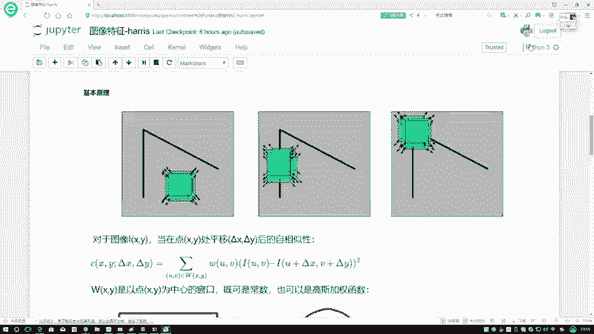

在本节课中，我们将要学习图像处理中一个核心概念的基本数学原理。我们将从一个直观的图像区域平移问题出发，逐步推导出用于衡量图像局部结构变化的数学公式，并学习如何通过泰勒展开等方法对其进行化简和矩阵化表示。

---

## 图像区域的平移与灰度变化

对于一个图像，我们用 **I** 来表示其灰度级。当我们关注图像的一个小区域时，例如一个 **3×3** 的区域，它包含九个像素点。

在图像上滑动这个窗口时，每次框住的像素点集合是不同的。例如，第一次框住的点可以表示为 **X1, X2, ..., X9**，而滑动后框住的点则变为 **Z1, Z2, ..., Z9**。

我们需要比较的是这两个区域之间灰度的变化情况。这本质上是一个对应位置像素的**减法操作**。

---

## 数学公式的建立

上一节我们介绍了通过滑动窗口比较灰度变化的想法，本节中我们来看看如何将其总结成一个数学公式。

对于图像中的一个区域 **XY**，当我们将其平移 **（Δx, Δy）** 后，需要判断平移前后区域的自相似性，即灰度变化情况。

我们用 **C** 来表示最终的灰度变化情况。由于是对区域中**每一个点**进行判断，因此需要进行求和计算。公式的核心部分如下：

**C(Δx, Δy) = Σ [I(u, v) - I(u+Δx, v+Δy)]²**

其中：
*   **u, v** 属于当前窗口 **W** 中的每一个像素坐标。
*   **I(u, v)** 是平移前点 **(u, v)** 的灰度值。
*   **I(u+Δx, v+Δy)** 是平移后对应点的灰度值。
*   进行**平方**操作是为了消除灰度值上升或下降带来的正负号影响，只关注变化的幅度。

---

## 引入权重窗口

在计算窗口内所有像素的贡献时，我们并非同等对待每一个像素。通常，窗口中心的像素比边缘的像素更能代表该区域的特征，因此影响应该更大。

为此，我们引入一个**权重窗口 W**。**W(u, v)** 的大小与图像窗口 **I** 完全相同，它定义了窗口中每个像素点的权重。

此时，完整的公式变为：

**C(Δx, Δy) = Σ W(u, v) * [I(u, v) - I(u+Δx, v+Δy)]²**

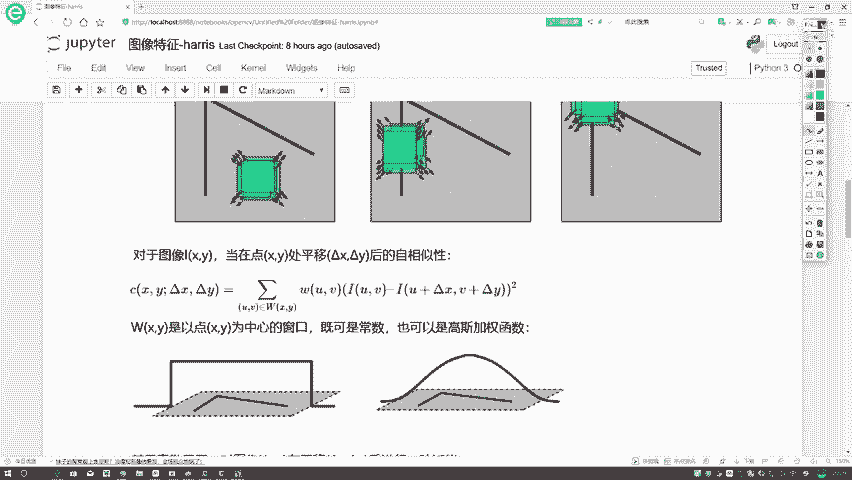

关于权重窗口 **W** 的选择，有以下常见方式：

以下是权重窗口的两种常见形式：

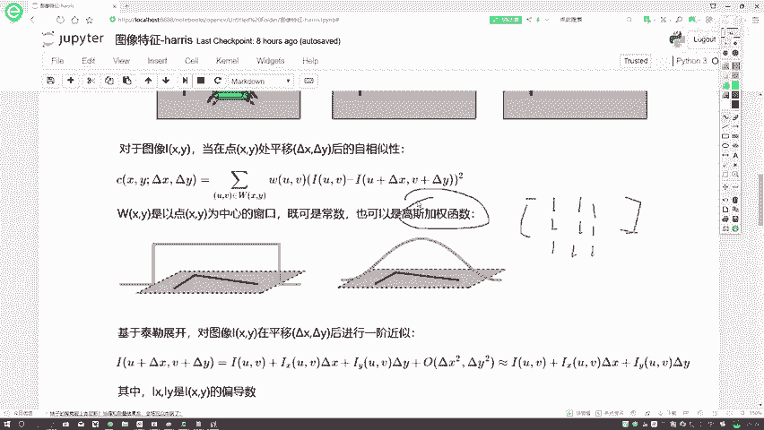

*   **常数值窗口**：窗口内所有权重值均为1，表示所有像素同等重要。
    ```python
    # 例如一个3x3的常数值窗口
    W_constant = [[1, 1, 1],
                  [1, 1, 1],
                  [1, 1, 1]]
    ```
*   **高斯窗口**：权重从中心向四周按高斯分布递减，中心像素权重最高。
    ```python
    # 例如一个近似的高斯窗口
    W_gaussian = [[1, 2, 1],
                  [2, 4, 2],
                  [1, 2, 1]]
    ```

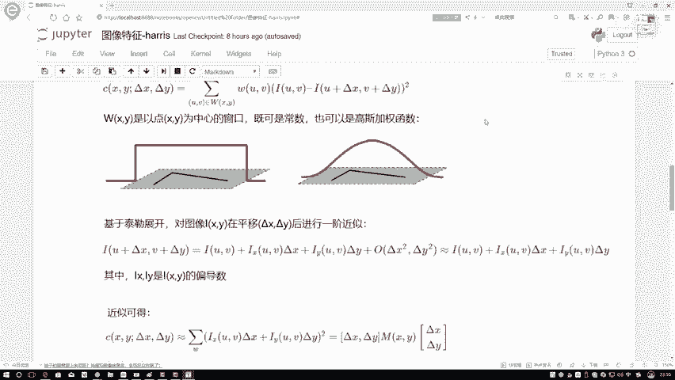

通常情况下，我们更倾向于使用**高斯加权窗口**。

---

## 公式的化简：泰勒展开

上一节我们建立了完整的灰度变化公式，但公式中的 **I(u+Δx, v+Δy)** 项直接计算并不方便。本节中我们来看看如何利用数学工具对其进行化简。

当平移量 **Δx** 和 **Δy** 相对较小时（在图像处理中通常是成立的），我们可以对 **I(u+Δx, v+Δy)** 进行**一阶泰勒展开**。

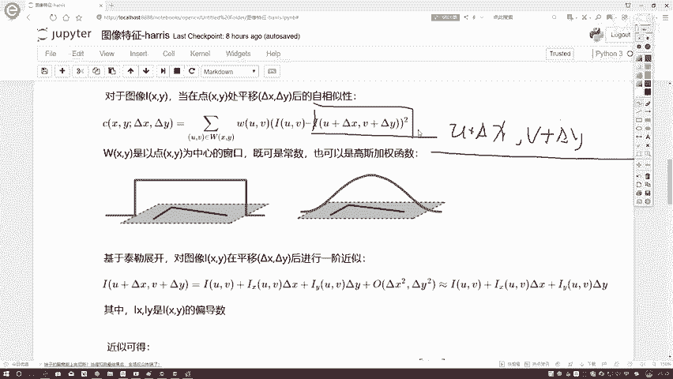

根据泰勒展开公式，有：

**I(u+Δx, v+Δy) ≈ I(u, v) + Iₓ(u, v)*Δx + Iᵧ(u, v)*Δy**

其中：
*   **Iₓ(u, v)** 是图像 **I** 在点 **(u, v)** 处对 **x** 方向的偏导数（可理解为水平方向的变化率）。
*   **Iᵧ(u, v)** 是图像 **I** 在点 **(u, v)** 处对 **y** 方向的偏导数（可理解为垂直方向的变化率）。
*   高阶无穷小项被忽略。

进行泰勒展开的目的是为了化简。将展开式代入原公式的平方项内部：

**[I(u, v) - I(u+Δx, v+Δy)]² ≈ [I(u, v) - (I(u, v) + IₓΔx + IᵧΔy)]² = [ - (IₓΔx + IᵧΔy) ]²**

由于外面有平方运算，负号会消失，因此上式等价于：

**[Iₓ(u, v)*Δx + Iᵧ(u, v)*Δy]²**

---

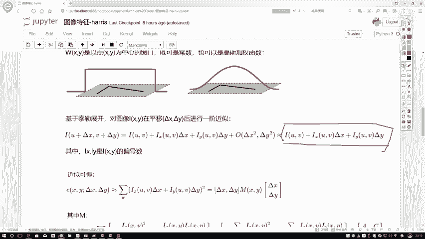

## 矩阵化表示

经过泰勒展开近似后，我们的灰度变化公式 **C(Δx, Δy)** 简化为：

**C(Δx, Δy) ≈ Σ W(u, v) * [Iₓ(u, v)*Δx + Iᵧ(u, v)*Δy]²**

为了表达和后续分析的方便，我们将其写成矩阵形式。将平方项展开：

**[IₓΔx + IᵧΔy]² = (IₓΔx + IᵧΔy) * (IₓΔx + IᵧΔy) = Iₓ²Δx² + 2IₓIᵧΔxΔy + Iᵧ²Δy²**

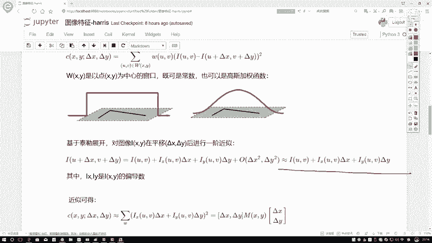

这可以看作是向量 **[Δx, Δy]** 与一个矩阵相乘的二次型形式。具体地，令向量 **d = [Δx, Δy]ᵀ**，我们可以构造一个 **2×2** 的矩阵 **M**（在考虑权重 **W** 的求和后）：

**M = Σ W(u, v) * [ [Iₓ², IₓIᵧ], [IₓIᵧ, Iᵧ²] ]**

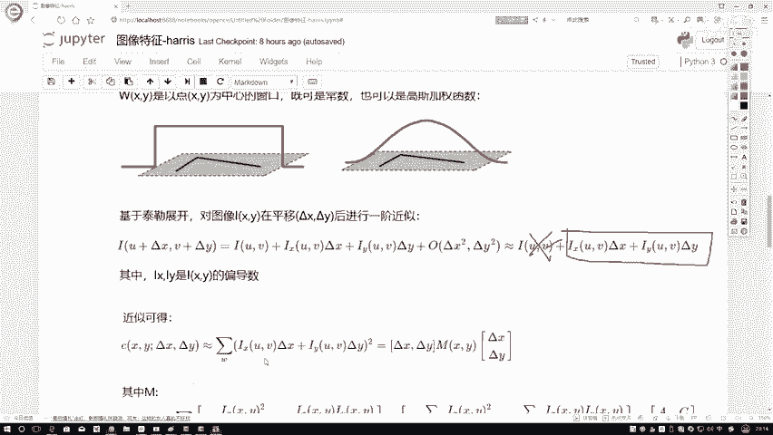

那么，灰度变化函数可以优雅地表示为：

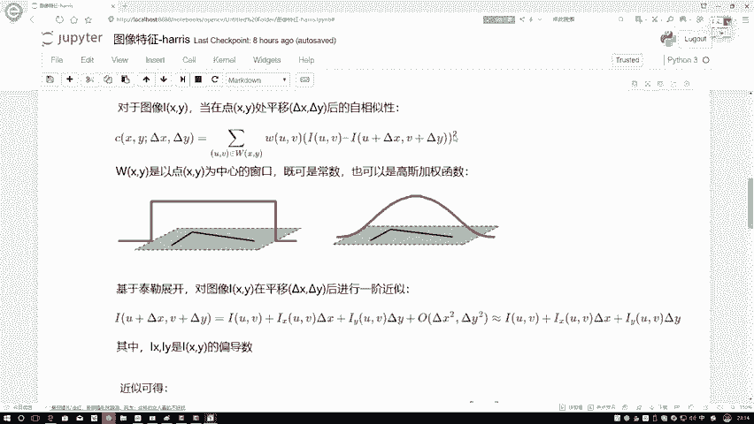

**C(Δx, Δy) ≈ dᵀ * M * d**

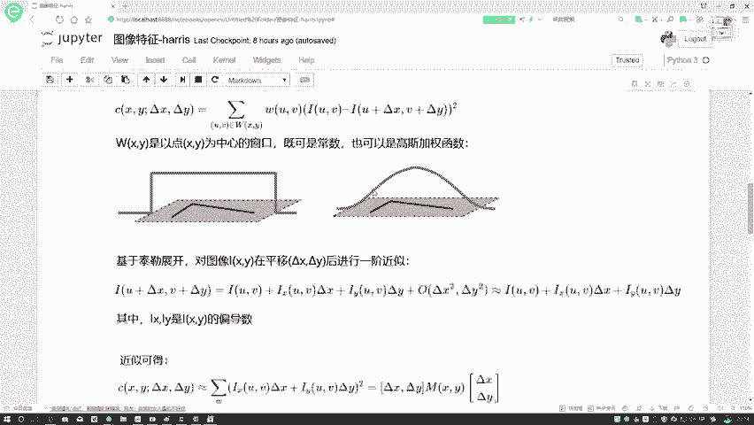

这个矩阵 **M** 被称为**结构张量**或**二阶矩矩阵**，它捕获了图像窗口内在 **(u, v)** 点附近沿 **x** 和 **y** 方向的梯度强度信息及其相关性，是后续判断角点、边缘等图像特征的基础。

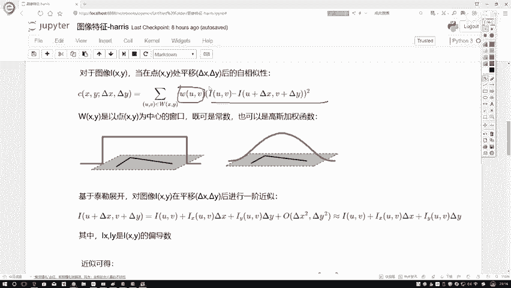

---

## 总结

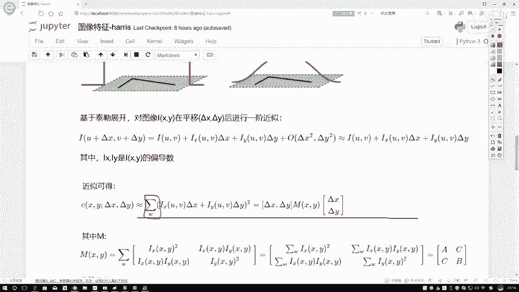

本节课中我们一起学习了图像局部结构分析的数学基础推导。

1.  我们从**滑动窗口比较灰度变化**的直观概念出发，建立了初始的数学公式。
2.  然后，我们引入了**权重窗口 W** 来区分窗口内不同像素的重要性。
3.  接着，为了解决公式计算难点，我们利用**一阶泰勒展开**对平移后的灰度值进行了线性近似，极大地简化了公式。
4.  最后，我们将简化后的公式整理成简洁的**矩阵二次型** **dᵀ M d**，并引出了核心的**结构张量矩阵 M**。

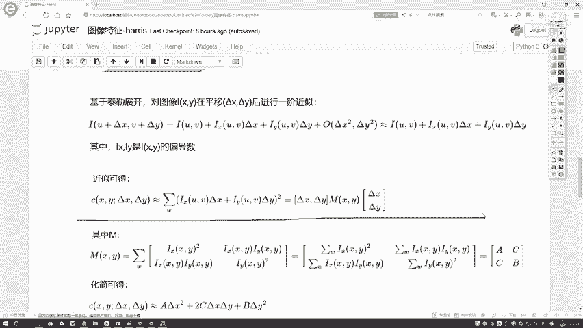

这个推导过程是理解许多经典图像特征检测算法（如Harris角点检测）的关键第一步。矩阵 **M** 的特征值将直接告诉我们该图像区域是平坦的、存在边缘还是角点。