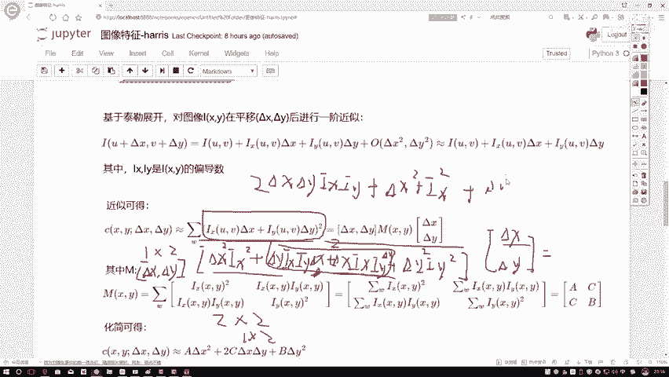
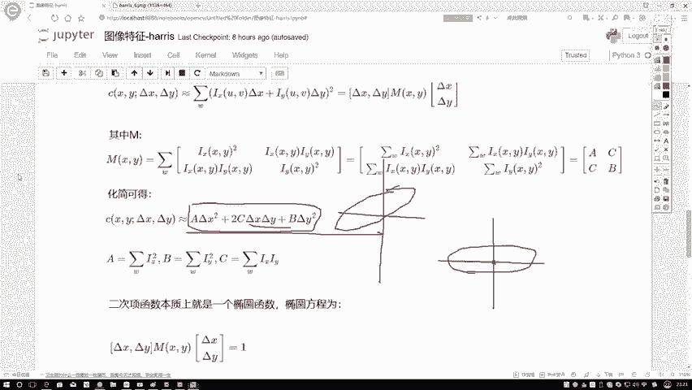
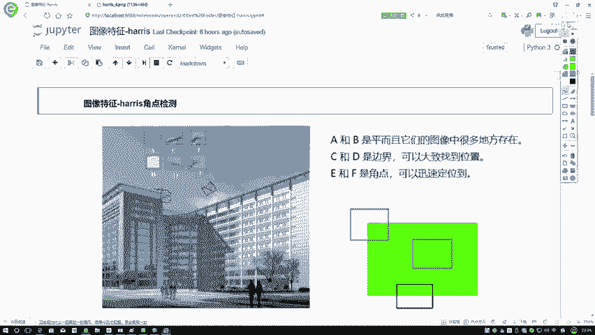
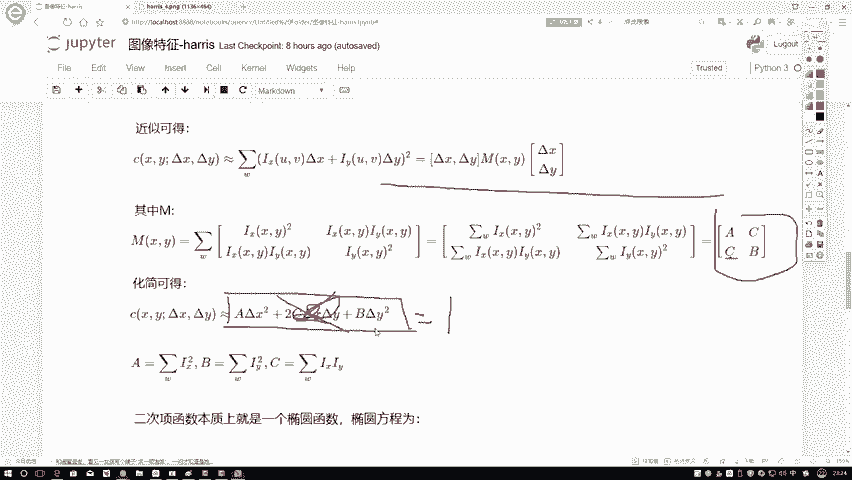

# 课程P43：3-求解化简 🧮

在本节课中，我们将学习如何将Harris角点检测中的核心表达式进行化简和转换。我们将通过矩阵运算，将复杂的二次型表达式转化为更易于分析和理解的椭圆方程形式，并探讨其几何意义。

---

上一节我们介绍了角点响应函数的基本形式。本节中，我们来看看如何通过矩阵变换来化简这个表达式。

首先，我们需要将原始表达式中的Δx和Δy项提取出来。观察原始式子，在相减之后，除了Δx和Δy，还剩下Ix²、Iy²以及IxIy项。因此，我们的目标是将表达式转换为以Δx、Δy为一组，以Ix、Iy为另一组的形式。

为了证明转换的可行性，我们定义一个矩阵M。让我们验证通过左乘一个由Δx和Δy组成的行向量，能否还原出最初的表达式。

我们进行如下矩阵乘法运算：
设行向量为 `[Δx, Δy]`，矩阵M为2x2矩阵。计算过程如下：
第一行乘第一列得到：`Δx * Ix²`
第一行乘第二列得到：`Δy * IxIy`
接着，计算第二列的结果：
`Δx * IxIy + Δy * Iy²`

至此，我们得到了一个1x2的行向量结果：`[Δx*Ix² + Δy*IxIy, Δx*IxIy + Δy*Iy²]`。

然后，将这个行向量右乘一个列向量 `[Δx, Δy]^T`，得到一个标量值：
`(Δx*Ix² + Δy*IxIy) * Δx + (Δx*IxIy + Δy*Iy²) * Δy`



展开后得到：
`Δx² * Ix² + ΔxΔy * IxIy + ΔxΔy * IxIy + Δy² * Iy²`

合并同类项后，结果为：
`Δx² * Ix² + 2 * ΔxΔy * IxIy + Δy² * Iy²`

可以看到，这个结果与原始展开的表达式完全一致。因此，我们使用矩阵M进行的变换是恒等变换，而非近似。

---

在证明了矩阵变换的有效性后，我们可以用更简洁的符号来重新定义矩阵M，以便观察其特性。

令：
`A = Ix²`
`B = Iy²`
`C = IxIy`

则矩阵M可以写为：
```
M = [ A  C ]
    [ C  B ]
```

这是一个实对称矩阵。在线性代数中，实对称矩阵可以进行对角化操作。对角化可以理解为一种“标准化”操作，使得矩阵只有主对角线上有非零值，这些值就是矩阵的特征值（记为λ1, λ2）。

---

上一节我们将表达式转换成了矩阵形式。本节中，我们利用这个矩阵形式来进一步探索其几何含义。

将矩阵 `M = [[A, C], [C, B]]` 代入二次型表达式 `E(Δx, Δy) = [Δx, Δy] * M * [Δx, Δy]^T` 并展开，得到：
`E(Δx, Δy) = A * Δx² + 2C * ΔxΔy + B * Δy²`

这个形式看起来像什么？它非常类似于一个二次曲线方程。回想高中解析几何，椭圆的标准方程为 `x²/a² + y²/b² = 1`。

虽然我们的表达式右边不是1，而是灰度变化值E，但我们可以暂时考虑其等高线，即假设 `E(Δx, Δy) = 常数`（例如设为1）。在这个假设下，方程 `A * Δx² + 2C * ΔxΔy + B * Δy² = 1` 描述的就是一个椭圆。

这个椭圆可能不是标准的（即其主轴可能与坐标轴不平行），这是因为方程中存在交叉项 `2C * ΔxΔy`。如果C=0，椭圆方程就变为 `A * Δx² + B * Δy² = 1`，这将是一个主轴与坐标轴对齐的标准椭圆。

---



基于角点的一个重要性质——旋转不变性（即图像旋转后，角点依然是角点），我们可以对这个“歪斜”的椭圆进行标准化处理。

以下是核心思路：
1.  表达式 `A * Δx² + 2C * ΔxΔy + B * Δy² = 1` 定义了一个椭圆。
2.  该椭圆的“歪斜”是由交叉项系数C引起的。
3.  通过对实对称矩阵M进行对角化，我们可以找到一个新的坐标系（由特征向量定义），在这个新坐标系下，椭圆方程将不再包含交叉项，从而变为标准形式。
4.  这个变换相当于将图像窗口（或我们观察的局部区域）旋转到与椭圆主轴对齐，这并不改变该点是否为角点的本质属性。



这个过程为我们提供了一种强大的分析工具：通过研究矩阵M的特征值，我们可以直接判断当前窗口内是否包含角点。

---



本节课中我们一起学习了Harris角点检测中核心表达式的化简过程。我们首先通过矩阵运算将表达式转换为二次型形式，然后将其几何意义解释为一个椭圆方程。最后，我们引出了通过对实对称矩阵对角化来消除交叉项、分析椭圆主轴（即特征向量）和尺度（即特征值）的思想，这为下一节理解最终的Harris角点响应判据奠定了坚实的基础。