# 课程P44：4-特征归属划分 🎯

在本节课中，我们将深入探讨Harris角点检测算法的核心数学原理。我们将学习如何通过分析图像局部区域的灰度变化，来区分角点、边缘和平坦区域。理解这一过程是掌握经典特征检测方法的关键。

## 对角化与椭圆标准化 🔄

上一节我们介绍了自相关函数与矩阵M。本节中我们来看看如何通过对角化操作来简化分析。

这是一个两行两列的实对称矩阵。根据线性代数知识，对于N行N列的实对称阵，一定能找到N个特征向量，使其可对角化。在这里，我们同样可以进行这样的对角化操作。

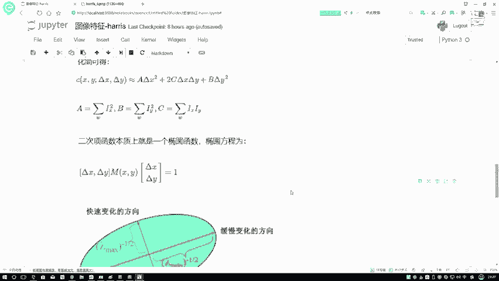

对角化完成后，我们得到特征值λ₁和λ₂。这相当于对矩阵进行了一个标准化操作。如果不熟悉对角化的深层含义，可以通俗地理解为：我们得到了一个“歪的”椭圆，现在要通过标准化操作把它“正过来”。

完成标准化操作后，矩阵中只剩下λ₁和λ₂。此时，我们的式子变成了：

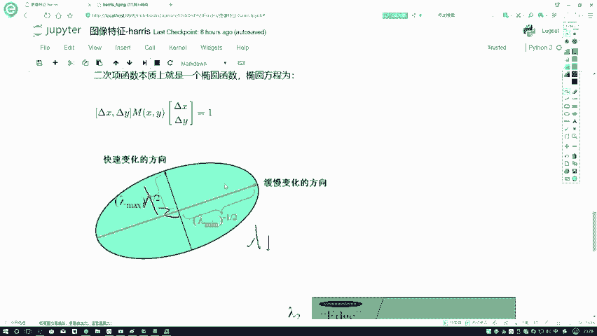

`λ₁ * Δx² + λ₂ * Δy² = C`

这里C是一个常数。为了更标准地表示椭圆方程，我们通常会写成 `x²/a² + y²/b² = 1` 的形式。对比可知，`1/a²` 对应 λ₁，`1/b²` 对应 λ₂。

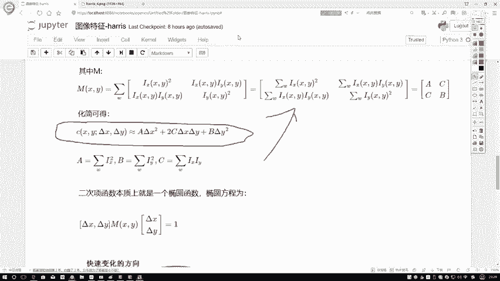

因此，我们可以得到：
`a = 1 / √λ₁`
`b = 1 / √λ₂`

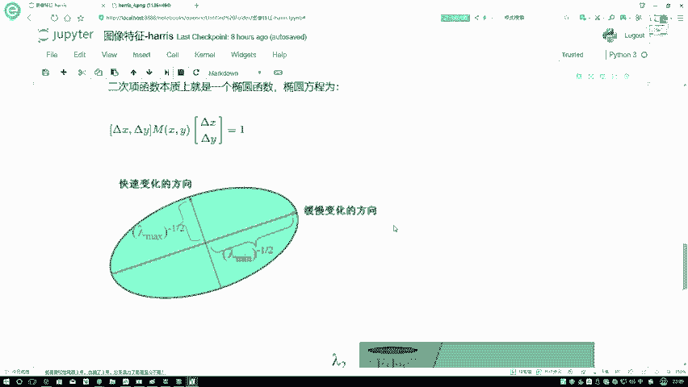

这里，a和b分别代表椭圆的长轴和短轴。

## 特征值的几何意义 📐

解释完对角化过程后，我们来看看特征值λ₁和λ₂的几何意义。

λ₁和λ₂分别对应椭圆的两个轴（长轴和短轴）。当椭圆发生变化时，其大小由特征值决定。椭圆越大，意味着λ₁和λ₂的值越大。

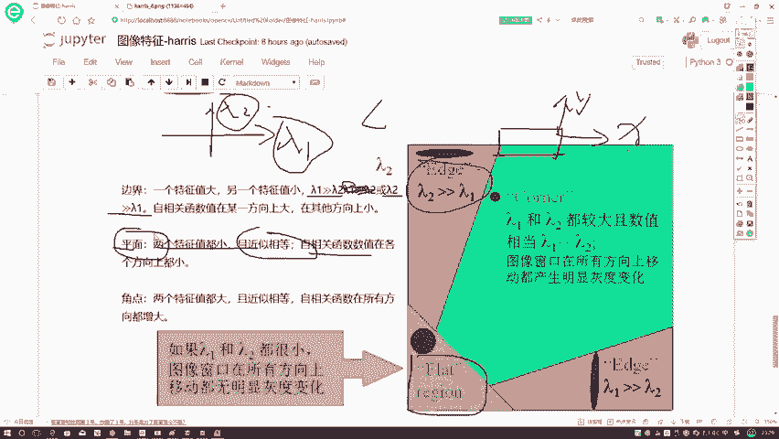

让我们再梳理一遍：原始表达式是 `AΔx² + BΔy²`。通过对角化，我们消去了交叉项，并用λ₁和λ₂代替了A和B。当λ₁和λ₂变大时，椭圆变大，这意味着函数值E变大。

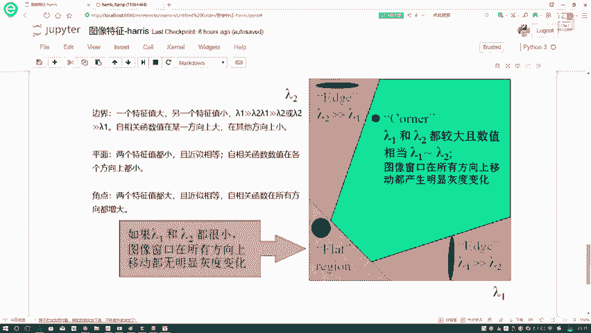

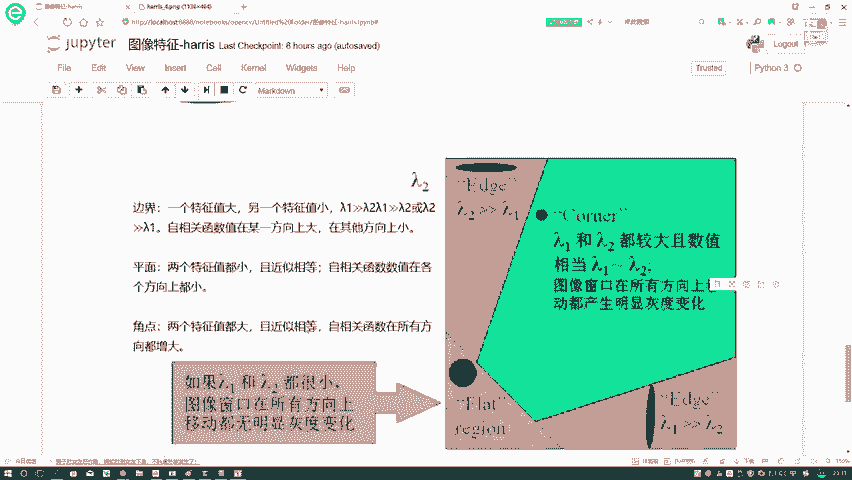

函数值E变大，意味着图像在该窗口内的灰度变化剧烈；反之，E变化小，则意味着灰度变化平缓。

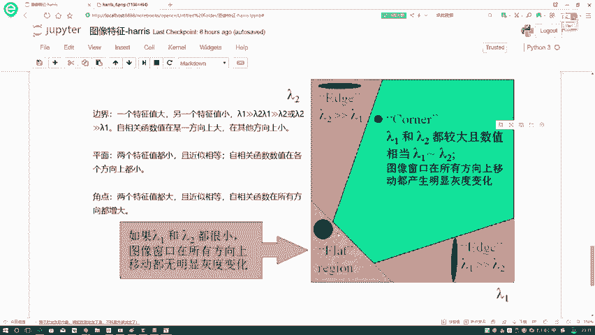

## 区域类型判断 🧭

解释完函数E的意义后，我们现在可以对比不同情况，来判断一个区域是边缘、平坦区域还是角点。

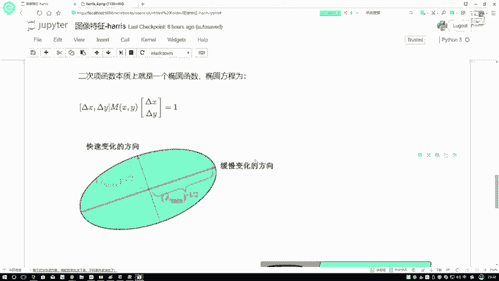

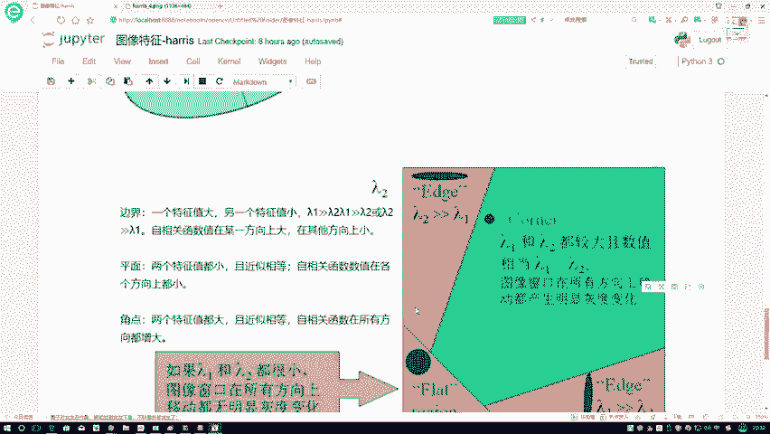

以下是基于特征值λ₁和λ₂大小的判断逻辑：

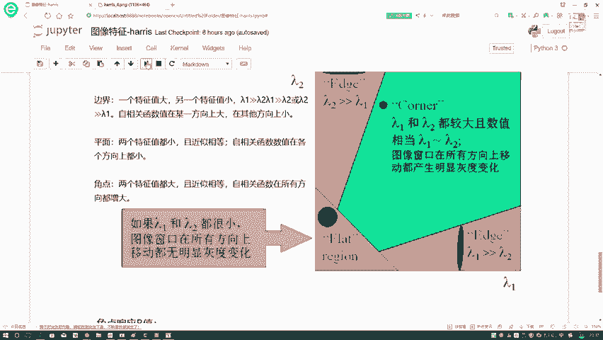

*   **边缘**：当λ₁远大于λ₂，或λ₂远大于λ₁时，表示在一个方向上变化剧烈，而在垂直方向上变化平缓，这对应图像的边缘。
*   **平坦区域**：当λ₁和λ₂都较小且近似相等时，表示自相关函数在各个方向的变化都很小，整体灰度变化平缓，这对应平坦区域。
*   **角点**：当λ₁和λ₂都比较大时，表示无论向哪个方向移动，灰度都会发生剧烈变化，这对应图像的角点。

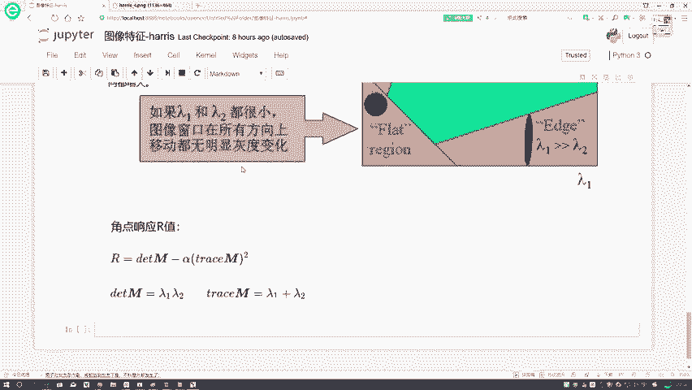

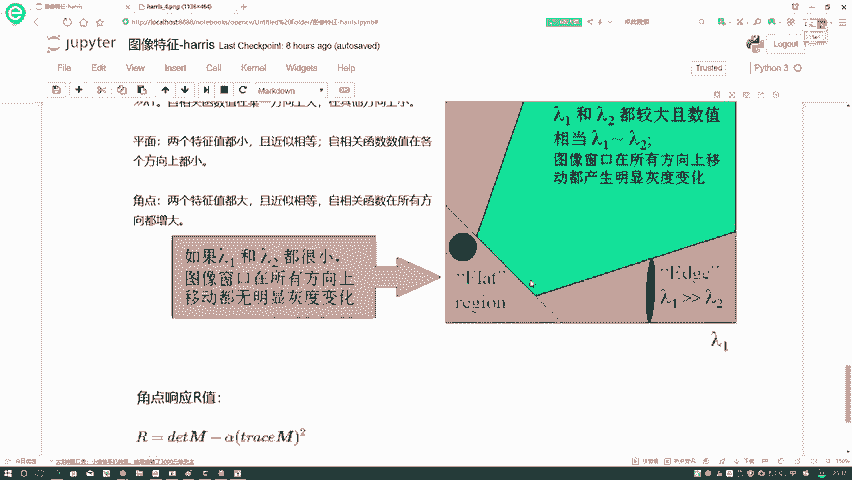

## 角点响应函数R 📊

到目前为止，我们知道了如何通过比较特征值的大小来定性判断区域类型。但光说“远大于”或“比较小”不够直接，科学家们定义了一个量化的“角点响应函数R”来解决这个问题。

R的定义如下：
`R = λ₁ * λ₂ - k * (λ₁ + λ₂)²`
其中k是一个较小的经验常数，在OpenCV中通常取0.04。

我们可以通过计算出的R值来更精确地判断：

*   **平坦区域**：λ₁和λ₂都很小，R值接近于0。
*   **边缘**：λ₁和λ₂一个大一个小，R值为负数。
*   **角点**：λ₁和λ₂都比较大，R值为正数。

因此，基本的判断方法是：R > 0 大致为角点，R ≈ 0 为平坦区域，R < 0 为边缘。

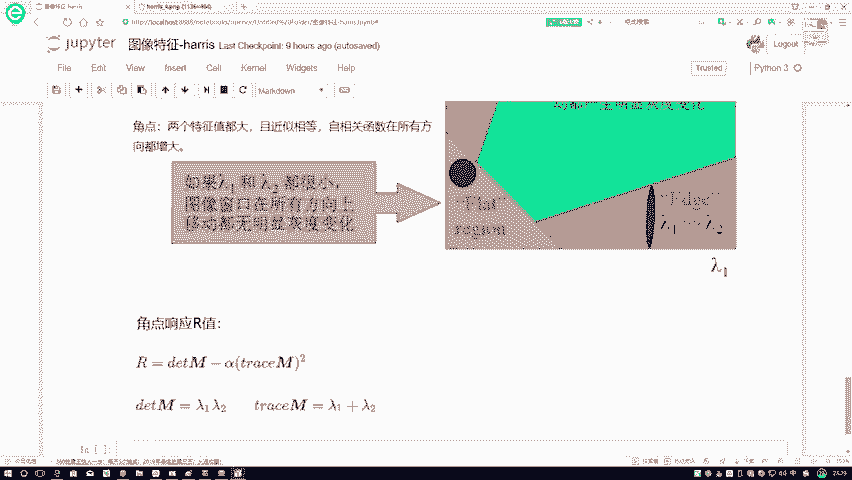

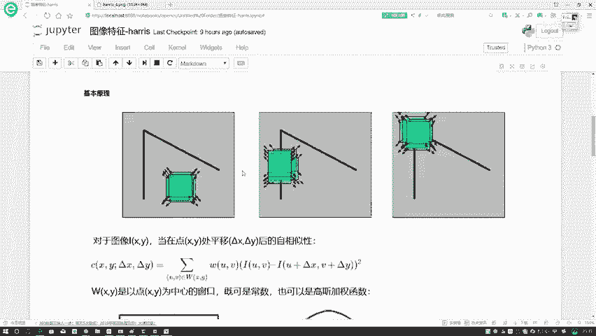

## Harris算法流程总结 📝

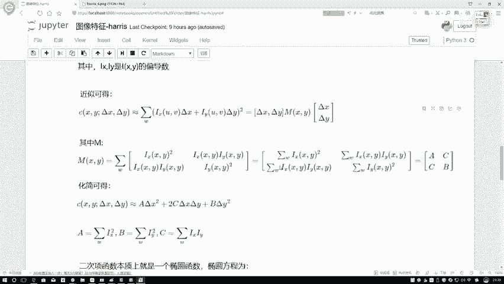

最后，我们来总结一下Harris角点检测算法的完整流程。

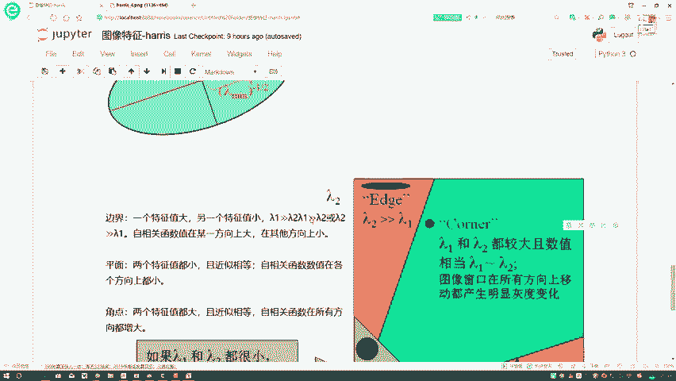

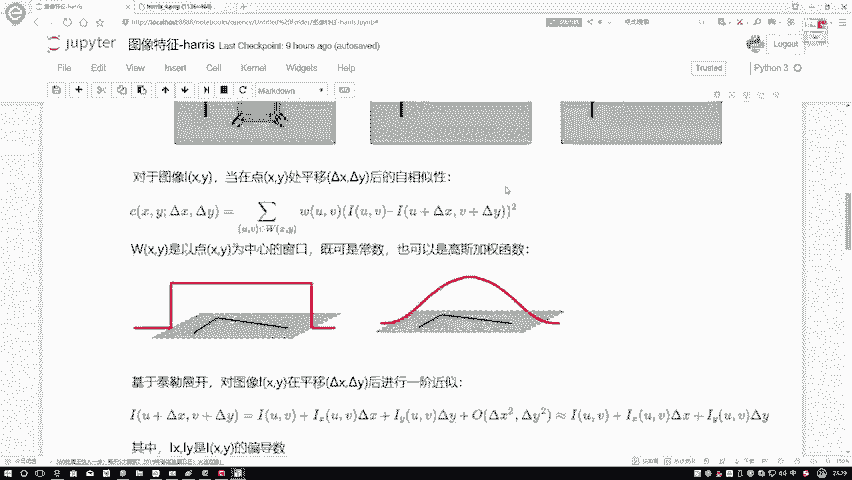

以下是算法的主要步骤：

1.  **计算梯度**：对输入图像，分别计算x方向和y方向的梯度（如一阶导数），得到I_x和I_y。
2.  **构建与计算矩阵M**：根据梯度计算矩阵M中的各个元素（I_x², I_y², I_x*I_y），并通常进行高斯加权，然后计算该矩阵的特征值λ₁和λ₂。
3.  **计算响应与判断**：根据特征值计算角点响应函数R，并根据R值的大小判断每个像素位置属于角点、边缘还是平坦区域。
4.  **非极大值抑制**：在角点检测结果中，一个角点周围区域的响应值可能都很高。我们需要应用非极大值抑制，只保留局部区域内的最大值点，从而得到精确的、单像素级别的角点位置。

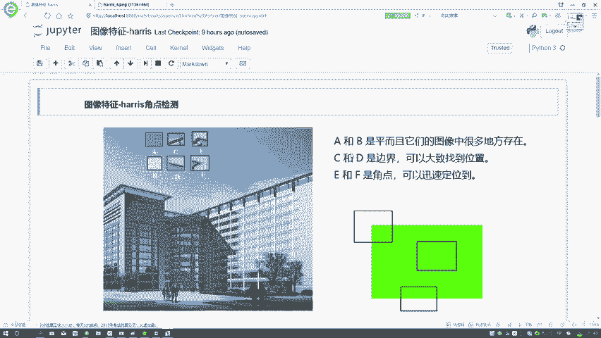

本节课中我们一起学习了Harris角点检测算法的数学原理。我们从自相关矩阵的对角化入手，理解了特征值对应于灰度变化椭圆的轴长，进而学会了通过比较特征值大小或计算响应值R来区分角点、边缘和平坦区域，并掌握了算法的完整实施流程。