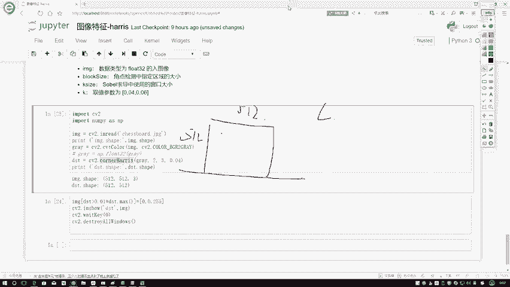
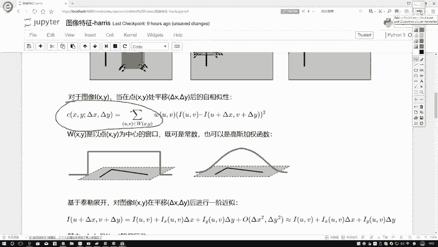
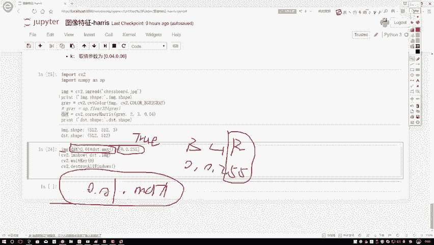
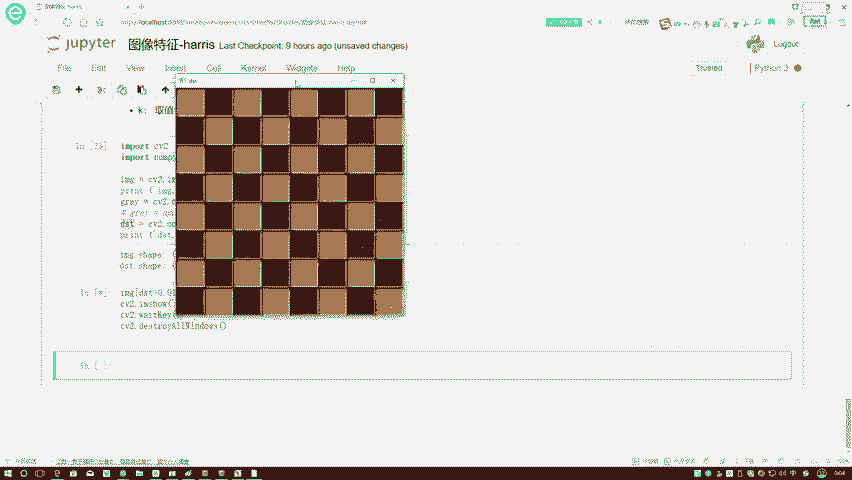
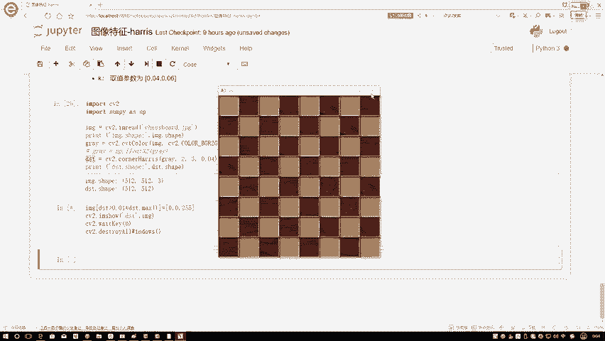
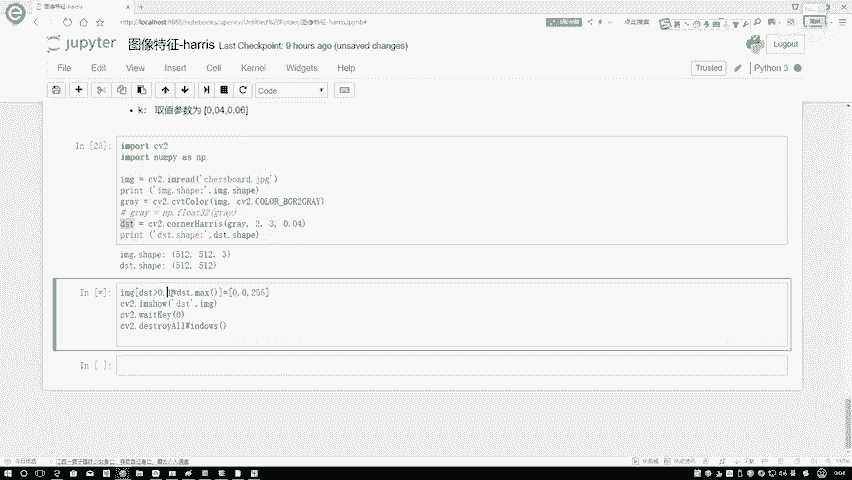
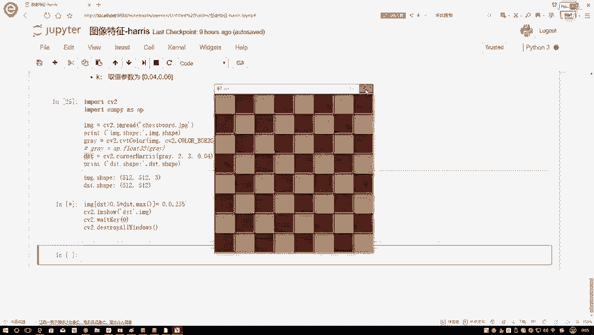
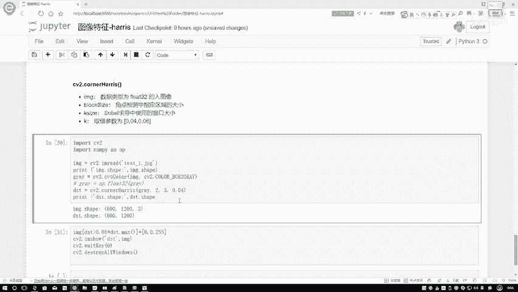

# 课程P45：OpenCV角点检测实战 🎯

在本节课中，我们将学习如何在OpenCV中使用Harris角点检测算法。我们将通过调用一个简单的函数接口，对图像进行角点检测，并学习如何调整参数以优化检测结果。

## 概述

角点检测是计算机视觉中的一项基础任务，用于识别图像中两条或多条边缘相交的点。OpenCV提供了便捷的函数来实现Harris角点检测。本节教程将详细介绍该函数的使用方法、参数含义以及结果的可视化过程。

## 使用OpenCV进行角点检测

上一节我们介绍了角点检测的基本原理，本节中我们来看看如何在OpenCV中具体实现。

OpenCV中用于Harris角点检测的核心函数是 `cv2.cornerHarris`。该函数有四个主要参数，其调用格式如下：

```python
dst = cv2.cornerHarris(src, blockSize, ksize, k)
```

以下是各个参数的具体说明：

*   **src**：输入图像。要求数据类型为 `np.float32`。如果读取的图像格式不符，需要进行转换。
*   **blockSize**：指定用于角点检测的邻域窗口大小。
*   **ksize**：Sobel算子的孔径参数，用于计算图像梯度。通常设置为3。
*   **k**：Harris检测器方程中的自由参数，用于调整角点检测的敏感度。OpenCV推荐值为0.04，取值范围通常在0.04到0.06之间。

## 实战步骤

接下来，我们通过一个国际象棋棋盘的例子，演示完整的角点检测流程。

首先，导入必要的工具包并读取图像。

```python
import cv2
import numpy as np

# 读取图像（国际象棋棋盘）
img = cv2.imread(‘chessboard.jpg’)
print(‘原始图像形状：‘, img.shape) # 例如 (512, 512, 3)
```

然后，将彩色图像转换为灰度图，因为角点检测通常在灰度图上进行。



```python
# 转换为灰度图
gray = cv2.cvtColor(img, cv2.COLOR_BGR2GRAY)
```



接着，对灰度图执行Harris角点检测。

```python
# 执行Harris角点检测
gray = np.float32(gray)
dst = cv2.cornerHarris(gray, 2, 3, 0.04)
print(‘检测结果形状：‘, dst.shape) # 例如 (512, 512)
```

检测结果 `dst` 是一个与输入图像同尺寸的数组，其中的每个值代表了对应像素点的角点响应强度（即公式中的C值）。值越大，该点是角点的可能性越高。

## 结果可视化

得到角点响应图后，我们需要设定一个阈值来筛选出真正的角点。通常，我们不使用固定阈值，而是与响应图中的最大值进行比较。

以下是筛选并标记角点的过程：

```python
# 将检测结果进行膨胀，使角点标记更明显（非必需步骤）
dst = cv2.dilate(dst, None)



# 设定一个阈值（例如最大值的1%），筛选角点
img[dst > 0.01 * dst.max()] = [0, 0, 255] # 将角点位置标记为红色（BGR格式）



# 显示结果
cv2.imshow(‘Harris Corners‘, img)
cv2.waitKey(0)
cv2.destroyAllWindows()
```

在这段代码中，`dst > 0.01 * dst.max()` 会生成一个布尔型数组，其中 `True` 表示该位置的响应值超过了最大值的1%。我们将原图中这些位置像素的BGR值设置为 `[0, 0, 255]`，即用红色圆点标记出角点。

## 参数调整与效果对比



如果觉得检测到的角点过多或过少，可以调整阈值比例。例如，将阈值提高到最大值的10%或50%：

```python
# 使用更严格的阈值（10%）
img[dst > 0.1 * dst.max()] = [0, 0, 255]



# 使用非常严格的阈值（50%）
img[dst > 0.5 * dst.max()] = [0, 0, 255]
```

提高阈值后，只有响应更强的点会被标记为角点，从而减少检测数量。反之，降低阈值会增加检测到的角点数量。最佳阈值需要根据具体图像和应用场景进行调整。



## 在其他图像上的应用

Harris角点检测同样适用于其他类型的图像，例如建筑场景。通过更换输入图像，我们可以检测建筑物、树木等物体的角点。

```python
# 对另一张图像（如房屋）进行角点检测
img_building = cv2.imread(‘building.jpg’)
gray_building = cv2.cvtColor(img_building, cv2.COLOR_BGR2GRAY)
gray_building = np.float32(gray_building)
dst_building = cv2.cornerHarris(gray_building, 2, 3, 0.04)
# ... 后续可视化步骤同上
```

在实际应用中，最好的学习方法是使用自己的图片进行测试和实验，观察不同参数下的检测效果。

## 总结



本节课中我们一起学习了OpenCV中Harris角点检测的实战应用。我们掌握了 `cv2.cornerHarris` 函数的使用方法，理解了其关键参数的含义，并完成了从图像读取、灰度转换、角点检测到结果可视化的完整流程。最后，我们还探讨了如何通过调整阈值来优化角点检测的效果。掌握这一工具，是进行更复杂图像特征提取和匹配的重要基础。