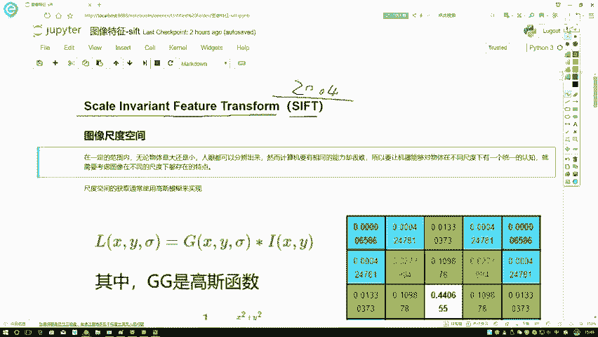
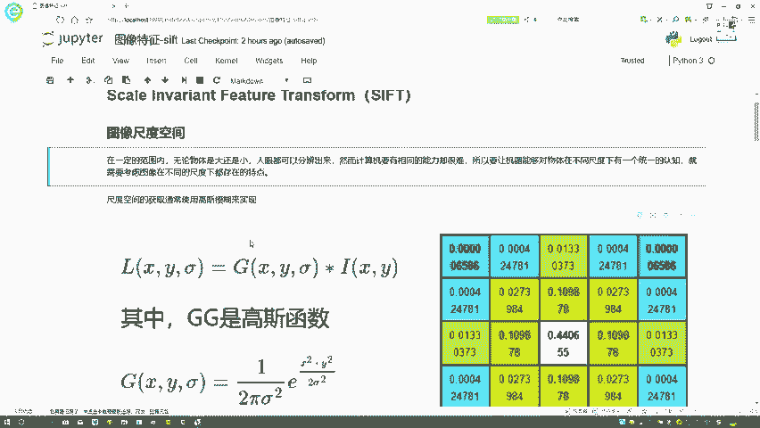
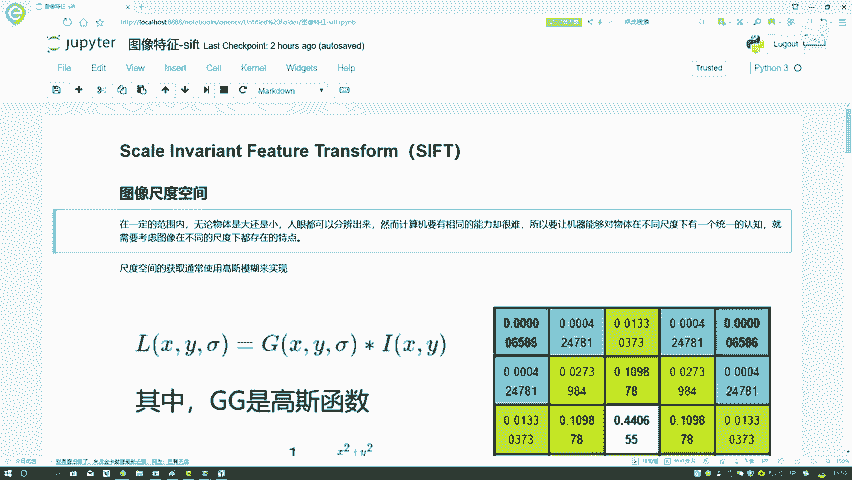
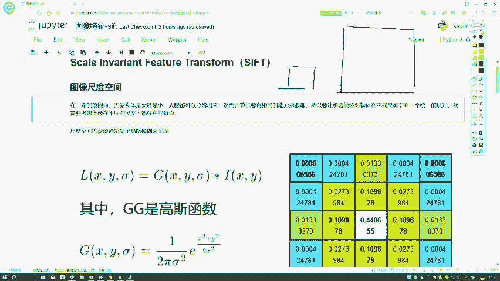
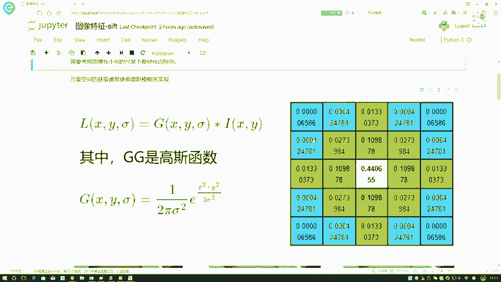
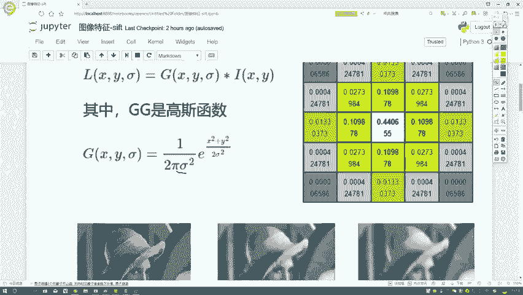
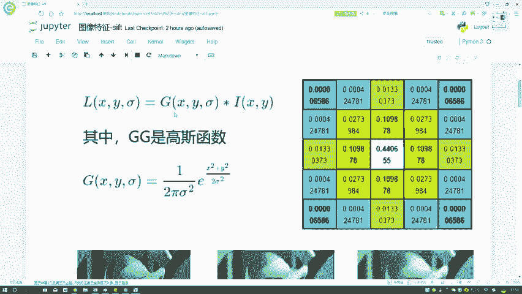
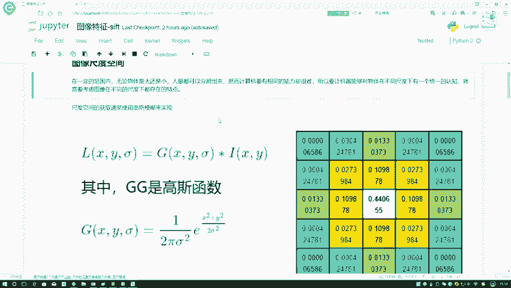
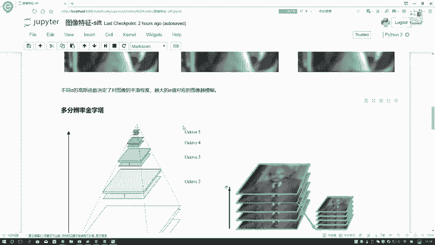

# 课程P46：SIFT算法（1）- 尺度空间定义 🏞️

在本节课中，我们将要学习图像特征匹配中的SIFT算法。SIFT全称为尺度不变特征变换，是一种具有平移不变性的图像特征匹配算法。这个算法是计算机视觉领域最常用的方法之一。虽然原始的SIFT算法在2004年完善，后续出现了许多改进版本，但其核心思想基本保持不变。由于SIFT算法涉及的数学概念和整体流程较多，我们将分模块进行解读。首先，我们来介绍第一个核心模块：图像的尺度空间。



## 图像的尺度空间



上一节我们介绍了SIFT算法的背景，本节中我们来看看什么是图像的尺度空间。



人类视觉系统具备一个关键能力：无论物体离我们是远是近、看起来是清晰还是模糊，我们通常都能识别出来。例如，在远处就能认出熟悉的人。我们希望计算机视觉系统也能具备类似的能力，即不仅能在图像清晰时提取特征，在图像模糊或尺度（大小）变化时也能提取出稳定的特征。这就是构建“尺度空间”的目的。

为了实现这个目标，我们需要对图像进行一系列变换，模拟人在不同观察条件下看到的图像。以下是构建尺度空间的核心步骤。

### 高斯滤波：实现尺度变换的工具

我们需要一种工具来系统地改变图像的清晰度（尺度）。这里使用的方法是**高斯滤波**。



高斯滤波的核心是一个高斯函数，它定义了一个滤波核（或称卷积核）。这个核的特点是其数值分布呈“钟形”，中心点的权重最大，向四周逐渐减小。滤波过程就是用这个核在原始图像上进行卷积操作。

用公式表示，二维高斯函数如下：

```
G(x, y, σ) = (1 / (2πσ²)) * exp(-(x² + y²) / (2σ²))
```

其中，`(x, y)`是像素点的坐标，`σ`（西格玛）是高斯分布的标准差。



### 标准差σ的作用

参数`σ`控制着高斯滤波的模糊程度。`σ`值越大，高斯核的权重分布越平缓，对原始图像的平滑（模糊）效果就越强；`σ`值越小，高斯核的权重越集中在中心，对图像的改变就越小，图像越接近原始状态。

因此，通过选择不同的`σ`值进行高斯滤波，我们可以得到同一图像在不同模糊程度（即不同尺度）下的版本。这就像从远处（模糊、大尺度）和近处（清晰、小尺度）观察同一个场景。



### 构建尺度空间的过程



具体操作是：从原始图像开始，使用一系列逐渐增大的`σ`值对其进行高斯滤波。这样就生成了一个图像序列，序列中的图像从清晰逐渐变得模糊。这个图像序列就构成了该图像的一个“尺度空间”。





本节课中我们一起学习了SIFT算法的第一个核心概念——尺度空间。我们了解到，为了让计算机像人眼一样在不同观察条件下稳定地识别特征，需要构建图像的尺度空间。这主要通过使用不同标准差`σ`的高斯滤波器对图像进行模糊处理来实现。`σ`值控制模糊程度，从而模拟出图像在不同尺度下的表现形式。理解尺度空间是掌握后续SIFT算法关键步骤的基础。