# 课程P47：2-高斯差分金字塔 🔍

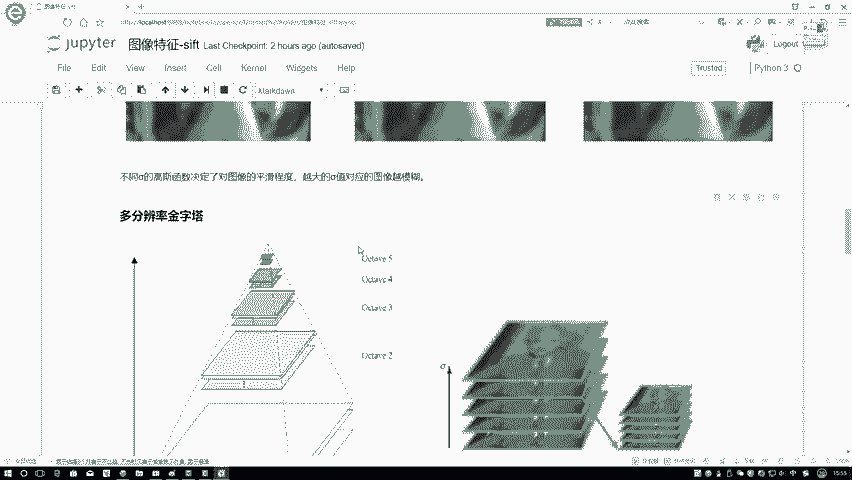

在本节课中，我们将要学习尺度空间理论中的一个核心概念——高斯差分金字塔。我们将了解为什么需要构建图像金字塔，以及如何通过高斯差分来有效地识别图像中的关键特征点。

---

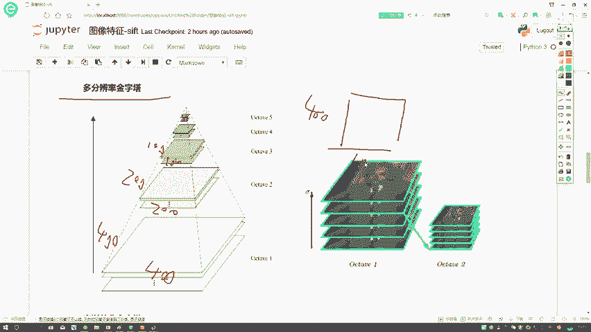

上一节我们介绍了高斯模糊在构建尺度空间中的作用。本节中我们来看看如何结合图像金字塔来构建一个更完整的尺度空间。

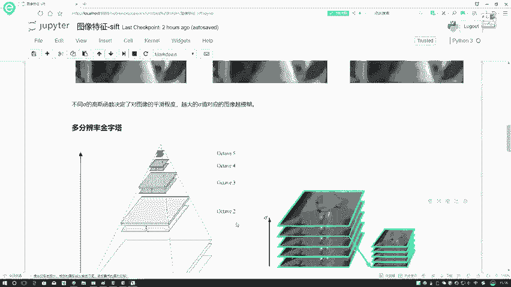

光进行高斯模糊是不够的。就像从远处就能认出班主任一样，计算机也需要在不同距离（尺度）下识别特征。因此，我们需要构建一个图像金字塔。

图像金字塔之前解释过。例如，最底层是一张400×400的图像。往上一层变为200×200，再上一层变为100×100。这就是一个图像金字塔。在特征提取过程中，无论目标较大（近处）还是较小（远处），计算机都需要能提取出其特征。

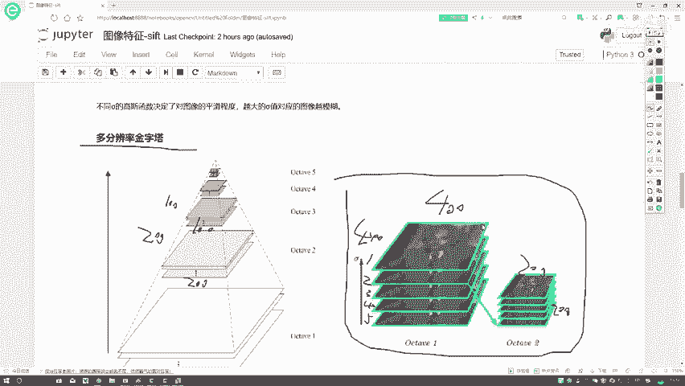

在图像尺度空间的构建中，我们需要做两件事：
1.  在同一个尺寸的层面上（例如都是400×400），进行多次不同参数的高斯模糊。
2.  在不同尺寸的金字塔层上，重复上述操作。

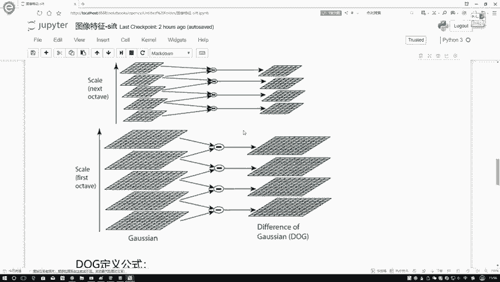

以下是构建过程的详细说明：

*   在400×400这一层，我们可以进行六种不同参数的高斯滤波变换。
*   同理，在200×200这一层，也需要进行六种不同的高斯滤波变换。
*   在100×100这一层，同样需要进行六种不同的高斯滤波变换。

因此，我们的尺度空间有两个层面：第一个层面是不同分辨率的图像金字塔；第二个层面是金字塔每一层内部，都需要生成多个经过不同高斯模糊的结果。

---

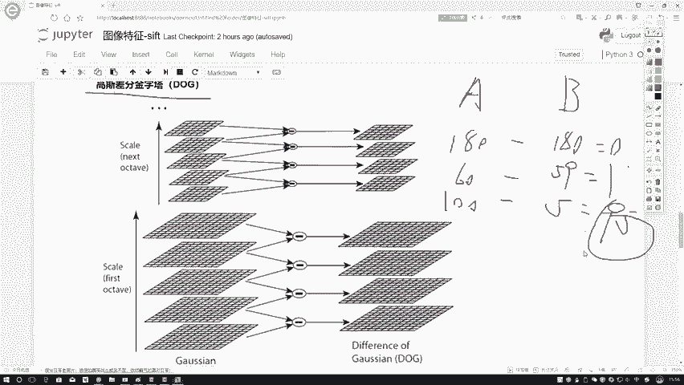

理解了尺度空间的构建后，接下来我们要介绍一个核心概念：高斯差分。

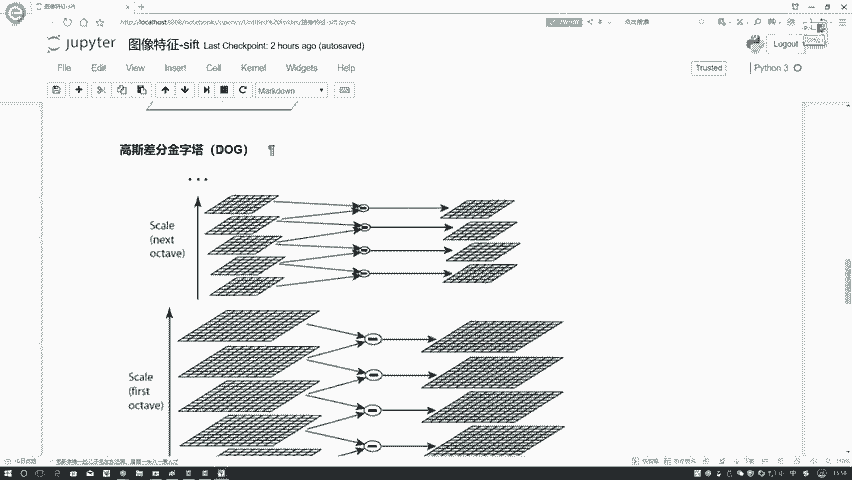

直接比较原始特征可能难以区分关键信息。例如，想区分A和B两个学生：
*   A：身高180cm，体重60kg，成绩100分。
*   B：身高180cm，体重59kg，成绩5分。

如果用身高比较，差异为0，无法区分。用体重比较，差异为1，也很小。但用成绩比较，差异为95分，这就能清晰地区分好坏。**我们认为，呈现显著差异的地方才是有价值的特征。**

在图像处理中，我们使用**高斯差分金字塔**来寻找这种差异性。其核心思想是：对同一金字塔层内、相邻的两个高斯模糊图像进行相减。

以下是高斯差分的具体做法：

*   假设在400×400这一层，我们得到了5张不同模糊程度的图像（记为1,2,3,4,5）。
*   由于它们尺寸相同，我们可以进行差分计算：图像2减去图像1，图像3减去图像2，图像4减去图像3，图像5减去图像4。
*   这样，5张输入图像最终会得到4个差分结果图。
*   在200×200层，也进行同样的操作，得到4个差分结果图。

这些差分结果图用于观察图像中的每个点。SIFT算法的目标就是寻找特征点。那么什么样的点能成为特征点呢？**在差分结果中，数值较大（无论是正极大值还是负极小值）的极值点，通常被认为是重要的、有区分度的特征。**

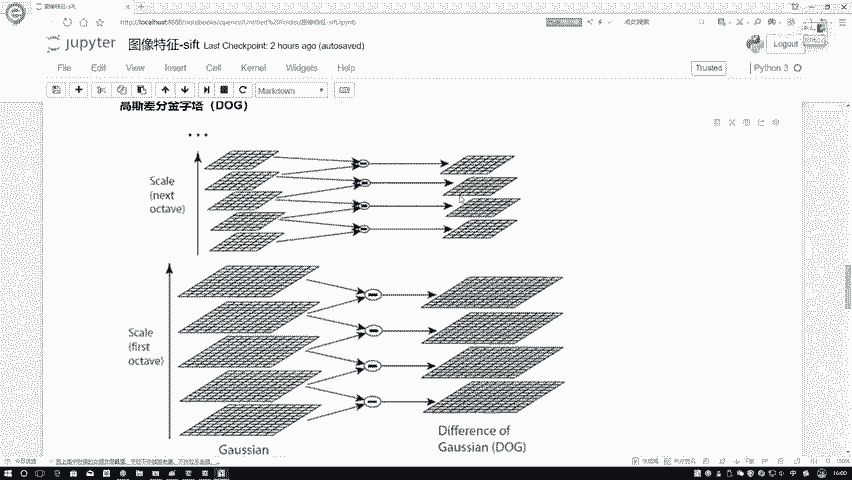

最后，我们从数学上定义一下高斯差分。一个高斯差分结果 `D(x, y, σ)` 需要三个参数来确定：

*   **`x, y`**：表示该点在图像中的具体位置坐标。
*   **`σ`**：表示生成该差分结果所使用的高斯模糊核的参数（尺度）。

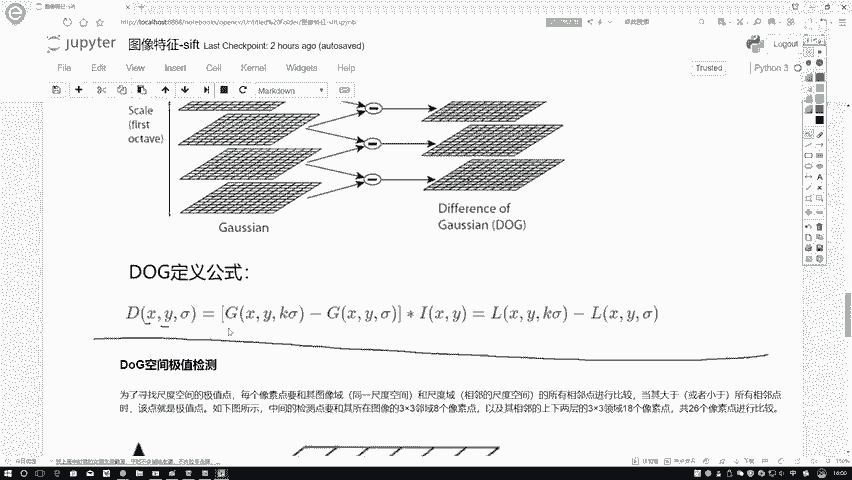

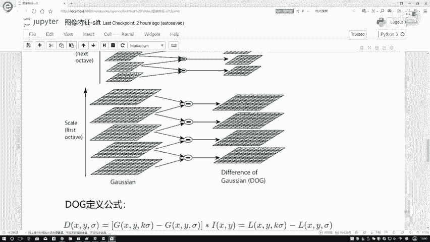

其计算公式可以表示为：
`D(x, y, σ) = (G(x, y, kσ) - G(x, y, σ)) * I(x, y) = L(x, y, kσ) - L(x, y, σ)`

其中：
*   `G` 是高斯核函数。
*   `I` 是原始图像。
*   `L` 是图像经过高斯模糊后的结果。
*   `k` 是一个常数乘子，用于控制相邻模糊尺度之间的比例。

---

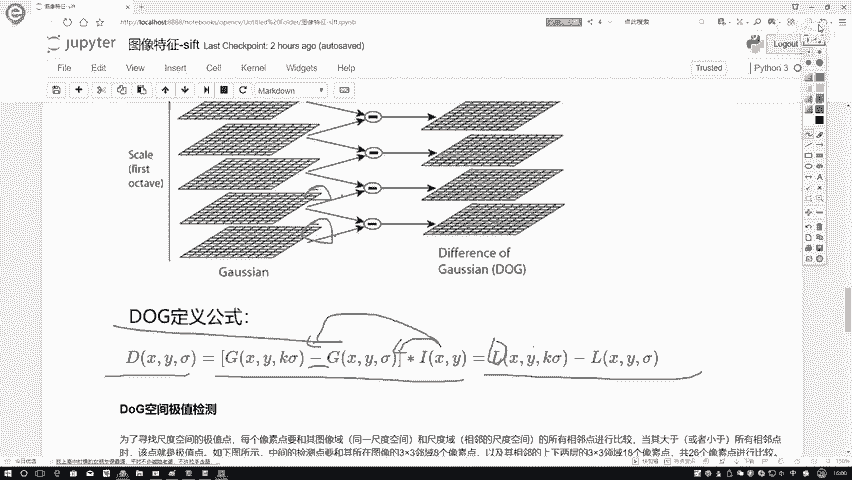

本节课中我们一起学习了高斯差分金字塔的构建原理与作用。我们了解到，通过构建图像金字塔并在每一层内计算相邻高斯模糊图像的差分，可以有效地凸显出图像在不同尺度下的显著特征区域，为后续定位关键特征点奠定了基础。核心在于，**差分结果中的极值点对应了图像中稳定性高、区分度强的潜在特征位置。**