# 课程P48：3-特征关键点定位 🔍

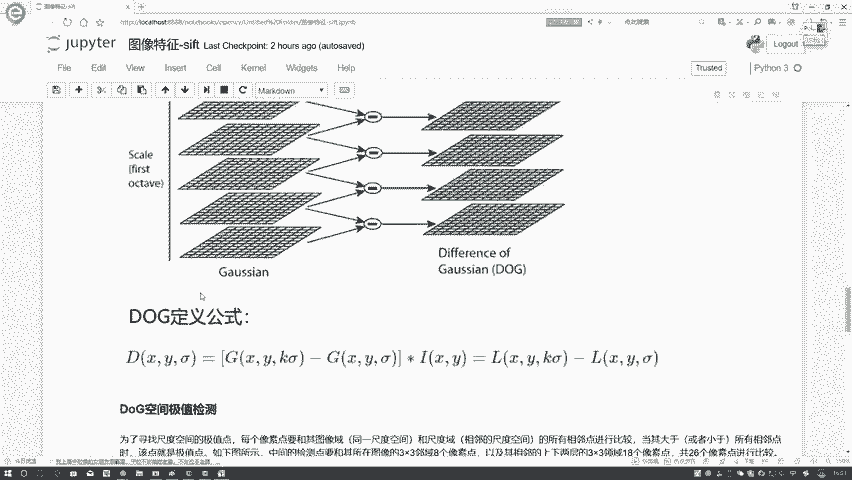

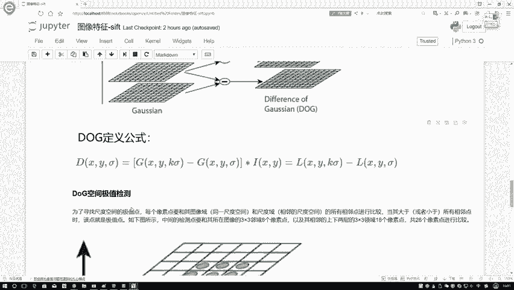

在本节课中，我们将学习SIFT算法中特征关键点定位的核心步骤。我们将重点探讨如何从高斯差分金字塔中检测极值点，以及如何对这些离散的极值点进行精确定位，使其更接近真实的连续极值位置。

---

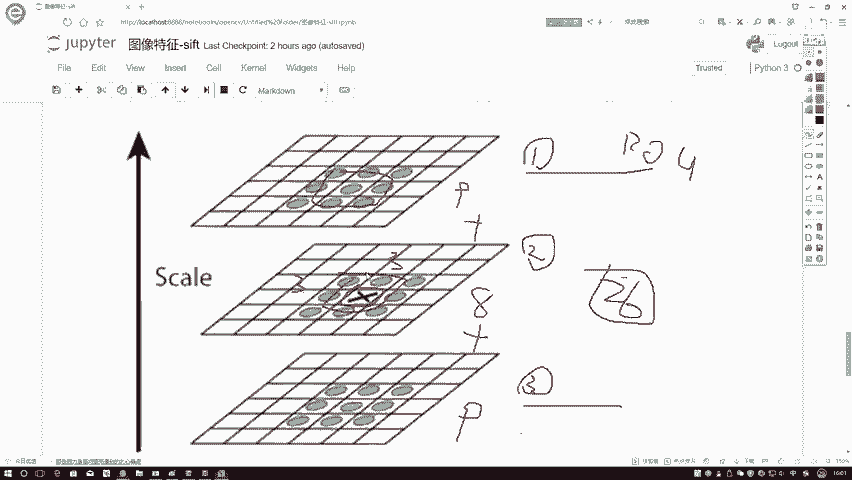

## 极值点检测

上一节我们介绍了高斯差分金字塔的构建。本节中我们来看看如何从中找出极值点。

我们的目标是在高斯差分金字塔中寻找局部极值点（极大值或极小值）。在SIFT算法中，寻找极值点并非仅在一个二维图像平面内进行，而是在三维尺度空间中进行比较。

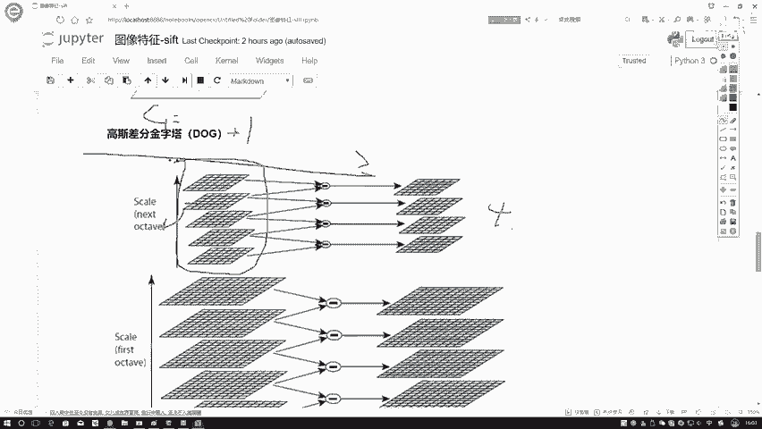

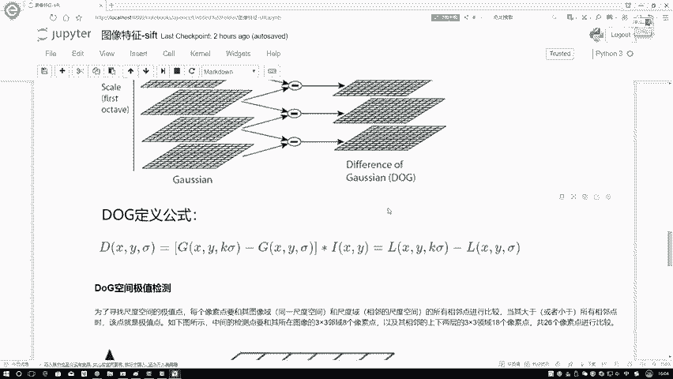

以下是具体的比较方法：
*   对于一个候选点，需要将其与**同尺度图像**中周围8个相邻像素进行比较。
*   同时，还需要与**上一层尺度**和**下一层尺度**图像中，对应位置3x3窗口内的9个像素点进行比较。
*   因此，每个候选点总共需要与 **8 + 9 + 9 = 26** 个点进行比较。

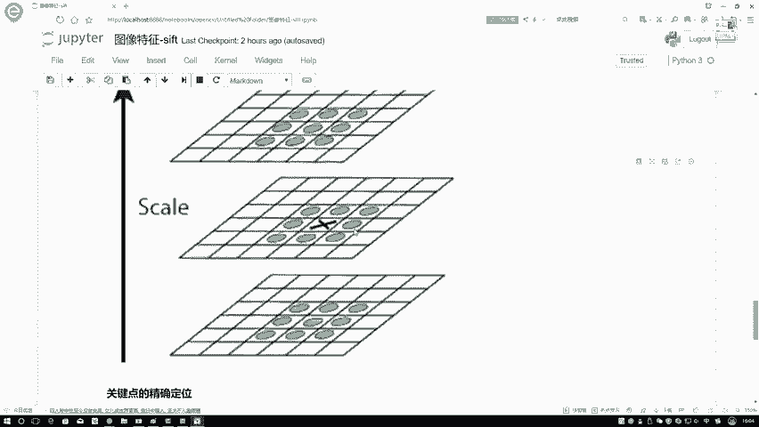

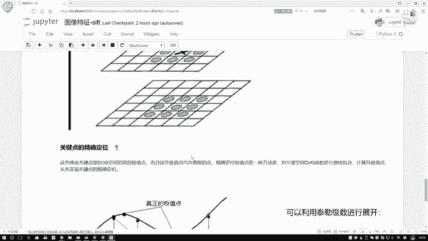

只有当一个点的值比这26个邻居的值都大（极大值）或都小（极小值）时，它才会被初步标记为关键点。

**需要注意的边界情况**：
*   尺度空间的最底层和最顶层的图像无法进行上下层比较，因此无法检测极值点。
*   若要在`S`个尺度中检测极值点，则需要构建`S+2`层高斯差分金字塔，因为首尾两层无法使用。
*   相应地，构建高斯差分金字塔需要的高斯模糊图像层数`G`应等于`S+3`。

---

## 关键点的精确定位

通过极值检测我们得到了一系列离散的关键点。然而，这些离散的点并不一定是连续尺度空间中**准确**的极值点位置。

我们需要对这些离散的极值点进行“微调”或“拟合”，以找到更精确的连续极值点位置。这个过程称为**关键点的精确定位**。

其核心思想是：利用离散点及其邻域的信息，通过数学方法拟合出连续的极值函数，从而找到更精确的极值位置。

### 一维情况下的拟合原理

为了便于理解，我们先看一个一维函数的简化例子。假设我们通过离散采样检测到一个极值点位于`x=0`处，其函数值为`D(0)`。但真实的连续极值点可能位于`x=0`附近。

我们可以利用**泰勒展开式**，在`x=0`处对连续函数`D(x)`进行近似：

`D(x) ≈ D(0) + (∂D/∂x)*x + 0.5*(∂²D/∂x²)*x²`

其中：
*   `D(0)` 是离散点`x=0`处的函数值。
*   `∂D/∂x` 是函数在`x=0`处的一阶导数（梯度）。
*   `∂²D/∂x²` 是函数在`x=0`处的二阶导数。

对于图像这样的离散数据，导数无法直接计算，但可以用差分来近似。例如，一阶导数可以近似为：
`∂D/∂x ≈ [D(1) - D(-1)] / 2`

拟合出连续函数`D(x)`的近似表达式后，为了找到其真实的极值点，我们令其一阶导数为零并求解`x`：
`∂D(x)/∂x = (∂D/∂x) + (∂²D/∂x²)*x = 0`

解出偏移量`x̂`后，将其代回原泰勒展开式，即可得到修正后更精确的极值`D(x̂)`。

### SIFT中的三维精确定位

在实际的SIFT算法中，关键点存在于三维空间：图像坐标`(x, y)`和尺度`σ`。因此，精确定位是在三维空间中进行的。

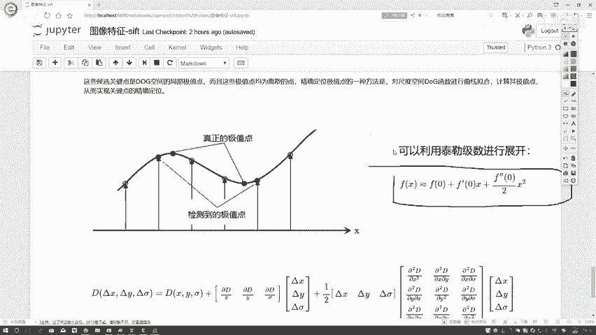

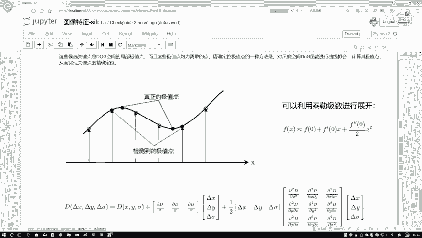

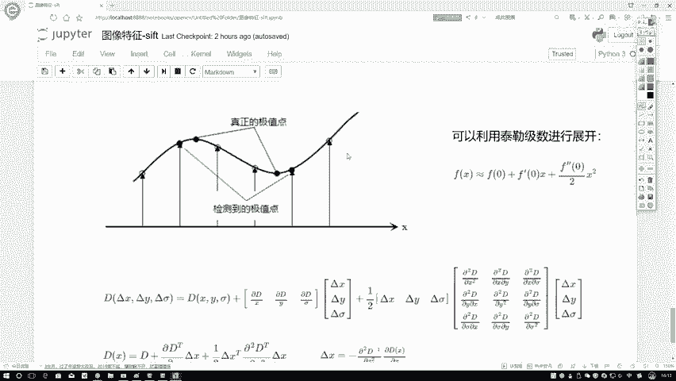

其原理与一维情况相同，但使用了向量和矩阵的形式来表示。对离散检测到的关键点`(x, y, σ)`，其修正量`X̂ = (Δx, Δy, Δσ)^T`可以通过求解以下方程得到：

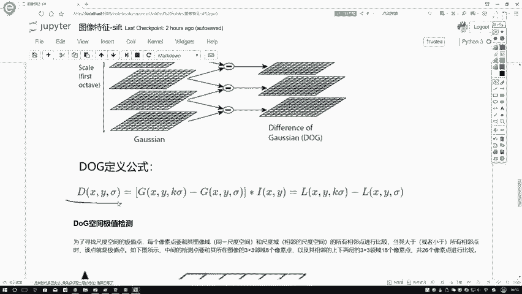

`X̂ = - (∂²D⁻¹/∂X²) * (∂D/∂X)`

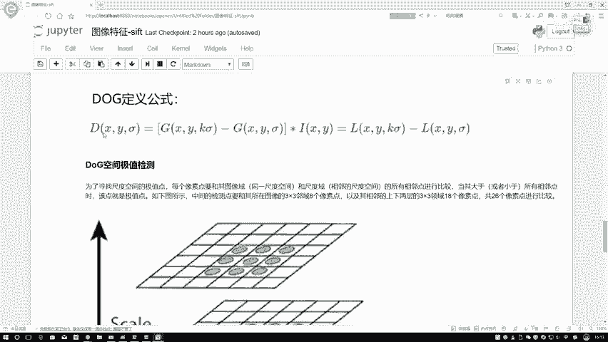

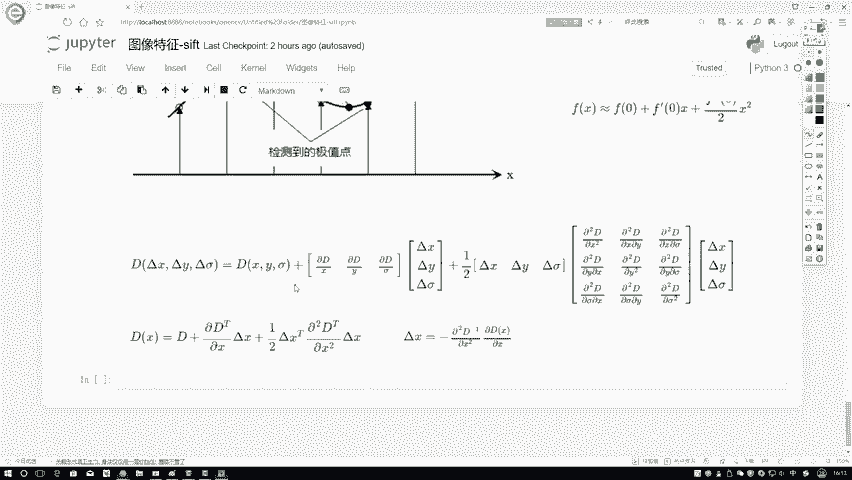

其中：
*   `∂D/∂X` 是三维梯度向量。
*   `∂²D/∂X²` 是Hessian矩阵（二阶偏导数矩阵）。

将计算出的偏移量`X̂`加回到原离散坐标上，就得到了精确定位后的关键点位置。同时，将`X̂`代入展开式也能得到该极值点更准确的响应值`D(X̂)`，这个值可用于后续筛选低对比度的不稳定关键点。

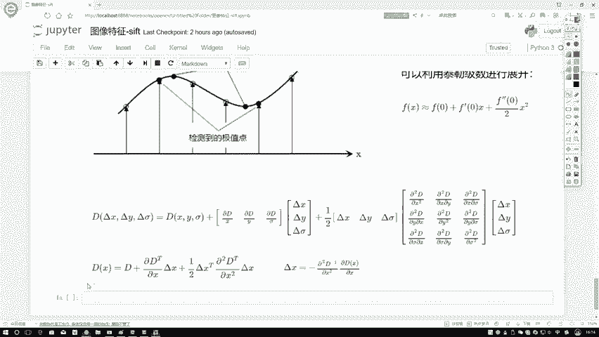

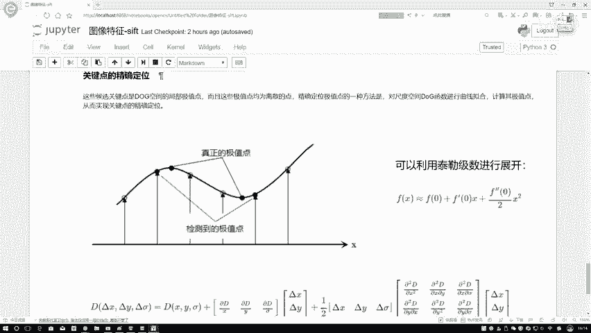

---

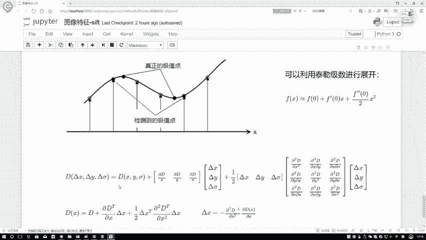

## 总结

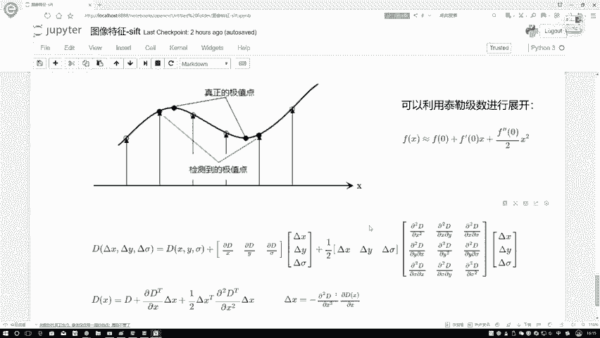

本节课中我们一起学习了SIFT特征关键点定位的两个核心步骤：
1.  **极值点检测**：在高斯差分金字塔的三维尺度空间中，将每个像素点与其周围的26个邻域点进行比较，初步找出局部极值点。
2.  **关键点精确定位**：由于初步检测到的极值点是离散的，我们利用泰勒展开式对离散点进行拟合，通过求导数为零的方法，在连续空间中计算出更精确的极值点位置和响应值。这个过程将关键点从离散的像素坐标修正到了亚像素级别的精度。

理解这两个步骤，特别是精确定位的数学思想，对于掌握SIFT算法的精髓至关重要。虽然其中涉及一些数学推导，但核心目标始终是：让找到的特征点位置尽可能稳定和准确。