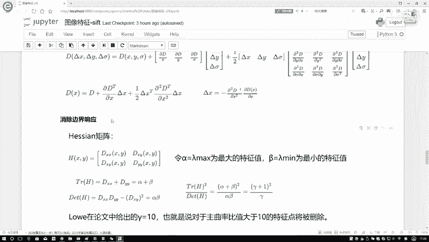
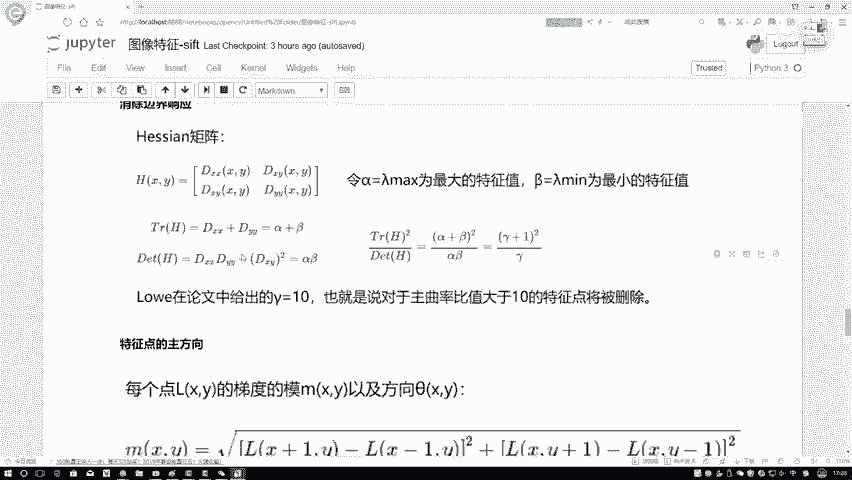
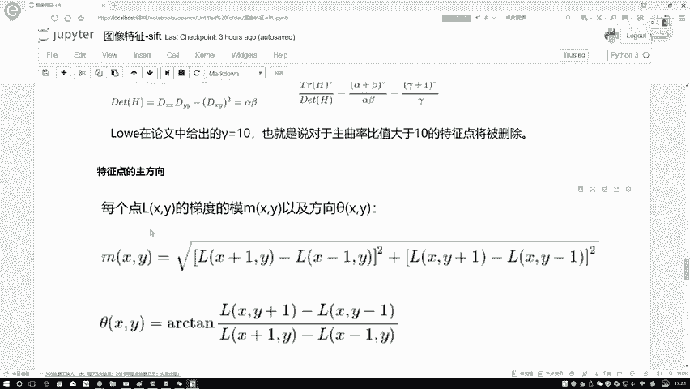
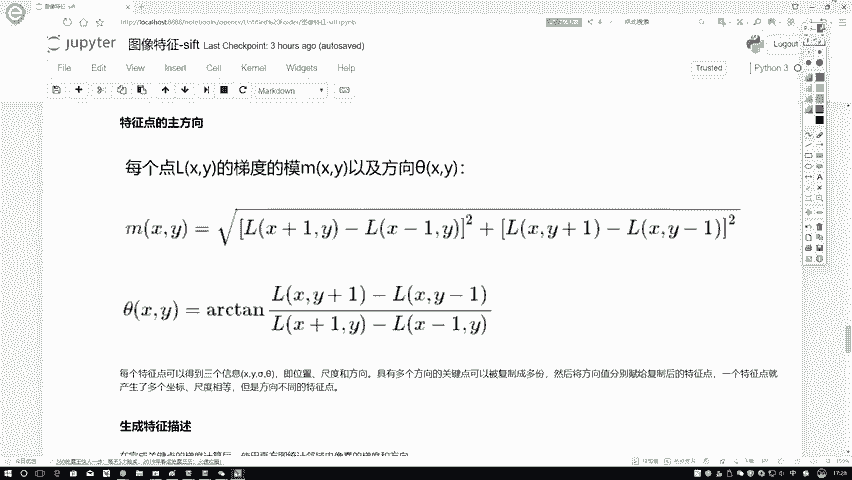
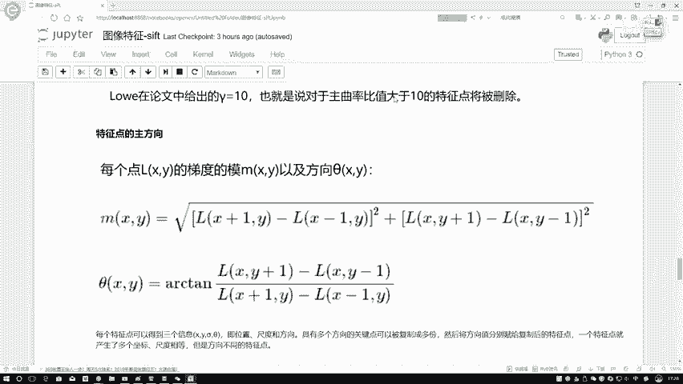
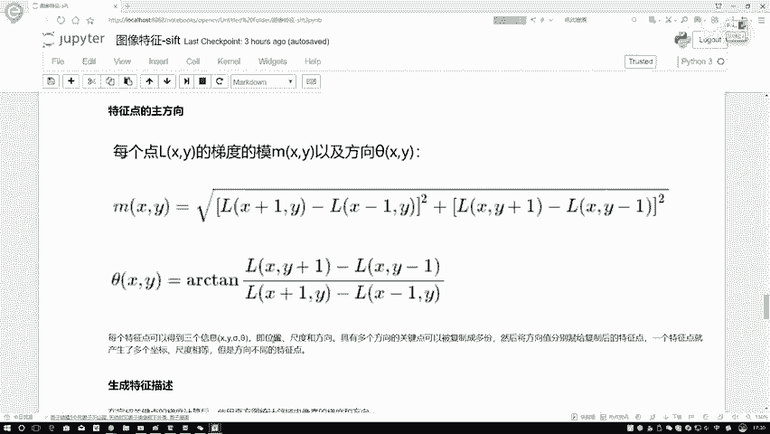
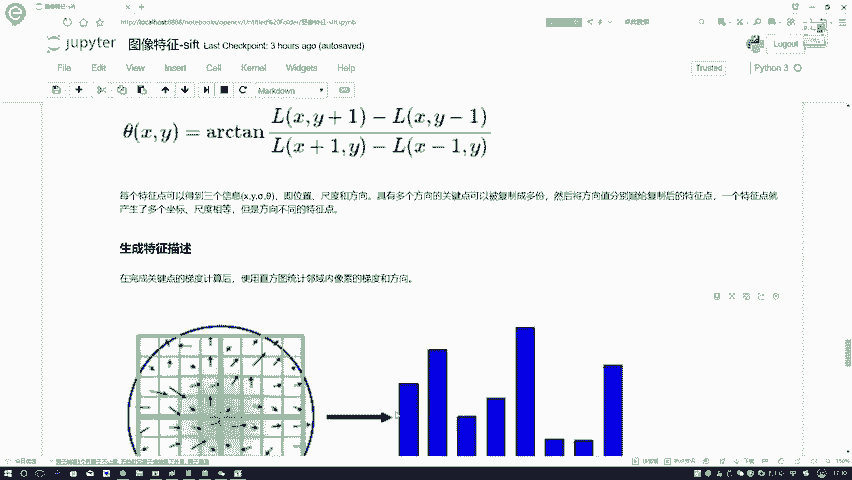
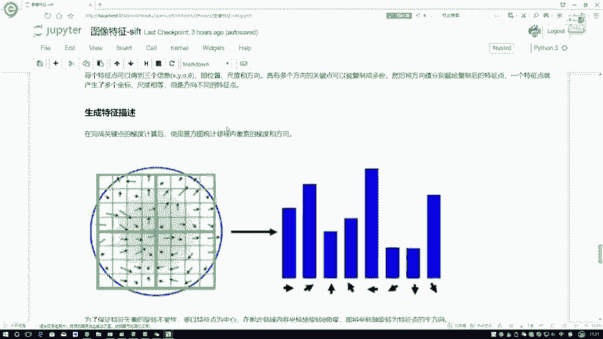
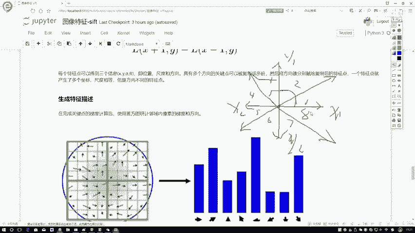
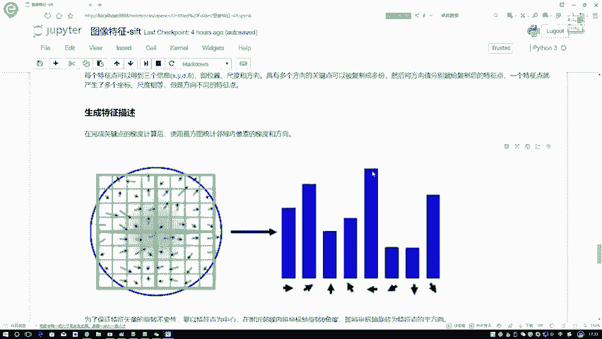

# 课程P49：SIFT特征描述生成教程 🧭

在本节课中，我们将学习SIFT算法中生成特征描述的关键步骤。上一节我们介绍了关键点的定位与过滤，本节中我们来看看如何为这些关键点生成具有旋转不变性的特征描述符。

## 消除边界响应

当我们得到极值点的具体位置之后，还需要对这些位置进行过滤，判断其重要性。论文中提到一个步骤叫做“消除边界响应”。因为我们之前使用高斯差分函数进行滤波操作，可能会增强图像边缘的响应，因此需要消除这些响应。





这里的修正方法与之前讲解的Harris角点检测方法基本一致。在讲解角点检测时，我们提到了特征值λ1和λ2。当一个特征值大、另一个特征值小时，该点通常位于边界上。SIFT论文中采用了相同的思路，定义了α（较大的特征值）和β（较小的特征值），它们构成了Hessian矩阵：



```
H = [Dxx, Dxy;
     Dxy, Dyy]
```





其计算方法与Harris角点检测完全相同。核心判断条件是特征值的比值。我们让α代表较大的特征值，β代表较小的特征值。如果它们的比值大于一个阈值（论文中设定γ=10），即一个特征值远大于另一个，那么该点大概率位于边界上。对于这类边界点，我们应当进行过滤操作。

以下是边界响应的消除步骤：
1.  计算关键点处的Hessian矩阵。
2.  求解该矩阵的特征值α和β。
3.  判断比值 `r = α / β` 是否大于阈值（例如10）。
4.  若大于阈值，则判定为边缘响应点，将其剔除。

## 关键点方向分配



在得到稳定的关键点后，我们需要将其转换为计算机能够识别的数值向量。在生成描述向量之前，必须先为每个关键点分配一个主方向，以确保描述符具有旋转不变性。



方向定义方法很简单：对于当前关键点，我们计算其梯度幅值和方向。这与Harris角点检测中计算梯度方向的方法一致。梯度方向通过反正切函数计算，梯度幅值通过各方向梯度平方和的平方根计算。

因此，当我们得到一个关键点后，可以获得以下三个核心信息：
*   **位置**：由坐标 (x, y) 表示。
*   **尺度**：由检测到该关键点的高斯差分金字塔的尺度σ决定。
*   **方向**：由该点邻域内像素的梯度方向统计决定。

## 基于梯度方向直方图的主方向确定

有了位置、尺度和方向信息后，我们来看如何具体确定主方向。这需要借助梯度方向直方图。



观察关键点的一个邻域区域（论文对邻域半径有具体选择策略，此处我们理解核心思想即可）。在这个邻域内，每个像素都有其梯度方向和幅值，如同许多带有方向和长度的“小箭头”。

为了统计这些方向信息，我们使用方向直方图。直方图的X轴代表方向区间，Y轴代表落入该区间的梯度幅值累加和（而非简单的点数）。为了简化，通常将360度的方向范围划分为8个区间（每45度一个区间），例如0-44度、45-89度等。



以下是构建方向直方图的步骤：
1.  在关键点的尺度空间邻域内，计算所有像素的梯度幅值和方向。
2.  将方向范围量化为8个区间（bin）。
3.  将每个像素的梯度幅值累加到其对应的方向区间中。
4.  直方图的峰值代表了该关键点邻域梯度的主方向。

通常情况下，我们会得到一个明显的主方向峰值。但有时，可能存在一个与主峰值高度接近（例如达到主峰值80%以上）的次峰值。此时，论文建议将此关键点复制一份，并分别以主方向和次方向生成两个特征描述符。这样，一个关键点可能对应多个不同方向的特征向量，增强了匹配的鲁棒性。

## 总结



本节课中我们一起学习了SIFT特征描述生成的核心步骤。我们首先了解了如何通过Hessian矩阵特征值比值来消除不稳定的边缘响应点。接着，探讨了为关键点分配方向的重要性，这是实现旋转不变性的基础。最后，详细讲解了如何通过梯度方向直方图来确定关键点的主方向，并处理多峰值情况。这些步骤为下一步将关键点转换为独特的特征描述向量奠定了坚实基础。