# 图像处理基础课程 P5：图像平滑处理 📸

在本节课中，我们将要学习图像处理中的一项基础技术——图像平滑处理。平滑处理的核心是对图像数据进行各种滤波操作，其目的是去除图像中的噪声，使图像看起来更柔和。如果你了解过卷积的概念，那么理解平滑处理将会非常简单。

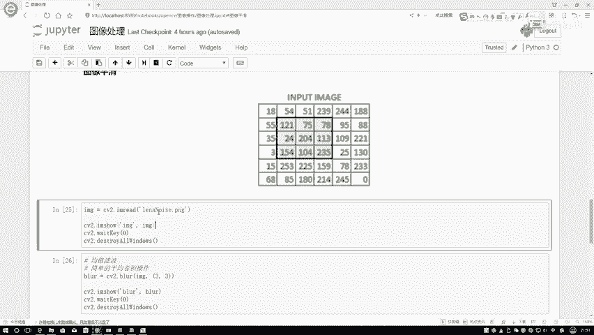

## 概述

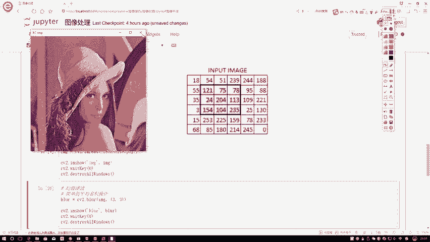

我们首先来看一下本次处理的输入图像。这张图像经过了一些特殊处理，上面存在明显的椒盐噪声点。我们的目标就是通过滤波操作，尽可能去除这些噪声。


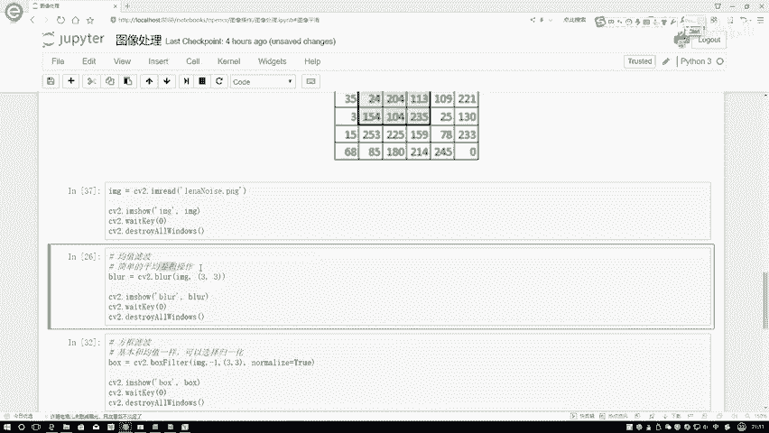

如上图所示，输入图像中包含了许多不规则的亮点和暗点，这些就是我们需要处理的噪声。接下来，我们将介绍几种不同的滤波方法来平滑图像。

## 均值滤波

上一节我们看到了带有噪声的图像，本节中我们来看看第一种平滑处理方法——均值滤波。对于不熟悉滤波概念的同学，可以将其理解为一种简单的平均卷积操作。

其核心思想是：对于图像中的每一个像素点，将其值替换为以其为中心的邻域内所有像素值的平均值。这能有效平滑局部区域的突变。

以下是均值滤波的工作原理：

1.  定义一个固定大小的卷积核（例如 3x3）。
2.  将这个核在图像上滑动。
3.  对于核覆盖的每一个区域，计算区域内所有像素值的平均值。
4.  用这个平均值替换中心像素点的原始值。

用公式描述，对于一个 3x3 的核，中心点的新值计算如下：
`新像素值 = (P1 + P2 + P3 + P4 + P5 + P6 + P7 + P8 + P9) / 9`
其中 P1 到 P9 是核覆盖的 9 个像素点的值。

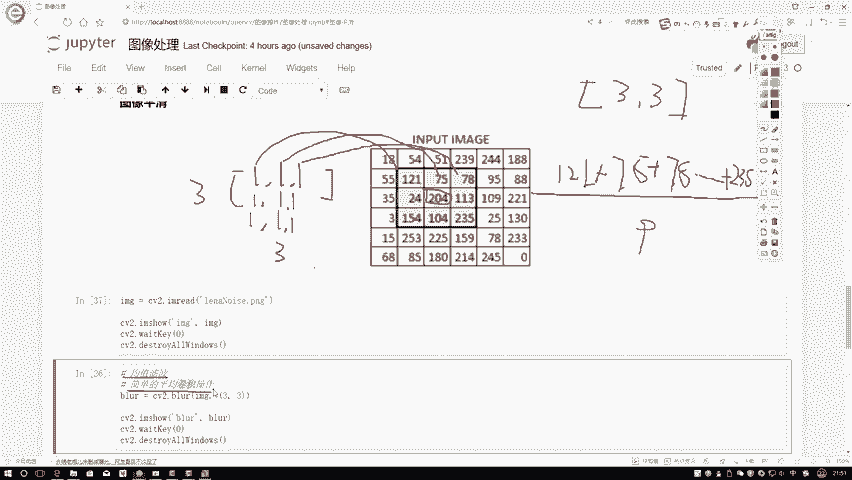

在代码实现中，我们通常使用 OpenCV 库的 `cv2.blur()` 函数。

```python
import cv2
# 读取图像
img = cv2.imread(‘noisy_image.jpg’)
# 应用均值滤波，使用 5x5 的核
blurred = cv2.blur(img, (5, 5))
```

让我们看一下均值滤波的效果。原始图像中的椒盐噪声非常明显。

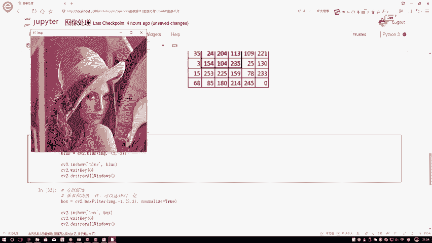

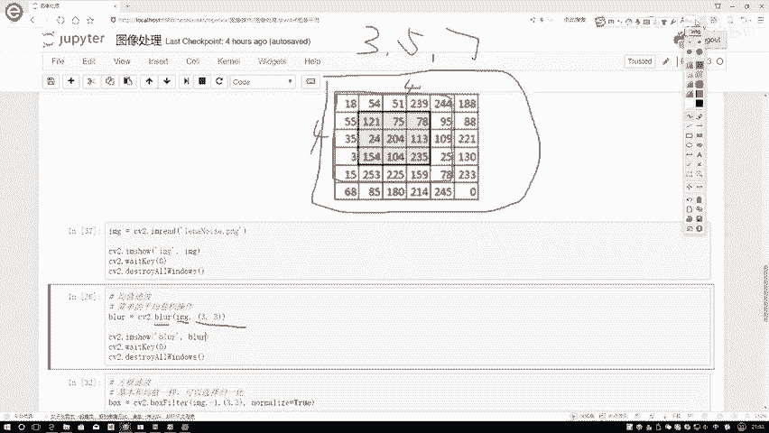

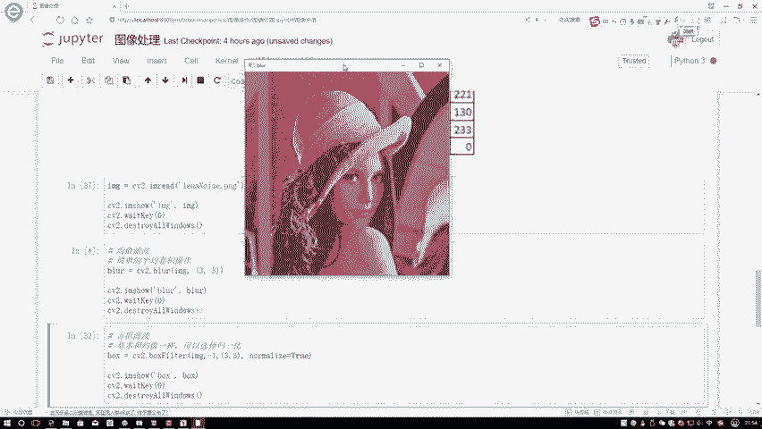

经过均值滤波处理后，图像中的噪声点变得模糊，整体观感更为平滑。


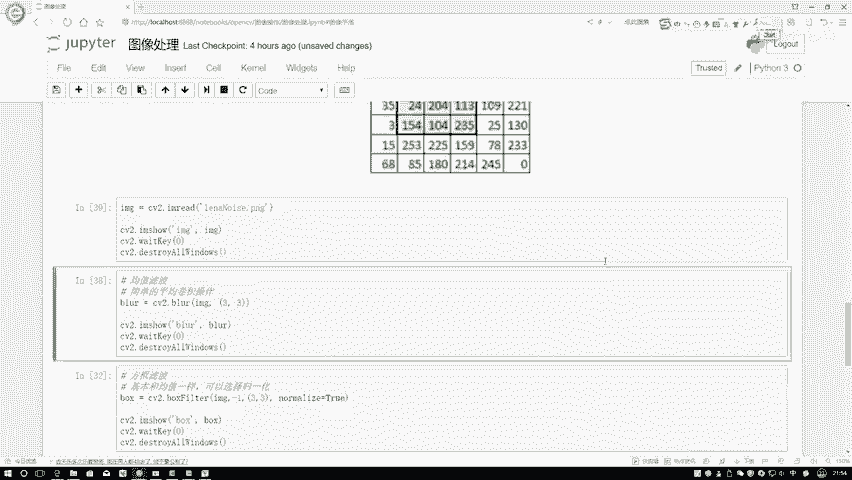


可以看到，噪声虽然被削弱，但图像的边缘也同时变得模糊，这是均值滤波的一个特点。

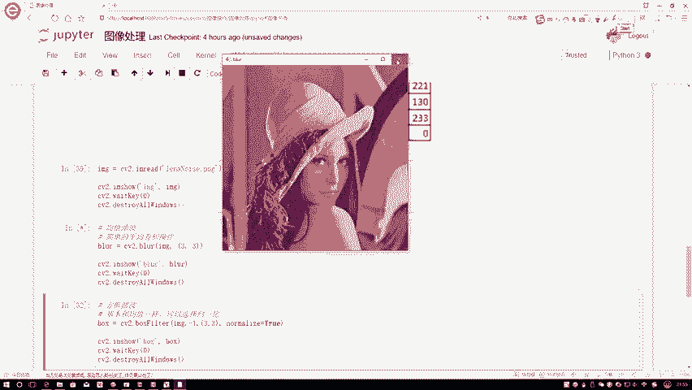

## 方框滤波

了解了基础的均值滤波后，我们来看一个与之非常相似的操作——方框滤波。你可以将方框滤波视为均值滤波的一个更通用的版本。

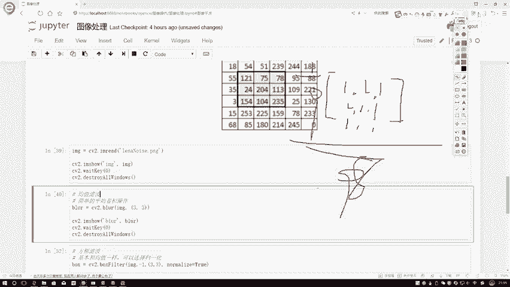

方框滤波的核心操作同样是卷积求和，但它多了一个是否进行归一化的选项。以下是方框滤波的关键参数：

*   **输入图像**：需要处理的原始图像。
*   **目标图像深度**：通常设为 `-1`，表示输出图像与输入图像深度相同。
*   **核大小**：例如 `(3,3)` 或 `(5,5)`，定义参与计算的邻域范围。
*   **归一化标志**：这是一个布尔值，决定是否在求和后除以核内元素总数。

当 `normalize=True` 时，方框滤波的效果与均值滤波完全一致，计算公式为：
`新像素值 = (核内像素值之和) / (核宽 * 核高)`

当 `normalize=False` 时，方框滤波直接输出核内像素值之和，而不进行平均。这可能导致像素值超过255（对于8位图像），此时OpenCV会将这些越界值截断为255。

以下是使用 OpenCV 的 `cv2.boxFilter()` 函数的示例：

```python
import cv2
img = cv2.imread(‘noisy_image.jpg’)
# 应用方框滤波，并进行归一化（效果同均值滤波）
box_blur_norm = cv2.boxFilter(img, -1, (5,5), normalize=True)
# 应用方框滤波，不进行归一化
box_blur_no_norm = cv2.boxFilter(img, -1, (5,5), normalize=False)
```

让我们对比一下效果。当 `normalize=True` 时，结果与均值滤波相同。

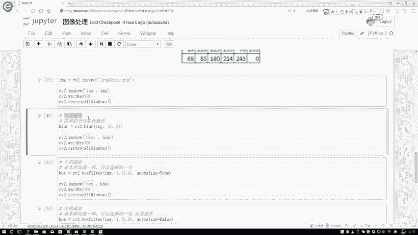

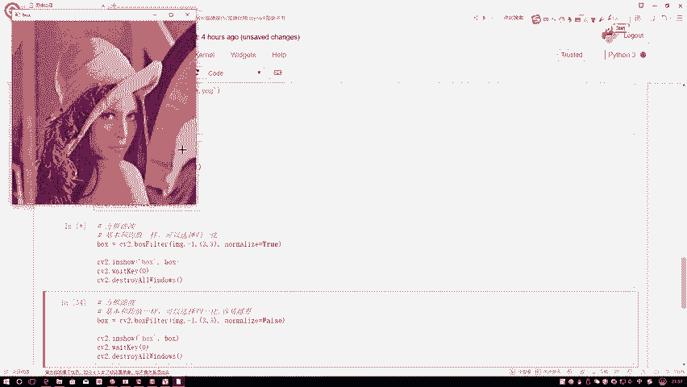

当 `normalize=False` 时，由于大量像素值在求和后超过255并被置为255，图像中会出现大面积的白色区域。


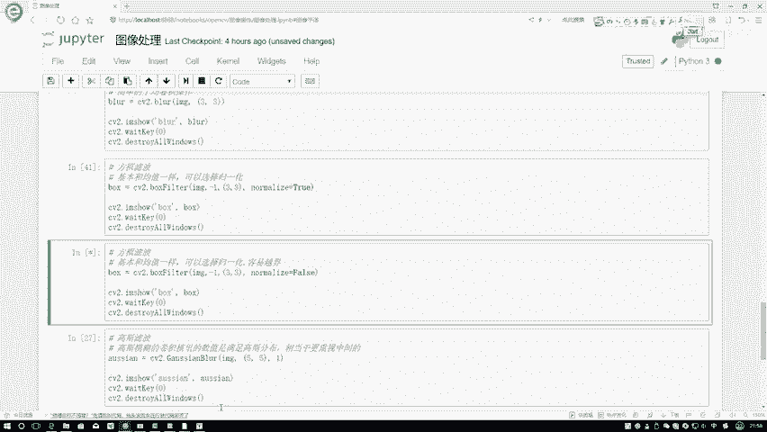

因此，在使用方框滤波时，通常建议保持归一化选项开启，除非有特殊需求。

## 总结

本节课中我们一起学习了图像平滑处理的两种基础滤波方法。
*   **均值滤波**：通过计算邻域像素的平均值来平滑图像，能有效抑制噪声，但会使图像边缘模糊。
*   **方框滤波**：均值滤波的泛化形式，通过 `normalize` 参数控制是否进行归一化。归一化时与均值滤波等价；不归一化时直接求和，可能导致像素值越界。


这两种方法是图像去噪和预处理中非常实用的工具，为后续更复杂的图像分析任务奠定了基础。