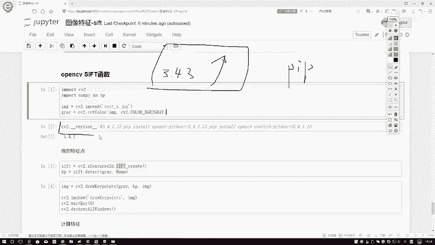
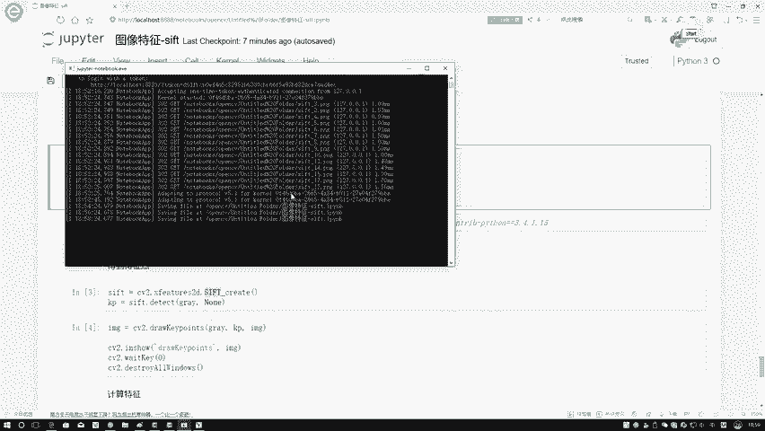
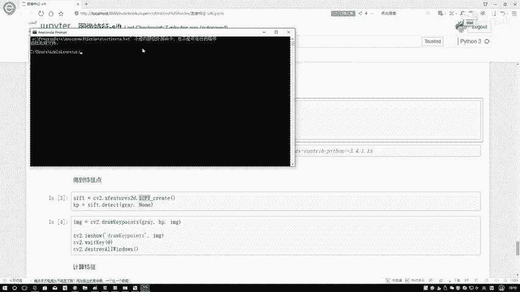
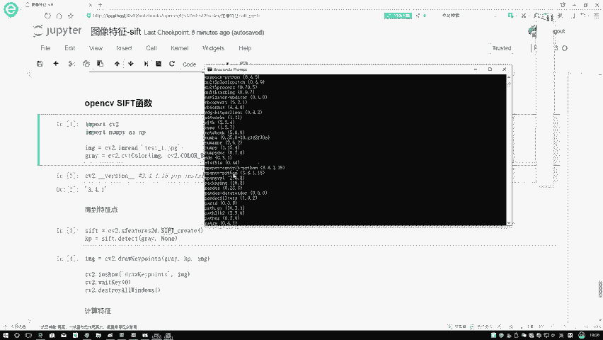
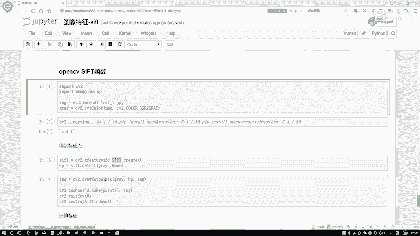
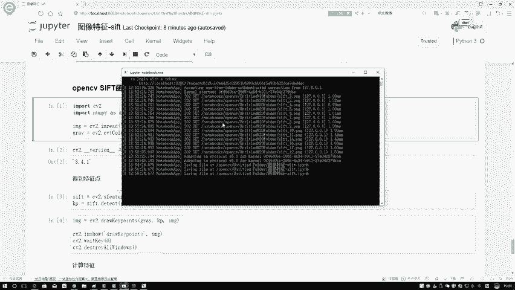
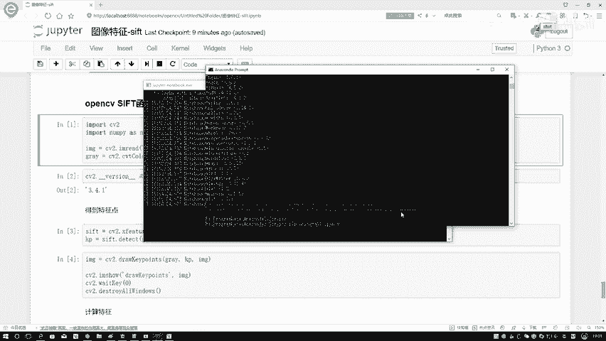
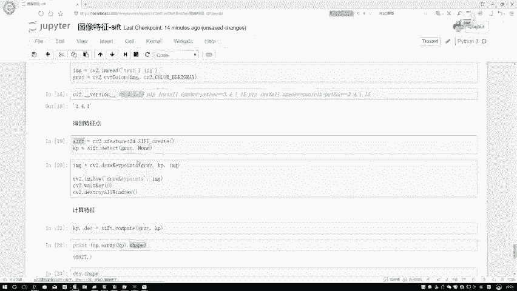

# 课程P51：OpenCV中SIFT函数使用教程 🛠️

在本节课中，我们将学习如何在OpenCV中使用SIFT算法，包括检测图像关键点并将其构建为特征向量。我们将从环境配置开始，逐步讲解函数的具体使用方法。

## 环境配置与版本降级

上一节我们介绍了SIFT算法的基本原理，本节中我们来看看如何在OpenCV中实际应用它。首先需要解决一个常见问题：由于SIFT算法在OpenCV 3.4.3及以上版本中受专利保护，我们需要将OpenCV版本降级到3.4.1.15才能使用相关函数。

以下是降级OpenCV版本的具体步骤：



1.  首先，需要卸载当前已安装的高版本OpenCV包。
2.  然后，重新安装指定版本的`opencv-python`和`opencv-contrib-python`包。



具体操作命令如下。请根据你的Python环境，在相应的命令行或终端中执行：



```bash
# 1. 卸载已安装的OpenCV包
pip uninstall opencv-python opencv-contrib-python

# 2. 安装指定版本的OpenCV包
pip install opencv-python==3.4.1.15
pip install opencv-contrib-python==3.4.1.15
```

安装完成后，可以通过以下代码验证版本：

```python
import cv2
print(cv2.__version__)  # 应输出 3.4.1.15
```

## SIFT关键点检测

环境配置完成后，我们就可以开始使用SIFT算法了。第一步是实例化SIFT检测器，并对图像进行关键点检测。

以下是使用SIFT检测关键点的完整代码流程：



1.  导入OpenCV库并读取图像。
2.  将图像转换为灰度图，这是SIFT算法要求的输入格式。
3.  创建SIFT检测器实例。
4.  使用`detect`方法检测图像中的关键点。



```python
import cv2



# 读取图像
img = cv2.imread('lena.jpg')
# 转换为灰度图
gray = cv2.cvtColor(img, cv2.COLOR_BGR2GRAY)

# 实例化SIFT检测器
sift = cv2.xfeatures2d.SIFT_create()
# 检测关键点
keypoints = sift.detect(gray, None)
```



检测到的关键点存储在`keypoints`变量中，它是一个由OpenCV封装的对象列表，包含了每个关键点的位置、尺度和方向等信息。

## 绘制关键点

得到关键点后，我们可以将其可视化在图像上。OpenCV提供了`drawKeypoints`函数来完成这个任务，这比自己手动绘制每个点要方便得多。

以下是绘制关键点的代码：

```python
# 在原始图像上绘制关键点
img_with_keypoints = cv2.drawKeypoints(img, keypoints, None)

# 显示结果
cv2.imshow('SIFT Keypoints', img_with_keypoints)
cv2.waitKey(0)
cv2.destroyAllWindows()
```

执行上述代码后，你将在图像上看到许多被圆圈标记的关键点。这些关键点通常位于图像的角点、边缘等具有显著纹理变化的区域。

## 计算特征描述符

关键点本身只提供了位置信息。为了进行图像匹配或识别，我们需要为每个关键点计算一个特征向量，即描述符。SIFT描述符是一个128维的向量，它对关键点周围的梯度信息进行了统计。

以下是计算特征描述符的步骤：

1.  使用之前实例化的SIFT对象的`compute`方法。
2.  该方法需要传入图像和检测到的关键点。
3.  它会返回更新后的关键点列表和对应的描述符矩阵。

```python
# 计算关键点的描述符
keypoints, descriptors = sift.compute(gray, keypoints)

# 查看描述符的维度
print(descriptors.shape)  # 输出类似 (6827, 128)

# 查看第一个关键点的描述符向量
print(descriptors[0])
```

输出结果`(6827, 128)`表示检测到了6827个关键点，每个关键点的描述符是一个128维的向量。这个描述符矩阵就是后续进行图像匹配、目标识别等高级任务的基础数据。

## 完整代码示例

为了更清晰地展示整个流程，这里提供一个从读取图像到获取描述符的完整代码示例。你可以用你自己的图像路径替换`'test_image.jpg'`。

```python
import cv2

# 1. 读取并预处理图像
img = cv2.imread('test_image.jpg')
gray = cv2.cvtColor(img, cv2.COLOR_BGR2GRAY)

# 2. 创建SIFT检测器并检测关键点
sift = cv2.xfeatures2d.SIFT_create()
keypoints = sift.detect(gray, None)

# 3. 绘制关键点（可视化）
img_kp = cv2.drawKeypoints(img, keypoints, None)
cv2.imshow('Detected Keypoints', img_kp)
cv2.waitKey(0)

# 4. 计算特征描述符
keypoints, descriptors = sift.compute(gray, keypoints)
print(f"找到 {len(keypoints)} 个关键点。")
print(f"描述符矩阵形状: {descriptors.shape}")  # (关键点数量, 128)

cv2.destroyAllWindows()
```

## 总结



本节课中我们一起学习了在OpenCV中应用SIFT算法的完整流程。我们首先解决了因专利问题导致的版本兼容性，将OpenCV降级到3.4.1.15。接着，我们分步实现了**SIFT检测器的实例化**、**关键点检测**、**关键点可视化**以及最重要的**128维特征描述符计算**。这些步骤是许多计算机视觉任务（如图像匹配、三维重建、目标识别）的基础。现在你已经掌握了将图像转换为一系列具有鲁棒性的特征向量的方法，可以尝试将其应用于你自己的项目中。