# 课程P52：1-检测任务中阶段的意义 🎯

在本节课中，我们将要学习目标检测领域中的两种经典范式：**两阶段（Two-Stage）** 与 **单阶段（One-Stage）** 方法。我们将通过对比，理解YOLO系列算法的核心思想及其优缺点，为后续深入学习YOLO V1奠定基础。

## 两种检测范式的介绍

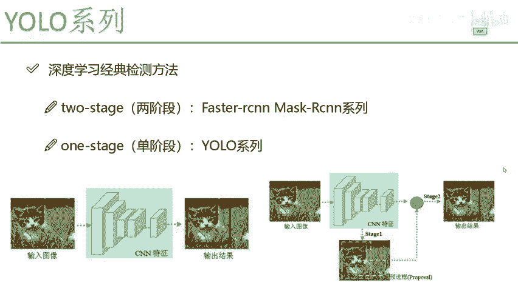

上一节我们介绍了课程的整体安排，本节中我们来看看目标检测任务中的两种经典做法。

在深度学习中，目标检测算法主要分为两类：**两阶段（Two-Stage）** 和 **单阶段（One-Stage）**。

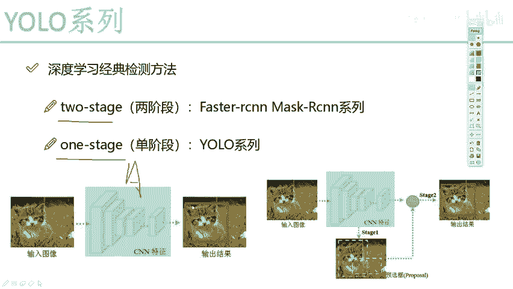

## 单阶段（One-Stage）方法

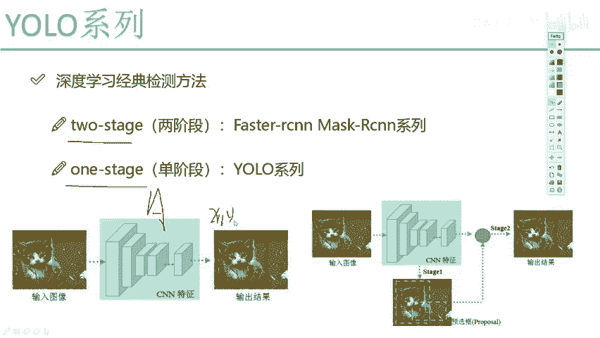

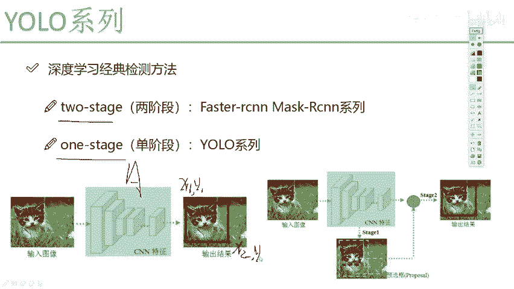

我们先来看单阶段方法。单阶段方法的核心思想非常直接：将目标检测任务视为一个回归问题。

现在我们要做一个物体检测任务。输入一张图像，例如一张包含猫的图像，最终输出一个框住猫的边界框坐标。从本质上说，我们只需要得到四个预测值：

*   **x1, y1**: 边界框左上角的坐标。
*   **x2, y2**: 边界框右下角的坐标。

这看起来就是一个标准的回归任务。因此，在YOLO系列算法中，我们提到的 **One-Stage** 就是指：**一个卷积神经网络（CNN）直接完成从图像到边界框坐标的回归**。

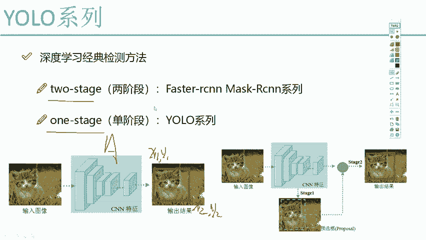

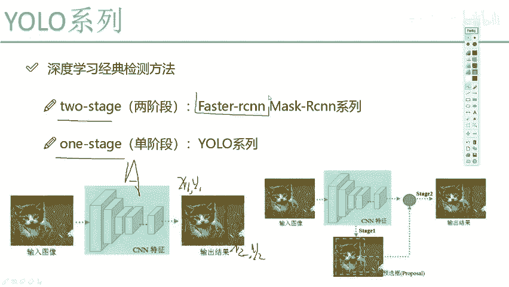

其流程可以概括为：
`输入图像 -> CNN网络 -> 回归输出 (x1, y1, x2, y2)`

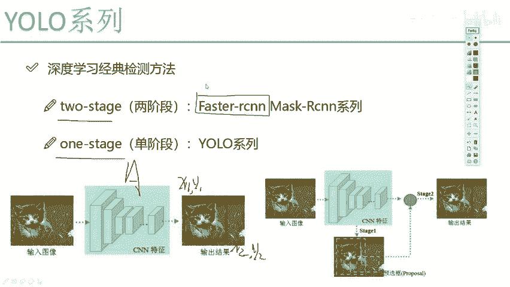

这意味着，从输入到输出，中间不需要任何额外的、复杂的中间步骤或补充模块，一个CNN网络就能完成所有工作。这是YOLO系列算法最核心的出发点。

## 两阶段（Two-Stage）方法

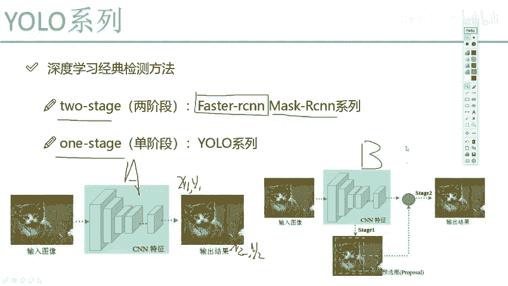

除了YOLO这类单阶段算法，目标检测领域还有另一类著名的算法，称为两阶段方法。

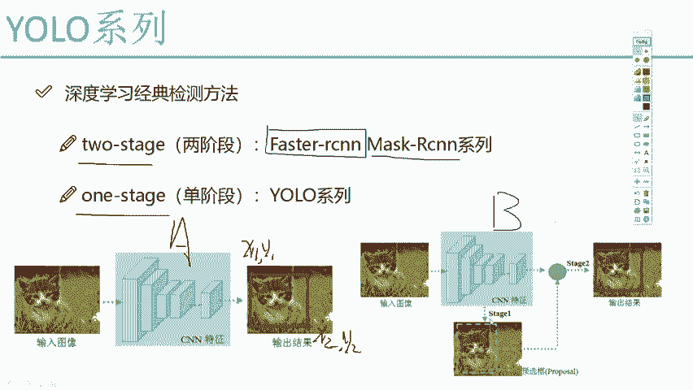

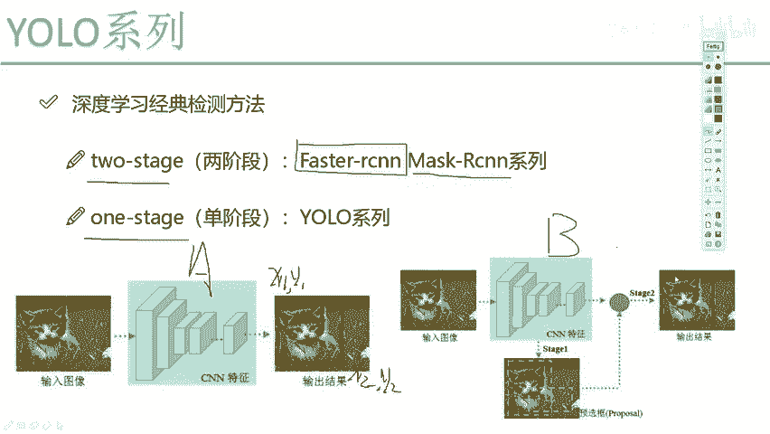

一个典型的代表是2015年底提出的 **Faster R-CNN** 算法，它常被认为是目标检测领域的里程碑式工作。我们通过下图来简单了解其思路：

对于两阶段方法，我们同样输入一张猫的图像，最终目标也是输出猫的位置坐标。但在这个过程中，算法**增加了一个额外的步骤**。

在论文中，这个额外的步骤被称为 **区域建议网络（RPN， Region Proposal Network）**。观察流程图可以发现，在得到最终结果前，系统会先产生一些 **预选框（Proposals）**，如图中的绿色和黄色虚线框。

这给人的感觉是：为了完成检测任务，算法先进行了一次“预选”或“初选”，从整张图像中筛选出一些可能包含物体的候选区域，然后再对这些候选区域进行精细的分类和位置回归。

我们可以用一个比喻来理解两者的区别：
*   **单阶段（One-Stage）**：好比要从全国人口中直接选出1000人参加比赛。
*   **两阶段（Two-Stage）**：先在全国人口中进行一轮初选，挑出一批有特长的人，然后再从这批人中选出最终的1000人参加比赛。

显然，两阶段方法流程更复杂一些。但这种复杂性带来了潜在的好处：由于经过了预筛选，最终预测的结果可能更准确。

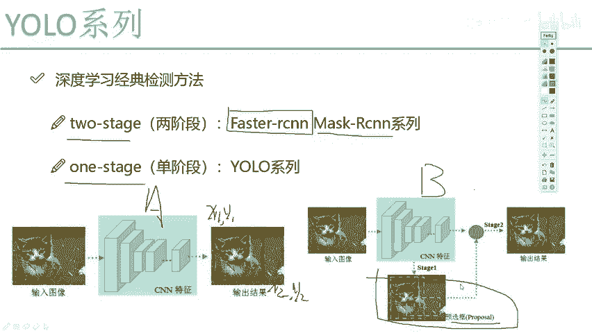

## 为何要了解这两种范式

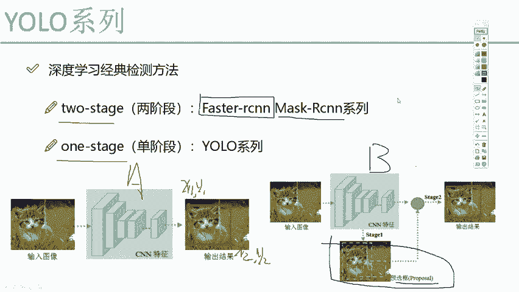

大家如果对Faster R-CNN等两阶段算法不熟悉，没有关系，只需要记住它的核心是多了一步 **预选操作** 即可。

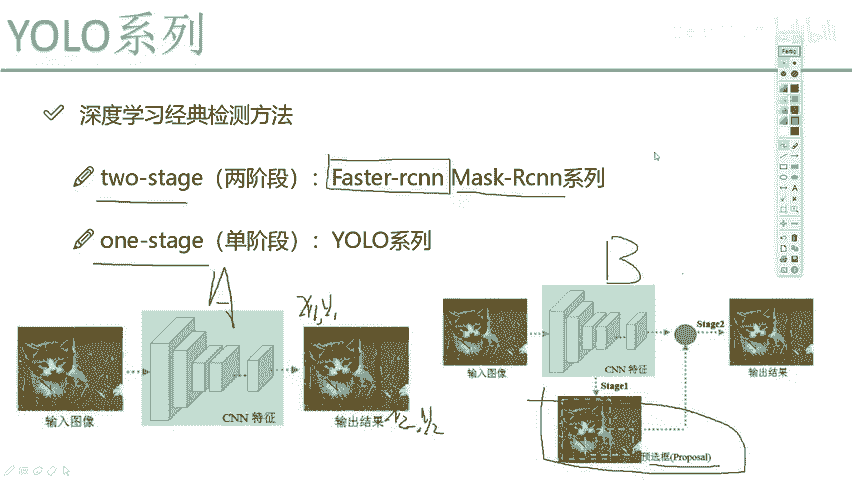

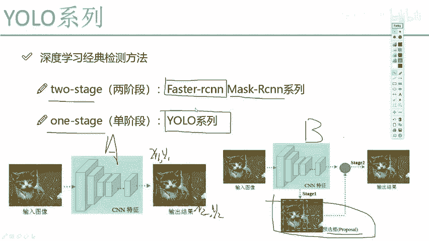

而我们今天开始要讲的 **YOLO系列算法，是没有这个预选步骤的，它直接用一个网络完成预测**。

我之所以要给大家讲解Two-Stage和One-Stage的概念，主要是为了让大家在学习YOLO算法时，能够清晰地认识到它的**优点与缺点**。学完一个算法后，我们需要知道在实际应用场景中如何选择：**是选择Faster R-CNN，还是选择YOLO？** 理解它们根本的设计差异，是做出正确选择的基础。

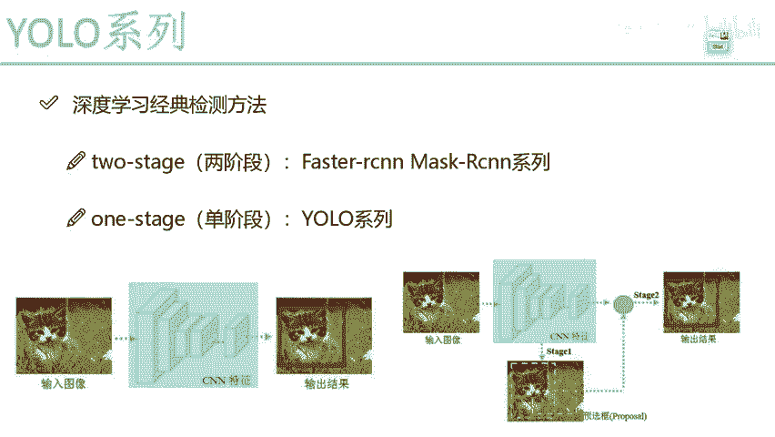

---

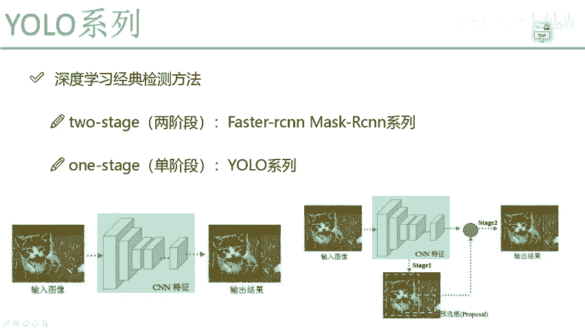

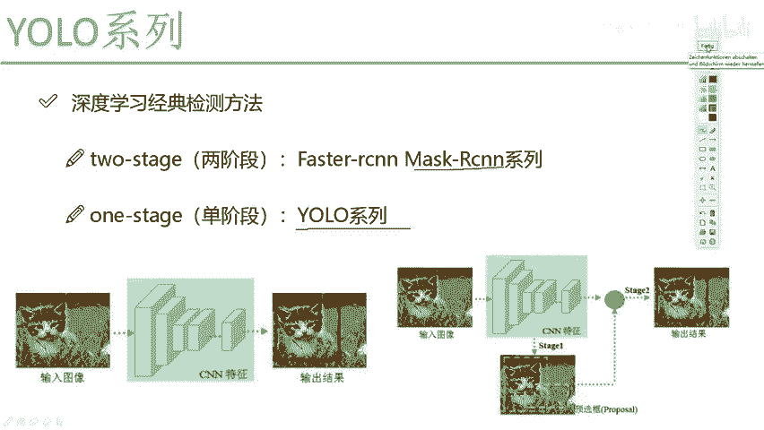

本节课中我们一起学习了目标检测中**单阶段**与**两阶段**方法的根本区别。单阶段方法（如YOLO）将检测视为端到端的回归问题，追求速度；而两阶段方法（如Faster R-CNN）通过增加区域建议步骤来提升精度。理解这一对比，有助于我们把握YOLO系列算法的设计精髓与适用场景。接下来，我们将正式进入YOLO V1的详细讲解。