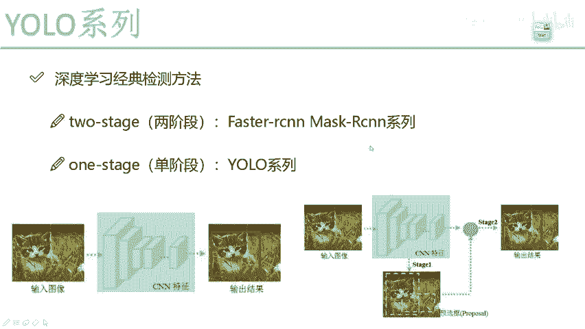
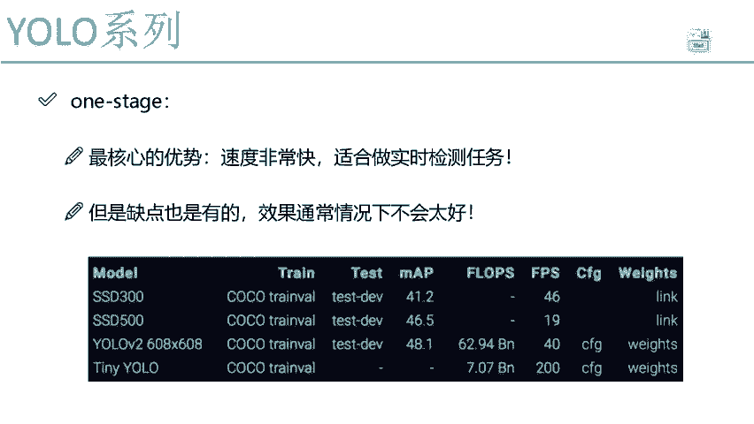
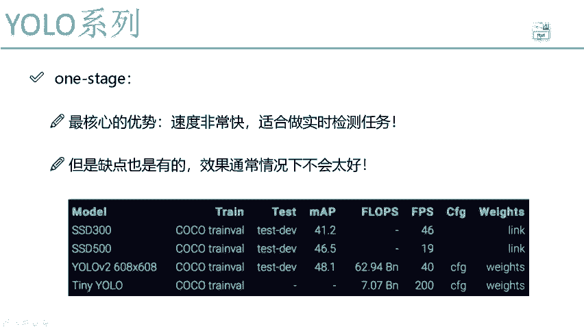
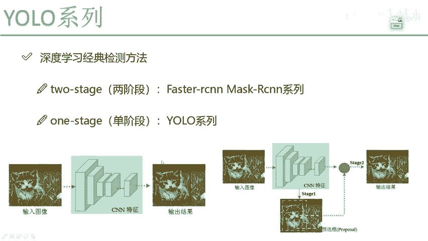
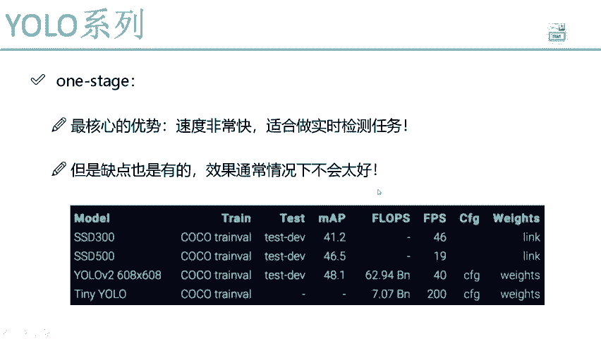
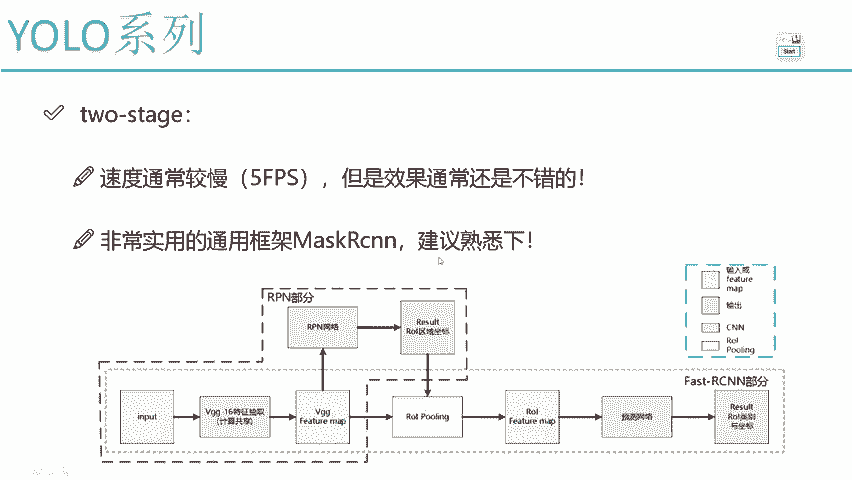

# 课程P53：不同阶段算法优缺点分析 🧐

在本节课中，我们将一起学习目标检测领域中单阶段（One-Stage）与双阶段（Two-Stage）算法的核心区别，并重点分析以YOLO为代表的单阶段算法的优缺点。我们将通过对比，理解不同算法在速度与精度上的权衡。

---

## 单阶段算法（如YOLO）的核心优势

上一节我们介绍了目标检测算法的两种主要类型。本节中，我们来看看单阶段算法的核心优势。

单阶段算法，例如YOLO，其最大的特点是**速度非常快**。这是因为它的网络结构非常直接：输入一张图片，网络直接进行回归，一次性输出目标的边界框和类别。中间省去了像RPN（区域建议网络）这样的复杂预处理或补充步骤。

**核心流程可以简化为：**
`输入图像 -> 单一神经网络 -> 回归得到检测结果`

这种“一条龙”式的处理流程，使得YOLO在处理速度上具有巨大优势。在基于视频流的实时检测任务中，高帧率（FPS）是至关重要的，而YOLO系列算法正是为此类任务设计的。

以下是单阶段算法YOLO的主要优点：
*   **速度极快**：能够满足实时检测的需求，例如视频监控、自动驾驶等场景。
*   **流程简洁**：网络结构端到端，易于理解和实现。

因此，如果你的任务核心需求是**实时性**，那么YOLO是一个非常适合的选择。

---

## 单阶段算法的局限性

然而，单阶段算法并非完美。在享受速度优势的同时，我们也需要了解其付出的代价。

由于缺少了像双阶段算法中“候选区域筛选”这一精细步骤，YOLO等单阶段算法在检测精度上通常会做出一些妥协。其预测可能相对“粗糙”一些。

以下是单阶段算法的主要缺点：
*   **精度相对较低**：与顶尖的双阶段算法（如Faster R-CNN）相比，在同等条件下，其检测精度（通常用mAP值衡量）通常会稍逊一筹。
*   **对小目标检测效果欠佳**：密集或小目标场景下的检测能力可能较弱。

简而言之，选择YOLO意味着在**速度与精度之间进行权衡**：我们获得了飞快的处理速度，但检测效果可能不如一些更复杂的双阶段算法。

---

## 双阶段算法的特点

作为对比，我们简要了解一下双阶段算法的特点。

双阶段算法，如Faster R-CNN，其流程分为两步：首先由RPN网络生成可能包含目标的候选区域（Region Proposals），然后对这些候选区域进行精细的分类和边界框回归。

**核心流程可以简化为：**
`输入图像 -> RPN生成候选区域 -> 对候选区域进行分类与回归`

这种设计的优点是：
*   **精度通常更高**：因为经过了两轮筛选和优化，对目标的定位和识别更为精准。
*   **缺点也很明显**：流程复杂，**速度较慢**，难以达到实时检测的要求（例如Faster R-CNN的典型速度可能只有5 FPS）。

所以，如果你的任务对检测精度要求极高，且对实时性不敏感（如离线分析图像），双阶段算法是更优的选择。

---

## 如何衡量算法性能：FPS与mAP

在目标检测中，我们主要用两个指标来综合评价一个算法：

1.  **FPS**：每秒帧数。它直接衡量算法的**速度**。FPS值越高，代表处理速度越快，越能满足实时性要求。在YOLO中，你可以通过调整网络结构的复杂度来权衡FPS。
2.  **mAP**：平均精度均值。它综合了精度和召回率，是衡量算法**检测精度**的核心指标。mAP值越高，代表算法的检测效果越好。

**一个基本规律是：在现有技术下，速度（FPS）和精度（mAP）往往是矛盾的。** 追求更高的速度通常会导致精度下降，反之亦然。没有算法能同时在两个方面都达到极致。

---

## 总结

本节课中，我们一起学习了目标检测中单阶段与双阶段算法的核心优缺点。

*   **单阶段算法（以YOLO为例）**：**速度快**，流程简洁，非常适合**实时检测**任务，但在检测精度上通常不如双阶段算法。
*   **双阶段算法（以Faster R-CNN为例）**：**精度高**，检测效果更优，但**速度慢**，难以实现实时处理。

选择算法时，关键在于根据你的任务需求，在**速度（FPS）** 与**精度（mAP）** 之间做出合适的权衡。对于后续的YOLO系列课程，我们将聚焦于其网络结构的具体实现与优化，而无需深入双阶段算法的复杂细节。